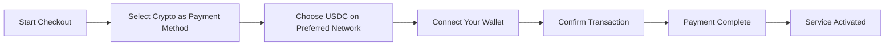
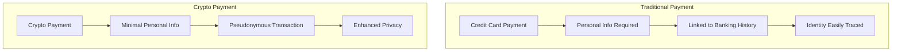
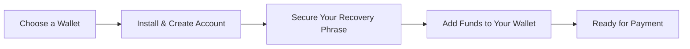

# تقديم مدفوعات العملات المشفرة: خصوصية مُحسّنة لخدمة البريد الإلكتروني الخاصة بك {#introducing-crypto-payments-enhanced-privacy-for-your-email-service}

## جدول المحتويات {#table-of-contents}

* [مقدمة](#foreword)
* [لماذا تُعدّ مدفوعات العملات المشفرة مهمة؟](#why-crypto-payments-matter)
* [كيف يعمل](#how-it-works)
* [فوائد الخصوصية](#privacy-benefits)
* [التفاصيل الفنية](#technical-details)
* [إعداد محفظة العملات المشفرة الخاصة بك](#setting-up-your-crypto-wallet)
  * [ميتاماسك](#metamask)
  * [شبح](#phantom)
  * [محفظة كوين بيس](#coinbase-wallet)
  * [واليت كونيكت](#walletconnect)
* [ابدء](#getting-started)
* [التطلع إلى الأمام](#looking-forward)

## مقدمة {#foreword}

في [إعادة توجيه البريد الإلكتروني](https://forwardemail.net)، نسعى باستمرار إلى تحسين أمان [خصوصية](https://en.wikipedia.org/wiki/Privacy) الخاص بك وجعل خدمتنا أكثر سهولة في الوصول. واليوم، يسعدنا أن نعلن أننا نقبل الآن مدفوعات [العملة المشفرة](https://en.wikipedia.org/wiki/Cryptocurrency) من خلال دمج مدفوعات [سترايب](https://stripe.com) المشفرة.

## لماذا تُعدّ مدفوعات العملات المشفرة مهمة؟ {#why-crypto-payments-matter}

لطالما كان [خصوصية](https://en.wikipedia.org/wiki/Internet_privacy) جوهر خدمتنا. على الرغم من أننا قدمنا طرق دفع متنوعة سابقًا، إلا أن مدفوعات العملات المشفرة توفر طبقة إضافية من الخصوصية تتماشى تمامًا مع مهمتنا. بالدفع بالعملات المشفرة، يمكنك:

* حافظ على سرية هويتك عند شراء خدمات البريد الإلكتروني لدينا.
* قلل من المعلومات الشخصية المرتبطة بحساب بريدك الإلكتروني.
* حافظ على هويتك المالية وبريدك الإلكتروني منفصلين.
* ادعم نظام [التمويل اللامركزي](https://en.wikipedia.org/wiki/Decentralized_finance) المتنامي.

## كيف يعمل {#how-it-works}

لقد دمجنا نظام الدفع بالعملات المشفرة [سترايب](https://docs.stripe.com/crypto) لجعل العملية سلسة قدر الإمكان. إليك كيفية الدفع مقابل خدمات إعادة توجيه البريد الإلكتروني باستخدام العملات المشفرة:

1. **اختر العملة المشفرة كطريقة دفع**: عند الخروج، سترى "العملة المشفرة" كخيار للدفع إلى جانب الطرق التقليدية مثل بطاقات الائتمان.

٢. **اختر عملتك الرقمية**: حاليًا، نقبل [USDC](https://en.wikipedia.org/wiki/USD_Coin) (عملة الدولار الأمريكي) على عدة سلاسل كتل، بما في ذلك [إيثريوم](https://ethereum.org) و[سولانا](https://solana.com) و[مضلع](https://polygon.technology). USDC عملة رقمية مستقرة، وتحافظ على قيمتها النسبية مع الدولار الأمريكي.

٣. **ربط محفظتك**: سيتم توجيهك إلى صفحة آمنة حيث يمكنك ربط محفظة العملات المشفرة المفضلة لديك. ندعم خيارات محفظة متعددة، بما في ذلك:
* [ميتاماسك](https://metamask.io)
* [شبح](https://phantom.app)
* [محفظة كوين بيس](https://www.coinbase.com/wallet)
* [واليت كونيكت](https://walletconnect.com) (متوافق مع العديد من المحافظ الأخرى)

٤. **أكمل عملية الدفع**: أكّد المعاملة في محفظتك، وستكون جاهزًا! سيتم معالجة الدفعة، وسيتم تفعيل خدمة إعادة توجيه البريد الإلكتروني فورًا.

## مزايا الخصوصية لـ {#privacy-benefits}

يؤدي استخدام العملة المشفرة لاشتراكك في خدمة البريد الإلكتروني المباشر إلى تعزيز خصوصيتك بعدة طرق:

* **معلومات شخصية مُخفّضة**: بخلاف مدفوعات بطاقات الائتمان، لا تتطلب معاملات العملات المشفرة اسمك أو عنوان إرسال الفواتير أو أي تفاصيل شخصية أخرى. تعرّف على المزيد حول [خصوصية المعاملات](https://en.wikipedia.org/wiki/Privacy_coin).
* **الانفصال عن الخدمات المصرفية التقليدية**: لا يمكن ربط دفعتك بحسابك المصرفي أو سجلك الائتماني. اقرأ عن [الخصوصية المالية](https://en.wikipedia.org/wiki/Financial_privacy).
* **خصوصية بلوكتشين**: على الرغم من أن معاملات بلوكتشين عامة، إلا أنها تُجرى بأسماء مستعارة ولا ترتبط مباشرةً بهويتك الحقيقية. راجع [تقنيات خصوصية البلوك تشين](https://en.wikipedia.org/wiki/Privacy_and_blockchain).
* **تماشيًا مع قيمنا**: بصفتنا خدمة بريد إلكتروني تُركّز على الخصوصية، نؤمن بمنحك التحكم في معلوماتك الشخصية في كل خطوة. اطلع على [سياسة الخصوصية](/privacy).

## التفاصيل الفنية لـ {#technical-details}

للمهتمين بالجوانب الفنية:

* نستخدم بنية [سترايب](https://docs.stripe.com/crypto/stablecoin-payments) للدفع بالعملات المشفرة، والتي تُعالج جميع تعقيدات معاملات البلوك تشين.
* تُجرى المدفوعات باستخدام [USDC](https://www.circle.com/en/usdc) على منصات بلوكتشين متعددة، بما في ذلك [إيثريوم](https://ethereum.org) و[سولانا](https://solana.com) و[مضلع](https://polygon.technology).
* عند الدفع بالعملات المشفرة، نتلقى القيمة المعادلة بالدولار الأمريكي، مما يُمكّننا من الحفاظ على استقرار الأسعار.

## إعداد محفظة العملات المشفرة الخاصة بك {#setting-up-your-crypto-wallet}

هل أنت جديد في عالم العملات المشفرة؟ إليك كيفية إعداد المحافظ التي ندعمها:

حامل مكان مؤقت 0 قناع ميتا {حامل مكان مؤقت 1}

[ميتاماسك](https://metamask.io) هي واحدة من محافظ Ethereum الأكثر شعبية.

١. تفضل بزيارة [صفحة تنزيل MetaMask](https://metamask.io/download/)
٢. ثبّت ملحق المتصفح أو تطبيق الهاتف المحمول
٣. اتبع تعليمات الإعداد لإنشاء محفظة جديدة
٤. **هام**: احفظ عبارة الاسترداد بأمان
٥. أضف ETH أو USDC إلى محفظتك من خلال منصة تداول أو شراء مباشر
٦. [دليل إعداد MetaMask المفصل](https://metamask.io/faqs/)

حامل مكان مؤقت 0 شبح {حامل مكان مؤقت 1}

[شبح](https://phantom.app) هي محفظة Solana الرائدة.

١. تفضل بزيارة [موقع فانتوم](https://phantom.app/)
٢. نزّل الإصدار المناسب لجهازك
٣. أنشئ محفظة جديدة باتباع التعليمات التي تظهر على الشاشة
٤. انسخ عبارة الاسترداد احتياطيًا بشكل آمن
٥. أضف SOL أو USDC إلى محفظتك
٦. [دليل محفظة فانتوم](https://help.phantom.app/hc/en-us/articles/4406388623251-How-to-create-a-new-wallet)

حامل مكان مؤقت 0 محفظة كوين بيس {#coinbase-wallet}

يدعم [محفظة كوين بيس](https://www.coinbase.com/wallet) سلاسل الكتل المتعددة.

١. نزّل [محفظة كوين بيس](https://www.coinbase.com/wallet/downloads)
٢. أنشئ محفظة جديدة (منفصلة عن حساب بورصة Coinbase)
٣. أمّن عبارة الاسترداد الخاصة بك
٤. حوّل أو اشترِ العملات المشفرة مباشرةً من التطبيق
٥. [دليل محفظة Coinbase](https://www.coinbase.com/learn/tips-and-tutorials/how-to-set-up-a-crypto-wallet)

حامل مكان مؤقت 0 WalletConnect {حامل مكان مؤقت 1}

[واليت كونيكت](https://walletconnect.com) هو بروتوكول يربط المحافظ بمواقع الويب.

١. أولاً، نزّل محفظة متوافقة مع WalletConnect (تتوفر خيارات متعددة).
٢. أثناء الدفع، اختر WalletConnect.
٣. امسح رمز الاستجابة السريعة (QR) باستخدام تطبيق محفظتك.
٤. وافق على الاتصال.
٥. [المحافظ المتوافقة مع WalletConnect](https://walletconnect.com/registry/wallets)

## البدء {#getting-started}

هل أنت مستعد لتعزيز خصوصيتك مع مدفوعات العملات المشفرة؟ ما عليك سوى اختيار "العملات المشفرة" عند الدفع في المرة القادمة التي تجدد فيها اشتراكك أو ترقي باقتك.

لمزيد من المعلومات حول العملات المشفرة وتقنية blockchain، راجع هذه الموارد:

* حامل مكان مؤقت ٠ - إنفستوبيديا
* حامل مكان مؤقت ١ - إنفستوبيديا
* حامل مكان مؤقت ٢ - مؤسسة الحدود الإلكترونية

## نتطلع إلى المستقبل {#looking-forward}

إضافة مدفوعات العملات المشفرة ليست سوى خطوة إضافية في التزامنا المستمر بـ [خصوصية](https://en.wikipedia.org/wiki/Privacy) و[حماية](https://en.wikipedia.org/wiki/Computer_security) وخيارات المستخدم. نؤمن بأن خدمة البريد الإلكتروني الخاصة بك يجب أن تحترم خصوصيتك على جميع المستويات، بدءًا من الرسائل التي ترسلها وحتى طريقة دفعك للخدمة.

كما هو الحال دائمًا، نرحب بملاحظاتكم حول خيار الدفع الجديد هذا. إذا كانت لديكم أي أسئلة حول استخدام العملات المشفرة مع خدمة إعادة توجيه البريد الإلكتروني، يُرجى التواصل مع [فريق الدعم](/help).

---

**مراجع:**

1. [توثيق Stripe Crypto](https://docs.stripe.com/crypto)
2. [عملة USDC المستقرة](https://www.circle.com/en/usdc)
3. [سلسلة كتل الإيثريوم](https://ethereum.org)
4. [سولانا بلوكتشين](https://solana.com)
5. [شبكة بوليجون](https://polygon.technology)
6. [مؤسسة الحدود الإلكترونية - الخصوصية](https://www.eff.org/issues/privacy)
7. [سياسة الخصوصية لإعادة توجيه البريد الإلكتروني](/privacy)