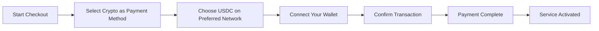
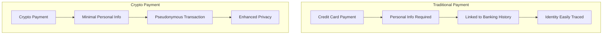
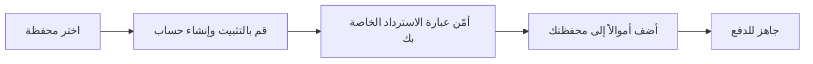

# تقديم مدفوعات العملات المشفرة: خصوصية محسّنة لخدمة بريدك الإلكتروني {#introducing-crypto-payments-enhanced-privacy-for-your-email-service}

## جدول المحتويات {#table-of-contents}

* [مقدمة](#foreword)
* [لماذا تهم مدفوعات العملات المشفرة](#why-crypto-payments-matter)
* [كيف تعمل](#how-it-works)
* [فوائد الخصوصية](#privacy-benefits)
* [التفاصيل التقنية](#technical-details)
* [إعداد محفظة العملات المشفرة الخاصة بك](#setting-up-your-crypto-wallet)
  * [MetaMask](#metamask)
  * [Phantom](#phantom)
  * [Coinbase Wallet](#coinbase-wallet)
  * [WalletConnect](#walletconnect)
* [البدء](#getting-started)
* [نظرة مستقبلية](#looking-forward)

## مقدمة {#foreword}

في [Forward Email](https://forwardemail.net)، نحن نبحث باستمرار عن طرق لتحسين [الخصوصية](https://en.wikipedia.org/wiki/Privacy) والأمان لديك مع جعل خدمتنا أكثر سهولة. اليوم، نحن متحمسون للإعلان عن أننا نقبل الآن مدفوعات [العملات المشفرة](https://en.wikipedia.org/wiki/Cryptocurrency) من خلال تكامل مدفوعات العملات المشفرة الخاص بـ [Stripe](https://stripe.com).

## لماذا تهم مدفوعات العملات المشفرة {#why-crypto-payments-matter}

كانت [الخصوصية](https://en.wikipedia.org/wiki/Internet_privacy) دائمًا في صميم خدمتنا. بينما قدمنا طرق دفع مختلفة في الماضي، توفر مدفوعات العملات المشفرة طبقة إضافية من الخصوصية التي تتماشى تمامًا مع مهمتنا. من خلال الدفع بالعملات المشفرة، يمكنك:

* الحفاظ على قدر أكبر من إخفاء الهوية عند شراء خدمات البريد الإلكتروني الخاصة بنا
* تقليل المعلومات الشخصية المرتبطة بحساب بريدك الإلكتروني
* الحفاظ على فصل هويتك المالية وهويتك البريدية
* دعم نظام [التمويل اللامركزي](https://en.wikipedia.org/wiki/Decentralized_finance) المتنامي

## كيف تعمل {#how-it-works}

لقد دمجنا نظام مدفوعات العملات المشفرة الخاص بـ [Stripe](https://docs.stripe.com/crypto) لجعل العملية سلسة قدر الإمكان. إليك كيف يمكنك الدفع مقابل خدمات Forward Email باستخدام العملات المشفرة:

```mermaid
flowchart LR
    A[Start Checkout] --> B[Select Crypto as Payment Method]
    B --> C[Choose USDC on Preferred Network]
    C --> D[Connect Your Wallet]
    D --> E[Confirm Transaction]
    E --> F[Payment Complete]
    F --> G[Service Activated]
```

1. **اختر العملات المشفرة كطريقة الدفع الخاصة بك**: عند إتمام الشراء، سترى خيار "العملات المشفرة" كطريقة دفع إلى جانب الطرق التقليدية مثل بطاقات الائتمان.

2. **اختر عملتك المشفرة**: حاليًا، نقبل [USDC](https://en.wikipedia.org/wiki/USD_Coin) (عملة الدولار الأمريكي الرقمية) على عدة شبكات بلوكتشين بما في ذلك [Ethereum](https://ethereum.org)، [Solana](https://solana.com)، و [Polygon](https://polygon.technology). USDC هي عملة مستقرة تحافظ على قيمة 1:1 مقابل الدولار الأمريكي.

3. **قم بتوصيل محفظتك**: سيتم توجيهك إلى صفحة آمنة حيث يمكنك توصيل محفظة العملات المشفرة المفضلة لديك. نحن ندعم عدة خيارات للمحفظة بما في ذلك:
   * [MetaMask](https://metamask.io)
   * [Phantom](https://phantom.app)
   * [Coinbase Wallet](https://www.coinbase.com/wallet)
   * [WalletConnect](https://walletconnect.com) (متوافق مع العديد من المحافظ الأخرى)

4. **أكمل الدفع الخاص بك**: قم بتأكيد المعاملة في محفظتك، وهكذا تكون قد انتهيت! سيتم معالجة الدفع، وسيتم تفعيل خدمة Forward Email الخاصة بك على الفور.

## فوائد الخصوصية {#privacy-benefits}

استخدام العملات المشفرة لاشتراكك في Forward Email يعزز خصوصيتك بعدة طرق:

```mermaid
graph TD
    subgraph "Traditional Payment"
    A[Credit Card Payment] --> B[Personal Info Required]
    B --> C[Linked to Banking History]
    C --> D[Identity Easily Traced]
    end

    subgraph "Crypto Payment"
    E[Crypto Payment] --> F[Minimal Personal Info]
    F --> G[Pseudonymous Transaction]
    G --> H[Enhanced Privacy]
    end
```

* **تقليل المعلومات الشخصية**: على عكس مدفوعات بطاقات الائتمان، لا تتطلب معاملات العملات المشفرة اسمك أو عنوان الفواتير أو غيرها من التفاصيل الشخصية. تعرف على المزيد حول [خصوصية المعاملات](https://en.wikipedia.org/wiki/Privacy_coin).
* **الفصل عن البنوك التقليدية**: لا يمكن ربط دفعتك بحسابك المصرفي أو تاريخك الائتماني. اقرأ عن [الخصوصية المالية](https://en.wikipedia.org/wiki/Financial_privacy).
* **خصوصية البلوكتشين**: بينما معاملات البلوكتشين عامة، فهي تحمل هوية مستعارة وليست مرتبطة مباشرة بهويتك الحقيقية. اطلع على [تقنيات خصوصية البلوكتشين](https://en.wikipedia.org/wiki/Privacy_and_blockchain).
* **متوافق مع قيمنا**: كخدمة بريد إلكتروني تركز على الخصوصية، نؤمن بمنحك السيطرة على معلوماتك الشخصية في كل خطوة. اطلع على [سياسة الخصوصية](/privacy).
## التفاصيل التقنية {#technical-details}

للمهتمين بالجوانب التقنية:

* نستخدم بنية الدفع المشفرة الخاصة بـ [Stripe's](https://docs.stripe.com/crypto/stablecoin-payments)، التي تتعامل مع كل تعقيدات معاملات البلوكشين.
* تتم المدفوعات بعملة [USDC](https://www.circle.com/en/usdc) على عدة شبكات بلوكشين بما في ذلك [Ethereum](https://ethereum.org)، [Solana](https://solana.com)، و [Polygon](https://polygon.technology).
* بينما تدفع بالعملات المشفرة، نستلم القيمة المعادلة بالدولار الأمريكي، مما يسمح لنا بالحفاظ على تسعير مستقر.

## إعداد محفظة العملات المشفرة الخاصة بك {#setting-up-your-crypto-wallet}

جديد في عالم العملات المشفرة؟ إليك كيفية إعداد المحافظ التي ندعمها:

```mermaid
flowchart LR
    A[اختر محفظة] --> B[قم بالتثبيت وإنشاء حساب]
    B --> C[أمّن عبارة الاسترداد الخاصة بك]
    C --> D[أضف أموالاً إلى محفظتك]
    D --> E[جاهز للدفع]
```

### MetaMask {#metamask}

[MetaMask](https://metamask.io) هي واحدة من أشهر محافظ Ethereum.

1. قم بزيارة [صفحة تحميل MetaMask](https://metamask.io/download/)
2. قم بتثبيت إضافة المتصفح أو التطبيق المحمول
3. اتبع تعليمات الإعداد لإنشاء محفظة جديدة
4. **مهم**: خزّن عبارة الاسترداد الخاصة بك بأمان
5. أضف ETH أو USDC إلى محفظتك عبر بورصة أو شراء مباشر
6. [دليل إعداد MetaMask المفصل](https://metamask.io/faqs/)

### Phantom {#phantom}

[Phantom](https://phantom.app) هي محفظة رائدة لشبكة Solana.

1. قم بزيارة [موقع Phantom](https://phantom.app/)
2. حمّل النسخة المناسبة لجهازك
3. أنشئ محفظة جديدة باتباع التعليمات على الشاشة
4. قم بعمل نسخة احتياطية آمنة لعبارة الاسترداد الخاصة بك
5. أضف SOL أو USDC إلى محفظتك
6. [دليل محفظة Phantom](https://help.phantom.app/hc/en-us/articles/4406388623251-How-to-create-a-new-wallet)

### Coinbase Wallet {#coinbase-wallet}

[Coinbase Wallet](https://www.coinbase.com/wallet) يدعم عدة شبكات بلوكشين.

1. حمّل [محفظة Coinbase](https://www.coinbase.com/wallet/downloads)
2. أنشئ محفظة جديدة (مستقلة عن حساب بورصة Coinbase)
3. أمّن عبارة الاسترداد الخاصة بك
4. قم بتحويل أو شراء العملات المشفرة مباشرة في التطبيق
5. [دليل محفظة Coinbase](https://www.coinbase.com/learn/tips-and-tutorials/how-to-set-up-a-crypto-wallet)

### WalletConnect {#walletconnect}

[WalletConnect](https://walletconnect.com) هو بروتوكول يربط المحافظ بالمواقع الإلكترونية.

1. أولاً، حمّل محفظة متوافقة مع WalletConnect (تتوفر العديد من الخيارات)
2. أثناء الدفع، اختر WalletConnect
3. امسح رمز الاستجابة السريعة (QR) باستخدام تطبيق المحفظة الخاص بك
4. وافق على الاتصال
5. [محافظ متوافقة مع WalletConnect](https://walletconnect.com/registry/wallets)

## البدء {#getting-started}

هل أنت مستعد لتعزيز خصوصيتك باستخدام مدفوعات العملات المشفرة؟ ببساطة اختر خيار "العملات المشفرة" أثناء الدفع في المرة القادمة التي تجدد فيها اشتراكك أو ترقي خطتك.

لمزيد من المعلومات حول العملات المشفرة وتقنية البلوكشين، اطلع على هذه الموارد:

* [ما هي العملة المشفرة؟](https://www.investopedia.com/terms/c/cryptocurrency.asp) - Investopedia
* [شرح البلوكشين](https://www.investopedia.com/terms/b/blockchain.asp) - Investopedia
* [دليل الخصوصية الرقمية](https://www.eff.org/issues/privacy) - المؤسسة الإلكترونية للحقوق الرقمية

## التطلع إلى المستقبل {#looking-forward}

إضافة مدفوعات العملات المشفرة هي خطوة أخرى في التزامنا المستمر بـ [الخصوصية](https://en.wikipedia.org/wiki/Privacy)، [الأمان](https://en.wikipedia.org/wiki/Computer_security)، وخيار المستخدم. نحن نؤمن بأن خدمة البريد الإلكتروني الخاصة بك يجب أن تحترم خصوصيتك على كل المستويات — من الرسائل التي ترسلها إلى كيفية دفعك مقابل الخدمة.

كالعادة، نرحب بتعليقاتك حول خيار الدفع الجديد هذا. إذا كانت لديك أسئلة حول استخدام العملات المشفرة مع Forward Email، يرجى التواصل مع [فريق الدعم](/help).

---

**المراجع:**

1. [توثيق Stripe Crypto](https://docs.stripe.com/crypto)
2. [عملة USDC المستقرة](https://www.circle.com/en/usdc)
3. [بلوكشين Ethereum](https://ethereum.org)
4. [بلوكشين Solana](https://solana.com)
5. [شبكة Polygon](https://polygon.technology)
6. [المؤسسة الإلكترونية للحقوق الرقمية - الخصوصية](https://www.eff.org/issues/privacy)
7. [سياسة خصوصية Forward Email](/privacy)
