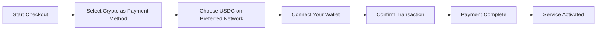
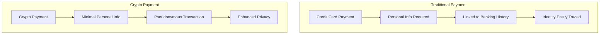
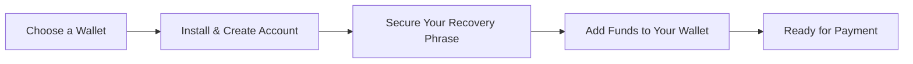

# Představujeme kryptoměnové platby: Zvýšené soukromí pro vaši e-mailovou službu {#introducing-crypto-payments-enhanced-privacy-for-your-email-service}

## Obsah {#table-of-contents}

* [Předmluva](#foreword)
* [Proč jsou platby v kryptoměnách důležité](#why-crypto-payments-matter)
* [Jak to funguje](#how-it-works)
* [Výhody ochrany osobních údajů](#privacy-benefits)
* [Technické detaily](#technical-details)
* [Nastavení krypto peněženky](#setting-up-your-crypto-wallet)
  * [MetaMaska](#metamask)
  * [Přízrak](#phantom)
  * [Peněženka Coinbase](#coinbase-wallet)
  * [WalletConnect](#walletconnect)
* [Začínáme](#getting-started)
* [Pohled do budoucna](#looking-forward)

## Předmluva {#foreword}

Ve službě [Přeposlat e-mail](https://forwardemail.net) neustále hledáme způsoby, jak vylepšit vaše [soukromí](https://en.wikipedia.org/wiki/Privacy) a zabezpečení a zároveň zpřístupnit naše služby. Dnes s radostí oznamujeme, že nyní přijímáme platby [kryptoměna](https://en.wikipedia.org/wiki/Cryptocurrency) prostřednictvím integrace kryptoměn [Stripe's](https://stripe.com).

## Proč jsou platby v kryptoměnách důležité {#why-crypto-payments-matter}

[Soukromí](https://en.wikipedia.org/wiki/Internet_privacy) byl vždy jádrem našich služeb. I když jsme v minulosti nabízeli různé platební metody, platby v kryptoměnách poskytují další vrstvu soukromí, která je dokonale v souladu s naším posláním. Platbou v kryptoměnách můžete:

* Zachovejte větší anonymitu při nákupu našich e-mailových služeb
* Omezte množství osobních údajů vázaných na váš e-mailový účet
* Oddělte své finanční a e-mailové identity
* Podpořte rostoucí ekosystém [decentralizované finance](https://en.wikipedia.org/wiki/Decentralized_finance)

## Jak to funguje {#how-it-works}

Aby byl proces co nejplynulejší, integrovali jsme kryptoměnový platební systém [Stripe's](https://docs.stripe.com/crypto). Zde je návod, jak můžete platit za služby Forward Email pomocí kryptoměny:

1. **Vyberte kryptoměnu jako způsob platby**: Při placení uvidíte jako možnost platby možnost „Kryptoměna“ vedle tradičních metod, jako jsou kreditní karty.

2. **Vyberte si kryptoměnu**: V současné době akceptujeme [USDC](https://en.wikipedia.org/wiki/USD_Coin) (USD Coin) na několika blockchainech, včetně [Ethereum](https://ethereum.org), [Solána](https://solana.com) a [Polygon](https://polygon.technology). USDC je stabilní kryptoměna, která si udržuje hodnotu 1:1 vůči americkému dolaru.

3. **Připojte svou peněženku**: Budete přesměrováni na zabezpečenou stránku, kde si můžete připojit svou preferovanou krypto peněženku. Podporujeme několik možností peněženek, včetně:
* [MetaMaska](https://metamask.io)
* [Přízrak](https://phantom.app)
* [Peněženka Coinbase](https://www.coinbase.com/wallet)
* [WalletConnect](https://walletconnect.com) (kompatibilní s mnoha dalšími peněženkami)

4. **Dokončete platbu**: Potvrďte transakci ve své peněžence a je to! Platba bude zpracována a vaše služba přeposílání e-mailů bude okamžitě aktivována.

## Výhody ochrany osobních údajů {#privacy-benefits}

Používání kryptoměny pro vaše předplatné Forward Email zvyšuje vaše soukromí několika způsoby:

* **Omezené osobní údaje**: Na rozdíl od plateb kreditní kartou kryptoměnové transakce nevyžadují vaše jméno, fakturační adresu ani jiné osobní údaje. Více informací naleznete na [soukromí transakcí](https://en.wikipedia.org/wiki/Privacy_coin).
* **Oddělení od tradičního bankovnictví**: Vaši platbu nelze propojit s vaším bankovním účtem ani s úvěrovou historií. Přečtěte si o [finanční soukromí](https://en.wikipedia.org/wiki/Financial_privacy).
* **Soukromí blockchainu**: Transakce blockchainu jsou sice veřejné, ale jsou pseudonymní a nejsou přímo spojeny s vaší skutečnou identitou. Viz [techniky ochrany soukromí blockchainu](https://en.wikipedia.org/wiki/Privacy_and_blockchain).
* **V souladu s našimi hodnotami**: Jako e-mailová služba zaměřená na soukromí věříme, že vám v každém kroku dáváme kontrolu nad vašimi osobními údaji. Podívejte se na naše [zásady ochrany osobních údajů](/privacy).

## Technické podrobnosti {#technical-details}

Pro ty, kteří se zajímají o technické aspekty:

* Používáme kryptoměnovou platební infrastrukturu [Stripe's](https://docs.stripe.com/crypto/stablecoin-payments), která zvládá veškerou složitost blockchainových transakcí.
* Platby se provádějí v [USDC](https://www.circle.com/en/usdc) na několika blockchainech, včetně [Ethereum](https://ethereum.org), [Solána](https://solana.com) a [Polygon](https://polygon.technology).
* Zatímco platíte v kryptoměně, my obdržíme ekvivalentní hodnotu v USD, což nám umožňuje udržovat stabilní ceny.

## Nastavení krypto peněženky {#setting-up-your-crypto-wallet}

Jste v kryptoměnách nováčkem? Zde je návod, jak nastavit peněženky, které podporujeme:

### MetaMaska {#metamask}

[MetaMaska](https://metamask.io) je jednou z nejpopulárnějších peněženek Ethereum.

1. Navštivte stránku [Stránka pro stažení MetaMask](https://metamask.io/download/)
2. Nainstalujte rozšíření prohlížeče nebo mobilní aplikaci
3. Vytvořte novou peněženku podle pokynů k nastavení
4. **Důležité**: Bezpečně uložte svou obnovovací frázi
5. Přidejte ETH nebo USDC do své peněženky prostřednictvím burzy nebo přímého nákupu
6. [Podrobný návod k nastavení MetaMask](https://metamask.io/faqs/)

### Fantom {#phantom}

[Přízrak](https://phantom.app) je přední peněženka od Solany.

1. Navštivte stránku [Fantomský web](https://phantom.app/)
2. Stáhněte si příslušnou verzi pro své zařízení
3. Vytvořte novou peněženku podle pokynů na obrazovce
4. Bezpečně zálohujte svou obnovovací frázi
5. Přidejte do peněženky SOL nebo USDC
6. [Průvodce peněženkou Phantom](https://help.phantom.app/hc/en-us/articles/4406388623251-How-to-create-a-new-wallet)

### Peněženka Coinbase {#coinbase-wallet}

[Peněženka Coinbase](https://www.coinbase.com/wallet) podporuje více blockchainů.

1. Stáhněte si [Peněženka Coinbase](https://www.coinbase.com/wallet/downloads)
2. Vytvořte si novou peněženku (oddělenou od účtu na burze Coinbase)
3. Zabezpečte si obnovovací frázi
4. Převeďte nebo zakupte kryptoměny přímo v aplikaci
5. [Průvodce peněženkou Coinbase](https://www.coinbase.com/learn/tips-and-tutorials/how-to-set-up-a-crypto-wallet)

### WalletConnect {#walletconnect}

[WalletConnect](https://walletconnect.com) je protokol, který propojuje peněženky s webovými stránkami.

1. Nejprve si stáhněte peněženku kompatibilní s WalletConnect (k dispozici je mnoho možností).
2. Během placení vyberte WalletConnect.
3. Naskenujte QR kód pomocí aplikace peněženky.
4. Schválení připojení.
5. [Peněženky kompatibilní s WalletConnect](https://walletconnect.com/registry/wallets)

## Začínáme {#getting-started}

Jste připraveni vylepšit své soukromí pomocí kryptoměnových plateb? Při příštím obnovení předplatného nebo upgradu tarifu jednoduše vyberte během platby možnost „Krypto“.

Pro více informací o kryptoměnách a technologii blockchain se podívejte na tyto zdroje:

* [Co je kryptoměna?](https://www.investopedia.com/terms/c/cryptocurrency.asp) - Investopedie
* [Vysvětlení blockchainu](https://www.investopedia.com/terms/b/blockchain.asp) - Investopedie
* [Průvodce digitálním soukromím](https://www.eff.org/issues/privacy) - Nadace Electronic Frontier

## Výhled do budoucna {#looking-forward}

Přidání plateb v kryptoměnách je jen dalším krokem v našem trvalém závazku k [soukromí](https://en.wikipedia.org/wiki/Privacy), [zabezpečení](https://en.wikipedia.org/wiki/Computer_security) a uživatelské volbě. Věříme, že vaše e-mailová služba by měla respektovat vaše soukromí na všech úrovních – od zpráv, které odesíláte, až po způsob platby za službu.

Jako vždy uvítáme vaši zpětnou vazbu k této nové platební možnosti. Máte-li dotazy ohledně používání kryptoměny s funkcí Forward Email, kontaktujte prosím našeho [tým podpory](/help).

---

**Odkazy:**

1. [Dokumentace Stripe Crypto](https://docs.stripe.com/crypto)
2. [Stablecoin USDC](https://www.circle.com/en/usdc)
3. [Blockchain Etherea](https://ethereum.org)
4. [Blockchain Solana](https://solana.com)
5. [Polygonální síť](https://polygon.technology)
6. [Nadace pro elektronické hranice – Ochrana osobních údajů](https://www.eff.org/issues/privacy)
7. [Zásady ochrany osobních údajů pro přeposílání e-mailů](/privacy)