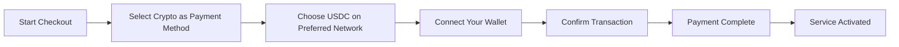
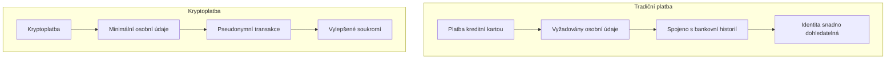
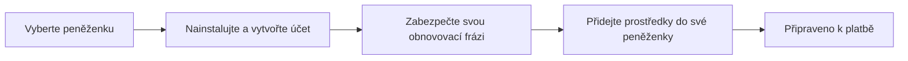

# Představujeme kryptoměnové platby: Vylepšené soukromí pro vaši e-mailovou službu {#introducing-crypto-payments-enhanced-privacy-for-your-email-service}

## Obsah {#table-of-contents}

* [Úvod](#foreword)
* [Proč jsou kryptoměnové platby důležité](#why-crypto-payments-matter)
* [Jak to funguje](#how-it-works)
* [Výhody pro soukromí](#privacy-benefits)
* [Technické detaily](#technical-details)
* [Nastavení vaší kryptopeněženky](#setting-up-your-crypto-wallet)
  * [MetaMask](#metamask)
  * [Phantom](#phantom)
  * [Coinbase Wallet](#coinbase-wallet)
  * [WalletConnect](#walletconnect)
* [Začínáme](#getting-started)
* [Výhled do budoucna](#looking-forward)

## Úvod {#foreword}

Ve [Forward Email](https://forwardemail.net) neustále hledáme způsoby, jak zlepšit vaše [soukromí](https://en.wikipedia.org/wiki/Privacy) a bezpečnost a zároveň zpřístupnit naši službu co nejvíce lidem. Dnes s potěšením oznamujeme, že nyní přijímáme platby [kryptoměnou](https://en.wikipedia.org/wiki/Cryptocurrency) prostřednictvím integrace kryptoplateb od [Stripe](https://stripe.com).

## Proč jsou kryptoměnové platby důležité {#why-crypto-payments-matter}

[Soukromí](https://en.wikipedia.org/wiki/Internet_privacy) bylo vždy jádrem naší služby. Zatímco jsme v minulosti nabízeli různé platební metody, platby kryptoměnou poskytují další vrstvu soukromí, která dokonale ladí s naší misí. Platbou kryptoměnou můžete:

* Zachovat větší anonymitu při nákupu našich e-mailových služeb
* Snížit množství osobních údajů spojených s vaším e-mailovým účtem
* Oddělit své finanční a e-mailové identity
* Podpořit rostoucí ekosystém [decentralizovaných financí](https://en.wikipedia.org/wiki/Decentralized_finance)

## Jak to funguje {#how-it-works}

Integrovali jsme kryptoplatební systém [Stripe](https://docs.stripe.com/crypto), aby byl proces co nejplynulejší. Zde je návod, jak můžete zaplatit za služby Forward Email pomocí kryptoměny:

```mermaid
flowchart LR
    A[Start Checkout] --> B[Select Crypto as Payment Method]
    B --> C[Choose USDC on Preferred Network]
    C --> D[Connect Your Wallet]
    D --> E[Confirm Transaction]
    E --> F[Payment Complete]
    F --> G[Service Activated]
```

1. **Vyberte kryptoměnu jako platební metodu**: Při placení uvidíte možnost „Crypto“ vedle tradičních metod, jako jsou kreditní karty.

2. **Vyberte svou kryptoměnu**: Momentálně přijímáme [USDC](https://en.wikipedia.org/wiki/USD_Coin) (USD Coin) na několika blockchainech včetně [Ethereum](https://ethereum.org), [Solana](https://solana.com) a [Polygon](https://polygon.technology). USDC je stabilní kryptoměna, která udržuje hodnotu 1:1 s americkým dolarem.

3. **Připojte svou peněženku**: Budete přesměrováni na zabezpečenou stránku, kde můžete připojit svou preferovanou kryptopeněženku. Podporujeme několik možností peněženek včetně:
   * [MetaMask](https://metamask.io)
   * [Phantom](https://phantom.app)
   * [Coinbase Wallet](https://www.coinbase.com/wallet)
   * [WalletConnect](https://walletconnect.com) (kompatibilní s mnoha dalšími peněženkami)

4. **Dokončete platbu**: Potvrďte transakci ve své peněžence a je to! Platba bude zpracována a vaše služba Forward Email bude okamžitě aktivována.

## Výhody pro soukromí {#privacy-benefits}

Používání kryptoměny pro vaše předplatné Forward Email zvyšuje vaše soukromí několika způsoby:

```mermaid
graph TD
    subgraph "Tradiční platba"
    A[Platba kreditní kartou] --> B[Vyžadovány osobní údaje]
    B --> C[Spojeno s bankovní historií]
    C --> D[Identita snadno dohledatelná]
    end

    subgraph "Kryptoplatba"
    E[Kryptoplatba] --> F[Minimální osobní údaje]
    F --> G[Pseudonymní transakce]
    G --> H[Vylepšené soukromí]
    end
```

* **Snížené osobní údaje**: Na rozdíl od plateb kreditní kartou kryptotransakce nevyžadují vaše jméno, fakturační adresu ani jiné osobní údaje. Více o [soukromí transakcí](https://en.wikipedia.org/wiki/Privacy_coin).
* **Oddělení od tradičního bankovnictví**: Vaše platba nemůže být spojena s vaším bankovním účtem nebo kreditní historií. Přečtěte si o [finančním soukromí](https://en.wikipedia.org/wiki/Financial_privacy).
* **Soukromí na blockchainu**: I když jsou blockchainové transakce veřejné, jsou pseudonymní a nejsou přímo spojeny s vaší skutečnou identitou. Viz [techniky soukromí na blockchainu](https://en.wikipedia.org/wiki/Privacy_and_blockchain).
* **V souladu s našimi hodnotami**: Jako služba zaměřená na soukromí věříme, že byste měli mít kontrolu nad svými osobními údaji v každém kroku. Podívejte se na naši [zásady ochrany soukromí](/privacy).
## Technické detaily {#technical-details}

Pro ty, kteří se zajímají o technické aspekty:

* Používáme [Stripe](https://docs.stripe.com/crypto/stablecoin-payments) infrastrukturu pro kryptoměnové platby, která řeší veškerou složitost blockchainových transakcí.
* Platby jsou prováděny v [USDC](https://www.circle.com/en/usdc) na více blockchainech včetně [Ethereum](https://ethereum.org), [Solana](https://solana.com) a [Polygon](https://polygon.technology).
* I když platíte v kryptoměně, my přijímáme ekvivalentní hodnotu v USD, což nám umožňuje udržovat stabilní ceny.

## Nastavení vaší kryptopeněženky {#setting-up-your-crypto-wallet}

Jste v kryptoměnách noví? Zde je návod, jak nastavit peněženky, které podporujeme:

```mermaid
flowchart LR
    A[Vyberte peněženku] --> B[Nainstalujte a vytvořte účet]
    B --> C[Zabezpečte svou obnovovací frázi]
    C --> D[Přidejte prostředky do své peněženky]
    D --> E[Připraveno k platbě]
```

### MetaMask {#metamask}

[MetaMask](https://metamask.io) je jedna z nejoblíbenějších Ethereum peněženek.

1. Navštivte [stránku ke stažení MetaMask](https://metamask.io/download/)
2. Nainstalujte rozšíření do prohlížeče nebo mobilní aplikaci
3. Postupujte podle pokynů pro vytvoření nové peněženky
4. **Důležité**: Bezpečně uložte svou obnovovací frázi
5. Přidejte ETH nebo USDC do své peněženky přes burzu nebo přímý nákup
6. [Podrobný průvodce nastavením MetaMask](https://metamask.io/faqs/)

### Phantom {#phantom}

[Phantom](https://phantom.app) je přední peněženka pro Solanu.

1. Navštivte [web Phantom](https://phantom.app/)
2. Stáhněte si vhodnou verzi pro své zařízení
3. Vytvořte novou peněženku podle pokynů na obrazovce
4. Bezpečně zálohujte svou obnovovací frázi
5. Přidejte SOL nebo USDC do své peněženky
6. [Průvodce peněženkou Phantom](https://help.phantom.app/hc/en-us/articles/4406388623251-How-to-create-a-new-wallet)

### Coinbase Wallet {#coinbase-wallet}

[Coinbase Wallet](https://www.coinbase.com/wallet) podporuje více blockchainů.

1. Stáhněte si [Coinbase Wallet](https://www.coinbase.com/wallet/downloads)
2. Vytvořte novou peněženku (oddělenou od účtu na burze Coinbase)
3. Zabezpečte svou obnovovací frázi
4. Přeneste nebo zakupte kryptoměnu přímo v aplikaci
5. [Průvodce Coinbase Wallet](https://www.coinbase.com/learn/tips-and-tutorials/how-to-set-up-a-crypto-wallet)

### WalletConnect {#walletconnect}

[WalletConnect](https://walletconnect.com) je protokol, který propojuje peněženky s webovými stránkami.

1. Nejprve si stáhněte peněženku kompatibilní s WalletConnect (k dispozici je mnoho možností)
2. Při placení vyberte WalletConnect
3. Naskenujte QR kód pomocí aplikace peněženky
4. Schvalte připojení
5. [Peněženky kompatibilní s WalletConnect](https://walletconnect.com/registry/wallets)

## Začínáme {#getting-started}

Připraveni zvýšit své soukromí pomocí kryptoměnových plateb? Jednoduše při dalším obnovení předplatného nebo upgradu plánu vyberte možnost „Krypto“ při placení.

Pro více informací o kryptoměnách a blockchainové technologii si prohlédněte tyto zdroje:

* [Co je kryptoměna?](https://www.investopedia.com/terms/c/cryptocurrency.asp) - Investopedia
* [Vysvětlení blockchainu](https://www.investopedia.com/terms/b/blockchain.asp) - Investopedia
* [Průvodce digitálním soukromím](https://www.eff.org/issues/privacy) - Electronic Frontier Foundation

## Výhled do budoucna {#looking-forward}

Přidání plateb v kryptoměnách je jen dalším krokem v našem trvalém závazku k [soukromí](https://en.wikipedia.org/wiki/Privacy), [bezpečnosti](https://en.wikipedia.org/wiki/Computer_security) a volbě uživatele. Věříme, že vaše e-mailová služba by měla respektovat vaše soukromí na každé úrovni – od zpráv, které odesíláte, až po způsob, jakým platíte za službu.

Jako vždy vítáme vaše připomínky k této nové platební možnosti. Pokud máte otázky ohledně používání kryptoměn s Forward Email, obraťte se na náš [tým podpory](/help).

---

**Reference:**

1. [Stripe Crypto Dokumentace](https://docs.stripe.com/crypto)
2. [USDC Stablecoin](https://www.circle.com/en/usdc)
3. [Ethereum Blockchain](https://ethereum.org)
4. [Solana Blockchain](https://solana.com)
5. [Polygon Network](https://polygon.technology)
6. [Electronic Frontier Foundation - Soukromí](https://www.eff.org/issues/privacy)
7. [Zásady ochrany osobních údajů Forward Email](/privacy)
