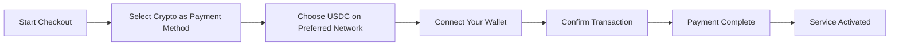
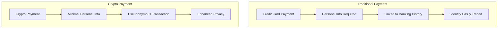
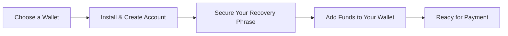

# Introduktion af kryptobetalinger: Forbedret privatliv for din e-mailtjeneste {#introducing-crypto-payments-enhanced-privacy-for-your-email-service}

## Indholdsfortegnelse {#table-of-contents}

* [Forord](#foreword)
* [Hvorfor kryptobetalinger er vigtige](#why-crypto-payments-matter)
* [Sådan fungerer det](#how-it-works)
* [Fordele ved privatlivets fred](#privacy-benefits)
* [Tekniske detaljer](#technical-details)
* [Opsætning af din krypto-tegnebog](#setting-up-your-crypto-wallet)
  * [MetaMaske](#metamask)
  * [Fantom](#phantom)
  * [Coinbase-tegnebog](#coinbase-wallet)
  * [WalletConnect](#walletconnect)
* [Kom godt i gang](#getting-started)
* [Ser fremad](#looking-forward)

## Forord {#foreword}

Hos [Videresend e-mail](https://forwardemail.net) leder vi konstant efter måder at forbedre din [privatliv](https://en.wikipedia.org/wiki/Privacy) og sikkerhed, samtidig med at vi gør vores tjeneste mere tilgængelig. I dag er vi glade for at kunne meddele, at vi nu accepterer [kryptovaluta](https://en.wikipedia.org/wiki/Cryptocurrency)-betalinger via [Stripes](https://stripe.com) kryptobetalingsintegration.

## Hvorfor kryptobetalinger er vigtige {#why-crypto-payments-matter}

[Privatliv](https://en.wikipedia.org/wiki/Internet_privacy) har altid været kernen i vores service. Selvom vi tidligere har tilbudt forskellige betalingsmetoder, giver kryptovalutabetalinger et ekstra lag af privatliv, der passer perfekt til vores mission. Ved at betale med krypto kan du:

* Oprethold større anonymitet, når du køber vores e-mailtjenester
* Reducer mængden af personlige oplysninger, der er knyttet til din e-mailkonto
* Hold dine økonomiske og e-mail-identiteter adskilt
* Støt det voksende [decentraliseret finansiering](https://en.wikipedia.org/wiki/Decentralized_finance) økosystem

## Sådan fungerer det {#how-it-works}

Vi har integreret kryptobetalingssystemet [Stripes](https://docs.stripe.com/crypto) for at gøre processen så problemfri som muligt. Sådan kan du betale for videresendelsestjenester til e-mails ved hjælp af kryptovaluta:

1. **Vælg krypto som din betalingsmetode**: Når du betaler, vil du se "Krypto" som en betalingsmulighed sammen med traditionelle metoder som kreditkort.

2. **Vælg din kryptovaluta**: Vi accepterer i øjeblikket [USDC](https://en.wikipedia.org/wiki/USD_Coin) (USD-mønt) på flere blockchains, herunder [Ethereum](https://ethereum.org), [Solana](https://solana.com) og [Polygon](https://polygon.technology). USDC er en stabil kryptovaluta, der opretholder en 1:1 værdi i forhold til den amerikanske dollar.

3. **Tilslut din tegnebog**: Du vil blive omdirigeret til en sikker side, hvor du kan forbinde din foretrukne kryptotegnebog. Vi understøtter flere tegnebogsmuligheder, herunder:
* [MetaMaske](https://metamask.io)
* [Fantom](https://phantom.app)
* [Coinbase-tegnebog](https://www.coinbase.com/wallet)
* [WalletConnect](https://walletconnect.com) (kompatibel med mange andre tegnebøger)

4. **Fuldfør din betaling**: Bekræft transaktionen i din wallet, og så er du klar! Betalingen vil blive behandlet, og din tjeneste til videresendelse af e-mails vil blive aktiveret med det samme.

## Fordele ved privatlivets fred {#privacy-benefits}

Brug af kryptovaluta til dit abonnement på videresendt e-mail forbedrer dit privatliv på flere måder:

* **Reduceret antal personlige oplysninger**: I modsætning til kreditkortbetalinger kræver kryptotransaktioner ikke dit navn, faktureringsadresse eller andre personlige oplysninger. Få mere at vide om [transaktionsbeskyttelse](https://en.wikipedia.org/wiki/Privacy_coin).
* **Adskillelse fra traditionel bankvirksomhed**: Din betaling kan ikke knyttes til din bankkonto eller kredithistorik. Læs om [økonomisk privatliv](https://en.wikipedia.org/wiki/Financial_privacy).
* **Blockchain-privatliv**: Selvom blockchain-transaktioner er offentlige, er de pseudonyme og ikke direkte knyttet til din identitet i den virkelige verden. Se [blockchain-privatlivsteknikker](https://en.wikipedia.org/wiki/Privacy_and_blockchain).
* **I overensstemmelse med vores værdier**: Som en privatlivsfokuseret e-mailtjeneste tror vi på at give dig kontrol over dine personlige oplysninger i hvert trin. Se vores [privatlivspolitik](/privacy).

## Tekniske detaljer {#technical-details}

For dem der er interesserede i de tekniske aspekter:

* Vi bruger kryptobetalingsinfrastrukturen [Stripes](https://docs.stripe.com/crypto/stablecoin-payments), som håndterer al kompleksitet i blockchain-transaktioner.

* Betalinger foretages i [USDC](https://www.circle.com/en/usdc) på flere blockchains, herunder [Ethereum](https://ethereum.org), [Solana](https://solana.com) og [Polygon](https://polygon.technology).

* Mens du betaler i kryptovaluta, modtager vi den tilsvarende værdi i USD, hvilket giver os mulighed for at opretholde stabile priser.

## Opsætning af din krypto-tegnebog {#setting-up-your-crypto-wallet}

Ny bruger af kryptovaluta? Sådan konfigurerer du de tegnebøger, vi understøtter:

### MetaMaske {#metamask}

[MetaMaske](https://metamask.io) er en af de mest populære Ethereum-wallets.

1. Besøg [MetaMask downloadside](https://metamask.io/download/)
2. Installer browserudvidelsen eller mobilappen
3. Følg opsætningsvejledningen for at oprette en ny tegnebog
4. **Vigtigt**: Gem din gendannelsesfrase sikkert
5. Tilføj ETH eller USDC til din tegnebog via en børs eller et direkte køb
6. [Detaljeret MetaMask-opsætningsvejledning](https://metamask.io/faqs/)

### Fantom {#phantom}

[Fantom](https://phantom.app) er en førende Solana-wallet.

1. Besøg [Phantom-websted](https://phantom.app/)
2. Download den relevante version til din enhed
3. Opret en ny tegnebog ved at følge instruktionerne på skærmen
4. Sikkerhedskopier din gendannelsesfrase på en sikker måde
5. Tilføj SOL eller USDC til din tegnebog
6. [Guide til Phantom-pung](https://help.phantom.app/hc/en-us/articles/4406388623251-How-to-create-a-new-wallet)

### Coinbase-tegnebog {#coinbase-wallet}

[Coinbase-tegnebog](https://www.coinbase.com/wallet) understøtter flere blockchains.

1. Download [Coinbase-tegnebog](https://www.coinbase.com/wallet/downloads)
2. Opret en ny tegnebog (separat fra Coinbase-børskontoen)
3. Sikr din gendannelsesfrase
4. Overfør eller køb kryptovaluta direkte i appen
5. [Coinbase Wallet-guide](https://www.coinbase.com/learn/tips-and-tutorials/how-to-set-up-a-crypto-wallet)

### WalletConnect {#walletconnect}

[WalletConnect](https://walletconnect.com) er en protokol, der forbinder tegnebøger med websteder.

1. Download først en WalletConnect-kompatibel tegnebog (mange muligheder tilgængelige)
2. Vælg WalletConnect under betaling
3. Scan QR-koden med din tegnebogsapp
4. Godkend forbindelsen
5. [WalletConnect-kompatible tegnebøger](https://walletconnect.com/registry/wallets)

## Introduktion {#getting-started}

Klar til at forbedre dit privatliv med kryptobetalinger? Vælg blot muligheden "Krypto" ved betaling næste gang du fornyer dit abonnement eller opgraderer dit abonnement.

For mere information om kryptovalutaer og blockchain-teknologi, se disse ressourcer:

* [Hvad er kryptovaluta?](https://www.investopedia.com/terms/c/cryptocurrency.asp) - Investopedia
* [Blockchain forklaret](https://www.investopedia.com/terms/b/blockchain.asp) - Investopedia
* [Guide til digital privatliv](https://www.eff.org/issues/privacy) - Electronic Frontier Foundation

## Ser fremad {#looking-forward}

Tilføjelse af kryptovalutabetalinger er blot endnu et skridt i vores løbende engagement i [privatliv](https://en.wikipedia.org/wiki/Privacy), [sikkerhed](https://en.wikipedia.org/wiki/Computer_security) og brugernes valg. Vi mener, at din e-mailtjeneste bør respektere dit privatliv på alle niveauer – fra de beskeder, du sender, til hvordan du betaler for tjenesten.

Som altid modtager vi gerne din feedback om denne nye betalingsmulighed. Hvis du har spørgsmål om brugen af kryptovaluta med videresendelse af e-mail, bedes du kontakte vores [supportteam](/help).

---

**Referencer:**

1. [Stripe Crypto-dokumentation](https://docs.stripe.com/crypto)
2. [USDC Stablecoin](https://www.circle.com/en/usdc)
3. [Ethereum Blockchain](https://ethereum.org)
4. [Solana Blockchain](https://solana.com)
5. [Polygonnetværk](https://polygon.technology)
6. [Electronic Frontier Foundation - Privatliv](https://www.eff.org/issues/privacy)
7. [Privatlivspolitik for videresendelse af e-mail](/privacy)