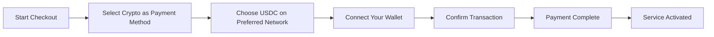
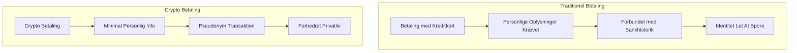
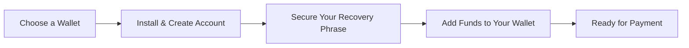

# Introduktion til Crypto Payments: Forbedret Privatliv for Din Email Service {#introducing-crypto-payments-enhanced-privacy-for-your-email-service}

## Indholdsfortegnelse {#table-of-contents}

* [Forord](#foreword)
* [Hvorfor Crypto Payments er Vigtige](#why-crypto-payments-matter)
* [Sådan Fungerer Det](#how-it-works)
* [Fordele ved Privatliv](#privacy-benefits)
* [Tekniske Detaljer](#technical-details)
* [Opsætning af Din Crypto Wallet](#setting-up-your-crypto-wallet)
  * [MetaMask](#metamask)
  * [Phantom](#phantom)
  * [Coinbase Wallet](#coinbase-wallet)
  * [WalletConnect](#walletconnect)
* [Kom Godt I Gang](#getting-started)
* [Fremtidsudsigter](#looking-forward)

## Forord {#foreword}

Hos [Forward Email](https://forwardemail.net) søger vi konstant efter måder at forbedre dit [privatliv](https://en.wikipedia.org/wiki/Privacy) og sikkerhed, samtidig med at vi gør vores service mere tilgængelig. I dag er vi glade for at kunne annoncere, at vi nu accepterer [kryptovaluta](https://en.wikipedia.org/wiki/Cryptocurrency) betalinger gennem [Stripes](https://stripe.com) crypto betalingsintegration.

## Hvorfor Crypto Payments er Vigtige {#why-crypto-payments-matter}

[Privatliv](https://en.wikipedia.org/wiki/Internet_privacy) har altid været kernen i vores service. Selvom vi tidligere har tilbudt forskellige betalingsmetoder, giver kryptovalutabetalinger et ekstra lag af privatliv, som passer perfekt til vores mission. Ved at betale med crypto kan du:

* Opretholde større anonymitet ved køb af vores email-tjenester
* Reducere de personlige oplysninger knyttet til din email-konto
* Holde dine finansielle og email-identiteter adskilt
* Støtte det voksende [decentraliserede finans]-økosystem ([decentralized finance](https://en.wikipedia.org/wiki/Decentralized_finance))

## Sådan Fungerer Det {#how-it-works}

Vi har integreret [Stripes](https://docs.stripe.com/crypto) crypto betalingssystem for at gøre processen så gnidningsfri som muligt. Sådan kan du betale for Forward Email tjenester med kryptovaluta:

```mermaid
flowchart LR
    A[Start Checkout] --> B[Select Crypto as Payment Method]
    B --> C[Choose USDC on Preferred Network]
    C --> D[Connect Your Wallet]
    D --> E[Confirm Transaction]
    E --> F[Payment Complete]
    F --> G[Service Activated]
```

1. **Vælg Crypto som Din Betalingsmetode**: Når du går til kassen, vil du se "Crypto" som en betalingsmulighed ved siden af traditionelle metoder som kreditkort.

2. **Vælg Din Kryptovaluta**: Vi accepterer i øjeblikket [USDC](https://en.wikipedia.org/wiki/USD_Coin) (USD Coin) på flere blockchains, herunder [Ethereum](https://ethereum.org), [Solana](https://solana.com) og [Polygon](https://polygon.technology). USDC er en stabil kryptovaluta, der opretholder en 1:1 værdi med den amerikanske dollar.

3. **Forbind Din Wallet**: Du bliver omdirigeret til en sikker side, hvor du kan forbinde din foretrukne crypto wallet. Vi understøtter flere wallet-muligheder, herunder:
   * [MetaMask](https://metamask.io)
   * [Phantom](https://phantom.app)
   * [Coinbase Wallet](https://www.coinbase.com/wallet)
   * [WalletConnect](https://walletconnect.com) (kompatibel med mange andre wallets)

4. **Fuldfør Din Betaling**: Bekræft transaktionen i din wallet, og så er du klar! Betalingen vil blive behandlet, og din Forward Email service aktiveres med det samme.

## Fordele ved Privatliv {#privacy-benefits}

Brug af kryptovaluta til dit Forward Email abonnement forbedrer dit privatliv på flere måder:

```mermaid
graph TD
    subgraph "Traditionel Betaling"
    A[Betaling med Kreditkort] --> B[Personlige Oplysninger Krævet]
    B --> C[Forbundet med Bankhistorik]
    C --> D[Identitet Let At Spore]
    end

    subgraph "Crypto Betaling"
    E[Crypto Betaling] --> F[Minimal Personlig Info]
    F --> G[Pseudonym Transaktion]
    G --> H[Forbedret Privatliv]
    end
```

* **Reducerede Personlige Oplysninger**: I modsætning til kreditkortbetalinger kræver crypto-transaktioner ikke dit navn, faktureringsadresse eller andre personlige detaljer. Læs mere om [transaktionsprivatliv](https://en.wikipedia.org/wiki/Privacy_coin).
* **Adskillelse fra Traditionel Bankvirksomhed**: Din betaling kan ikke forbindes til din bankkonto eller kredit historie. Læs om [finansielt privatliv](https://en.wikipedia.org/wiki/Financial_privacy).
* **Blockchain Privatliv**: Selvom blockchain-transaktioner er offentlige, er de pseudonyme og ikke direkte knyttet til din virkelige identitet. Se [blockchain privatlivsteknikker](https://en.wikipedia.org/wiki/Privacy_and_blockchain).
* **I Overensstemmelse med Vores Værdier**: Som en privatlivsfokuseret email-service tror vi på at give dig kontrol over dine personlige oplysninger på alle trin. Se vores [privatlivspolitik](/privacy).
## Tekniske Detaljer {#technical-details}

For dem, der er interesserede i de tekniske aspekter:

* Vi bruger [Stripes](https://docs.stripe.com/crypto/stablecoin-payments) kryptobetalingsinfrastruktur, som håndterer al kompleksiteten ved blockchain-transaktioner.
* Betalinger foretages i [USDC](https://www.circle.com/en/usdc) på flere blockchains, herunder [Ethereum](https://ethereum.org), [Solana](https://solana.com) og [Polygon](https://polygon.technology).
* Selvom du betaler med kryptovaluta, modtager vi den tilsvarende værdi i USD, hvilket gør det muligt for os at opretholde stabile priser.

## Opsætning af Din Kryptopung {#setting-up-your-crypto-wallet}

Ny inden for kryptovaluta? Her er hvordan du opsætter de punge, vi understøtter:

```mermaid
flowchart LR
    A[Choose a Wallet] --> B[Install & Create Account]
    B --> C[Secure Your Recovery Phrase]
    C --> D[Add Funds to Your Wallet]
    D --> E[Ready for Payment]
```

### MetaMask {#metamask}

[MetaMask](https://metamask.io) er en af de mest populære Ethereum-punge.

1. Besøg [MetaMask download-siden](https://metamask.io/download/)
2. Installer browserudvidelsen eller mobilappen
3. Følg opsætningsinstruktionerne for at oprette en ny pung
4. **Vigtigt**: Opbevar din gendannelsesfrase sikkert
5. Tilføj ETH eller USDC til din pung via en børs eller direkte køb
6. [Detaljeret MetaMask Opsætningsguide](https://metamask.io/faqs/)

### Phantom {#phantom}

[Phantom](https://phantom.app) er en førende Solana-pung.

1. Besøg [Phantom-websiden](https://phantom.app/)
2. Download den passende version til din enhed
3. Opret en ny pung ved at følge instruktionerne på skærmen
4. Sikkerhedskopier din gendannelsesfrase sikkert
5. Tilføj SOL eller USDC til din pung
6. [Phantom Pung Guide](https://help.phantom.app/hc/en-us/articles/4406388623251-How-to-create-a-new-wallet)

### Coinbase Wallet {#coinbase-wallet}

[Coinbase Wallet](https://www.coinbase.com/wallet) understøtter flere blockchains.

1. Download [Coinbase Wallet](https://www.coinbase.com/wallet/downloads)
2. Opret en ny pung (adskilt fra Coinbase børs-konto)
3. Sikr din gendannelsesfrase
4. Overfør eller køb kryptovaluta direkte i appen
5. [Coinbase Wallet Guide](https://www.coinbase.com/learn/tips-and-tutorials/how-to-set-up-a-crypto-wallet)

### WalletConnect {#walletconnect}

[WalletConnect](https://walletconnect.com) er en protokol, der forbinder punge til websites.

1. Download først en WalletConnect-kompatibel pung (mange muligheder tilgængelige)
2. Vælg WalletConnect under checkout
3. Scan QR-koden med din pung-app
4. Godkend forbindelsen
5. [WalletConnect Kompatible Punge](https://walletconnect.com/registry/wallets)

## Kom Godt I Gang {#getting-started}

Klar til at forbedre dit privatliv med kryptobetalinger? Vælg blot "Crypto" muligheden under checkout næste gang du fornyer dit abonnement eller opgraderer din plan.

For mere information om kryptovalutaer og blockchain-teknologi, se disse ressourcer:

* [Hvad er Kryptovaluta?](https://www.investopedia.com/terms/c/cryptocurrency.asp) - Investopedia
* [Blockchain Forklaret](https://www.investopedia.com/terms/b/blockchain.asp) - Investopedia
* [Digital Privatlivsguide](https://www.eff.org/issues/privacy) - Electronic Frontier Foundation

## Fremtidsudsigter {#looking-forward}

Tilføjelsen af kryptobetalinger er blot endnu et skridt i vores løbende engagement for [privatliv](https://en.wikipedia.org/wiki/Privacy), [sikkerhed](https://en.wikipedia.org/wiki/Computer_security) og brugerens valg. Vi mener, at din e-mailtjeneste skal respektere dit privatliv på alle niveauer—fra de beskeder, du sender, til hvordan du betaler for tjenesten.

Som altid byder vi din feedback på denne nye betalingsmulighed velkommen. Hvis du har spørgsmål om brugen af kryptovaluta med Forward Email, så kontakt venligst vores [supportteam](/help).

---

**Referencer:**

1. [Stripe Crypto Dokumentation](https://docs.stripe.com/crypto)
2. [USDC Stablecoin](https://www.circle.com/en/usdc)
3. [Ethereum Blockchain](https://ethereum.org)
4. [Solana Blockchain](https://solana.com)
5. [Polygon Netværk](https://polygon.technology)
6. [Electronic Frontier Foundation - Privatliv](https://www.eff.org/issues/privacy)
7. [Forward Email Privatlivspolitik](/privacy)
