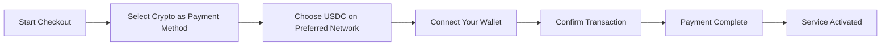
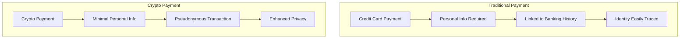
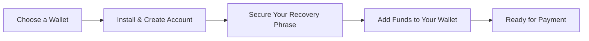

# Einführung von Kryptozahlungen: Verbesserter Datenschutz für Ihren E-Mail-Dienst {#introducing-crypto-payments-enhanced-privacy-for-your-email-service}

## Inhaltsverzeichnis {#table-of-contents}

* [Vorwort](#foreword)
* [Warum Krypto-Zahlungen wichtig sind](#why-crypto-payments-matter)
* [Wie es funktioniert](#how-it-works)
* [Datenschutzvorteile](#privacy-benefits)
* [Technische Details](#technical-details)
* [Einrichten Ihrer Krypto-Wallet](#setting-up-your-crypto-wallet)
  * [MetaMask](#metamask)
  * [Phantom](#phantom)
  * [Coinbase Wallet](#coinbase-wallet)
  * [WalletConnect](#walletconnect)
* [Erste Schritte](#getting-started)
* [Ich freue mich auf](#looking-forward)

## Vorwort {#foreword}

Bei [E-Mail weiterleiten](https://forwardemail.net) suchen wir ständig nach Möglichkeiten, Ihre [Datenschutz](https://en.wikipedia.org/wiki/Privacy) und Sicherheit zu verbessern und gleichzeitig unseren Service zugänglicher zu gestalten. Heute freuen wir uns, bekannt geben zu können, dass wir jetzt [Kryptowährung](https://en.wikipedia.org/wiki/Cryptocurrency) Zahlungen über die [Streifen](https://stripe.com) Krypto-Zahlungsintegration akzeptieren.

## Warum Krypto-Zahlungen wichtig sind {#why-crypto-payments-matter}

[Datenschutz](https://en.wikipedia.org/wiki/Internet_privacy) war schon immer der Kern unseres Services. Obwohl wir in der Vergangenheit verschiedene Zahlungsmethoden angeboten haben, bieten Zahlungen mit Kryptowährungen zusätzliche Privatsphäre, die perfekt zu unserer Mission passt. Durch die Zahlung mit Kryptowährungen können Sie:

* Mehr Anonymität beim Kauf unserer E-Mail-Dienste
* Reduzieren Sie die Anzahl der persönlichen Daten, die mit Ihrem E-Mail-Konto verknüpft sind
* Trennen Sie Ihre Finanz- und E-Mail-Identitäten
* Unterstützen Sie das wachsende [dezentrale Finanzen](https://en.wikipedia.org/wiki/Decentralized_finance)-Ökosystem

## So funktioniert es {#how-it-works}

Wir haben das Krypto-Zahlungssystem [Streifen](https://docs.stripe.com/crypto) integriert, um den Prozess so reibungslos wie möglich zu gestalten. So können Sie für Forward-E-Mail-Dienste mit Kryptowährung bezahlen:

1. **Wählen Sie Krypto als Zahlungsmethode**: Beim Bezahlen wird Ihnen neben herkömmlichen Methoden wie Kreditkarten auch „Krypto“ als Zahlungsoption angezeigt.

2. **Wählen Sie Ihre Kryptowährung**: Derzeit akzeptieren wir [USDC](https://en.wikipedia.org/wiki/USD_Coin) (USD Coin) auf mehreren Blockchains, darunter [Ethereum](https://ethereum.org), [Solana](https://solana.com) und [Polygon](https://polygon.technology). USDC ist eine stabile Kryptowährung, die einen Wert von 1:1 zum US-Dollar beibehält.

3. **Wallet verbinden**: Sie werden auf eine sichere Seite weitergeleitet, auf der Sie Ihr bevorzugtes Krypto-Wallet verbinden können. Wir unterstützen verschiedene Wallet-Optionen, darunter:
* [MetaMask](https://metamask.io)
* [Phantom](https://phantom.app)
* [Coinbase Wallet](https://www.coinbase.com/wallet)
* [WalletConnect](https://walletconnect.com) (kompatibel mit vielen anderen Wallets)

4. **Zahlung abschließen**: Bestätigen Sie die Transaktion in Ihrem Wallet – fertig! Die Zahlung wird bearbeitet und Ihr E-Mail-Weiterleitungsdienst wird sofort aktiviert.

## Datenschutzvorteile {#privacy-benefits}

Die Verwendung von Kryptowährung für Ihr Forward Email-Abonnement verbessert Ihre Privatsphäre auf verschiedene Weise:

* **Weniger personenbezogene Daten**: Im Gegensatz zu Kreditkartenzahlungen benötigen Krypto-Transaktionen weder Ihren Namen, Ihre Rechnungsadresse noch andere persönliche Daten. Erfahren Sie mehr über [Transaktionsvertraulichkeit](https://en.wikipedia.org/wiki/Privacy_coin).
* **Trennung vom traditionellen Bankgeschäft**: Ihre Zahlung kann nicht mit Ihrem Bankkonto oder Ihrer Kredithistorie verknüpft werden. Lesen Sie mehr über [finanzielle Privatsphäre](https://en.wikipedia.org/wiki/Financial_privacy).
* **Blockchain-Datenschutz**: Blockchain-Transaktionen sind zwar öffentlich, aber pseudonym und nicht direkt mit Ihrer realen Identität verknüpft. Siehe [Blockchain-Datenschutztechniken](https://en.wikipedia.org/wiki/Privacy_and_blockchain).
* **Im Einklang mit unseren Werten**: Als datenschutzorientierter E-Mail-Dienst legen wir Wert darauf, Ihnen bei jedem Schritt die Kontrolle über Ihre personenbezogenen Daten zu geben. Lesen Sie unseren [Datenschutzrichtlinie](/privacy).

## Technische Details {#technical-details}

Für alle, die sich für die technischen Aspekte interessieren:

* Wir nutzen die Krypto-Zahlungsinfrastruktur [Streifen](https://docs.stripe.com/crypto/stablecoin-payments), die die gesamte Komplexität von Blockchain-Transaktionen abwickelt.
* Zahlungen erfolgen in [USDC](https://www.circle.com/en/usdc) auf mehreren Blockchains, darunter [Ethereum](https://ethereum.org), [Solana](https://solana.com) und [Polygon](https://polygon.technology).
* Wenn Sie in Kryptowährung bezahlen, erhalten wir den Gegenwert in USD, wodurch wir stabile Preise gewährleisten können.

## Einrichten Ihres Krypto-Wallets {#setting-up-your-crypto-wallet}

Neu bei Kryptowährungen? So richten Sie die von uns unterstützten Wallets ein:

### MetaMask {#metamask}

[MetaMask](https://metamask.io) ist eine der beliebtesten Ethereum-Wallets.

1. Besuchen Sie [MetaMask-Downloadseite](https://metamask.io/download/)
2. Installieren Sie die Browsererweiterung oder die mobile App.
3. Folgen Sie den Einrichtungsanweisungen, um ein neues Wallet zu erstellen.
4. **Wichtig**: Bewahren Sie Ihre Wiederherstellungsphrase sicher auf.
5. Fügen Sie ETH oder USDC über einen Umtausch oder Direktkauf zu Ihrem Wallet hinzu.
6. [Detaillierte MetaMask-Einrichtungsanleitung](https://metamask.io/faqs/)

### Phantom {#phantom}

[Phantom](https://phantom.app) ist eine führende Solana-Wallet.

1. Besuchen Sie [Phantom-Website](https://phantom.app/)
2. Laden Sie die passende Version für Ihr Gerät herunter.
3. Erstellen Sie ein neues Wallet gemäß den Anweisungen auf dem Bildschirm.
4. Sichern Sie Ihre Wiederherstellungsphrase.
5. Fügen Sie SOL oder USDC zu Ihrem Wallet hinzu.
6. [Phantom Wallet-Leitfaden](https://help.phantom.app/hc/en-us/articles/4406388623251-How-to-create-a-new-wallet)

### Coinbase Wallet {#coinbase-wallet}

[Coinbase Wallet](https://www.coinbase.com/wallet) unterstützt mehrere Blockchains.

1. [Coinbase Wallet](https://www.coinbase.com/wallet/downloads) herunterladen
2. Neues Wallet erstellen (getrennt vom Coinbase-Konto)
3. Wiederherstellungsphrase sichern
4. Kryptowährungen direkt in der App übertragen oder kaufen
5. [Leitfaden zur Coinbase-Wallet](https://www.coinbase.com/learn/tips-and-tutorials/how-to-set-up-a-crypto-wallet)

### WalletConnect {#walletconnect}

[WalletConnect](https://walletconnect.com) ist ein Protokoll, das Wallets mit Websites verbindet.

1. Laden Sie zunächst eine WalletConnect-kompatible Wallet herunter (viele Optionen verfügbar).
2. Wählen Sie beim Bezahlvorgang WalletConnect aus.
3. Scannen Sie den QR-Code mit Ihrer Wallet-App.
4. Bestätigen Sie die Verbindung.
5. [WalletConnect-kompatible Geldbörsen](https://walletconnect.com/registry/wallets)

## Erste Schritte {#getting-started}

Möchten Sie Ihre Privatsphäre mit Kryptozahlungen verbessern? Wählen Sie einfach die Option „Krypto“ beim Bezahlvorgang, wenn Sie Ihr Abonnement verlängern oder Ihren Plan aktualisieren.

Weitere Informationen zu Kryptowährungen und Blockchain-Technologie finden Sie in diesen Ressourcen:

* [Was ist Kryptowährung?](https://www.investopedia.com/terms/c/cryptocurrency.asp) – Investopedia
* [Blockchain erklärt](https://www.investopedia.com/terms/b/blockchain.asp) – Investopedia
* [Leitfaden zur digitalen Privatsphäre](https://www.eff.org/issues/privacy) – Electronic Frontier Foundation

## Ich freue mich auf {#looking-forward}

Die Einführung von Kryptowährungszahlungen ist nur ein weiterer Schritt in unserem kontinuierlichen Engagement für [Datenschutz](https://en.wikipedia.org/wiki/Privacy), [Sicherheit](https://en.wikipedia.org/wiki/Computer_security) und die Wahlfreiheit der Nutzer. Wir sind der Meinung, dass Ihr E-Mail-Dienst Ihre Privatsphäre auf jeder Ebene respektieren sollte – von den Nachrichten, die Sie senden, bis hin zur Art und Weise, wie Sie für den Dienst bezahlen.

Wie immer freuen wir uns über Ihr Feedback zu dieser neuen Zahlungsoption. Bei Fragen zur Verwendung von Kryptowährung mit Forward Email wenden Sie sich bitte an unseren [Support-Team](/help).

---

**Referenzen:**

1. [Stripe Crypto-Dokumentation](https://docs.stripe.com/crypto)
2. [USDC-Stablecoin](https://www.circle.com/en/usdc)
3. [Ethereum Blockchain](https://ethereum.org)
4. [Solana Blockchain](https://solana.com)
5. [Polygon-Netzwerk](https://polygon.technology)
6. [Electronic Frontier Foundation - Datenschutz](https://www.eff.org/issues/privacy)
7. [Datenschutzrichtlinie für E-Mail-Weiterleitungen](/privacy)