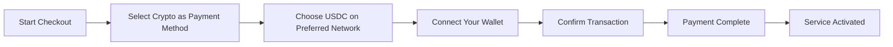
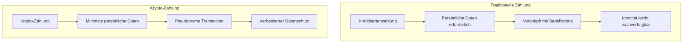
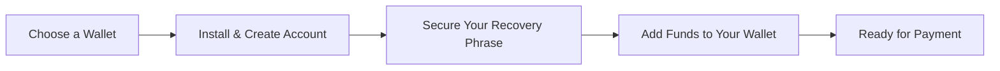

# Einführung von Krypto-Zahlungen: Verbesserter Datenschutz für Ihren E-Mail-Dienst {#introducing-crypto-payments-enhanced-privacy-for-your-email-service}

## Inhaltsverzeichnis {#table-of-contents}

* [Vorwort](#foreword)
* [Warum Krypto-Zahlungen wichtig sind](#why-crypto-payments-matter)
* [Wie es funktioniert](#how-it-works)
* [Datenschutzvorteile](#privacy-benefits)
* [Technische Details](#technical-details)
* [Einrichten Ihrer Krypto-Wallet](#setting-up-your-crypto-wallet)
  * [MetaMask](#metamask)
  * [Phantom](#phantom)
  * [Coinbase Wallet](#coinbase-wallet)
  * [WalletConnect](#walletconnect)
* [Erste Schritte](#getting-started)
* [Ausblick](#looking-forward)

## Vorwort {#foreword}

Bei [Forward Email](https://forwardemail.net) suchen wir ständig nach Möglichkeiten, Ihre [Privatsphäre](https://de.wikipedia.org/wiki/Privatsph%C3%A4re) und Sicherheit zu verbessern und gleichzeitig unseren Dienst zugänglicher zu machen. Heute freuen wir uns, bekannt zu geben, dass wir jetzt [Kryptowährungs](https://de.wikipedia.org/wiki/Kryptow%C3%A4hrung)-Zahlungen über die Krypto-Zahlungsintegration von [Stripe](https://stripe.com) akzeptieren.

## Warum Krypto-Zahlungen wichtig sind {#why-crypto-payments-matter}

[Datenschutz](https://de.wikipedia.org/wiki/Internet-Datenschutz) stand schon immer im Mittelpunkt unseres Dienstes. Während wir in der Vergangenheit verschiedene Zahlungsmethoden angeboten haben, bieten Krypto-Zahlungen eine zusätzliche Datenschutzeebene, die perfekt mit unserer Mission übereinstimmt. Durch die Zahlung mit Krypto können Sie:

* Größere Anonymität beim Kauf unserer E-Mail-Dienste bewahren
* Die persönlichen Informationen, die mit Ihrem E-Mail-Konto verknüpft sind, reduzieren
* Ihre finanziellen und E-Mail-Identitäten trennen
* Das wachsende [dezentrale Finanzwesen](https://de.wikipedia.org/wiki/Dezentrale_Finanzen) unterstützen

## Wie es funktioniert {#how-it-works}

Wir haben das Krypto-Zahlungssystem von [Stripe](https://docs.stripe.com/crypto) integriert, um den Prozess so nahtlos wie möglich zu gestalten. So können Sie Forward Email-Dienste mit Kryptowährung bezahlen:

```mermaid
flowchart LR
    A[Start Checkout] --> B[Select Crypto as Payment Method]
    B --> C[Choose USDC on Preferred Network]
    C --> D[Connect Your Wallet]
    D --> E[Confirm Transaction]
    E --> F[Payment Complete]
    F --> G[Service Activated]
```

1. **Wählen Sie Krypto als Zahlungsmethode**: Beim Checkout sehen Sie „Krypto“ als Zahlungsoption neben traditionellen Methoden wie Kreditkarten.

2. **Wählen Sie Ihre Kryptowährung**: Derzeit akzeptieren wir [USDC](https://en.wikipedia.org/wiki/USD_Coin) (USD Coin) auf mehreren Blockchains, darunter [Ethereum](https://ethereum.org), [Solana](https://solana.com) und [Polygon](https://polygon.technology). USDC ist eine stabile Kryptowährung, die einen 1:1-Wert zum US-Dollar hält.

3. **Verbinden Sie Ihre Wallet**: Sie werden auf eine sichere Seite weitergeleitet, auf der Sie Ihre bevorzugte Krypto-Wallet verbinden können. Wir unterstützen mehrere Wallet-Optionen, darunter:
   * [MetaMask](https://metamask.io)
   * [Phantom](https://phantom.app)
   * [Coinbase Wallet](https://www.coinbase.com/wallet)
   * [WalletConnect](https://walletconnect.com) (kompatibel mit vielen anderen Wallets)

4. **Schließen Sie Ihre Zahlung ab**: Bestätigen Sie die Transaktion in Ihrer Wallet, und schon sind Sie fertig! Die Zahlung wird verarbeitet und Ihr Forward Email-Dienst wird sofort aktiviert.

## Datenschutzvorteile {#privacy-benefits}

Die Verwendung von Kryptowährung für Ihr Forward Email-Abonnement verbessert Ihren Datenschutz auf verschiedene Weise:

```mermaid
graph TD
    subgraph "Traditionelle Zahlung"
    A[Kreditkartenzahlung] --> B[Persönliche Daten erforderlich]
    B --> C[Verknüpft mit Bankhistorie]
    C --> D[Identität leicht nachverfolgbar]
    end

    subgraph "Krypto-Zahlung"
    E[Krypto-Zahlung] --> F[Minimale persönliche Daten]
    F --> G[Pseudonyme Transaktion]
    G --> H[Verbesserter Datenschutz]
    end
```

* **Reduzierte persönliche Informationen**: Im Gegensatz zu Kreditkartenzahlungen erfordern Krypto-Transaktionen nicht Ihren Namen, Ihre Rechnungsadresse oder andere persönliche Details. Erfahren Sie mehr über [Transaktionsprivatsphäre](https://en.wikipedia.org/wiki/Privacy_coin).
* **Trennung vom traditionellen Bankwesen**: Ihre Zahlung kann nicht mit Ihrem Bankkonto oder Ihrer Kreditgeschichte verknüpft werden. Lesen Sie mehr über [finanzielle Privatsphäre](https://en.wikipedia.org/wiki/Financial_privacy).
* **Blockchain-Datenschutz**: Obwohl Blockchain-Transaktionen öffentlich sind, sind sie pseudonym und nicht direkt mit Ihrer realen Identität verknüpft. Siehe [Blockchain-Datenschutztechniken](https://en.wikipedia.org/wiki/Privacy_and_blockchain).
* **Im Einklang mit unseren Werten**: Als datenschutzorientierter E-Mail-Dienst glauben wir daran, Ihnen bei jedem Schritt die Kontrolle über Ihre persönlichen Daten zu geben. Schauen Sie sich unsere [Datenschutzerklärung](/privacy) an.
## Technische Details {#technical-details}

Für diejenigen, die an den technischen Aspekten interessiert sind:

* Wir verwenden die [Krypto-Zahlungsinfrastruktur von Stripe](https://docs.stripe.com/crypto/stablecoin-payments), die die gesamte Komplexität von Blockchain-Transaktionen abwickelt.
* Zahlungen erfolgen in [USDC](https://www.circle.com/en/usdc) auf mehreren Blockchains, darunter [Ethereum](https://ethereum.org), [Solana](https://solana.com) und [Polygon](https://polygon.technology).
* Während Sie in Kryptowährung bezahlen, erhalten wir den entsprechenden Wert in USD, was uns ermöglicht, stabile Preise beizubehalten.

## Einrichtung Ihrer Krypto-Wallet {#setting-up-your-crypto-wallet}

Neu bei Kryptowährungen? So richten Sie die von uns unterstützten Wallets ein:

```mermaid
flowchart LR
    A[Choose a Wallet] --> B[Install & Create Account]
    B --> C[Secure Your Recovery Phrase]
    C --> D[Add Funds to Your Wallet]
    D --> E[Ready for Payment]
```

### MetaMask {#metamask}

[MetaMask](https://metamask.io) ist eine der beliebtesten Ethereum-Wallets.

1. Besuchen Sie die [MetaMask-Downloadseite](https://metamask.io/download/)
2. Installieren Sie die Browser-Erweiterung oder die mobile App
3. Folgen Sie den Einrichtungshinweisen, um eine neue Wallet zu erstellen
4. **Wichtig**: Bewahren Sie Ihre Wiederherstellungsphrase sicher auf
5. Fügen Sie ETH oder USDC über eine Börse oder einen Direktkauf zu Ihrer Wallet hinzu
6. [Detaillierte MetaMask-Einrichtungsanleitung](https://metamask.io/faqs/)

### Phantom {#phantom}

[Phantom](https://phantom.app) ist eine führende Solana-Wallet.

1. Besuchen Sie die [Phantom-Website](https://phantom.app/)
2. Laden Sie die passende Version für Ihr Gerät herunter
3. Erstellen Sie eine neue Wallet, indem Sie den Anweisungen auf dem Bildschirm folgen
4. Sichern Sie Ihre Wiederherstellungsphrase sicher
5. Fügen Sie SOL oder USDC zu Ihrer Wallet hinzu
6. [Phantom Wallet Anleitung](https://help.phantom.app/hc/en-us/articles/4406388623251-How-to-create-a-new-wallet)

### Coinbase Wallet {#coinbase-wallet}

[Coinbase Wallet](https://www.coinbase.com/wallet) unterstützt mehrere Blockchains.

1. Laden Sie [Coinbase Wallet](https://www.coinbase.com/wallet/downloads) herunter
2. Erstellen Sie eine neue Wallet (getrennt vom Coinbase-Börsenkonto)
3. Sichern Sie Ihre Wiederherstellungsphrase
4. Übertragen oder kaufen Sie Kryptowährungen direkt in der App
5. [Coinbase Wallet Anleitung](https://www.coinbase.com/learn/tips-and-tutorials/how-to-set-up-a-crypto-wallet)

### WalletConnect {#walletconnect}

[WalletConnect](https://walletconnect.com) ist ein Protokoll, das Wallets mit Websites verbindet.

1. Laden Sie zunächst eine Wallet herunter, die WalletConnect unterstützt (viele Optionen verfügbar)
2. Wählen Sie während des Bezahlvorgangs WalletConnect aus
3. Scannen Sie den QR-Code mit Ihrer Wallet-App
4. Genehmigen Sie die Verbindung
5. [WalletConnect-kompatible Wallets](https://walletconnect.com/registry/wallets)

## Erste Schritte {#getting-started}

Bereit, Ihre Privatsphäre mit Krypto-Zahlungen zu verbessern? Wählen Sie einfach beim nächsten Verlängern Ihres Abonnements oder Upgrade Ihres Plans die Option „Krypto“ während des Bezahlvorgangs aus.

Für weitere Informationen über Kryptowährungen und Blockchain-Technologie sehen Sie sich diese Ressourcen an:

* [Was ist Kryptowährung?](https://www.investopedia.com/terms/c/cryptocurrency.asp) – Investopedia
* [Blockchain erklärt](https://www.investopedia.com/terms/b/blockchain.asp) – Investopedia
* [Leitfaden für digitale Privatsphäre](https://www.eff.org/issues/privacy) – Electronic Frontier Foundation

## Ausblick {#looking-forward}

Die Einführung von Kryptowährungszahlungen ist nur ein weiterer Schritt in unserem fortlaufenden Engagement für [Privatsphäre](https://en.wikipedia.org/wiki/Privacy), [Sicherheit](https://en.wikipedia.org/wiki/Computer_security) und Benutzerwahl. Wir sind der Meinung, dass Ihr E-Mail-Dienst Ihre Privatsphäre auf jeder Ebene respektieren sollte – von den Nachrichten, die Sie senden, bis hin zu der Art und Weise, wie Sie für den Dienst bezahlen.

Wie immer freuen wir uns über Ihr Feedback zu dieser neuen Zahlungsoption. Wenn Sie Fragen zur Verwendung von Kryptowährungen mit Forward Email haben, wenden Sie sich bitte an unser [Support-Team](/help).

---

**Quellen:**

1. [Stripe Crypto Dokumentation](https://docs.stripe.com/crypto)
2. [USDC Stablecoin](https://www.circle.com/en/usdc)
3. [Ethereum Blockchain](https://ethereum.org)
4. [Solana Blockchain](https://solana.com)
5. [Polygon Netzwerk](https://polygon.technology)
6. [Electronic Frontier Foundation – Privatsphäre](https://www.eff.org/issues/privacy)
7. [Forward Email Datenschutzrichtlinie](/privacy)
