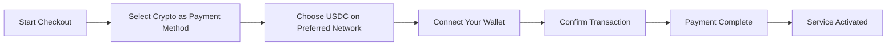
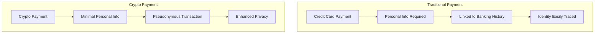
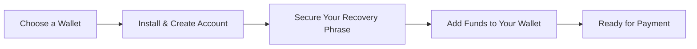

# Presentamos los pagos con criptomonedas: Mayor privacidad para su servicio de correo electrónico {#introducing-crypto-payments-enhanced-privacy-for-your-email-service}

## Tabla de contenido {#table-of-contents}

* [Prefacio](#foreword)
* [Por qué son importantes los pagos con criptomonedas](#why-crypto-payments-matter)
* [Cómo funciona](#how-it-works)
* [Beneficios de la privacidad](#privacy-benefits)
* [Detalles técnicos](#technical-details)
* [Configuración de su billetera de criptomonedas](#setting-up-your-crypto-wallet)
  * [MetaMask](#metamask)
  * [Fantasma](#phantom)
  * [Monedero Coinbase](#coinbase-wallet)
  * [Conexión de billetera](#walletconnect)
* [Empezando](#getting-started)
* [Pensando en el futuro](#looking-forward)

## Prólogo {#foreword}

En [Reenviar correo electrónico](https://forwardemail.net), buscamos constantemente maneras de mejorar su seguridad y [privacidad](https://en.wikipedia.org/wiki/Privacy), a la vez que hacemos nuestro servicio más accesible. Hoy nos complace anunciar que ahora aceptamos pagos [criptomoneda](https://en.wikipedia.org/wiki/Cryptocurrency) a través de la integración de pagos con criptomonedas [Rayas](https://stripe.com).

## Por qué son importantes los pagos con criptomonedas {#why-crypto-payments-matter}

[Privacidad](https://en.wikipedia.org/wiki/Internet_privacy) siempre ha sido la base de nuestro servicio. Si bien hemos ofrecido varios métodos de pago anteriormente, los pagos con criptomonedas brindan una capa adicional de privacidad que se alinea perfectamente con nuestra misión. Al pagar con criptomonedas, puedes:

* Mantenga un mayor anonimato al adquirir nuestros servicios de correo electrónico
* Reduzca la información personal vinculada a su cuenta de correo electrónico
* Mantenga separadas sus identidades financieras y de correo electrónico
* Apoye el creciente ecosistema [finanzas descentralizadas](https://en.wikipedia.org/wiki/Decentralized_finance)

## Cómo funciona {#how-it-works}

Hemos integrado el sistema de pago con criptomonedas [Rayas](https://docs.stripe.com/crypto) para que el proceso sea lo más sencillo posible. Así es como puedes pagar los servicios de Reenvío de Correo Electrónico con criptomonedas:

1. **Seleccione Crypto como su método de pago**: Al realizar el pago, verá "Crypto" como opción de pago junto con los métodos tradicionales como tarjetas de crédito.

2. **Elige tu criptomoneda**: Actualmente, aceptamos [USDC](https://en.wikipedia.org/wiki/USD_Coin) (USD Coin) en varias cadenas de bloques, incluyendo [Ethereum](https://ethereum.org), [Solana](https://solana.com) y [Polígono](https://polygon.technology). USDC es una criptomoneda estable que mantiene un valor de 1:1 con el dólar estadounidense.

3. **Conecta tu billetera**: Serás redirigido a una página segura donde podrás conectar tu billetera de criptomonedas preferida. Admitimos varias opciones de billetera, incluyendo:
* [MetaMask](https://metamask.io)
* [Fantasma](https://phantom.app)
* [Monedero Coinbase](https://www.coinbase.com/wallet)
* [Conexión de billetera](https://walletconnect.com) (compatible con muchas otras billeteras)

4. **Completa tu pago**: Confirma la transacción en tu billetera y ¡listo! El pago se procesará y tu servicio de reenvío de correo electrónico se activará de inmediato.

## Beneficios de privacidad {#privacy-benefits}

El uso de criptomonedas para su suscripción a Forward Email mejora su privacidad de varias maneras:

**Información Personal Reducida**: A diferencia de los pagos con tarjeta de crédito, las transacciones con criptomonedas no requieren su nombre, dirección de facturación ni otros datos personales. Obtenga más información sobre [privacidad de las transacciones](https://en.wikipedia.org/wiki/Privacy_coin).
* **Separación de la banca tradicional**: Su pago no se puede vincular a su cuenta bancaria ni a su historial crediticio. Lea sobre [privacidad financiera](https://en.wikipedia.org/wiki/Financial_privacy).
* **Privacidad en Blockchain**: Si bien las transacciones en blockchain son públicas, son seudónimas y no están directamente vinculadas a su identidad real. Consulte [técnicas de privacidad de blockchain](https://en.wikipedia.org/wiki/Privacy_and_blockchain).
* **Conforme a nuestros valores**: Como servicio de correo electrónico centrado en la privacidad, creemos en brindarle control sobre su información personal en cada paso. Consulte nuestro [política de privacidad](/privacy).

## Detalles técnicos {#technical-details}

Para aquellos interesados en los aspectos técnicos:

* Utilizamos la infraestructura de pagos de criptomonedas [Rayas](https://docs.stripe.com/crypto/stablecoin-payments), que gestiona toda la complejidad de las transacciones en blockchain.
* Los pagos se realizan en [USDC](https://www.circle.com/en/usdc) en múltiples blockchains, incluyendo [Ethereum](https://ethereum.org), [Solana](https://solana.com) y [Polígono](https://polygon.technology).
* Si usted paga en criptomonedas, recibimos el valor equivalente en USD, lo que nos permite mantener precios estables.

## Configuración de su billetera criptográfica {#setting-up-your-crypto-wallet}

¿Eres nuevo en criptomonedas? Aquí te explicamos cómo configurar las billeteras compatibles:

MARCADOR DE TEMPERATURA 0 MetaMask {MARCADOR DE TEMPERATURA 1

[MetaMask](https://metamask.io) es una de las billeteras Ethereum más populares.

1. Visita [Página de descarga de MetaMask](https://metamask.io/download/)
2. Instala la extensión del navegador o la aplicación móvil
3. Sigue las instrucciones de configuración para crear una nueva billetera
4. **Importante**: Guarda de forma segura tu frase de recuperación
5. Agrega ETH o USDC a tu billetera a través de un exchange o compra directa
6. [Guía detallada de configuración de MetaMask](https://metamask.io/faqs/)

MARCADOR DE TEMPERATURA 0 Fantasma {MARCADOR DE TEMPERATURA 1

[Fantasma](https://phantom.app) es una billetera Solana líder.

1. Visita [Sitio web fantasma](https://phantom.app/)
2. Descarga la versión adecuada para tu dispositivo
3. Crea una nueva billetera siguiendo las instrucciones en pantalla
4. Crea una copia de seguridad de tu frase de recuperación
5. Agrega SOL o USDC a tu billetera
6. [Guía de la billetera fantasma](https://help.phantom.app/hc/en-us/articles/4406388623251-How-to-create-a-new-wallet)

### Monedero Coinbase {#coinbase-wallet}

[Monedero Coinbase](https://www.coinbase.com/wallet) admite múltiples cadenas de bloques.

1. Descarga [Monedero Coinbase](https://www.coinbase.com/wallet/downloads)
2. Crea una nueva billetera (separada de la cuenta de Coinbase)
3. Asegura tu frase de recuperación
4. Transfiere o compra criptomonedas directamente en la app
5. [Guía de billetera de Coinbase](https://www.coinbase.com/learn/tips-and-tutorials/how-to-set-up-a-crypto-wallet)

MARCADOR DE TEMPERATURA 0 WalletConnect {MARCADOR DE TEMPERATURA 1

[Conexión de billetera](https://walletconnect.com) es un protocolo que conecta billeteras a sitios web.

1. Primero, descarga una billetera compatible con WalletConnect (hay muchas opciones disponibles).
2. Durante el proceso de pago, selecciona WalletConnect.
3. Escanea el código QR con la app de tu billetera.
4. Aprueba la conexión.
5. [Carteras compatibles con WalletConnect](https://walletconnect.com/registry/wallets)

## Primeros pasos {#getting-started}

¿Listo para mejorar tu privacidad con pagos con criptomonedas? Simplemente selecciona la opción "Cripto" al finalizar la compra la próxima vez que renueves tu suscripción o actualices tu plan.

Para obtener más información sobre las criptomonedas y la tecnología blockchain, consulte estos recursos:

* [¿Qué es la criptomoneda?](https://www.investopedia.com/terms/c/cryptocurrency.asp) - Investopedia
* [Explicación de Blockchain](https://www.investopedia.com/terms/b/blockchain.asp) - Investopedia
* [Guía de privacidad digital](https://www.eff.org/issues/privacy) - Fundación Frontera Electrónica

## Mirando hacia adelante {#looking-forward}

Añadir pagos con criptomonedas es solo un paso más en nuestro compromiso continuo con [privacidad](https://en.wikipedia.org/wiki/Privacy), [seguridad](https://en.wikipedia.org/wiki/Computer_security) y la libertad de elección del usuario. Creemos que su servicio de correo electrónico debe respetar su privacidad en todos los aspectos, desde los mensajes que envía hasta cómo paga por el servicio.

Como siempre, agradecemos sus comentarios sobre esta nueva opción de pago. Si tiene alguna pregunta sobre el uso de criptomonedas con Forward Email, contáctenos en [equipo de soporte](/help).

---

**Referencias:**

1. [Documentación de Stripe Crypto](https://docs.stripe.com/crypto)
2. [Moneda estable USDC](https://www.circle.com/en/usdc)
3. [Cadena de bloques de Ethereum](https://ethereum.org)
4. [Cadena de bloques de Solana](https://solana.com)
5. [Red de polígonos](https://polygon.technology)
6. [Fundación Frontera Electrónica - Privacidad](https://www.eff.org/issues/privacy)
7. [Política de privacidad de reenvío de correo electrónico](/privacy)