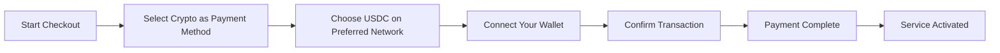
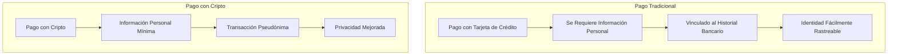
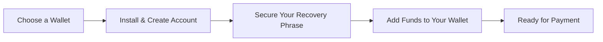

# Presentando Pagos con Criptomonedas: Mayor Privacidad para Tu Servicio de Email {#introducing-crypto-payments-enhanced-privacy-for-your-email-service}

## Tabla de Contenidos {#table-of-contents}

* [Prólogo](#foreword)
* [Por Qué Importan los Pagos con Criptomonedas](#why-crypto-payments-matter)
* [Cómo Funciona](#how-it-works)
* [Beneficios de Privacidad](#privacy-benefits)
* [Detalles Técnicos](#technical-details)
* [Configurando Tu Billetera Cripto](#setting-up-your-crypto-wallet)
  * [MetaMask](#metamask)
  * [Phantom](#phantom)
  * [Coinbase Wallet](#coinbase-wallet)
  * [WalletConnect](#walletconnect)
* [Comenzando](#getting-started)
* [Mirando Hacia el Futuro](#looking-forward)

## Prólogo {#foreword}

En [Forward Email](https://forwardemail.net), estamos constantemente buscando maneras de mejorar tu [privacidad](https://es.wikipedia.org/wiki/Privacidad) y seguridad mientras hacemos nuestro servicio más accesible. Hoy, nos emociona anunciar que ahora aceptamos pagos con [criptomonedas](https://es.wikipedia.org/wiki/Criptomoneda) a través de la integración de pagos cripto de [Stripe](https://stripe.com).

## Por Qué Importan los Pagos con Criptomonedas {#why-crypto-payments-matter}

La [privacidad](https://es.wikipedia.org/wiki/Privacidad_en_internet) siempre ha estado en el núcleo de nuestro servicio. Aunque hemos ofrecido varios métodos de pago en el pasado, los pagos con criptomonedas proporcionan una capa adicional de privacidad que se alinea perfectamente con nuestra misión. Al pagar con cripto, puedes:

* Mantener mayor anonimato al adquirir nuestros servicios de email
* Reducir la información personal vinculada a tu cuenta de email
* Mantener separadas tus identidades financiera y de email
* Apoyar el creciente ecosistema de [finanzas descentralizadas](https://es.wikipedia.org/wiki/Finanzas_descentralizadas)

## Cómo Funciona {#how-it-works}

Hemos integrado el sistema de pagos con criptomonedas de [Stripe](https://docs.stripe.com/crypto) para hacer el proceso lo más sencillo posible. Así es como puedes pagar los servicios de Forward Email usando criptomonedas:

```mermaid
flowchart LR
    A[Start Checkout] --> B[Select Crypto as Payment Method]
    B --> C[Choose USDC on Preferred Network]
    C --> D[Connect Your Wallet]
    D --> E[Confirm Transaction]
    E --> F[Payment Complete]
    F --> G[Service Activated]
```

1. **Selecciona Cripto como Tu Método de Pago**: Al realizar el pago, verás "Cripto" como una opción de pago junto a métodos tradicionales como tarjetas de crédito.

2. **Elige Tu Criptomoneda**: Actualmente, aceptamos [USDC](https://es.wikipedia.org/wiki/USD_Coin) (USD Coin) en múltiples blockchains incluyendo [Ethereum](https://ethereum.org), [Solana](https://solana.com) y [Polygon](https://polygon.technology). USDC es una criptomoneda estable que mantiene un valor 1:1 con el dólar estadounidense.

3. **Conecta Tu Billetera**: Serás redirigido a una página segura donde podrás conectar tu billetera cripto preferida. Soportamos múltiples opciones de billetera incluyendo:
   * [MetaMask](https://metamask.io)
   * [Phantom](https://phantom.app)
   * [Coinbase Wallet](https://www.coinbase.com/wallet)
   * [WalletConnect](https://walletconnect.com) (compatible con muchas otras billeteras)

4. **Completa Tu Pago**: Confirma la transacción en tu billetera, ¡y listo! El pago será procesado y tu servicio de Forward Email se activará inmediatamente.

## Beneficios de Privacidad {#privacy-benefits}

Usar criptomonedas para tu suscripción a Forward Email mejora tu privacidad de varias maneras:

```mermaid
graph TD
    subgraph "Pago Tradicional"
    A[Pago con Tarjeta de Crédito] --> B[Se Requiere Información Personal]
    B --> C[Vinculado al Historial Bancario]
    C --> D[Identidad Fácilmente Rastreable]
    end

    subgraph "Pago con Cripto"
    E[Pago con Cripto] --> F[Información Personal Mínima]
    F --> G[Transacción Pseudónima]
    G --> H[Privacidad Mejorada]
    end
```

* **Reducción de Información Personal**: A diferencia de los pagos con tarjeta de crédito, las transacciones cripto no requieren tu nombre, dirección de facturación u otros datos personales. Aprende más sobre la [privacidad en transacciones](https://es.wikipedia.org/wiki/Moneda_privada).
* **Separación de la Banca Tradicional**: Tu pago no puede ser vinculado a tu cuenta bancaria o historial crediticio. Lee sobre la [privacidad financiera](https://es.wikipedia.org/wiki/Privacidad_financiera).
* **Privacidad en Blockchain**: Aunque las transacciones en blockchain son públicas, son pseudónimas y no están directamente ligadas a tu identidad real. Consulta las [técnicas de privacidad en blockchain](https://es.wikipedia.org/wiki/Privacidad_y_blockchain).
* **Consistente con Nuestros Valores**: Como un servicio de email enfocado en la privacidad, creemos en darte control sobre tu información personal en cada paso. Revisa nuestra [política de privacidad](/privacy).
## Detalles Técnicos {#technical-details}

Para quienes estén interesados en los aspectos técnicos:

* Usamos la infraestructura de pagos con criptomonedas de [Stripe](https://docs.stripe.com/crypto/stablecoin-payments), que maneja toda la complejidad de las transacciones en blockchain.
* Los pagos se realizan en [USDC](https://www.circle.com/en/usdc) en múltiples blockchains incluyendo [Ethereum](https://ethereum.org), [Solana](https://solana.com) y [Polygon](https://polygon.technology).
* Aunque pagues en criptomoneda, recibimos el valor equivalente en USD, lo que nos permite mantener precios estables.

## Configurando Tu Billetera Cripto {#setting-up-your-crypto-wallet}

¿Nuevo en criptomonedas? Aquí te mostramos cómo configurar las billeteras que soportamos:

```mermaid
flowchart LR
    A[Choose a Wallet] --> B[Install & Create Account]
    B --> C[Secure Your Recovery Phrase]
    C --> D[Add Funds to Your Wallet]
    D --> E[Ready for Payment]
```

### MetaMask {#metamask}

[MetaMask](https://metamask.io) es una de las billeteras de Ethereum más populares.

1. Visita la [página de descarga de MetaMask](https://metamask.io/download/)
2. Instala la extensión para navegador o la app móvil
3. Sigue las instrucciones de configuración para crear una nueva billetera
4. **Importante**: Guarda de forma segura tu frase de recuperación
5. Añade ETH o USDC a tu billetera mediante un exchange o compra directa
6. [Guía detallada de configuración de MetaMask](https://metamask.io/faqs/)

### Phantom {#phantom}

[Phantom](https://phantom.app) es una billetera líder para Solana.

1. Visita el [sitio web de Phantom](https://phantom.app/)
2. Descarga la versión adecuada para tu dispositivo
3. Crea una nueva billetera siguiendo las instrucciones en pantalla
4. Haz una copia de seguridad segura de tu frase de recuperación
5. Añade SOL o USDC a tu billetera
6. [Guía de la billetera Phantom](https://help.phantom.app/hc/en-us/articles/4406388623251-How-to-create-a-new-wallet)

### Coinbase Wallet {#coinbase-wallet}

[Coinbase Wallet](https://www.coinbase.com/wallet) soporta múltiples blockchains.

1. Descarga [Coinbase Wallet](https://www.coinbase.com/wallet/downloads)
2. Crea una nueva billetera (separada de la cuenta de exchange de Coinbase)
3. Asegura tu frase de recuperación
4. Transfiere o compra cripto directamente en la app
5. [Guía de Coinbase Wallet](https://www.coinbase.com/learn/tips-and-tutorials/how-to-set-up-a-crypto-wallet)

### WalletConnect {#walletconnect}

[WalletConnect](https://walletconnect.com) es un protocolo que conecta billeteras con sitios web.

1. Primero, descarga una billetera compatible con WalletConnect (hay muchas opciones disponibles)
2. Durante el pago, selecciona WalletConnect
3. Escanea el código QR con tu app de billetera
4. Aprueba la conexión
5. [Billeteras compatibles con WalletConnect](https://walletconnect.com/registry/wallets)

## Comenzando {#getting-started}

¿Listo para mejorar tu privacidad con pagos en cripto? Simplemente selecciona la opción "Cripto" durante el pago la próxima vez que renueves tu suscripción o actualices tu plan.

Para más información sobre criptomonedas y tecnología blockchain, consulta estos recursos:

* [¿Qué es la criptomoneda?](https://www.investopedia.com/terms/c/cryptocurrency.asp) - Investopedia
* [Explicación de Blockchain](https://www.investopedia.com/terms/b/blockchain.asp) - Investopedia
* [Guía de privacidad digital](https://www.eff.org/issues/privacy) - Electronic Frontier Foundation

## Mirando Hacia Adelante {#looking-forward}

Agregar pagos con criptomonedas es solo un paso más en nuestro compromiso continuo con la [privacidad](https://en.wikipedia.org/wiki/Privacy), la [seguridad](https://en.wikipedia.org/wiki/Computer_security) y la elección del usuario. Creemos que tu servicio de correo electrónico debe respetar tu privacidad en todos los niveles—desde los mensajes que envías hasta cómo pagas por el servicio.

Como siempre, agradecemos tus comentarios sobre esta nueva opción de pago. Si tienes preguntas sobre el uso de criptomonedas con Forward Email, por favor contacta a nuestro [equipo de soporte](/help).

---

**Referencias:**

1. [Documentación de Stripe Crypto](https://docs.stripe.com/crypto)
2. [Stablecoin USDC](https://www.circle.com/en/usdc)
3. [Blockchain de Ethereum](https://ethereum.org)
4. [Blockchain de Solana](https://solana.com)
5. [Red Polygon](https://polygon.technology)
6. [Electronic Frontier Foundation - Privacidad](https://www.eff.org/issues/privacy)
7. [Política de Privacidad de Forward Email](/privacy)
