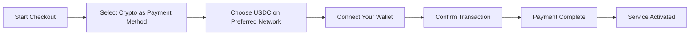
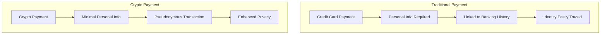
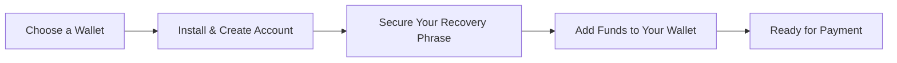

# Esittelyssä kryptomaksut: parannettu tietosuoja sähköpostipalvelullesi {#introducing-crypto-payments-enhanced-privacy-for-your-email-service}

## Sisällysluettelo {#table-of-contents}

* [Esipuhe](#foreword)
* [Miksi kryptomaksut ovat tärkeitä](#why-crypto-payments-matter)
* [Miten se toimii](#how-it-works)
* [Tietosuojaedut](#privacy-benefits)
* [Tekniset tiedot](#technical-details)
* [Kryptolompakon perustaminen](#setting-up-your-crypto-wallet)
  * [MetaMask](#metamask)
  * [Fantomi](#phantom)
  * [Coinbase-lompakko](#coinbase-wallet)
  * [WalletConnect](#walletconnect)
* [Aloittaminen](#getting-started)
* [Katse eteenpäin](#looking-forward)

## Esipuhe {#foreword}

[Lähetä sähköpostia eteenpäin](https://forwardemail.net):ssa etsimme jatkuvasti tapoja parantaa [yksityisyys](https://en.wikipedia.org/wiki/Privacy) -palveluasi ja sen turvallisuutta samalla, kun palvelumme on helpommin saavutettavissa. Tänään meillä on ilo ilmoittaa, että hyväksymme nyt [kryptovaluutta](https://en.wikipedia.org/wiki/Cryptocurrency)-maksut [Stripen](https://stripe.com)-kryptomaksuintegraation kautta.

## Miksi kryptomaksut ovat tärkeitä {#why-crypto-payments-matter}

[Tietosuoja](https://en.wikipedia.org/wiki/Internet_privacy) on aina ollut palvelumme ytimessä. Vaikka olemme aiemmin tarjonneet useita maksutapoja, kryptovaluuttamaksut tarjoavat ylimääräisen yksityisyyskerroksen, joka sopii täydellisesti missioomme. Maksamalla kryptovaluutalla voit:

* Säilytä parempi anonymiteetti ostaessasi sähköpostipalveluitamme
* Vähennä sähköpostitiliisi liitettyjä henkilötietoja
* Pidä taloudelliset ja sähköposti-identiteettisi erillään
* Tue kasvavaa [hajautettu rahoitus](https://en.wikipedia.org/wiki/Decentralized_finance)-ekosysteemiä

## Toimintaperiaate {#how-it-works}

Olemme integroineet [Stripen](https://docs.stripe.com/crypto)-kryptomaksujärjestelmän, jotta prosessi olisi mahdollisimman saumaton. Näin voit maksaa Forward Email -palveluista kryptovaluutalla:

1. **Valitse maksutavaksi krypto**: Kassalla näet maksuvaihtoehtona "Krypto" perinteisten maksutapojen, kuten luottokorttien, rinnalla.

2. **Valitse kryptovaluuttasi**: Tällä hetkellä hyväksymme [USDC](https://en.wikipedia.org/wiki/USD_Coin):n (USD-kolikko) useissa lohkoketjuissa, mukaan lukien [Ethereum](https://ethereum.org), [Solana](https://solana.com) ja [Monikulmio](https://polygon.technology). USDC on vakaa kryptovaluutta, jonka arvo pysyy suhteessa Yhdysvaltain dollariin suhteessa 1:1.

3. **Yhdistä lompakkosi**: Sinut ohjataan suojatulle sivulle, jolla voit yhdistää haluamasi kryptolompakkosi. Tuemme useita lompakkovaihtoehtoja, mukaan lukien:
* [MetaMask](https://metamask.io)
* [Fantomi](https://phantom.app)
* [Coinbase-lompakko](https://www.coinbase.com/wallet)
* [WalletConnect](https://walletconnect.com) (yhteensopiva monien muiden lompakoiden kanssa)

4. **Suorita maksusi**: Vahvista maksu lompakossasi, niin olet valmis! Maksu käsitellään ja sähköpostin edelleenlähetyspalvelusi aktivoidaan välittömästi.

## Tietosuojaedut {#privacy-benefits}

Kryptovaluutan käyttäminen Forward Email -tilauksessa parantaa yksityisyyttäsi monella tapaa:

* **Vähennetty henkilötietojen määrä**: Toisin kuin luottokorttimaksut, kryptotapahtumat eivät vaadi nimeäsi, laskutusosoitettasi tai muita henkilötietoja. Lue lisää [tapahtumien yksityisyys](https://en.wikipedia.org/wiki/Privacy_coin):sta.
* **Ero perinteisestä pankkitoiminnasta**: Maksuasi ei voida yhdistää pankkitiliisi tai luottohistoriaasi. Lue lisää [taloudellinen yksityisyys](https://en.wikipedia.org/wiki/Financial_privacy):stä.
* **Lohkoketjun yksityisyys**: Vaikka lohkoketjutapahtumat ovat julkisia, ne ovat salanimiä eivätkä suoraan sidottuja todelliseen identiteettiisi. Katso [lohkoketjun yksityisyystekniikat](https://en.wikipedia.org/wiki/Privacy_and_blockchain).
* **Arvojemme mukainen**: Yksityisyyteen keskittyvänä sähköpostipalveluna uskomme, että sinun on hallittava henkilötietojasi jokaisessa vaiheessa. Tutustu [tietosuojakäytäntö](/privacy):aan.

## Tekniset tiedot {#technical-details}

Niille, jotka ovat kiinnostuneita teknisistä puolista:

* Käytämme [Stripen](https://docs.stripe.com/crypto/stablecoin-payments)-kryptomaksuinfrastruktuuria, joka käsittelee lohkoketjutapahtumien monimutkaisuuden.
* Maksut suoritetaan [USDC](https://www.circle.com/en/usdc):ssä useissa lohkoketjuissa, mukaan lukien [Ethereum](https://ethereum.org), [Solana](https://solana.com) ja [Monikulmio](https://polygon.technology).
* Kun maksat kryptovaluutassa, me saamme vastaavan arvon Yhdysvaltain dollareina, minkä ansiosta voimme ylläpitää vakaata hinnoittelua.

## Kryptovaluuttalompakkosi määrittäminen {#setting-up-your-crypto-wallet}

Uusi kryptovaluuttojen parissa? Näin määrität tukemamme lompakot:

### Metamaski {#metamask}

[MetaMask](https://metamask.io) on yksi suosituimmista Ethereum-lompakoista.

1. Siirry [MetaMaskin lataussivu](https://metamask.io/download/)-sivustolle
2. Asenna selainlaajennus tai mobiilisovellus
3. Luo uusi lompakko noudattamalla asennusohjeita
4. **Tärkeää**: Säilytä palautuslausekkeesi turvallisesti
5. Lisää ETH tai USDC lompakkoosi valuutanvaihdon tai suoran oston kautta
6. [Yksityiskohtainen MetaMaskin asennusopas](https://metamask.io/faqs/)

VÄLIAIKAINEN_PAINETTU_0 Phantom {VÄLIAIKAINEN_PAINETTU_1

[Fantomi](https://phantom.app) on johtava Solanan lompakko.

1. Siirry [Phantom-verkkosivusto](https://phantom.app/)-sivustolle.
2. Lataa laitteellesi sopiva versio.
3. Luo uusi lompakko näytön ohjeiden mukaisesti.
4. Varmuuskopioi palautuslausekkeesi turvallisesti.
5. Lisää SOL tai USDC lompakkoosi.
6. [Phantom-lompakon opas](https://help.phantom.app/hc/en-us/articles/4406388623251-How-to-create-a-new-wallet)

### Coinbase-lompakko {#coinbase-wallet}

[Coinbase-lompakko](https://www.coinbase.com/wallet) tukee useita lohkoketjuja.

1. Lataa [Coinbase-lompakko](https://www.coinbase.com/wallet/downloads)
2. Luo uusi lompakko (erillään Coinbase-pörssitilistä)
3. Suojaa palautuslausekkeesi
4. Siirrä tai osta kryptovaluuttaa suoraan sovelluksessa
5. [Coinbase-lompakko-opas](https://www.coinbase.com/learn/tips-and-tutorials/how-to-set-up-a-crypto-wallet)

### WalletConnect {#walletconnect}

[WalletConnect](https://walletconnect.com) on protokolla, joka yhdistää lompakot verkkosivustoihin.

1. Lataa ensin WalletConnect-yhteensopiva lompakko (saatavilla useita vaihtoehtoja).
2. Valitse kassalla WalletConnect.
3. Skannaa QR-koodi lompakkosovelluksellasi.
4. Hyväksy yhteys.
5. [WalletConnect-yhteensopivat lompakot](https://walletconnect.com/registry/wallets)

## Aloittaminen {#getting-started}

Oletko valmis parantamaan yksityisyyttäsi kryptomaksuilla? Valitse vain "Krypto"-vaihtoehto kassalla seuraavan kerran, kun uusit tilauksesi tai päivität pakettiasi.

Lisätietoja kryptovaluutoista ja lohkoketjuteknologiasta saat näistä resursseista:

* [Mikä on kryptovaluutta?](https://www.investopedia.com/terms/c/cryptocurrency.asp) - Investopedia
* [Lohkoketju selitettynä](https://www.investopedia.com/terms/b/blockchain.asp) - Investopedia
* [Digitaalisen yksityisyyden opas](https://www.eff.org/issues/privacy) - Electronic Frontier Foundation

## Odotan innolla {#looking-forward}

Kryptovaluuttamaksujen lisääminen on vain yksi askel eteenpäin jatkuvassa sitoutumisessamme [yksityisyys](https://en.wikipedia.org/wiki/Privacy):een, [turvallisuus](https://en.wikipedia.org/wiki/Computer_security):een ja käyttäjien valinnanvapauteen. Uskomme, että sähköpostipalvelusi tulisi kunnioittaa yksityisyyttäsi kaikilla tasoilla – lähettämistäsi viesteistä siihen, miten maksat palvelusta.

Kuten aina, otamme mielellämme vastaan palautettasi tästä uudesta maksuvaihtoehdosta. Jos sinulla on kysyttävää kryptovaluutan käytöstä Forward Email -palvelun kanssa, ota yhteyttä [tukitiimi](/help) -tukihenkilöömme.

---

**Viitteet:**

1. [Stripe Crypton dokumentaatio](https://docs.stripe.com/crypto)
2. [USDC-stablecoin](https://www.circle.com/en/usdc)
3. [Ethereumin lohkoketju](https://ethereum.org)
4. [Solana Blockchain](https://solana.com)
5. [Monikulmioverkko](https://polygon.technology)
6. [Electronic Frontier Foundation - Tietosuoja](https://www.eff.org/issues/privacy)
7. [Sähköpostin edelleenlähetyksen tietosuojakäytäntö](/privacy)