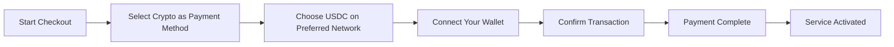
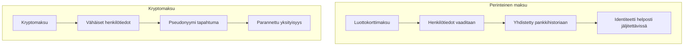
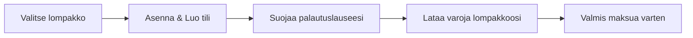

# Esittelyssä kryptomaksut: Parannettu yksityisyys sähköpostipalvelullesi {#introducing-crypto-payments-enhanced-privacy-for-your-email-service}

## Sisällysluettelo {#table-of-contents}

* [Esipuhe](#foreword)
* [Miksi kryptomaksut ovat tärkeitä](#why-crypto-payments-matter)
* [Miten se toimii](#how-it-works)
* [Yksityisyyden edut](#privacy-benefits)
* [Tekniset tiedot](#technical-details)
* [Kryptolompakkosi käyttöönotto](#setting-up-your-crypto-wallet)
  * [MetaMask](#metamask)
  * [Phantom](#phantom)
  * [Coinbase Wallet](#coinbase-wallet)
  * [WalletConnect](#walletconnect)
* [Aloittaminen](#getting-started)
* [Tulevaisuuden näkymät](#looking-forward)

## Esipuhe {#foreword}

Me [Forward Email](https://forwardemail.net) -palvelussa etsimme jatkuvasti keinoja parantaa yksityisyyttäsi ([privacy](https://en.wikipedia.org/wiki/Privacy)) ja turvallisuuttasi samalla kun teemme palvelustamme entistä saavutettavamman. Tänään olemme innoissamme voidessamme ilmoittaa, että hyväksymme nyt [kryptovaluuttamaksut](https://en.wikipedia.org/wiki/Cryptocurrency) [Stripen](https://stripe.com) kryptomaksuintegroinnin kautta.

## Miksi kryptomaksut ovat tärkeitä {#why-crypto-payments-matter}

[Yksityisyys](https://en.wikipedia.org/wiki/Internet_privacy) on aina ollut palvelumme ytimessä. Vaikka olemme aiemmin tarjonneet erilaisia maksutapoja, kryptomaksut tarjoavat lisäyksityisyyden kerroksen, joka sopii täydellisesti tehtäväämme. Maksamalla kryptovaluutalla voit:

* Säilyttää suuremman anonymiteetin ostaessasi sähköpostipalveluitamme
* Vähentää sähköpostitiliisi liitettyjä henkilötietoja
* Pitää taloudelliset ja sähköpostiin liittyvät identiteetit erillään
* Tukea kasvavaa [hajautetun rahoituksen](https://en.wikipedia.org/wiki/Decentralized_finance) ekosysteemiä

## Miten se toimii {#how-it-works}

Olemme integroineet [Stripen](https://docs.stripe.com/crypto) kryptomaksujärjestelmän, jotta prosessi olisi mahdollisimman sujuva. Näin voit maksaa Forward Email -palveluista kryptovaluutalla:

```mermaid
flowchart LR
    A[Start Checkout] --> B[Select Crypto as Payment Method]
    B --> C[Choose USDC on Preferred Network]
    C --> D[Connect Your Wallet]
    D --> E[Confirm Transaction]
    E --> F[Payment Complete]
    F --> G[Service Activated]
```

1. **Valitse maksutavaksi kryptovaluutta**: Kassalla näet "Crypto" maksuvaihtoehtona perinteisten maksutapojen, kuten luottokorttien, rinnalla.

2. **Valitse kryptovaluuttasi**: Tällä hetkellä hyväksymme [USDC](https://en.wikipedia.org/wiki/USD_Coin) (USD Coin) useilla lohkoketjuilla, mukaan lukien [Ethereum](https://ethereum.org), [Solana](https://solana.com) ja [Polygon](https://polygon.technology). USDC on vakaa kryptovaluutta, jonka arvo on 1:1 suhteessa Yhdysvaltain dollariin.

3. **Yhdistä lompakkosi**: Sinut ohjataan turvalliselle sivulle, jossa voit yhdistää haluamasi kryptolompakon. Tuemme useita lompakkovaihtoehtoja, kuten:
   * [MetaMask](https://metamask.io)
   * [Phantom](https://phantom.app)
   * [Coinbase Wallet](https://www.coinbase.com/wallet)
   * [WalletConnect](https://walletconnect.com) (yhteensopiva monien muiden lompakoiden kanssa)

4. **Suorita maksu loppuun**: Vahvista tapahtuma lompakossasi, ja homma on hoidettu! Maksu käsitellään, ja Forward Email -palvelusi aktivoidaan välittömästi.

## Yksityisyyden edut {#privacy-benefits}

Käyttämällä kryptovaluuttaa Forward Email -tilauksesi maksamiseen parannat yksityisyyttäsi monin tavoin:

```mermaid
graph TD
    subgraph "Perinteinen maksu"
    A[Luottokorttimaksu] --> B[Henkilötiedot vaaditaan]
    B --> C[Yhdistetty pankkihistoriaan]
    C --> D[Identiteetti helposti jäljitettävissä]
    end

    subgraph "Kryptomaksu"
    E[Kryptomaksu] --> F[Vähäiset henkilötiedot]
    F --> G[Pseudonyymi tapahtuma]
    G --> H[Parannettu yksityisyys]
    end
```

* **Vähemmän henkilötietoja**: Toisin kuin luottokorttimaksuissa, kryptotapahtumat eivät vaadi nimeäsi, laskutusosoitettasi tai muita henkilökohtaisia tietoja. Lue lisää [tapahtumien yksityisyydestä](https://en.wikipedia.org/wiki/Privacy_coin).
* **Erottautuminen perinteisestä pankkitoiminnasta**: Maksuasi ei voi yhdistää pankkitiliisi tai luottohistoriaasi. Lue lisää [taloudellisesta yksityisyydestä](https://en.wikipedia.org/wiki/Financial_privacy).
* **Lohkoketjun yksityisyys**: Vaikka lohkoketjutapahtumat ovat julkisia, ne ovat pseudonyymejä eivätkä suoraan liity todelliseen henkilöllisyyteesi. Katso [lohkoketjun yksityisyystekniikat](https://en.wikipedia.org/wiki/Privacy_and_blockchain).
* **Arvojemme mukainen**: Yksityisyyteen keskittyvänä sähköpostipalveluna uskomme, että sinulla on oikeus hallita henkilökohtaisia tietojasi jokaisessa vaiheessa. Tutustu [yksityisyydensuojaamme](/privacy).
## Teknisiä tietoja {#technical-details}

Teknisistä näkökohdista kiinnostuneille:

* Käytämme [Stripen](https://docs.stripe.com/crypto/stablecoin-payments) kryptomaksuinfrastruktuuria, joka hoitaa kaikki lohkoketjutapahtumien monimutkaisuudet.
* Maksut suoritetaan [USDC:llä](https://www.circle.com/en/usdc) useilla lohkoketjuilla, mukaan lukien [Ethereum](https://ethereum.org), [Solana](https://solana.com) ja [Polygon](https://polygon.technology).
* Vaikka maksat kryptovaluutalla, vastaanotamme vastaavan arvon USD:ssä, mikä mahdollistaa vakaan hinnoittelun ylläpitämisen.

## Kryptolompakkosi käyttöönotto {#setting-up-your-crypto-wallet}

Uusi kryptovaluutoissa? Näin otat käyttöön tukemamme lompakot:

```mermaid
flowchart LR
    A[Valitse lompakko] --> B[Asenna & Luo tili]
    B --> C[Suojaa palautuslauseesi]
    C --> D[Lataa varoja lompakkoosi]
    D --> E[Valmis maksua varten]
```

### MetaMask {#metamask}

[MetaMask](https://metamask.io) on yksi suosituimmista Ethereum-lompakoista.

1. Vieraile [MetaMaskin lataussivulla](https://metamask.io/download/)
2. Asenna selainlaajennus tai mobiilisovellus
3. Seuraa asennusohjeita uuden lompakon luomiseksi
4. **Tärkeää**: Säilytä palautuslauseesi turvallisesti
5. Lisää ETH:ta tai USDC:tä lompakkoosi vaihtopalvelun tai suoran ostoksen kautta
6. [Yksityiskohtainen MetaMaskin käyttöönotto-opas](https://metamask.io/faqs/)

### Phantom {#phantom}

[Phantom](https://phantom.app) on johtava Solana-lompakko.

1. Vieraile [Phantomin verkkosivulla](https://phantom.app/)
2. Lataa laitteellesi sopiva versio
3. Luo uusi lompakko näytön ohjeiden mukaan
4. Varmuuskopioi palautuslauseesi turvallisesti
5. Lisää SOL:ia tai USDC:tä lompakkoosi
6. [Phantom-lompakon opas](https://help.phantom.app/hc/en-us/articles/4406388623251-How-to-create-a-new-wallet)

### Coinbase Wallet {#coinbase-wallet}

[Coinbase Wallet](https://www.coinbase.com/wallet) tukee useita lohkoketjuja.

1. Lataa [Coinbase Wallet](https://www.coinbase.com/wallet/downloads)
2. Luo uusi lompakko (erillinen Coinbase-pörssitilistä)
3. Suojaa palautuslauseesi
4. Siirrä tai osta kryptoa suoraan sovelluksessa
5. [Coinbase Walletin opas](https://www.coinbase.com/learn/tips-and-tutorials/how-to-set-up-a-crypto-wallet)

### WalletConnect {#walletconnect}

[WalletConnect](https://walletconnect.com) on protokolla, joka yhdistää lompakot verkkosivustoihin.

1. Lataa ensin WalletConnect-yhteensopiva lompakko (monia vaihtoehtoja saatavilla)
2. Valitse kassalla WalletConnect
3. Skannaa QR-koodi lompakkosovelluksellasi
4. Hyväksy yhteys
5. [WalletConnect-yhteensopivat lompakot](https://walletconnect.com/registry/wallets)

## Aloittaminen {#getting-started}

Valmis parantamaan yksityisyyttäsi kryptomaksuilla? Valitse vain "Crypto" -vaihtoehto kassalla, kun uusit tilauksesi tai päivität suunnitelmaasi.

Lisätietoja kryptovaluutoista ja lohkoketjuteknologiasta löydät näistä lähteistä:

* [Mikä on kryptovaluutta?](https://www.investopedia.com/terms/c/cryptocurrency.asp) - Investopedia
* [Lohkoketjun selitys](https://www.investopedia.com/terms/b/blockchain.asp) - Investopedia
* [Digitaalisen yksityisyyden opas](https://www.eff.org/issues/privacy) - Electronic Frontier Foundation

## Tulevaisuuteen katsominen {#looking-forward}

Kryptovaluuttamaksujen lisääminen on vain yksi askel jatkuvassa sitoutumisessamme [yksityisyyteen](https://en.wikipedia.org/wiki/Privacy), [turvallisuuteen](https://en.wikipedia.org/wiki/Computer_security) ja käyttäjän valinnanvapauteen. Uskomme, että sähköpostipalvelusi tulisi kunnioittaa yksityisyyttäsi kaikilla tasoilla – viesteistä, joita lähetät, aina siihen, miten maksat palvelusta.

Kuten aina, otamme mielellämme vastaan palautettasi tästä uudesta maksuvaihtoehdosta. Jos sinulla on kysyttävää kryptovaluutan käytöstä Forward Emailin kanssa, ota yhteyttä [tukitiimiimme](/help).

---

**Lähteet:**

1. [Stripe Crypto Documentation](https://docs.stripe.com/crypto)
2. [USDC Stablecoin](https://www.circle.com/en/usdc)
3. [Ethereum Blockchain](https://ethereum.org)
4. [Solana Blockchain](https://solana.com)
5. [Polygon Network](https://polygon.technology)
6. [Electronic Frontier Foundation - Privacy](https://www.eff.org/issues/privacy)
7. [Forward Email Privacy Policy](/privacy)
