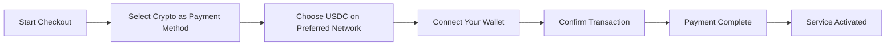
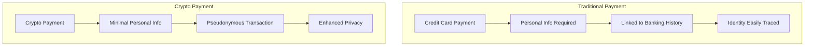
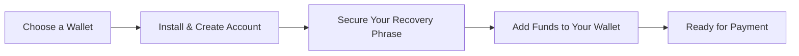

# Présentation des paiements cryptographiques : confidentialité améliorée pour votre service de messagerie électronique {#introducing-crypto-payments-enhanced-privacy-for-your-email-service}

## Table des matières {#table-of-contents}

* [Avant-propos](#foreword)
* [Pourquoi les paiements en cryptomonnaies sont importants](#why-crypto-payments-matter)
* [Comment ça marche](#how-it-works)
* [Avantages en matière de confidentialité](#privacy-benefits)
* [Détails techniques](#technical-details)
* [Configuration de votre portefeuille cryptographique](#setting-up-your-crypto-wallet)
  * [MétaMasque](#metamask)
  * [Fantôme](#phantom)
  * [Portefeuille Coinbase](#coinbase-wallet)
  * [WalletConnect](#walletconnect)
* [Commencer](#getting-started)
* [Avoir hâte de](#looking-forward)

## Avant-propos {#foreword}

Chez [Transférer un e-mail](https://forwardemail.net), nous cherchons constamment à améliorer votre [confidentialité](https://en.wikipedia.org/wiki/Privacy) et votre sécurité tout en rendant notre service plus accessible. Nous sommes ravis d'annoncer aujourd'hui que nous acceptons désormais les paiements [cryptomonnaie](https://en.wikipedia.org/wiki/Cryptocurrency) via l'intégration des paiements cryptographiques [Stripe](https://stripe.com).

## Pourquoi les paiements en cryptomonnaies sont importants {#why-crypto-payments-matter}

[Confidentialité](https://en.wikipedia.org/wiki/Internet_privacy) a toujours été au cœur de notre service. Bien que nous ayons proposé différents modes de paiement par le passé, les paiements en cryptomonnaies offrent un niveau de confidentialité supplémentaire, parfaitement en phase avec notre mission. En payant en cryptomonnaies, vous pouvez :

* Préservez votre anonymat lors de l'achat de nos services de messagerie
* Réduisez les informations personnelles liées à votre compte de messagerie
* Séparez vos identités financière et électronique
* Soutenez l'écosystème [finance décentralisée](https://en.wikipedia.org/wiki/Decentralized_finance) en pleine croissance

## Comment ça marche {#how-it-works}

Nous avons intégré le système de paiement crypto [Stripe](https://docs.stripe.com/crypto) pour simplifier le processus. Voici comment payer vos services de transfert d'e-mails en cryptomonnaie :

1. **Sélectionnez Crypto comme mode de paiement** : Lors du paiement, vous verrez « Crypto » comme option de paiement aux côtés des méthodes traditionnelles comme les cartes de crédit.

2. **Choisissez votre cryptomonnaie** : Actuellement, nous acceptons [USDC](https://en.wikipedia.org/wiki/USD_Coin) (USD Coin) sur plusieurs blockchains, dont [Ethereum](https://ethereum.org), [Solana](https://solana.com) et [Polygone](https://polygon.technology). L'USDC est une cryptomonnaie stable dont la valeur est de 1:1 avec le dollar américain.

3. **Connectez votre portefeuille** : Vous serez redirigé vers une page sécurisée où vous pourrez connecter votre portefeuille crypto préféré. Nous prenons en charge plusieurs options de portefeuille, notamment :
* [MétaMasque](https://metamask.io)
* [Fantôme](https://phantom.app)
* [Portefeuille Coinbase](https://www.coinbase.com/wallet)
* [WalletConnect](https://walletconnect.com) (compatible avec de nombreux autres portefeuilles)

4. **Terminez votre paiement** : Confirmez la transaction dans votre portefeuille et le tour est joué ! Le paiement sera traité et votre service de transfert d'e-mails sera immédiatement activé.

## Avantages de la confidentialité {#privacy-benefits}

L'utilisation de la crypto-monnaie pour votre abonnement Forward Email améliore votre confidentialité de plusieurs manières :

* **Informations personnelles réduites** : Contrairement aux paiements par carte de crédit, les transactions en cryptomonnaies ne nécessitent pas votre nom, votre adresse de facturation ni d’autres informations personnelles. En savoir plus sur [confidentialité des transactions](https://en.wikipedia.org/wiki/Privacy_coin).
* **Séparation des services bancaires traditionnels** : Votre paiement ne peut pas être lié à votre compte bancaire ni à votre historique de crédit. En savoir plus sur [confidentialité financière](https://en.wikipedia.org/wiki/Financial_privacy).
* **Confidentialité de la blockchain** : Bien que les transactions blockchain soient publiques, elles sont pseudonymes et ne sont pas directement liées à votre identité réelle. Voir [techniques de confidentialité de la blockchain](https://en.wikipedia.org/wiki/Privacy_and_blockchain).
* **Conformément à nos valeurs** : En tant que service de messagerie électronique axé sur la confidentialité, nous nous engageons à vous donner le contrôle de vos informations personnelles à chaque étape. Consultez notre [politique de confidentialité](/privacy).

## Détails techniques {#technical-details}

Pour ceux qui s'intéressent aux aspects techniques :

* Nous utilisons l'infrastructure de paiement cryptographique [Stripe](https://docs.stripe.com/crypto/stablecoin-payments), qui gère toute la complexité des transactions blockchain.
* Les paiements sont effectués dans [USDC](https://www.circle.com/en/usdc) sur plusieurs blockchains, dont [Ethereum](https://ethereum.org), [Solana](https://solana.com) et [Polygone](https://polygon.technology).
* Lorsque vous payez en cryptomonnaie, nous recevons la valeur équivalente en USD, ce qui nous permet de maintenir des prix stables.

## Configuration de votre portefeuille cryptographique {#setting-up-your-crypto-wallet}

Vous débutez dans les cryptomonnaies ? Voici comment configurer les portefeuilles que nous prenons en charge :

### MétaMasque {#metamask}

[MétaMasque](https://metamask.io) est l'un des portefeuilles Ethereum les plus populaires.

1. Accédez à [Page de téléchargement de MetaMask](https://metamask.io/download/)
2. Installez l'extension de navigateur ou l'application mobile
3. Suivez les instructions de configuration pour créer un nouveau portefeuille
4. **Important** : Conservez votre phrase de récupération en toute sécurité
5. Ajoutez des ETH ou des USDC à votre portefeuille via une plateforme d'échange ou un achat direct
6. [Guide de configuration détaillé de MetaMask](https://metamask.io/faqs/)

### Fantôme {#phantom}

[Fantôme](https://phantom.app) est un portefeuille Solana de premier plan.

1. Accédez à [Site Web fantôme](https://phantom.app/)
2. Téléchargez la version adaptée à votre appareil
3. Créez un nouveau portefeuille en suivant les instructions à l'écran
4. Sauvegardez votre phrase de récupération en toute sécurité
5. Ajoutez SOL ou USDC à votre portefeuille
6. [Guide du portefeuille fantôme](https://help.phantom.app/hc/en-us/articles/4406388623251-How-to-create-a-new-wallet)

### Portefeuille Coinbase {#coinbase-wallet}

[Portefeuille Coinbase](https://www.coinbase.com/wallet) prend en charge plusieurs blockchains.

1. Téléchargez [Portefeuille Coinbase](https://www.coinbase.com/wallet/downloads)
2. Créez un nouveau portefeuille (distinct du compte d'échange Coinbase)
3. Sécurisez votre phrase de récupération
4. Transférez ou achetez des cryptomonnaies directement dans l'application
5. [Guide du portefeuille Coinbase](https://www.coinbase.com/learn/tips-and-tutorials/how-to-set-up-a-crypto-wallet)

### WalletConnect {#walletconnect}

[WalletConnect](https://walletconnect.com) est un protocole qui connecte les portefeuilles aux sites Web.

1. Téléchargez d'abord un portefeuille compatible avec WalletConnect (plusieurs options disponibles).
2. Lors du paiement, sélectionnez WalletConnect.
3. Scannez le code QR avec votre application de portefeuille.
4. Validez la connexion.
5. [Portefeuilles compatibles avec WalletConnect](https://walletconnect.com/registry/wallets)

## Mise en route {#getting-started}

Prêt à améliorer votre confidentialité grâce aux paiements en cryptomonnaies ? Sélectionnez simplement l'option « Crypto » lors de votre prochain renouvellement ou de votre prochain changement d'abonnement.

Pour plus d'informations sur les crypto-monnaies et la technologie blockchain, consultez ces ressources :

* [Qu'est-ce que la crypto-monnaie ?](https://www.investopedia.com/terms/c/cryptocurrency.asp) - Investopedia
* [La blockchain expliquée](https://www.investopedia.com/terms/b/blockchain.asp) - Investopedia
* [Guide sur la confidentialité numérique](https://www.eff.org/issues/privacy) - Electronic Frontier Foundation

## Dans l'attente {#looking-forward}

L'ajout des paiements en cryptomonnaies n'est qu'une étape supplémentaire dans notre engagement continu envers [confidentialité](https://en.wikipedia.org/wiki/Privacy), [sécurité](https://en.wikipedia.org/wiki/Computer_security) et le libre choix des utilisateurs. Nous pensons que votre service de messagerie doit respecter votre vie privée à tous les niveaux, des messages que vous envoyez à votre mode de paiement.

Comme toujours, nous apprécions vos commentaires sur cette nouvelle option de paiement. Pour toute question concernant l'utilisation des cryptomonnaies avec Forward Email, veuillez contacter notre [équipe de soutien](/help).

---

**Références :**

1. [Documentation sur Stripe Crypto](https://docs.stripe.com/crypto)
2. [Stablecoin USDC](https://www.circle.com/en/usdc)
3. [Blockchain Ethereum](https://ethereum.org)
4. [Blockchain Solana](https://solana.com)
5. [Réseau polygonal](https://polygon.technology)
6. [Fondation Electronic Frontier - Confidentialité](https://www.eff.org/issues/privacy)
7. [Politique de confidentialité des e-mails transférés](/privacy)