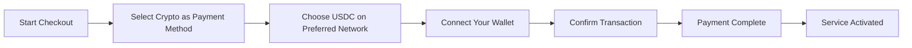
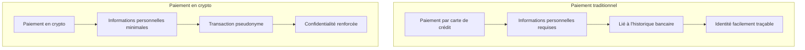
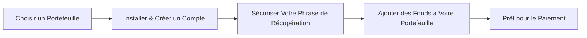

# Présentation des paiements en crypto : confidentialité renforcée pour votre service de messagerie {#introducing-crypto-payments-enhanced-privacy-for-your-email-service}

## Table des matières {#table-of-contents}

* [Avant-propos](#foreword)
* [Pourquoi les paiements en crypto sont importants](#why-crypto-payments-matter)
* [Comment ça fonctionne](#how-it-works)
* [Avantages en matière de confidentialité](#privacy-benefits)
* [Détails techniques](#technical-details)
* [Configurer votre portefeuille crypto](#setting-up-your-crypto-wallet)
  * [MetaMask](#metamask)
  * [Phantom](#phantom)
  * [Coinbase Wallet](#coinbase-wallet)
  * [WalletConnect](#walletconnect)
* [Commencer](#getting-started)
* [Perspectives](#looking-forward)

## Avant-propos {#foreword}

Chez [Forward Email](https://forwardemail.net), nous cherchons constamment des moyens d'améliorer votre [confidentialité](https://fr.wikipedia.org/wiki/Confidentialit%C3%A9) et votre sécurité tout en rendant notre service plus accessible. Aujourd'hui, nous sommes ravis d'annoncer que nous acceptons désormais les paiements en [cryptomonnaie](https://fr.wikipedia.org/wiki/Cryptomonnaie) via l'intégration de paiement crypto de [Stripe](https://stripe.com).

## Pourquoi les paiements en crypto sont importants {#why-crypto-payments-matter}

La [confidentialité](https://fr.wikipedia.org/wiki/Confidentialit%C3%A9_sur_Internet) a toujours été au cœur de notre service. Bien que nous ayons proposé diverses méthodes de paiement par le passé, les paiements en cryptomonnaie offrent une couche supplémentaire de confidentialité qui correspond parfaitement à notre mission. En payant en crypto, vous pouvez :

* Maintenir une plus grande anonymat lors de l'achat de nos services de messagerie
* Réduire les informations personnelles liées à votre compte email
* Garder vos identités financière et email séparées
* Soutenir l'écosystème croissant de la [finance décentralisée](https://fr.wikipedia.org/wiki/Finance_d%C3%A9centralis%C3%A9e)

## Comment ça fonctionne {#how-it-works}

Nous avons intégré le système de paiement crypto de [Stripe](https://docs.stripe.com/crypto) pour rendre le processus aussi fluide que possible. Voici comment vous pouvez payer les services Forward Email en utilisant la cryptomonnaie :

```mermaid
flowchart LR
    A[Start Checkout] --> B[Select Crypto as Payment Method]
    B --> C[Choose USDC on Preferred Network]
    C --> D[Connect Your Wallet]
    D --> E[Confirm Transaction]
    E --> F[Payment Complete]
    F --> G[Service Activated]
```

1. **Sélectionnez Crypto comme méthode de paiement** : Lors du paiement, vous verrez "Crypto" comme option de paiement aux côtés des méthodes traditionnelles comme les cartes de crédit.

2. **Choisissez votre cryptomonnaie** : Actuellement, nous acceptons [USDC](https://en.wikipedia.org/wiki/USD_Coin) (USD Coin) sur plusieurs blockchains dont [Ethereum](https://ethereum.org), [Solana](https://solana.com) et [Polygon](https://polygon.technology). USDC est une cryptomonnaie stable qui maintient une valeur 1:1 avec le dollar américain.

3. **Connectez votre portefeuille** : Vous serez redirigé vers une page sécurisée où vous pourrez connecter votre portefeuille crypto préféré. Nous supportons plusieurs options de portefeuille dont :
   * [MetaMask](https://metamask.io)
   * [Phantom](https://phantom.app)
   * [Coinbase Wallet](https://www.coinbase.com/wallet)
   * [WalletConnect](https://walletconnect.com) (compatible avec de nombreux autres portefeuilles)

4. **Finalisez votre paiement** : Confirmez la transaction dans votre portefeuille, et c’est tout ! Le paiement sera traité et votre service Forward Email sera activé immédiatement.

## Avantages en matière de confidentialité {#privacy-benefits}

Utiliser la cryptomonnaie pour votre abonnement Forward Email améliore votre confidentialité de plusieurs façons :

```mermaid
graph TD
    subgraph "Paiement traditionnel"
    A[Paiement par carte de crédit] --> B[Informations personnelles requises]
    B --> C[Lié à l'historique bancaire]
    C --> D[Identité facilement traçable]
    end

    subgraph "Paiement en crypto"
    E[Paiement en crypto] --> F[Informations personnelles minimales]
    F --> G[Transaction pseudonyme]
    G --> H[Confidentialité renforcée]
    end
```

* **Réduction des informations personnelles** : Contrairement aux paiements par carte de crédit, les transactions en crypto ne nécessitent pas votre nom, adresse de facturation ou autres détails personnels. En savoir plus sur la [confidentialité des transactions](https://en.wikipedia.org/wiki/Privacy_coin).
* **Séparation de la banque traditionnelle** : Votre paiement ne peut pas être lié à votre compte bancaire ou à votre historique de crédit. Lisez sur la [confidentialité financière](https://en.wikipedia.org/wiki/Financial_privacy).
* **Confidentialité de la blockchain** : Bien que les transactions blockchain soient publiques, elles sont pseudonymes et non directement liées à votre identité réelle. Voir les [techniques de confidentialité blockchain](https://en.wikipedia.org/wiki/Privacy_and_blockchain).
* **Conforme à nos valeurs** : En tant que service de messagerie axé sur la confidentialité, nous croyons en vous donnant le contrôle de vos informations personnelles à chaque étape. Consultez notre [politique de confidentialité](/privacy).
## Détails Techniques {#technical-details}

Pour ceux qui s'intéressent aux aspects techniques :

* Nous utilisons l'infrastructure de paiement crypto de [Stripe](https://docs.stripe.com/crypto/stablecoin-payments), qui gère toute la complexité des transactions blockchain.
* Les paiements sont effectués en [USDC](https://www.circle.com/en/usdc) sur plusieurs blockchains, notamment [Ethereum](https://ethereum.org), [Solana](https://solana.com), et [Polygon](https://polygon.technology).
* Bien que vous payiez en cryptomonnaie, nous recevons la valeur équivalente en USD, ce qui nous permet de maintenir des prix stables.

## Configuration de Votre Portefeuille Crypto {#setting-up-your-crypto-wallet}

Nouveau dans la cryptomonnaie ? Voici comment configurer les portefeuilles que nous supportons :

```mermaid
flowchart LR
    A[Choisir un Portefeuille] --> B[Installer & Créer un Compte]
    B --> C[Sécuriser Votre Phrase de Récupération]
    C --> D[Ajouter des Fonds à Votre Portefeuille]
    D --> E[Prêt pour le Paiement]
```

### MetaMask {#metamask}

[MetaMask](https://metamask.io) est l'un des portefeuilles Ethereum les plus populaires.

1. Visitez la [page de téléchargement MetaMask](https://metamask.io/download/)
2. Installez l'extension navigateur ou l'application mobile
3. Suivez les instructions de configuration pour créer un nouveau portefeuille
4. **Important** : Stockez votre phrase de récupération en toute sécurité
5. Ajoutez de l'ETH ou de l'USDC à votre portefeuille via un échange ou un achat direct
6. [Guide détaillé de configuration MetaMask](https://metamask.io/faqs/)

### Phantom {#phantom}

[Phantom](https://phantom.app) est un portefeuille leader sur Solana.

1. Visitez le [site Phantom](https://phantom.app/)
2. Téléchargez la version adaptée à votre appareil
3. Créez un nouveau portefeuille en suivant les instructions à l'écran
4. Sauvegardez votre phrase de récupération en toute sécurité
5. Ajoutez du SOL ou de l'USDC à votre portefeuille
6. [Guide du portefeuille Phantom](https://help.phantom.app/hc/en-us/articles/4406388623251-How-to-create-a-new-wallet)

### Coinbase Wallet {#coinbase-wallet}

[Coinbase Wallet](https://www.coinbase.com/wallet) supporte plusieurs blockchains.

1. Téléchargez [Coinbase Wallet](https://www.coinbase.com/wallet/downloads)
2. Créez un nouveau portefeuille (séparé du compte d'échange Coinbase)
3. Sécurisez votre phrase de récupération
4. Transférez ou achetez des cryptos directement dans l'application
5. [Guide Coinbase Wallet](https://www.coinbase.com/learn/tips-and-tutorials/how-to-set-up-a-crypto-wallet)

### WalletConnect {#walletconnect}

[WalletConnect](https://walletconnect.com) est un protocole qui connecte les portefeuilles aux sites web.

1. Téléchargez d'abord un portefeuille compatible WalletConnect (plusieurs options disponibles)
2. Lors du paiement, sélectionnez WalletConnect
3. Scannez le code QR avec votre application de portefeuille
4. Approuvez la connexion
5. [Portefeuilles compatibles WalletConnect](https://walletconnect.com/registry/wallets)

## Commencer {#getting-started}

Prêt à améliorer votre confidentialité avec les paiements en crypto ? Il vous suffit de sélectionner l'option « Crypto » lors du paiement la prochaine fois que vous renouvelez votre abonnement ou améliorez votre plan.

Pour plus d'informations sur les cryptomonnaies et la technologie blockchain, consultez ces ressources :

* [Qu'est-ce que la Cryptomonnaie ?](https://www.investopedia.com/terms/c/cryptocurrency.asp) - Investopedia
* [Explication de la Blockchain](https://www.investopedia.com/terms/b/blockchain.asp) - Investopedia
* [Guide de la Vie Privée Numérique](https://www.eff.org/issues/privacy) - Electronic Frontier Foundation

## Perspectives {#looking-forward}

L'ajout des paiements en cryptomonnaie est une étape supplémentaire dans notre engagement continu envers la [confidentialité](https://fr.wikipedia.org/wiki/Confidentialit%C3%A9), la [sécurité](https://fr.wikipedia.org/wiki/S%C3%A9curit%C3%A9_informatique) et le choix des utilisateurs. Nous croyons que votre service de messagerie doit respecter votre vie privée à tous les niveaux — des messages que vous envoyez à la manière dont vous payez le service.

Comme toujours, nous accueillons vos retours sur cette nouvelle option de paiement. Si vous avez des questions sur l'utilisation de la cryptomonnaie avec Forward Email, veuillez contacter notre [équipe de support](/help).

---

**Références :**

1. [Documentation Stripe Crypto](https://docs.stripe.com/crypto)
2. [Stablecoin USDC](https://www.circle.com/en/usdc)
3. [Blockchain Ethereum](https://ethereum.org)
4. [Blockchain Solana](https://solana.com)
5. [Réseau Polygon](https://polygon.technology)
6. [Electronic Frontier Foundation - Confidentialité](https://www.eff.org/issues/privacy)
7. [Politique de Confidentialité Forward Email](/privacy)
