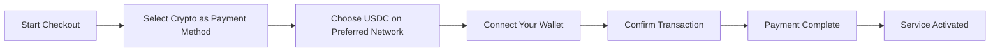
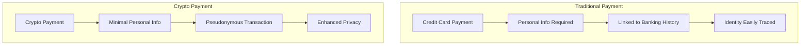
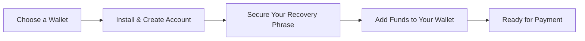

# הצגת תשלומי קריפטו: פרטיות משופרת עבור שירות הדוא"ל שלך {#introducing-crypto-payments-enhanced-privacy-for-your-email-service}

תוכן עניינים {##

* [הַקדָמָה](#foreword)
* [מדוע יש חשיבות לתשלומי קריפטו](#why-crypto-payments-matter)
* [איך זה עובד](#how-it-works)
* [יתרונות פרטיות](#privacy-benefits)
* [פרטים טכניים](#technical-details)
* [הגדרת ארנק הקריפטו שלך](#setting-up-your-crypto-wallet)
  * [MetaMask](#metamask)
  * [דִמיוֹנִי](#phantom)
  * [ארנק Coinbase](#coinbase-wallet)
  * [WalletConnect](#walletconnect)
* [תחילת העבודה](#getting-started)
* [מביט קדימה](#looking-forward)

## הקדמה {#foreword}

ב-[העברת דוא"ל](https://forwardemail.net), אנו מחפשים כל הזמן דרכים לשפר את [פְּרָטִיוּת](https://en.wikipedia.org/wiki/Privacy) ואת האבטחה שלך, תוך הפיכת השירות שלנו לנגיש יותר. היום, אנו שמחים להודיע שאנו מקבלים כעת תשלומים [מטבע קריפטוגרפי](https://en.wikipedia.org/wiki/Cryptocurrency) דרך שילוב תשלומי קריפטו [של פס](https://stripe.com).

## למה תשלומי קריפטו חשובים {#why-crypto-payments-matter}

[פְּרָטִיוּת](https://en.wikipedia.org/wiki/Internet_privacy) תמיד היה בליבת השירות שלנו. למרות שהצענו מגוון שיטות תשלום בעבר, תשלומים במטבעות קריפטוגרפיים מספקים שכבת פרטיות נוספת שמתיישבת בצורה מושלמת עם המשימה שלנו. על ידי תשלום באמצעות קריפטו, תוכלו:

* שמירה על אנונימיות רבה יותר בעת רכישת שירותי הדוא"ל שלנו
* צמצום המידע האישי הקשור לחשבון הדוא"ל שלך
* שמירה על הפרדה של הזהויות הפיננסיות והדוא"ל שלך
* תמיכה במערכת האקולוגית הגדלה של [מימון מבוזר](https://en.wikipedia.org/wiki/Decentralized_finance)

## איך זה עובד {#how-it-works}

שילבנו את מערכת התשלומים הקריפטוגרפית [של פס](https://docs.stripe.com/crypto) כדי להפוך את התהליך לחלק ככל האפשר. כך תוכלו לשלם עבור שירותי העברת דוא"ל באמצעות מטבעות קריפטוגרפיים:

1. **בחרו קריפטו כאמצעי התשלום שלכם**: בעת ביצוע הרכישה, תראו "קריפטו" כאפשרות תשלום לצד שיטות מסורתיות כמו כרטיסי אשראי.

2. **בחרו את המטבע הקריפטוגרפי שלכם**: נכון לעכשיו, אנו מקבלים [USDC](https://en.wikipedia.org/wiki/USD_Coin) (מטבע דולר אמריקאי) במספר בלוקצ'יין, כולל [את'ריום](https://ethereum.org), [סולנה](https://solana.com) ו-[מְצוּלָע](https://polygon.technology). USDC הוא מטבע קריפטוגרפי יציב ששומר על ערך של 1:1 ביחס לדולר האמריקאי.

3. **חבר את הארנק שלך**: תועבר לדף מאובטח שבו תוכל לחבר את ארנק הקריפטו המועדף עליך. אנו תומכים באפשרויות ארנק מרובות, כולל:
* [MetaMask](https://metamask.io)
* [דִמיוֹנִי](https://phantom.app)
* [ארנק Coinbase](https://www.coinbase.com/wallet)
* [WalletConnect](https://walletconnect.com) (תואם לארנקים רבים אחרים)

4. **השלם את התשלום**: אשר את העסקה בארנק שלך, ואתה מוכן! התשלום יעובד, ושירות העברת הדוא"ל שלך יופעל באופן מיידי.

## יתרונות פרטיות {#privacy-benefits}

שימוש במטבעות קריפטוגרפיים עבור מנוי Forward Email שלך משפר את הפרטיות שלך בכמה דרכים:

* **מידע אישי מופחת**: בניגוד לתשלומים בכרטיס אשראי, עסקאות קריפטו אינן דורשות את שמך, כתובת החיוב או פרטים אישיים אחרים. למידע נוסף על [פרטיות העסקה](https://en.wikipedia.org/wiki/Privacy_coin).
* **הפרדה מבנקאות מסורתית**: לא ניתן לקשר את התשלום שלך לחשבון הבנק או להיסטוריית האשראי שלך. קרא על [פרטיות פיננסית](https://en.wikipedia.org/wiki/Financial_privacy).
* **פרטיות בלוקצ'יין**: בעוד שעסקאות בלוקצ'יין הן ציבוריות, הן נמצאות תחת שם בדויים ואינן קשורות ישירות לזהותך האמיתית. ראה [טכניקות פרטיות בלוקצ'יין](https://en.wikipedia.org/wiki/Privacy_and_blockchain).
* **בהתאם לערכים שלנו**: כשירות דוא"ל המתמקד בפרטיות, אנו מאמינים במתן שליטה על המידע האישי שלך בכל שלב. עיין ב-[מדיניות הפרטיות](/privacy) שלנו.

## פרטים טכניים {#technical-details}

למעוניינים בהיבטים הטכניים:

* אנו משתמשים בתשתית תשלומים קריפטוגרפית [של פס](https://docs.stripe.com/crypto/stablecoin-payments), המטפלת בכל המורכבות של עסקאות בלוקצ'יין.
* התשלומים מתבצעים ב-[USDC](https://www.circle.com/en/usdc) על גבי מספר בלוקצ'יין, כולל [את'ריום](https://ethereum.org), [סולנה](https://solana.com) ו-[מְצוּלָע](https://polygon.technology).
* בזמן שאתם משלמים במטבעות קריפטוגרפיים, אנו מקבלים את הערך המקביל בדולר אמריקאי, מה שמאפשר לנו לשמור על תמחור יציב.

## הגדרת ארנק הקריפטו שלך {#setting-up-your-crypto-wallet}

חדש במטבעות קריפטוגרפיים? הנה איך להגדיר את הארנקים שבהם אנו תומכים:

### מטא-מסכה {#metamask}

[MetaMask](https://metamask.io) הוא אחד מארנקי את'ריום הפופולריים ביותר.

1. בקרו באתר [דף הורדה של MetaMask](https://metamask.io/download/)
2. התקינו את תוסף הדפדפן או את אפליקציית המובייל
3. עקבו אחר הוראות ההתקנה כדי ליצור ארנק חדש
4. **חשוב**: אחסן בצורה מאובטחת את משפט השחזור שלך
5. הוסיפו ETH או USDC לארנק שלכם באמצעות החלפה או רכישה ישירה
6. [מדריך התקנה מפורט של MetaMask](https://metamask.io/faqs/)

### פנטום {#phantom}

[דִמיוֹנִי](https://phantom.app) הוא ארנק סולאנה מוביל.

1. בקרו באתר [אתר פנטום](https://phantom.app/)
2. הורידו את הגרסה המתאימה למכשיר שלכם
3. צרו ארנק חדש לפי ההוראות שעל המסך
4. גבו בצורה מאובטחת את משפט השחזור שלכם
5. הוסיפו SOL או USDC לארנק שלכם
6. [מדריך ארנק פנטום](https://help.phantom.app/hc/en-us/articles/4406388623251-How-to-create-a-new-wallet)

### ארנק Coinbase {#coinbase-wallet}

[ארנק Coinbase](https://www.coinbase.com/wallet) תומך במספר בלוקצ'יין.

1. הורד את [ארנק Coinbase](https://www.coinbase.com/wallet/downloads)
2. צור ארנק חדש (נפרד מחשבון הבורסה של Coinbase)
3. אבטח את משפט השחזור שלך
4. העבר או קנה קריפטו ישירות באפליקציה
5. [מדריך ארנק Coinbase](https://www.coinbase.com/learn/tips-and-tutorials/how-to-set-up-a-crypto-wallet)

### ארנקקונקט {#walletconnect}

[WalletConnect](https://walletconnect.com) הוא פרוטוקול המחבר ארנקים לאתרי אינטרנט.

1. ראשית, הורידו ארנק תואם WalletConnect (קיימות אפשרויות רבות)
2. במהלך התשלום, בחרו WalletConnect
3. סרקו את קוד ה-QR באמצעות אפליקציית הארנק שלכם
4. אשרו את החיבור
5. [ארנקים תואמי WalletConnect](https://walletconnect.com/registry/wallets)

## תחילת העבודה {#getting-started}

מוכן לשפר את הפרטיות שלך עם תשלומי קריפטו? פשוט בחר באפשרות "קריפטו" במהלך התשלום בפעם הבאה שתחדש את המנוי שלך או תשדרג את התוכנית שלך.

למידע נוסף על מטבעות קריפטוגרפיים וטכנולוגיית בלוקצ'יין, עיין במשאבים הבאים:

* [מהו מטבע קריפטו?](https://www.investopedia.com/terms/c/cryptocurrency.asp) - Investopedia
* [הסבר בלוקצ'יין](https://www.investopedia.com/terms/b/blockchain.asp) - Investopedia
* [מדריך פרטיות דיגיטלית](https://www.eff.org/issues/privacy) - קרן Electronic Frontier

## מצפה לעתיד {#looking-forward}

הוספת תשלומי מטבעות קריפטוגרפיים היא רק צעד נוסף במחויבות המתמשכת שלנו ל-[פְּרָטִיוּת](https://en.wikipedia.org/wiki/Privacy), [בִּטָחוֹן](https://en.wikipedia.org/wiki/Computer_security), ולבחירת המשתמש. אנו מאמינים ששירות הדוא"ל שלך צריך לכבד את פרטיותך בכל רמה - החל מההודעות שאתה שולח ועד לאופן שבו אתה משלם עבור השירות.

כרגיל, נשמח לקבל את המשוב שלכם על אפשרות התשלום החדשה הזו. אם יש לכם שאלות לגבי שימוש בקריפטו עם Forward Email, אנא צרו קשר עם [צוות תמיכה](/help) שלנו.

---

**הפניות:**

1. [תיעוד Stripe Crypto](https://docs.stripe.com/crypto)
2. [USDC Stablecoin](https://www.circle.com/en/usdc)
3. [Ethereum Blockchain](https://ethereum.org)
4. [סולנה בלוקצ'יין](https://solana.com)
5. [רשת מצולע](https://polygon.technology)
6. [Electronic Frontier Foundation - פרטיות](https://www.eff.org/issues/privacy)
7. [העבר את מדיניות הפרטיות של דוא"ל](/privacy)