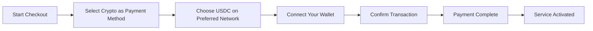
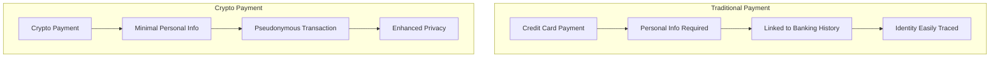
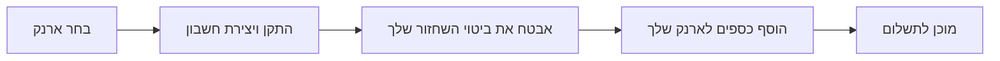

# הצגת תשלומי קריפטו: פרטיות משופרת לשירות האימייל שלך {#introducing-crypto-payments-enhanced-privacy-for-your-email-service}

## תוכן העניינים {#table-of-contents}

* [הקדמה](#foreword)
* [מדוע תשלומי קריפטו חשובים](#why-crypto-payments-matter)
* [איך זה עובד](#how-it-works)
* [יתרונות הפרטיות](#privacy-benefits)
* [פרטים טכניים](#technical-details)
* [הגדרת ארנק הקריפטו שלך](#setting-up-your-crypto-wallet)
  * [MetaMask](#metamask)
  * [Phantom](#phantom)
  * [Coinbase Wallet](#coinbase-wallet)
  * [WalletConnect](#walletconnect)
* [התחלה](#getting-started)
* [מבט לעתיד](#looking-forward)

## הקדמה {#foreword}

ב-[Forward Email](https://forwardemail.net), אנחנו תמיד מחפשים דרכים לשפר את ה[פרטיות](https://en.wikipedia.org/wiki/Privacy) והאבטחה שלך תוך כדי הפיכת השירות שלנו לנגיש יותר. היום, אנו נרגשים להודיע כי כעת אנו מקבלים תשלומים ב[מטבעות קריפטוגרפיים](https://en.wikipedia.org/wiki/Cryptocurrency) באמצעות אינטגרציית תשלומי הקריפטו של [Stripe](https://stripe.com).

## מדוע תשלומי קריפטו חשובים {#why-crypto-payments-matter}

ה[פרטיות](https://en.wikipedia.org/wiki/Internet_privacy) תמיד הייתה בלב השירות שלנו. בעוד שהצענו בעבר שיטות תשלום שונות, תשלומי קריפטו מספקים שכבת פרטיות נוספת שמתאימה באופן מושלם למשימתנו. בתשלום בקריפטו, תוכל:

* לשמור על אנונימיות גבוהה יותר בעת רכישת שירותי האימייל שלנו
* להפחית את המידע האישי הקשור לחשבון האימייל שלך
* לשמור על הפרדה בין זהותך הפיננסית לזהות האימייל שלך
* לתמוך באקוסיסטם המתפתח של [פיננסים מבוזרים](https://en.wikipedia.org/wiki/Decentralized_finance)

## איך זה עובד {#how-it-works}

אינטגרנו את מערכת תשלומי הקריפטו של [Stripe](https://docs.stripe.com/crypto) כדי להפוך את התהליך לחלק ככל האפשר. כך תוכל לשלם עבור שירותי Forward Email באמצעות מטבעות קריפטוגרפיים:

```mermaid
flowchart LR
    A[Start Checkout] --> B[Select Crypto as Payment Method]
    B --> C[Choose USDC on Preferred Network]
    C --> D[Connect Your Wallet]
    D --> E[Confirm Transaction]
    E --> F[Payment Complete]
    F --> G[Service Activated]
```

1. **בחר קריפטו כאמצעי התשלום שלך**: בעת התשלום, תראה את האפשרות "קריפטו" לצד שיטות מסורתיות כמו כרטיסי אשראי.

2. **בחר את המטבע הקריפטוגרפי שלך**: כרגע, אנו מקבלים [USDC](https://en.wikipedia.org/wiki/USD_Coin) (USD Coin) על מספר רשתות בלוקצ'יין כולל [Ethereum](https://ethereum.org), [Solana](https://solana.com), ו-[Polygon](https://polygon.technology). USDC הוא מטבע קריפטוגרפי יציב ששומר על ערך של 1:1 מול הדולר האמריקאי.

3. **חבר את הארנק שלך**: תועבר לעמוד מאובטח שבו תוכל לחבר את ארנק הקריפטו המועדף עליך. אנו תומכים במספר אפשרויות ארנק כולל:
   * [MetaMask](https://metamask.io)
   * [Phantom](https://phantom.app)
   * [Coinbase Wallet](https://www.coinbase.com/wallet)
   * [WalletConnect](https://walletconnect.com) (תואם להרבה ארנקים אחרים)

4. **השלים את התשלום שלך**: אשר את העסקה בארנק שלך, ואתה מוכן! התשלום יעובד, ושירות Forward Email שלך יופעל מיד.

## יתרונות הפרטיות {#privacy-benefits}

שימוש במטבעות קריפטוגרפיים למנוי Forward Email שלך משפר את הפרטיות שלך בכמה דרכים:

```mermaid
graph TD
    subgraph "Traditional Payment"
    A[Credit Card Payment] --> B[Personal Info Required]
    B --> C[Linked to Banking History]
    C --> D[Identity Easily Traced]
    end

    subgraph "Crypto Payment"
    E[Crypto Payment] --> F[Minimal Personal Info]
    F --> G[Pseudonymous Transaction]
    G --> H[Enhanced Privacy]
    end
```

* **הפחתת מידע אישי**: בניגוד לתשלומי כרטיסי אשראי, עסקאות קריפטו אינן דורשות את שמך, כתובת החיוב או פרטים אישיים אחרים. למידע נוסף על [פרטיות בעסקאות](https://en.wikipedia.org/wiki/Privacy_coin).
* **הפרדה מבנקאות מסורתית**: התשלום שלך לא יכול להיות מקושר לחשבון הבנק או להיסטוריית האשראי שלך. קרא על [פרטיות פיננסית](https://en.wikipedia.org/wiki/Financial_privacy).
* **פרטיות בבלוקצ'יין**: למרות שעסקאות בלוקצ'יין הן ציבוריות, הן פסאודונימיות ואינן קשורות ישירות לזהותך בעולם האמיתי. ראה [טכניקות פרטיות בבלוקצ'יין](https://en.wikipedia.org/wiki/Privacy_and_blockchain).
* **תואם לערכינו**: כשירות אימייל המתמקד בפרטיות, אנו מאמינים במתן שליטה על המידע האישי שלך בכל שלב. עיין ב[מדיניות הפרטיות שלנו](/privacy).
## פרטים טכניים {#technical-details}

למי שמעוניין בהיבטים הטכניים:

* אנו משתמשים בתשתית התשלומים הקריפטוגרפית של [Stripe's](https://docs.stripe.com/crypto/stablecoin-payments), שמטפלת בכל המורכבות של עסקאות בלוקצ'יין.
* התשלומים מתבצעים ב-[USDC](https://www.circle.com/en/usdc) על פני מספר בלוקצ'יינים כולל [Ethereum](https://ethereum.org), [Solana](https://solana.com), ו-[Polygon](https://polygon.technology).
* בזמן שאתם משלמים במטבע קריפטוגרפי, אנו מקבלים את הערך המקביל בדולרים אמריקאיים, מה שמאפשר לנו לשמור על תמחור יציב.

## הגדרת ארנק הקריפטו שלך {#setting-up-your-crypto-wallet}

חדש בקריפטו? כך תגדירו את הארנקים שאנו תומכים בהם:

```mermaid
flowchart LR
    A[בחר ארנק] --> B[התקן ויצירת חשבון]
    B --> C[אבטח את ביטוי השחזור שלך]
    C --> D[הוסף כספים לארנק שלך]
    D --> E[מוכן לתשלום]
```

### MetaMask {#metamask}

[MetaMask](https://metamask.io) הוא אחד מארנקי האת'ריום הפופולריים ביותר.

1. בקר בדף [הורדת MetaMask](https://metamask.io/download/)
2. התקן את תוסף הדפדפן או את אפליקציית המובייל
3. עקוב אחר הוראות ההגדרה ליצירת ארנק חדש
4. **חשוב**: שמור את ביטוי השחזור שלך בצורה מאובטחת
5. הוסף ETH או USDC לארנק שלך דרך בורסה או רכישה ישירה
6. [מדריך הגדרה מפורט של MetaMask](https://metamask.io/faqs/)

### Phantom {#phantom}

[Phantom](https://phantom.app) הוא ארנק מוביל של Solana.

1. בקר באתר [Phantom](https://phantom.app/)
2. הורד את הגרסה המתאימה למכשיר שלך
3. צור ארנק חדש לפי ההוראות שעל המסך
4. גבה בצורה מאובטחת את ביטוי השחזור שלך
5. הוסף SOL או USDC לארנק שלך
6. [מדריך ארנק Phantom](https://help.phantom.app/hc/en-us/articles/4406388623251-How-to-create-a-new-wallet)

### Coinbase Wallet {#coinbase-wallet}

[Coinbase Wallet](https://www.coinbase.com/wallet) תומך במספר בלוקצ'יינים.

1. הורד את [Coinbase Wallet](https://www.coinbase.com/wallet/downloads)
2. צור ארנק חדש (נפרד מחשבון הבורסה של Coinbase)
3. אבטח את ביטוי השחזור שלך
4. העבר או רכש קריפטו ישירות באפליקציה
5. [מדריך ארנק Coinbase](https://www.coinbase.com/learn/tips-and-tutorials/how-to-set-up-a-crypto-wallet)

### WalletConnect {#walletconnect}

[WalletConnect](https://walletconnect.com) הוא פרוטוקול שמחבר ארנקים לאתרים.

1. תחילה, הורד ארנק התומך ב-WalletConnect (ישנן אפשרויות רבות)
2. במהלך התשלום, בחר ב-WalletConnect
3. סרוק את קוד ה-QR עם אפליקציית הארנק שלך
4. אשר את החיבור
5. [ארנקים התומכים ב-WalletConnect](https://walletconnect.com/registry/wallets)

## התחלה {#getting-started}

מוכן לשפר את הפרטיות שלך עם תשלומים בקריפטו? פשוט בחר באפשרות "קריפטו" בעת התשלום בפעם הבאה שתחדש את המנוי או תשדרג את התוכנית שלך.

למידע נוסף על מטבעות קריפטוגרפיים וטכנולוגיית בלוקצ'יין, עיין במשאבים הבאים:

* [מהי מטבע קריפטוגרפי?](https://www.investopedia.com/terms/c/cryptocurrency.asp) - Investopedia
* [הסבר על בלוקצ'יין](https://www.investopedia.com/terms/b/blockchain.asp) - Investopedia
* [מדריך לפרטיות דיגיטלית](https://www.eff.org/issues/privacy) - Electronic Frontier Foundation

## מבט לעתיד {#looking-forward}

הוספת תשלומים במטבעות קריפטוגרפיים היא רק צעד נוסף במחויבות המתמשכת שלנו ל-[פרטיות](https://en.wikipedia.org/wiki/Privacy), [אבטחה](https://en.wikipedia.org/wiki/Computer_security) ובחירת המשתמש. אנו מאמינים ששירות הדואר האלקטרוני שלך צריך לכבד את פרטיותך בכל רמה—מההודעות שאתה שולח ועד לאופן שבו אתה משלם עבור השירות.

כמו תמיד, נשמח לקבל את המשוב שלך על אפשרות התשלום החדשה הזו. אם יש לך שאלות לגבי שימוש במטבעות קריפטוגרפיים עם Forward Email, אנא פנה אל צוות [התמיכה שלנו](/help).

---

**הפניות:**

1. [תיעוד קריפטו של Stripe](https://docs.stripe.com/crypto)
2. [USDC Stablecoin](https://www.circle.com/en/usdc)
3. [בלוקצ'יין Ethereum](https://ethereum.org)
4. [בלוקצ'יין Solana](https://solana.com)
5. [רשת Polygon](https://polygon.technology)
6. [Electronic Frontier Foundation - פרטיות](https://www.eff.org/issues/privacy)
7. [מדיניות פרטיות של Forward Email](/privacy)
