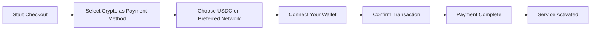
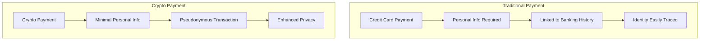
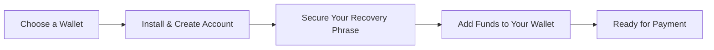

# Bemutatkozik a kriptofizetés: Fokozott adatvédelem az e-mail szolgáltatásához {#introducing-crypto-payments-enhanced-privacy-for-your-email-service}

## Tartalomjegyzék {#table-of-contents}

* [Előszó](#foreword)
* [Miért fontosak a kriptovaluta-fizetések?](#why-crypto-payments-matter)
* [Hogyan működik](#how-it-works)
* [Adatvédelmi előnyök](#privacy-benefits)
* [Műszaki adatok](#technical-details)
* [Kriptovaluta-tárca beállítása](#setting-up-your-crypto-wallet)
  * [MetaMaszk](#metamask)
  * [Fantom](#phantom)
  * [Coinbase pénztárca](#coinbase-wallet)
  * [WalletConnect](#walletconnect)
* [Első lépések](#getting-started)
* [Előre tekintve](#looking-forward)

## Előszó {#foreword}

A [E-mail továbbítása](https://forwardemail.net)-nál folyamatosan keressük a módját, hogy javítsuk a [magánélet](https://en.wikipedia.org/wiki/Privacy) biztonságát, miközben szolgáltatásunkat könnyebben hozzáférhetővé tesszük. Ma örömmel jelentjük be, hogy mostantól elfogadjuk a [kriptovaluta](https://en.wikipedia.org/wiki/Cryptocurrency) fizetéseket a [Csíkos](https://stripe.com) kriptofizetési integrációján keresztül.

## Miért fontosak a kriptofizetések? {#why-crypto-payments-matter}

A [Magánélet](https://en.wikipedia.org/wiki/Internet_privacy) mindig is szolgáltatásunk középpontjában állt. Bár a múltban számos fizetési módot kínáltunk, a kriptovalutával történő fizetés egy további adatvédelmi réteget biztosít, amely tökéletesen illeszkedik küldetésünkhöz. Kriptovalutával fizetve a következőket teheti:

* Fokozott anonimitást biztosít e-mail szolgáltatásaink vásárlásakor
* Csökkenti az e-mail fiókjához kapcsolódó személyes adatok mennyiségét
* Különíti el pénzügyi és e-mail azonosítóit
* Támogassa a növekvő [decentralizált pénzügyek](https://en.wikipedia.org/wiki/Decentralized_finance) ökoszisztémát

## Hogyan működik {#how-it-works}

Integráltuk a [Csíkos](https://docs.stripe.com/crypto) kriptovaluta fizetési rendszert, hogy a folyamat a lehető legzökkenőmentesebb legyen. Így fizethet a Forward Email szolgáltatásokért kriptovalutával:

1. **Válasszon kriptovalutát fizetési módként**: Fizetéskor a hagyományos fizetési módok, például a hitelkártyák mellett a „Kripto” felirat is megjelenik fizetési lehetőségként.

2. **Válassza ki a kriptovalutáját**: Jelenleg a [USDC](https://en.wikipedia.org/wiki/USD_Coin) (USD Coin) kriptovalutát több blokkláncon is elfogadjuk, beleértve a [Ethereum](https://ethereum.org), [Solana](https://solana.com) és [Poligon](https://polygon.technology) blokkláncokat. Az USDC egy stabil kriptovaluta, amely 1:1 arányban tartja az értékét az amerikai dollárral.

3. **Tárca csatlakoztatása**: Átirányítunk egy biztonságos oldalra, ahol csatlakoztathatja a kívánt kriptotárcáját. Több tárcaopciót is támogatunk, beleértve:
* [MetaMaszk](https://metamask.io)
* [Fantom](https://phantom.app)
* [Coinbase pénztárca](https://www.coinbase.com/wallet)
* [WalletConnect](https://walletconnect.com) (számos más tárcával kompatibilis)

4. **Fizetés befejezése**: Erősítse meg a tranzakciót a tárcájában, és máris készen áll! A fizetés feldolgozásra kerül, és az e-mail továbbítási szolgáltatása azonnal aktiválódik.

## Adatvédelmi előnyök {#privacy-benefits}

A Forward Email feliratkozáshoz kriptovaluták használata számos módon javítja az adatvédelmet:

* **Kevesebb személyes adat**: A hitelkártyás fizetésekkel ellentétben a kriptovalutákkal történő tranzakciókhoz nincs szükség a nevére, számlázási címére vagy egyéb személyes adataira. További információ a [tranzakciók adatvédelme](https://en.wikipedia.org/wiki/Privacy_coin) dokumentumról.
* **Elkülönülés a hagyományos banki szolgáltatásoktól**: A fizetése nem kapcsolható össze bankszámlájával vagy hiteltörténetével. További információ a [pénzügyi adatvédelem](https://en.wikipedia.org/wiki/Financial_privacy) dokumentumról.
* **Blokklánc-adatvédelem**: Bár a blokklánc-tranzakciók nyilvánosak, álnevesek, és nem kapcsolódnak közvetlenül a valós személyazonosságához. Lásd: [blokklánc adatvédelmi technikák](https://en.wikipedia.org/wiki/Privacy_and_blockchain).
* **Összhangban az értékeinkkel**: Adatvédelemre összpontosító e-mail-szolgáltatásként hiszünk abban, hogy minden lépésnél Önt kell kézben tartania személyes adatai felett. Tekintse meg a [adatvédelmi irányelvek](/privacy) dokumentumunkat.

## Műszaki adatok {#technical-details}

Akiket érdekelnek a technikai részletek:

* A [Csíkos](https://docs.stripe.com/crypto/stablecoin-payments) kriptofizetési infrastruktúrát használjuk, amely a blokklánc-tranzakciók összes összetettségét kezeli.
* A fizetések [USDC](https://www.circle.com/en/usdc)-ben történnek több blokkláncon, beleértve a [Ethereum](https://ethereum.org), [Solana](https://solana.com) és [Poligon](https://polygon.technology) blokkokat is.
* Amíg kriptovalutában fizet, mi az egyenértékű értéket USD-ben kapjuk meg, így stabil árakat tudunk fenntartani.

## Kriptovaluta-tárca beállítása {#setting-up-your-crypto-wallet}

Új a kriptovaluták világában? Így állíthatod be az általunk támogatott tárcákat:

### MetaMaszk {#metamask}

A [MetaMaszk](https://metamask.io) az egyik legnépszerűbb Ethereum tárca.

1. Látogassa meg a [MetaMask letöltési oldal](https://metamask.io/download/) oldalt.
2. Telepítse a böngészőbővítményt vagy a mobilalkalmazást.
3. Kövesse a telepítési utasításokat egy új pénztárca létrehozásához.
4. **Fontos**: Biztonságosan tárolja a helyreállítási kódját.
5. Adjon hozzá ETH-t vagy USDC-t a pénztárcájához tőzsdén vagy közvetlen vásárláson keresztül.
6. [Részletes MetaMask beállítási útmutató](https://metamask.io/faqs/)

### Fantom {IDEIGLENES_PLACEHOLDER_1

A [Fantom](https://phantom.app) egy vezető Solana tárca.

1. Látogassa meg a [Fantom weboldal](https://phantom.app/) oldalt.
2. Töltse le az eszközéhez megfelelő verziót.
3. Hozzon létre egy új tárcát a képernyőn megjelenő utasításokat követve.
4. Biztonságosan készítsen biztonsági másolatot a helyreállítási jelszaváról.
5. Adjon hozzá SOL vagy USDC egyenleget a tárcájához.
6. [Fantom pénztárca útmutató](https://help.phantom.app/hc/en-us/articles/4406388623251-How-to-create-a-new-wallet)

### Coinbase pénztárca {#coinbase-wallet}

A [Coinbase pénztárca](https://www.coinbase.com/wallet) több blokkláncot is támogat.

1. Töltse le a [Coinbase pénztárca](https://www.coinbase.com/wallet/downloads) alkalmazást.
2. Hozzon létre egy új tárcát (a Coinbase tőzsdefióktól függetlenül).
3. Biztosítsa a helyreállítási jelszavát.
4. Utaljon vagy vásároljon kriptovalutát közvetlenül az alkalmazásban.
5. [Coinbase pénztárca útmutató](https://www.coinbase.com/learn/tips-and-tutorials/how-to-set-up-a-crypto-wallet)

### WalletConnect {#walletconnect}

A [WalletConnect](https://walletconnect.com) egy protokoll, amely tárcákat köt össze weboldalakkal.

1. Először töltsön le egy WalletConnect-kompatibilis tárcát (számos lehetőség közül választhat).
2. A fizetés során válassza a WalletConnect lehetőséget.
3. Olvassa be a QR-kódot a tárcaalkalmazásával.
4. Hagyja jóvá a kapcsolatot.
5. [WalletConnect kompatibilis pénztárcák](https://walletconnect.com/registry/wallets)

## Első lépések {#getting-started}

Készen állsz arra, hogy kriptovalutákkal történő fizetésekkel fokozd az adatvédelmedet? Egyszerűen válaszd a „Kripto” lehetőséget a fizetés során, amikor legközelebb megújítod az előfizetésedet vagy frissíted a csomagodat.

A kriptovalutákról és a blokklánc technológiáról további információkat az alábbi forrásokban talál:

* [Mi a kriptovaluta?](https://www.investopedia.com/terms/c/cryptocurrency.asp) - Investopedia
* [Blokklánc magyarázata](https://www.investopedia.com/terms/b/blockchain.asp) - Investopedia
* [Digitális adatvédelmi útmutató](https://www.eff.org/issues/privacy) - Elektronikus Határ Alapítvány

## Előretekintve {#looking-forward}

A kriptovalutás fizetések hozzáadása csak egy újabb lépés a [magánélet](https://en.wikipedia.org/wiki/Privacy), a [biztonság](https://en.wikipedia.org/wiki/Computer_security) és a felhasználói választási lehetőségek iránti folyamatos elkötelezettségünkben. Úgy gondoljuk, hogy az e-mail-szolgáltatásnak minden szinten tiszteletben kell tartania az Ön adatainak védelmét – az elküldött üzenetektől kezdve egészen addig, hogy hogyan fizeti a szolgáltatást.

Mint mindig, örömmel fogadjuk visszajelzését ezzel az új fizetési móddal kapcsolatban. Ha kérdése van a kriptovaluták Forward Email funkcióval való használatával kapcsolatban, kérjük, vegye fel a kapcsolatot a [támogató csapat](/help) munkatársunkkal.

---

**Referenciák:**

1. [Stripe Crypto dokumentáció](https://docs.stripe.com/crypto)
2. [USDC stabilérme](https://www.circle.com/en/usdc)
3. [Ethereum blokklánc](https://ethereum.org)
4. [Solana blokklánc](https://solana.com)
5. [Poligonhálózat](https://polygon.technology)
6. [Elektronikus Határ Alapítvány - Adatvédelem](https://www.eff.org/issues/privacy)
7. [E-mail továbbítási adatvédelmi irányelvek](/privacy)