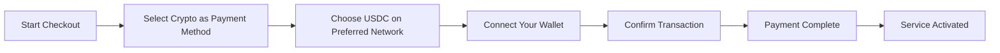
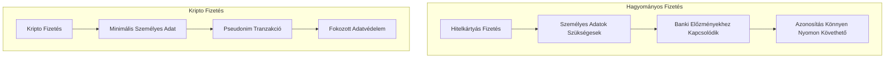
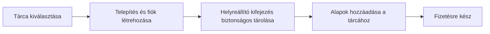

# Bemutatkozik a Kripto Fizetés: Fokozott Adatvédelem az Email Szolgáltatásodhoz {#introducing-crypto-payments-enhanced-privacy-for-your-email-service}

## Tartalomjegyzék {#table-of-contents}

* [Előszó](#foreword)
* [Miért Fontosak a Kripto Fizetések](#why-crypto-payments-matter)
* [Hogyan Működik](#how-it-works)
* [Adatvédelmi Előnyök](#privacy-benefits)
* [Technikai Részletek](#technical-details)
* [Kripto Tárcád Beállítása](#setting-up-your-crypto-wallet)
  * [MetaMask](#metamask)
  * [Phantom](#phantom)
  * [Coinbase Wallet](#coinbase-wallet)
  * [WalletConnect](#walletconnect)
* [Első Lépések](#getting-started)
* [Előre Tekintve](#looking-forward)

## Előszó {#foreword}

A [Forward Email](https://forwardemail.net) csapatánál folyamatosan keressük a módját, hogyan javíthatnánk az Ön [adatvédelmét](https://en.wikipedia.org/wiki/Privacy) és biztonságát, miközben szolgáltatásunkat még hozzáférhetőbbé tesszük. Ma örömmel jelentjük be, hogy mostantól elfogadjuk a [kriptopénzes](https://en.wikipedia.org/wiki/Cryptocurrency) fizetéseket a [Stripe](https://stripe.com) kripto fizetési integrációján keresztül.

## Miért Fontosak a Kripto Fizetések {#why-crypto-payments-matter}

Az [adatvédelem](https://en.wikipedia.org/wiki/Internet_privacy) mindig is szolgáltatásunk alapja volt. Bár korábban többféle fizetési módot kínáltunk, a kripto fizetések egy további adatvédelmi réteget biztosítanak, amely tökéletesen illeszkedik küldetésünkhöz. Kriptóval fizetve Ön:

* Nagyobb anonimitást tarthat meg email szolgáltatásaink vásárlásakor
* Csökkentheti az email fiókjához kötött személyes adatok mennyiségét
* Elkülönítheti pénzügyi és email azonosítóit
* Támogathatja a növekvő [decentralizált pénzügyi](https://en.wikipedia.org/wiki/Decentralized_finance) ökoszisztémát

## Hogyan Működik {#how-it-works}

Integráltuk a [Stripe](https://docs.stripe.com/crypto) kripto fizetési rendszerét, hogy a folyamat a lehető legzökkenőmentesebb legyen. Így fizethet a Forward Email szolgáltatásaiért kriptopénzzel:

```mermaid
flowchart LR
    A[Start Checkout] --> B[Select Crypto as Payment Method]
    B --> C[Choose USDC on Preferred Network]
    C --> D[Connect Your Wallet]
    D --> E[Confirm Transaction]
    E --> F[Payment Complete]
    F --> G[Service Activated]
```

1. **Válassza a Kripto Fizetést**: A fizetésnél a "Crypto" opciót fogja látni a hagyományos fizetési módok, például a hitelkártya mellett.

2. **Válassza Ki a Kriptopénzét**: Jelenleg elfogadjuk az [USDC](https://en.wikipedia.org/wiki/USD_Coin) (USD Coin) kriptopénzt több blokkláncon, beleértve az [Ethereum](https://ethereum.org), [Solana](https://solana.com) és [Polygon](https://polygon.technology) hálózatokat. Az USDC egy stabil kriptopénz, amely 1:1 arányban követi az amerikai dollár értékét.

3. **Csatlakoztassa Tárcáját**: Egy biztonságos oldalra irányítjuk, ahol csatlakoztathatja kedvenc kripto tárcáját. Több tárca opciót támogatunk, többek között:
   * [MetaMask](https://metamask.io)
   * [Phantom](https://phantom.app)
   * [Coinbase Wallet](https://www.coinbase.com/wallet)
   * [WalletConnect](https://walletconnect.com) (számos más tárcával kompatibilis)

4. **Fejezze be a Fizetést**: Erősítse meg a tranzakciót a tárcájában, és kész is! A fizetés feldolgozásra kerül, és a Forward Email szolgáltatása azonnal aktiválódik.

## Adatvédelmi Előnyök {#privacy-benefits}

A Forward Email előfizetésének kriptopénzzel történő fizetése több szempontból is növeli az adatvédelmet:

```mermaid
graph TD
    subgraph "Hagyományos Fizetés"
    A[Hitelkártyás Fizetés] --> B[Személyes Adatok Szükségesek]
    B --> C[Banki Előzményekhez Kapcsolódik]
    C --> D[Azonosítás Könnyen Nyomon Követhető]
    end

    subgraph "Kripto Fizetés"
    E[Kripto Fizetés] --> F[Minimális Személyes Adat]
    F --> G[Pseudonim Tranzakció]
    G --> H[Fokozott Adatvédelem]
    end
```

* **Csökkentett Személyes Adatok**: A hitelkártyás fizetésekkel ellentétben a kripto tranzakciók nem igénylik a nevét, számlázási címét vagy egyéb személyes adatait. Tudjon meg többet a [tranzakciós adatvédelemről](https://en.wikipedia.org/wiki/Privacy_coin).
* **Elkülönülés a Hagyományos Banki Rendszertől**: Fizetése nem köthető össze bankszámlájával vagy hiteltörténetével. Olvasson a [pénzügyi adatvédelemről](https://en.wikipedia.org/wiki/Financial_privacy).
* **Blokklánc Adatvédelem**: Bár a blokklánc tranzakciók nyilvánosak, azok pseudonimek, és nem közvetlenül kötődnek valós személyazonosságához. Tekintse meg a [blokklánc adatvédelmi technikákat](https://en.wikipedia.org/wiki/Privacy_and_blockchain).
* **Összhangban Értékeinkkel**: Mint adatvédelem-központú email szolgáltatás, hisszük, hogy Önnek minden lépésnél irányítása alatt kell tartania személyes adatait. Tekintse meg adatvédelmi szabályzatunkat [privacy policy](/privacy).
## Műszaki részletek {#technical-details}

Azok számára, akiket a műszaki részletek érdekelnek:

* A [Stripe](https://docs.stripe.com/crypto/stablecoin-payments) kriptófizetési infrastruktúráját használjuk, amely kezeli a blokklánc tranzakciók minden bonyolultságát.
* A fizetések [USDC](https://www.circle.com/en/usdc) formájában történnek több blokkláncon, beleértve az [Ethereum](https://ethereum.org), [Solana](https://solana.com) és [Polygon](https://polygon.technology) hálózatokat.
* Bár kriptovalutában fizetsz, mi az USD megfelelő értékét kapjuk meg, ami lehetővé teszi számunkra az árak stabil szinten tartását.

## Kriptotárcád beállítása {#setting-up-your-crypto-wallet}

Új vagy a kriptovaluták világában? Így állíthatod be az általunk támogatott tárcákat:

```mermaid
flowchart LR
    A[Tárca kiválasztása] --> B[Telepítés és fiók létrehozása]
    B --> C[Helyreállító kifejezés biztonságos tárolása]
    C --> D[Alapok hozzáadása a tárcához]
    D --> E[Fizetésre kész]
```

### MetaMask {#metamask}

A [MetaMask](https://metamask.io) az egyik legnépszerűbb Ethereum tárca.

1. Látogass el a [MetaMask letöltési oldalára](https://metamask.io/download/)
2. Telepítsd a böngészőbővítményt vagy a mobilalkalmazást
3. Kövesd a beállítási utasításokat egy új tárca létrehozásához
4. **Fontos**: Biztonságosan tárold a helyreállító kifejezést
5. Adj hozzá ETH-t vagy USDC-t a tárcádhoz egy tőzsdén vagy közvetlen vásárlással
6. [Részletes MetaMask beállítási útmutató](https://metamask.io/faqs/)

### Phantom {#phantom}

A [Phantom](https://phantom.app) egy vezető Solana tárca.

1. Látogass el a [Phantom weboldalára](https://phantom.app/)
2. Töltsd le az eszközödnek megfelelő verziót
3. Hozz létre egy új tárcát a képernyőn megjelenő utasítások szerint
4. Biztonságosan készíts biztonsági mentést a helyreállító kifejezésről
5. Adj hozzá SOL-t vagy USDC-t a tárcádhoz
6. [Phantom tárca útmutató](https://help.phantom.app/hc/en-us/articles/4406388623251-How-to-create-a-new-wallet)

### Coinbase Wallet {#coinbase-wallet}

A [Coinbase Wallet](https://www.coinbase.com/wallet) több blokkláncot is támogat.

1. Töltsd le a [Coinbase Walletet](https://www.coinbase.com/wallet/downloads)
2. Hozz létre egy új tárcát (külön a Coinbase tőzsdei fióktól)
3. Biztosítsd a helyreállító kifejezést
4. Kriptót közvetlenül az alkalmazásban vásárolhatsz vagy átutalhatsz
5. [Coinbase Wallet útmutató](https://www.coinbase.com/learn/tips-and-tutorials/how-to-set-up-a-crypto-wallet)

### WalletConnect {#walletconnect}

A [WalletConnect](https://walletconnect.com) egy protokoll, amely tárcákat köt össze weboldalakkal.

1. Először tölts le egy WalletConnect-kompatibilis tárcát (számos lehetőség elérhető)
2. A fizetés során válaszd a WalletConnect opciót
3. Olvasd be a QR-kódot a tárcaalkalmazásoddal
4. Engedélyezd a kapcsolatot
5. [WalletConnect kompatibilis tárcák](https://walletconnect.com/registry/wallets)

## Kezdés {#getting-started}

Készen állsz, hogy fokozd az adatvédelmed kriptófizetésekkel? Egyszerűen válaszd a "Kripto" opciót a fizetésnél, amikor legközelebb megújítod az előfizetésed vagy frissíted a csomagod.

További információk a kriptovalutákról és a blokklánc technológiáról:

* [Mi az a kriptovaluta?](https://www.investopedia.com/terms/c/cryptocurrency.asp) - Investopedia
* [Blokklánc magyarázat](https://www.investopedia.com/terms/b/blockchain.asp) - Investopedia
* [Digitális adatvédelmi útmutató](https://www.eff.org/issues/privacy) - Electronic Frontier Foundation

## Előre tekintve {#looking-forward}

A kriptovaluta fizetések hozzáadása csak egy újabb lépés az adatvédelemhez ([privacy](https://en.wikipedia.org/wiki/Privacy)), biztonsághoz ([security](https://en.wikipedia.org/wiki/Computer_security)) és a felhasználói választáshoz való elkötelezettségünkben. Úgy véljük, hogy az e-mail szolgáltatásodnak minden szinten tiszteletben kell tartania az adatvédelmedet – az elküldött üzenetektől kezdve egészen a szolgáltatás fizetéséig.

Mint mindig, szívesen fogadjuk visszajelzésedet erről az új fizetési lehetőségről. Ha kérdéseid vannak a kriptovaluta használatával kapcsolatban a Forward Email szolgáltatásban, kérjük, fordulj a [támogatói csapatunkhoz](/help).

---

**Hivatkozások:**

1. [Stripe Crypto Dokumentáció](https://docs.stripe.com/crypto)
2. [USDC Stablecoin](https://www.circle.com/en/usdc)
3. [Ethereum blokklánc](https://ethereum.org)
4. [Solana blokklánc](https://solana.com)
5. [Polygon hálózat](https://polygon.technology)
6. [Electronic Frontier Foundation - Adatvédelem](https://www.eff.org/issues/privacy)
7. [Forward Email Adatvédelmi Szabályzat](/privacy)
