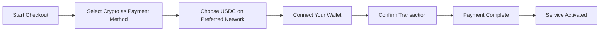
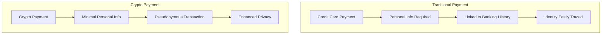
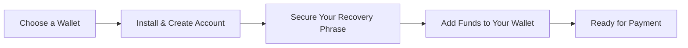

# Memperkenalkan Pembayaran Kripto: Privasi yang Ditingkatkan untuk Layanan Email Anda {#introducing-crypto-payments-enhanced-privacy-for-your-email-service}

## Daftar Isi {#table-of-contents}

* [Kata pengantar](#foreword)
* [Mengapa Pembayaran Kripto Penting](#why-crypto-payments-matter)
* [Cara Kerjanya](#how-it-works)
* [Manfaat Privasi](#privacy-benefits)
* [Detail Teknis](#technical-details)
* [Menyiapkan Dompet Kripto Anda](#setting-up-your-crypto-wallet)
  * [MetaMask](#metamask)
  * [Hantu](#phantom)
  * [Dompet Coinbase](#coinbase-wallet)
  * [Koneksi Dompet](#walletconnect)
* [Memulai](#getting-started)
* [Menantikan](#looking-forward)

## Kata Pengantar {#foreword}

Di [Teruskan Email](https://forwardemail.net), kami terus mencari cara untuk meningkatkan [pribadi](https://en.wikipedia.org/wiki/Privacy) dan keamanan Anda sekaligus membuat layanan kami lebih mudah diakses. Hari ini, dengan bangga kami umumkan bahwa kami kini menerima pembayaran [mata uang kripto](https://en.wikipedia.org/wiki/Cryptocurrency) melalui integrasi pembayaran kripto [Garis-garis](https://stripe.com).

## Mengapa Pembayaran Kripto Penting {#why-crypto-payments-matter}

[Pribadi](https://en.wikipedia.org/wiki/Internet_privacy) selalu menjadi inti layanan kami. Meskipun kami telah menawarkan berbagai metode pembayaran sebelumnya, pembayaran mata uang kripto memberikan lapisan privasi tambahan yang selaras dengan misi kami. Dengan membayar menggunakan kripto, Anda dapat:

* Jaga anonimitas yang lebih baik saat membeli layanan email kami
* Kurangi informasi pribadi yang terkait dengan akun email Anda
* Pisahkan identitas keuangan dan email Anda
* Dukung ekosistem [keuangan terdesentralisasi](https://en.wikipedia.org/wiki/Decentralized_finance) yang sedang berkembang

## Cara Kerjanya {#how-it-works}

Kami telah mengintegrasikan sistem pembayaran kripto [Garis-garis](https://docs.stripe.com/crypto) agar prosesnya semulus mungkin. Berikut cara Anda membayar layanan Forward Email menggunakan mata uang kripto:

1. **Pilih Kripto sebagai Metode Pembayaran Anda**: Saat melakukan pembayaran, Anda akan melihat "Kripto" sebagai opsi pembayaran di samping metode tradisional seperti kartu kredit.

2. **Pilih Mata Uang Kripto Anda**: Saat ini, kami menerima [USDC](https://en.wikipedia.org/wiki/USD_Coin) (USD Coin) di berbagai blockchain termasuk [Ethereum](https://ethereum.org), [Solana](https://solana.com), dan [Poligon](https://polygon.technology). USDC adalah mata uang kripto stabil yang nilainya setara dengan dolar AS.

3. **Hubungkan Dompet Anda**: Anda akan diarahkan ke halaman aman tempat Anda dapat menghubungkan dompet kripto pilihan Anda. Kami mendukung beberapa opsi dompet, termasuk:
* [MetaMask](https://metamask.io)
* [Hantu](https://phantom.app)
* [Dompet Coinbase](https://www.coinbase.com/wallet)
* [Koneksi Dompet](https://walletconnect.com) (kompatibel dengan banyak dompet lainnya)

4. **Selesaikan Pembayaran Anda**: Konfirmasikan transaksi di dompet Anda, dan Anda sudah siap! Pembayaran akan diproses, dan layanan Email Terusan Anda akan segera diaktifkan.

## Manfaat Privasi {#privacy-benefits}

Menggunakan mata uang kripto untuk langganan Email Terusan Anda meningkatkan privasi Anda dalam beberapa cara:

* **Informasi Pribadi yang Dikurangi**: Tidak seperti pembayaran kartu kredit, transaksi kripto tidak memerlukan nama, alamat penagihan, atau detail pribadi lainnya. Pelajari lebih lanjut tentang [privasi transaksi](https://en.wikipedia.org/wiki/Privacy_coin).
* **Pemisahan dari Perbankan Tradisional**: Pembayaran Anda tidak dapat dikaitkan dengan rekening bank atau riwayat kredit Anda. Baca tentang [privasi keuangan](https://en.wikipedia.org/wiki/Financial_privacy).
* **Privasi Blockchain**: Meskipun transaksi blockchain bersifat publik, transaksi tersebut bersifat pseudonim dan tidak terkait langsung dengan identitas dunia nyata Anda. Lihat [teknik privasi blockchain](https://en.wikipedia.org/wiki/Privacy_and_blockchain).
* **Sesuai dengan Nilai-Nilai Kami**: Sebagai layanan email yang berfokus pada privasi, kami percaya untuk memberi Anda kendali atas informasi pribadi Anda di setiap langkah. Lihat [kebijakan privasi](/privacy) kami.

## Detail Teknis {#technical-details}

Bagi mereka yang tertarik dengan aspek teknisnya:

* Kami menggunakan infrastruktur pembayaran kripto [Garis-garis](https://docs.stripe.com/crypto/stablecoin-payments), yang menangani semua kompleksitas transaksi blockchain.
* Pembayaran dilakukan dalam [USDC](https://www.circle.com/en/usdc) pada beberapa blockchain, termasuk [Ethereum](https://ethereum.org), [Solana](https://solana.com), dan [Poligon](https://polygon.technology).
* Saat Anda membayar dalam mata uang kripto, kami menerima nilai yang setara dalam USD, sehingga kami dapat mempertahankan harga yang stabil.

## Menyiapkan Dompet Kripto Anda {#setting-up-your-crypto-wallet}

Baru mengenal mata uang kripto? Berikut cara mengatur dompet yang kami dukung:

### MetaMask {#metamask}

[MetaMask](https://metamask.io) adalah salah satu dompet Ethereum yang paling populer.

1. Kunjungi [Halaman unduhan MetaMask](https://metamask.io/download/)
2. Pasang ekstensi peramban atau aplikasi seluler
3. Ikuti petunjuk pengaturan untuk membuat dompet baru
4. **Penting**: Simpan frasa pemulihan Anda dengan aman
5. Tambahkan ETH atau USDC ke dompet Anda melalui bursa atau pembelian langsung
6. [Panduan Pengaturan MetaMask Terperinci](https://metamask.io/faqs/)

### Hantu {#phantom}

[Hantu](https://phantom.app) adalah dompet Solana terkemuka.

1. Kunjungi [Situs web hantu](https://phantom.app/)
2. Unduh versi yang sesuai untuk perangkat Anda
3. Buat dompet baru dengan mengikuti petunjuk di layar
4. Cadangkan frasa pemulihan Anda dengan aman
5. Tambahkan SOL atau USDC ke dompet Anda
6. [Panduan Dompet Phantom](https://help.phantom.app/hc/en-us/articles/4406388623251-How-to-create-a-new-wallet)

### Dompet Coinbase {#coinbase-wallet}

[Dompet Coinbase](https://www.coinbase.com/wallet) mendukung beberapa blockchain.

1. Unduh [Dompet Coinbase](https://www.coinbase.com/wallet/downloads)
2. Buat dompet baru (terpisah dari akun bursa Coinbase)
3. Amankan frasa pemulihan Anda
4. Transfer atau beli kripto langsung di aplikasi
5. [Panduan Dompet Coinbase](https://www.coinbase.com/learn/tips-and-tutorials/how-to-set-up-a-crypto-wallet)

### Koneksi Dompet {#walletconnect}

[Koneksi Dompet](https://walletconnect.com) adalah protokol yang menghubungkan dompet ke situs web.

1. Pertama, unduh dompet yang kompatibel dengan WalletConnect (tersedia banyak pilihan)
2. Saat pembayaran, pilih WalletConnect
3. Pindai kode QR dengan aplikasi dompet Anda
4. Setujui koneksi
5. [Dompet yang Kompatibel dengan WalletConnect](https://walletconnect.com/registry/wallets)

## Memulai {#getting-started}

Siap meningkatkan privasi Anda dengan pembayaran kripto? Cukup pilih opsi "Kripto" saat pembayaran saat Anda memperbarui langganan atau meningkatkan paket berikutnya.

Untuk informasi lebih lanjut tentang mata uang kripto dan teknologi blockchain, lihat sumber daya berikut:

* [Apa itu Mata Uang Kripto?](https://www.investopedia.com/terms/c/cryptocurrency.asp) - Investopedia
* [Penjelasan tentang Blockchain](https://www.investopedia.com/terms/b/blockchain.asp) - Investopedia
* [Panduan Privasi Digital](https://www.eff.org/issues/privacy) - Yayasan Electronic Frontier

## Menantikan {#looking-forward}

Menambahkan pembayaran mata uang kripto hanyalah satu langkah lagi dalam komitmen berkelanjutan kami terhadap [pribadi](https://en.wikipedia.org/wiki/Privacy), [keamanan](https://en.wikipedia.org/wiki/Computer_security), dan pilihan pengguna. Kami percaya bahwa layanan email Anda harus menghormati privasi Anda di setiap aspek—mulai dari pesan yang Anda kirim hingga cara Anda membayar layanan tersebut.

Seperti biasa, kami sangat menghargai masukan Anda mengenai opsi pembayaran baru ini. Jika Anda memiliki pertanyaan tentang penggunaan mata uang kripto dengan Forward Email, silakan hubungi [tim pendukung](/help) kami.

---

**Referensi:**

1. [Dokumentasi Kripto Stripe](https://docs.stripe.com/crypto)
2. [Koin Stabil USDC](https://www.circle.com/en/usdc)
3. [Rantai Blok Ethereum](https://ethereum.org)
4. [Solana Blockchain](https://solana.com)
5. [Jaringan Poligon](https://polygon.technology)
6. [Yayasan Perbatasan Elektronik - Privasi](https://www.eff.org/issues/privacy)
7. [Kebijakan Privasi Email Teruskan](/privacy)