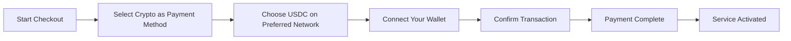
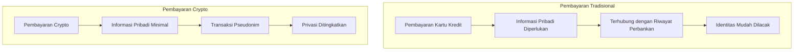
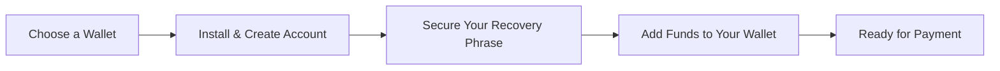

# Memperkenalkan Pembayaran Crypto: Privasi yang Ditingkatkan untuk Layanan Email Anda {#introducing-crypto-payments-enhanced-privacy-for-your-email-service}

## Daftar Isi {#table-of-contents}

* [Kata Pengantar](#foreword)
* [Mengapa Pembayaran Crypto Penting](#why-crypto-payments-matter)
* [Cara Kerjanya](#how-it-works)
* [Manfaat Privasi](#privacy-benefits)
* [Detail Teknis](#technical-details)
* [Menyiapkan Dompet Crypto Anda](#setting-up-your-crypto-wallet)
  * [MetaMask](#metamask)
  * [Phantom](#phantom)
  * [Coinbase Wallet](#coinbase-wallet)
  * [WalletConnect](#walletconnect)
* [Memulai](#getting-started)
* [Melihat ke Depan](#looking-forward)

## Kata Pengantar {#foreword}

Di [Forward Email](https://forwardemail.net), kami terus mencari cara untuk meningkatkan [privasi](https://en.wikipedia.org/wiki/Privacy) dan keamanan Anda sekaligus membuat layanan kami lebih mudah diakses. Hari ini, kami dengan senang hati mengumumkan bahwa kami sekarang menerima pembayaran [cryptocurrency](https://en.wikipedia.org/wiki/Cryptocurrency) melalui integrasi pembayaran crypto dari [Stripe](https://stripe.com).

## Mengapa Pembayaran Crypto Penting {#why-crypto-payments-matter}

[Privasi](https://en.wikipedia.org/wiki/Internet_privacy) selalu menjadi inti dari layanan kami. Meskipun kami telah menawarkan berbagai metode pembayaran di masa lalu, pembayaran cryptocurrency memberikan lapisan privasi tambahan yang sangat sesuai dengan misi kami. Dengan membayar menggunakan crypto, Anda dapat:

* Menjaga anonimitas yang lebih besar saat membeli layanan email kami
* Mengurangi informasi pribadi yang terkait dengan akun email Anda
* Memisahkan identitas keuangan dan email Anda
* Mendukung ekosistem [keuangan terdesentralisasi](https://en.wikipedia.org/wiki/Decentralized_finance) yang sedang berkembang

## Cara Kerjanya {#how-it-works}

Kami telah mengintegrasikan sistem pembayaran crypto dari [Stripe](https://docs.stripe.com/crypto) untuk membuat prosesnya semulus mungkin. Berikut cara Anda dapat membayar layanan Forward Email menggunakan cryptocurrency:

```mermaid
flowchart LR
    A[Start Checkout] --> B[Select Crypto as Payment Method]
    B --> C[Choose USDC on Preferred Network]
    C --> D[Connect Your Wallet]
    D --> E[Confirm Transaction]
    E --> F[Payment Complete]
    F --> G[Service Activated]
```

1. **Pilih Crypto sebagai Metode Pembayaran Anda**: Saat melakukan checkout, Anda akan melihat opsi "Crypto" sebagai metode pembayaran selain metode tradisional seperti kartu kredit.

2. **Pilih Cryptocurrency Anda**: Saat ini, kami menerima [USDC](https://en.wikipedia.org/wiki/USD_Coin) (USD Coin) di beberapa blockchain termasuk [Ethereum](https://ethereum.org), [Solana](https://solana.com), dan [Polygon](https://polygon.technology). USDC adalah cryptocurrency stabil yang mempertahankan nilai 1:1 dengan dolar AS.

3. **Hubungkan Dompet Anda**: Anda akan diarahkan ke halaman aman di mana Anda dapat menghubungkan dompet crypto pilihan Anda. Kami mendukung beberapa opsi dompet termasuk:
   * [MetaMask](https://metamask.io)
   * [Phantom](https://phantom.app)
   * [Coinbase Wallet](https://www.coinbase.com/wallet)
   * [WalletConnect](https://walletconnect.com) (kompatibel dengan banyak dompet lainnya)

4. **Selesaikan Pembayaran Anda**: Konfirmasikan transaksi di dompet Anda, dan semuanya siap! Pembayaran akan diproses, dan layanan Forward Email Anda akan segera diaktifkan.

## Manfaat Privasi {#privacy-benefits}

Menggunakan cryptocurrency untuk langganan Forward Email Anda meningkatkan privasi Anda dalam beberapa cara:

```mermaid
graph TD
    subgraph "Pembayaran Tradisional"
    A[Pembayaran Kartu Kredit] --> B[Informasi Pribadi Diperlukan]
    B --> C[Terhubung dengan Riwayat Perbankan]
    C --> D[Identitas Mudah Dilacak]
    end

    subgraph "Pembayaran Crypto"
    E[Pembayaran Crypto] --> F[Informasi Pribadi Minimal]
    F --> G[Transaksi Pseudonim]
    G --> H[Privasi Ditingkatkan]
    end
```

* **Informasi Pribadi Berkurang**: Berbeda dengan pembayaran kartu kredit, transaksi crypto tidak memerlukan nama, alamat penagihan, atau detail pribadi lainnya. Pelajari lebih lanjut tentang [privasi transaksi](https://en.wikipedia.org/wiki/Privacy_coin).
* **Pemisahan dari Perbankan Tradisional**: Pembayaran Anda tidak dapat dihubungkan dengan rekening bank atau riwayat kredit Anda. Baca tentang [privasi keuangan](https://en.wikipedia.org/wiki/Financial_privacy).
* **Privasi Blockchain**: Meskipun transaksi blockchain bersifat publik, mereka bersifat pseudonim dan tidak langsung terkait dengan identitas dunia nyata Anda. Lihat [teknik privasi blockchain](https://en.wikipedia.org/wiki/Privacy_and_blockchain).
* **Konsisten dengan Nilai Kami**: Sebagai layanan email yang berfokus pada privasi, kami percaya dalam memberikan Anda kontrol atas informasi pribadi Anda di setiap langkah. Lihat [kebijakan privasi kami](/privacy).
## Detail Teknis {#technical-details}

Untuk yang tertarik dengan aspek teknis:

* Kami menggunakan infrastruktur pembayaran kripto [Stripe's](https://docs.stripe.com/crypto/stablecoin-payments), yang menangani semua kompleksitas transaksi blockchain.
* Pembayaran dilakukan dalam [USDC](https://www.circle.com/en/usdc) di berbagai blockchain termasuk [Ethereum](https://ethereum.org), [Solana](https://solana.com), dan [Polygon](https://polygon.technology).
* Meskipun Anda membayar dengan cryptocurrency, kami menerima nilai setara dalam USD, memungkinkan kami menjaga harga tetap stabil.

## Menyiapkan Dompet Crypto Anda {#setting-up-your-crypto-wallet}

Baru dengan cryptocurrency? Berikut cara menyiapkan dompet yang kami dukung:

```mermaid
flowchart LR
    A[Choose a Wallet] --> B[Install & Create Account]
    B --> C[Secure Your Recovery Phrase]
    C --> D[Add Funds to Your Wallet]
    D --> E[Ready for Payment]
```

### MetaMask {#metamask}

[MetaMask](https://metamask.io) adalah salah satu dompet Ethereum paling populer.

1. Kunjungi [halaman unduh MetaMask](https://metamask.io/download/)
2. Pasang ekstensi browser atau aplikasi mobile
3. Ikuti petunjuk penyiapan untuk membuat dompet baru
4. **Penting**: Simpan frase pemulihan Anda dengan aman
5. Tambahkan ETH atau USDC ke dompet Anda melalui pertukaran atau pembelian langsung
6. [Panduan Penyiapan MetaMask Lengkap](https://metamask.io/faqs/)

### Phantom {#phantom}

[Phantom](https://phantom.app) adalah dompet terkemuka untuk Solana.

1. Kunjungi [situs Phantom](https://phantom.app/)
2. Unduh versi yang sesuai untuk perangkat Anda
3. Buat dompet baru mengikuti instruksi di layar
4. Cadangkan frase pemulihan Anda dengan aman
5. Tambahkan SOL atau USDC ke dompet Anda
6. [Panduan Dompet Phantom](https://help.phantom.app/hc/en-us/articles/4406388623251-How-to-create-a-new-wallet)

### Coinbase Wallet {#coinbase-wallet}

[Coinbase Wallet](https://www.coinbase.com/wallet) mendukung berbagai blockchain.

1. Unduh [Coinbase Wallet](https://www.coinbase.com/wallet/downloads)
2. Buat dompet baru (terpisah dari akun pertukaran Coinbase)
3. Amankan frase pemulihan Anda
4. Transfer atau beli crypto langsung di aplikasi
5. [Panduan Coinbase Wallet](https://www.coinbase.com/learn/tips-and-tutorials/how-to-set-up-a-crypto-wallet)

### WalletConnect {#walletconnect}

[WalletConnect](https://walletconnect.com) adalah protokol yang menghubungkan dompet ke situs web.

1. Pertama, unduh dompet yang kompatibel dengan WalletConnect (banyak pilihan tersedia)
2. Saat checkout, pilih WalletConnect
3. Pindai kode QR dengan aplikasi dompet Anda
4. Setujui koneksi
5. [Dompet Kompatibel WalletConnect](https://walletconnect.com/registry/wallets)

## Memulai {#getting-started}

Siap meningkatkan privasi Anda dengan pembayaran crypto? Cukup pilih opsi "Crypto" saat checkout berikutnya ketika Anda memperbarui langganan atau meningkatkan paket Anda.

Untuk informasi lebih lanjut tentang cryptocurrency dan teknologi blockchain, lihat sumber daya berikut:

* [Apa itu Cryptocurrency?](https://www.investopedia.com/terms/c/cryptocurrency.asp) - Investopedia
* [Penjelasan Blockchain](https://www.investopedia.com/terms/b/blockchain.asp) - Investopedia
* [Panduan Privasi Digital](https://www.eff.org/issues/privacy) - Electronic Frontier Foundation

## Melihat ke Depan {#looking-forward}

Menambahkan pembayaran cryptocurrency adalah satu langkah lagi dalam komitmen berkelanjutan kami terhadap [privasi](https://en.wikipedia.org/wiki/Privacy), [keamanan](https://en.wikipedia.org/wiki/Computer_security), dan pilihan pengguna. Kami percaya bahwa layanan email Anda harus menghormati privasi Anda di setiap tingkat—dari pesan yang Anda kirim hingga cara Anda membayar layanan.

Seperti biasa, kami menyambut umpan balik Anda tentang opsi pembayaran baru ini. Jika Anda memiliki pertanyaan tentang penggunaan cryptocurrency dengan Forward Email, silakan hubungi [tim dukungan kami](/help).

---

**Referensi:**

1. [Dokumentasi Stripe Crypto](https://docs.stripe.com/crypto)
2. [Stablecoin USDC](https://www.circle.com/en/usdc)
3. [Blockchain Ethereum](https://ethereum.org)
4. [Blockchain Solana](https://solana.com)
5. [Jaringan Polygon](https://polygon.technology)
6. [Electronic Frontier Foundation - Privasi](https://www.eff.org/issues/privacy)
7. [Kebijakan Privasi Forward Email](/privacy)
