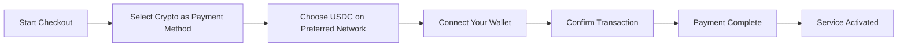
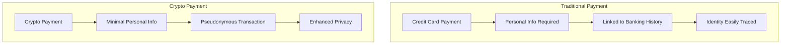
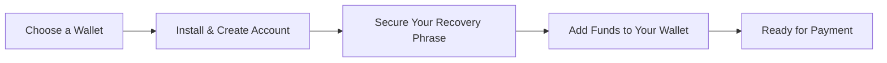

# Introduzione ai pagamenti in criptovaluta: maggiore privacy per il tuo servizio di posta elettronica {#introducing-crypto-payments-enhanced-privacy-for-your-email-service}

## Indice {#table-of-contents}

* [Prefazione](#foreword)
* [Perché i pagamenti in criptovaluta sono importanti](#why-crypto-payments-matter)
* [Come funziona](#how-it-works)
* [Vantaggi della privacy](#privacy-benefits)
* [Dettagli tecnici](#technical-details)
* [Impostazione del tuo portafoglio crittografico](#setting-up-your-crypto-wallet)
  * [MetaMask](#metamask)
  * [Fantasma](#phantom)
  * [Portafoglio Coinbase](#coinbase-wallet)
  * [WalletConnect](#walletconnect)
* [Iniziare](#getting-started)
* [In attesa](#looking-forward)

## Prefazione {#foreword}

Noi di [Inoltra e-mail](https://forwardemail.net) siamo costantemente alla ricerca di modi per migliorare la tua sicurezza e la tua esperienza [riservatezza](https://en.wikipedia.org/wiki/Privacy), rendendo il nostro servizio più accessibile. Oggi siamo lieti di annunciare che ora accettiamo pagamenti [criptovaluta](https://en.wikipedia.org/wiki/Cryptocurrency) tramite l'integrazione di pagamenti in criptovaluta [Stripe's](https://stripe.com).

## Perché i pagamenti in criptovaluta sono importanti {#why-crypto-payments-matter}

[Riservatezza](https://en.wikipedia.org/wiki/Internet_privacy) è sempre stato al centro del nostro servizio. Sebbene in passato abbiamo offerto diversi metodi di pagamento, i pagamenti in criptovaluta offrono un ulteriore livello di privacy che si allinea perfettamente alla nostra missione. Pagando con criptovalute, puoi:

* Mantieni un maggiore anonimato quando acquisti i nostri servizi di posta elettronica
* Riduci le informazioni personali associate al tuo account di posta elettronica
* Mantieni separate le tue identità finanziarie ed email
* Supporta il crescente ecosistema [finanza decentralizzata](https://en.wikipedia.org/wiki/Decentralized_finance)

## Come funziona {#how-it-works}

Abbiamo integrato il sistema di pagamento crittografico [Stripe's](https://docs.stripe.com/crypto) per rendere il processo il più semplice possibile. Ecco come puoi pagare i servizi di Forward Email utilizzando criptovalute:

1. **Seleziona Criptovalute come metodo di pagamento**: al momento del pagamento, vedrai "Criptovalute" come opzione di pagamento insieme ai metodi tradizionali come le carte di credito.

2. **Scegli la tua criptovaluta**: Attualmente accettiamo [USDC](https://en.wikipedia.org/wiki/USD_Coin) (USD Coin) su diverse blockchain, tra cui [Ethereum](https://ethereum.org), [Solana](https://solana.com) e [Poligono](https://polygon.technology). USDC è una criptovaluta stabile che mantiene un valore 1:1 con il dollaro statunitense.

3. **Collega il tuo portafoglio**: Verrai reindirizzato a una pagina sicura dove potrai collegare il tuo portafoglio crypto preferito. Supportiamo diverse opzioni di portafoglio, tra cui:
* [MetaMask](https://metamask.io)
* [Fantasma](https://phantom.app)
* [Portafoglio Coinbase](https://www.coinbase.com/wallet)
* [WalletConnect](https://walletconnect.com) (compatibile con molti altri portafogli)

4. **Completa il pagamento**: Conferma la transazione nel tuo portafoglio e il gioco è fatto! Il pagamento verrà elaborato e il tuo servizio di inoltro email verrà attivato immediatamente.

## Vantaggi sulla privacy {#privacy-benefits}

Utilizzare la criptovaluta per l'abbonamento a Forward Email migliora la tua privacy in diversi modi:

* **Informazioni personali ridotte**: a differenza dei pagamenti con carta di credito, le transazioni in criptovaluta non richiedono nome, indirizzo di fatturazione o altri dati personali. Scopri di più su [riservatezza delle transazioni](https://en.wikipedia.org/wiki/Privacy_coin).
* **Separazione dai servizi bancari tradizionali**: il pagamento non può essere collegato al tuo conto bancario o alla tua cronologia creditizia. Scopri di più su [privacy finanziaria](https://en.wikipedia.org/wiki/Financial_privacy).
* **Privacy blockchain**: sebbene le transazioni blockchain siano pubbliche, sono pseudonime e non direttamente collegate alla tua identità reale. Vedi [tecniche di privacy blockchain](https://en.wikipedia.org/wiki/Privacy_and_blockchain).
* **In linea con i nostri valori**: in qualità di servizio di posta elettronica incentrato sulla privacy, crediamo nel darti il controllo sulle tue informazioni personali in ogni fase. Scopri di più su [politica sulla riservatezza](/privacy).

## Dettagli tecnici {#technical-details}

Per chi fosse interessato agli aspetti tecnici:

* Utilizziamo l'infrastruttura di pagamento crittografica [Stripe's](https://docs.stripe.com/crypto/stablecoin-payments), che gestisce tutta la complessità delle transazioni blockchain.
* I pagamenti vengono effettuati in [USDC](https://www.circle.com/en/usdc) su diverse blockchain, tra cui [Ethereum](https://ethereum.org), [Solana](https://solana.com) e [Poligono](https://polygon.technology).
* Mentre paghi in criptovaluta, riceviamo il valore equivalente in USD, il che ci consente di mantenere prezzi stabili.

## Configurazione del tuo portafoglio crittografico {#setting-up-your-crypto-wallet}

Sei nuovo nel mondo delle criptovalute? Ecco come configurare i wallet che supportiamo:

### MetaMask {#metamask}

[MetaMask](https://metamask.io) è uno dei portafogli Ethereum più popolari.

1. Visita [Pagina di download di MetaMask](https://metamask.io/download/)
2. Installa l'estensione del browser o l'app mobile
3. Segui le istruzioni di configurazione per creare un nuovo portafoglio
4. **Importante**: conserva la tua frase di recupero in modo sicuro
5. Aggiungi ETH o USDC al tuo portafoglio tramite un exchange o un acquisto diretto
6. [Guida dettagliata all'installazione di MetaMask](https://metamask.io/faqs/)

### Fantasma {#phantom}

[Fantasma](https://phantom.app) è uno dei principali portafogli Solana.

1. Visita [Sito web fantasma](https://phantom.app/)
2. Scarica la versione appropriata per il tuo dispositivo
3. Crea un nuovo portafoglio seguendo le istruzioni sullo schermo
4. Esegui un backup sicuro della frase di recupero
5. Aggiungi SOL o USDC al tuo portafoglio
6. [Guida al portafoglio Phantom](https://help.phantom.app/hc/en-us/articles/4406388623251-How-to-create-a-new-wallet)

### Portafoglio Coinbase {#coinbase-wallet}

[Portafoglio Coinbase](https://www.coinbase.com/wallet) supporta più blockchain.

1. Scarica [Portafoglio Coinbase](https://www.coinbase.com/wallet/downloads)
2. Crea un nuovo portafoglio (separato dall'account di scambio Coinbase)
3. Proteggi la tua frase di recupero
4. Trasferisci o acquista criptovalute direttamente dall'app
5. [Guida al portafoglio Coinbase](https://www.coinbase.com/learn/tips-and-tutorials/how-to-set-up-a-crypto-wallet)

### WalletConnect {#walletconnect}

[WalletConnect](https://walletconnect.com) è un protocollo che collega i portafogli ai siti web.

1. Innanzitutto, scarica un portafoglio compatibile con WalletConnect (sono disponibili diverse opzioni)
2. Al momento del pagamento, seleziona WalletConnect
3. Scansiona il codice QR con l'app del tuo portafoglio
4. Approva la connessione
5. [Portafogli compatibili con WalletConnect](https://walletconnect.com/registry/wallets)

## Per iniziare {#getting-started}

Pronto a migliorare la tua privacy con i pagamenti in criptovaluta? Seleziona semplicemente l'opzione "Cripto" al momento del pagamento al prossimo rinnovo dell'abbonamento o upgrade del piano.

Per maggiori informazioni sulle criptovalute e sulla tecnologia blockchain, consulta queste risorse:

* [Cosa sono le criptovalute?](https://www.investopedia.com/terms/c/cryptocurrency.asp) - Investopedia
* [Blockchain spiegata](https://www.investopedia.com/terms/b/blockchain.asp) - Investopedia
* [Guida alla privacy digitale](https://www.eff.org/issues/privacy) - Electronic Frontier Foundation

## Guardando avanti {#looking-forward}

L'aggiunta dei pagamenti in criptovaluta è solo un ulteriore passo avanti nel nostro impegno costante per [riservatezza](https://en.wikipedia.org/wiki/Privacy), [sicurezza](https://en.wikipedia.org/wiki/Computer_security) e la libertà di scelta dell'utente. Crediamo che il tuo servizio di posta elettronica debba rispettare la tua privacy a ogni livello, dai messaggi che invii alle modalità di pagamento.

Come sempre, apprezziamo il tuo feedback su questa nuova opzione di pagamento. Per qualsiasi domanda sull'utilizzo delle criptovalute con Forward Email, contatta il nostro [squadra di supporto](/help).

---

**Riferimenti:**

1. [Documentazione di Stripe Crypto](https://docs.stripe.com/crypto)
2. [Stablecoin USDC](https://www.circle.com/en/usdc)
3. [Blockchain di Ethereum](https://ethereum.org)
4. [Blockchain di Solana](https://solana.com)
5. [Rete poligonale](https://polygon.technology)
6. [Electronic Frontier Foundation - Privacy](https://www.eff.org/issues/privacy)
7. [Informativa sulla privacy di Inoltra e-mail](/privacy)