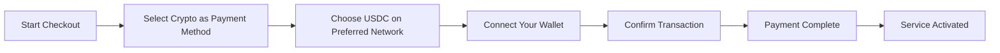
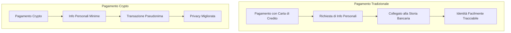
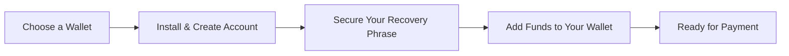

# Presentazione dei Pagamenti in Crypto: Privacy Migliorata per il Tuo Servizio Email {#introducing-crypto-payments-enhanced-privacy-for-your-email-service}

## Indice {#table-of-contents}

* [Prefazione](#foreword)
* [Perché i Pagamenti in Crypto Sono Importanti](#why-crypto-payments-matter)
* [Come Funziona](#how-it-works)
* [Vantaggi per la Privacy](#privacy-benefits)
* [Dettagli Tecnici](#technical-details)
* [Configurare il Tuo Portafoglio Crypto](#setting-up-your-crypto-wallet)
  * [MetaMask](#metamask)
  * [Phantom](#phantom)
  * [Coinbase Wallet](#coinbase-wallet)
  * [WalletConnect](#walletconnect)
* [Iniziare](#getting-started)
* [Prospettive Future](#looking-forward)

## Prefazione {#foreword}

Su [Forward Email](https://forwardemail.net), siamo costantemente alla ricerca di modi per migliorare la tua [privacy](https://en.wikipedia.org/wiki/Privacy) e sicurezza rendendo il nostro servizio più accessibile. Oggi, siamo entusiasti di annunciare che ora accettiamo pagamenti in [criptovaluta](https://en.wikipedia.org/wiki/Cryptocurrency) tramite l'integrazione dei pagamenti crypto di [Stripe](https://stripe.com).

## Perché i Pagamenti in Crypto Sono Importanti {#why-crypto-payments-matter}

La [privacy](https://en.wikipedia.org/wiki/Internet_privacy) è sempre stata al centro del nostro servizio. Sebbene in passato abbiamo offerto vari metodi di pagamento, i pagamenti in criptovaluta forniscono un ulteriore livello di privacy che si allinea perfettamente con la nostra missione. Pagando con crypto, puoi:

* Mantenere maggiore anonimato nell'acquisto dei nostri servizi email
* Ridurre le informazioni personali collegate al tuo account email
* Tenere separate le tue identità finanziarie ed email
* Supportare l'ecosistema in crescita della [finanza decentralizzata](https://en.wikipedia.org/wiki/Decentralized_finance)

## Come Funziona {#how-it-works}

Abbiamo integrato il sistema di pagamento crypto di [Stripe](https://docs.stripe.com/crypto) per rendere il processo il più semplice possibile. Ecco come puoi pagare i servizi Forward Email usando criptovalute:

```mermaid
flowchart LR
    A[Start Checkout] --> B[Select Crypto as Payment Method]
    B --> C[Choose USDC on Preferred Network]
    C --> D[Connect Your Wallet]
    D --> E[Confirm Transaction]
    E --> F[Payment Complete]
    F --> G[Service Activated]
```

1. **Seleziona Crypto come Metodo di Pagamento**: Al momento del checkout, vedrai "Crypto" come opzione di pagamento insieme ai metodi tradizionali come le carte di credito.

2. **Scegli la Tua Criptovaluta**: Attualmente accettiamo [USDC](https://en.wikipedia.org/wiki/USD_Coin) (USD Coin) su diverse blockchain tra cui [Ethereum](https://ethereum.org), [Solana](https://solana.com) e [Polygon](https://polygon.technology). USDC è una criptovaluta stabile che mantiene un valore 1:1 con il dollaro USA.

3. **Collega il Tuo Portafoglio**: Verrai reindirizzato a una pagina sicura dove potrai collegare il tuo portafoglio crypto preferito. Supportiamo diverse opzioni di portafoglio tra cui:
   * [MetaMask](https://metamask.io)
   * [Phantom](https://phantom.app)
   * [Coinbase Wallet](https://www.coinbase.com/wallet)
   * [WalletConnect](https://walletconnect.com) (compatibile con molti altri portafogli)

4. **Completa il Pagamento**: Conferma la transazione nel tuo portafoglio, e il gioco è fatto! Il pagamento sarà processato e il tuo servizio Forward Email sarà attivato immediatamente.

## Vantaggi per la Privacy {#privacy-benefits}

Usare criptovalute per il tuo abbonamento Forward Email migliora la tua privacy in diversi modi:

```mermaid
graph TD
    subgraph "Pagamento Tradizionale"
    A[Pagamento con Carta di Credito] --> B[Richiesta di Info Personali]
    B --> C[Collegato alla Storia Bancaria]
    C --> D[Identità Facilmente Tracciabile]
    end

    subgraph "Pagamento Crypto"
    E[Pagamento Crypto] --> F[Info Personali Minime]
    F --> G[Transazione Pseudonima]
    G --> H[Privacy Migliorata]
    end
```

* **Riduzione delle Informazioni Personali**: A differenza dei pagamenti con carta di credito, le transazioni crypto non richiedono il tuo nome, indirizzo di fatturazione o altri dettagli personali. Scopri di più sulla [privacy delle transazioni](https://en.wikipedia.org/wiki/Privacy_coin).
* **Separazione dalla Banca Tradizionale**: Il tuo pagamento non può essere collegato al tuo conto bancario o alla tua storia creditizia. Leggi sulla [privacy finanziaria](https://en.wikipedia.org/wiki/Financial_privacy).
* **Privacy della Blockchain**: Sebbene le transazioni blockchain siano pubbliche, sono pseudonime e non direttamente collegate alla tua identità reale. Vedi le [tecniche di privacy sulla blockchain](https://en.wikipedia.org/wiki/Privacy_and_blockchain).
* **Coerente con i Nostri Valori**: Come servizio email focalizzato sulla privacy, crediamo nel darti il controllo sulle tue informazioni personali in ogni fase. Consulta la nostra [informativa sulla privacy](/privacy).
## Dettagli Tecnici {#technical-details}

Per chi è interessato agli aspetti tecnici:

* Utilizziamo l'infrastruttura di pagamento crypto di [Stripe](https://docs.stripe.com/crypto/stablecoin-payments), che gestisce tutta la complessità delle transazioni blockchain.
* I pagamenti vengono effettuati in [USDC](https://www.circle.com/en/usdc) su più blockchain tra cui [Ethereum](https://ethereum.org), [Solana](https://solana.com) e [Polygon](https://polygon.technology).
* Anche se paghi in criptovaluta, riceviamo il valore equivalente in USD, permettendoci di mantenere prezzi stabili.

## Configurare il Tuo Portafoglio Crypto {#setting-up-your-crypto-wallet}

Se sei nuovo alle criptovalute, ecco come configurare i portafogli che supportiamo:

```mermaid
flowchart LR
    A[Choose a Wallet] --> B[Install & Create Account]
    B --> C[Secure Your Recovery Phrase]
    C --> D[Add Funds to Your Wallet]
    D --> E[Ready for Payment]
```

### MetaMask {#metamask}

[MetaMask](https://metamask.io) è uno dei portafogli Ethereum più popolari.

1. Visita la [pagina di download di MetaMask](https://metamask.io/download/)
2. Installa l'estensione del browser o l'app mobile
3. Segui le istruzioni di configurazione per creare un nuovo portafoglio
4. **Importante**: Conserva in modo sicuro la tua frase di recupero
5. Aggiungi ETH o USDC al tuo portafoglio tramite uno scambio o acquisto diretto
6. [Guida dettagliata alla configurazione di MetaMask](https://metamask.io/faqs/)

### Phantom {#phantom}

[Phantom](https://phantom.app) è un portafoglio leader per Solana.

1. Visita il [sito di Phantom](https://phantom.app/)
2. Scarica la versione appropriata per il tuo dispositivo
3. Crea un nuovo portafoglio seguendo le istruzioni a schermo
4. Esegui il backup sicuro della tua frase di recupero
5. Aggiungi SOL o USDC al tuo portafoglio
6. [Guida al portafoglio Phantom](https://help.phantom.app/hc/en-us/articles/4406388623251-How-to-create-a-new-wallet)

### Coinbase Wallet {#coinbase-wallet}

[Coinbase Wallet](https://www.coinbase.com/wallet) supporta più blockchain.

1. Scarica [Coinbase Wallet](https://www.coinbase.com/wallet/downloads)
2. Crea un nuovo portafoglio (separato dall'account di scambio Coinbase)
3. Proteggi la tua frase di recupero
4. Trasferisci o acquista crypto direttamente nell'app
5. [Guida a Coinbase Wallet](https://www.coinbase.com/learn/tips-and-tutorials/how-to-set-up-a-crypto-wallet)

### WalletConnect {#walletconnect}

[WalletConnect](https://walletconnect.com) è un protocollo che collega i portafogli ai siti web.

1. Prima, scarica un portafoglio compatibile con WalletConnect (molte opzioni disponibili)
2. Durante il checkout, seleziona WalletConnect
3. Scansiona il codice QR con la tua app portafoglio
4. Approva la connessione
5. [Portafogli compatibili con WalletConnect](https://walletconnect.com/registry/wallets)

## Iniziare {#getting-started}

Pronto a migliorare la tua privacy con i pagamenti in crypto? Seleziona semplicemente l'opzione "Crypto" durante il checkout la prossima volta che rinnovi l'abbonamento o aggiorni il piano.

Per maggiori informazioni sulle criptovalute e sulla tecnologia blockchain, consulta queste risorse:

* [Cos'è la criptovaluta?](https://www.investopedia.com/terms/c/cryptocurrency.asp) - Investopedia
* [Blockchain spiegata](https://www.investopedia.com/terms/b/blockchain.asp) - Investopedia
* [Guida alla privacy digitale](https://www.eff.org/issues/privacy) - Electronic Frontier Foundation

## Guardando Avanti {#looking-forward}

L'aggiunta dei pagamenti in criptovaluta è solo un ulteriore passo nel nostro impegno continuo verso la [privacy](https://en.wikipedia.org/wiki/Privacy), la [sicurezza](https://en.wikipedia.org/wiki/Computer_security) e la scelta dell'utente. Crediamo che il tuo servizio email debba rispettare la tua privacy a ogni livello — dai messaggi che invii a come paghi il servizio.

Come sempre, accogliamo con piacere il tuo feedback su questa nuova opzione di pagamento. Se hai domande sull'uso delle criptovalute con Forward Email, contatta il nostro [team di supporto](/help).

---

**Riferimenti:**

1. [Documentazione Crypto di Stripe](https://docs.stripe.com/crypto)
2. [Stablecoin USDC](https://www.circle.com/en/usdc)
3. [Blockchain Ethereum](https://ethereum.org)
4. [Blockchain Solana](https://solana.com)
5. [Rete Polygon](https://polygon.technology)
6. [Electronic Frontier Foundation - Privacy](https://www.eff.org/issues/privacy)
7. [Informativa sulla privacy di Forward Email](/privacy)
