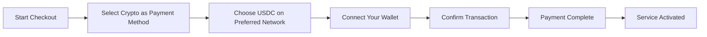
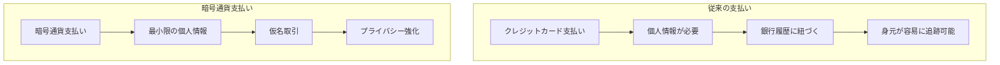
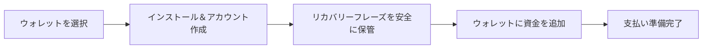

# 暗号通貨決済の導入：メールサービスのプライバシー強化 {#introducing-crypto-payments-enhanced-privacy-for-your-email-service}

## 目次 {#table-of-contents}

* [はじめに](#foreword)
* [暗号通貨決済が重要な理由](#why-crypto-payments-matter)
* [仕組み](#how-it-works)
* [プライバシーの利点](#privacy-benefits)
* [技術的詳細](#technical-details)
* [暗号ウォレットの設定](#setting-up-your-crypto-wallet)
  * [MetaMask](#metamask)
  * [Phantom](#phantom)
  * [Coinbase Wallet](#coinbase-wallet)
  * [WalletConnect](#walletconnect)
* [始め方](#getting-started)
* [今後の展望](#looking-forward)

## はじめに {#foreword}

[Forward Email](https://forwardemail.net)では、サービスの利便性を高めつつ、皆様の[プライバシー](https://en.wikipedia.org/wiki/Privacy)とセキュリティを向上させる方法を常に模索しています。本日、[Stripe](https://stripe.com)の暗号通貨決済統合を通じて、[暗号通貨](https://en.wikipedia.org/wiki/Cryptocurrency)による支払いを受け付けることを発表できることを嬉しく思います。

## 暗号通貨決済が重要な理由 {#why-crypto-payments-matter}

[プライバシー](https://en.wikipedia.org/wiki/Internet_privacy)は常に私たちのサービスの核となる価値です。これまで様々な支払い方法を提供してきましたが、暗号通貨決済は私たちのミッションに完全に合致する追加のプライバシーレイヤーを提供します。暗号通貨で支払うことで、以下が可能になります：

* メールサービス購入時の匿名性を高める
* メールアカウントに紐づく個人情報を減らす
* 金融情報とメールの身元を分離する
* 成長する[分散型金融](https://en.wikipedia.org/wiki/Decentralized_finance)エコシステムを支援する

## 仕組み {#how-it-works}

[Stripe](https://docs.stripe.com/crypto)の暗号通貨決済システムを統合し、できるだけスムーズなプロセスを実現しました。Forward Emailサービスの支払いに暗号通貨を使う方法は以下の通りです：

```mermaid
flowchart LR
    A[Start Checkout] --> B[Select Crypto as Payment Method]
    B --> C[Choose USDC on Preferred Network]
    C --> D[Connect Your Wallet]
    D --> E[Confirm Transaction]
    E --> F[Payment Complete]
    F --> G[Service Activated]
```

1. **支払い方法として暗号通貨を選択**：チェックアウト時に、クレジットカードなどの従来の方法と並んで「Crypto」が支払いオプションとして表示されます。

2. **暗号通貨を選択**：現在、[Ethereum](https://ethereum.org)、[Solana](https://solana.com)、[Polygon](https://polygon.technology)など複数のブロックチェーン上の[USDC](https://en.wikipedia.org/wiki/USD_Coin)（USDコイン）を受け付けています。USDCは米ドルと1:1の価値を維持するステーブルコインです。

3. **ウォレットを接続**：安全なページにリダイレクトされ、お好みの暗号ウォレットを接続できます。対応ウォレットは以下の通りです：
   * [MetaMask](https://metamask.io)
   * [Phantom](https://phantom.app)
   * [Coinbase Wallet](https://www.coinbase.com/wallet)
   * [WalletConnect](https://walletconnect.com)（多くの他ウォレットに対応）

4. **支払いを完了**：ウォレットでトランザクションを確認すれば完了です！支払いが処理され、Forward Emailサービスが即座に有効化されます。

## プライバシーの利点 {#privacy-benefits}

Forward Emailのサブスクリプションに暗号通貨を使うことで、プライバシーが以下のように強化されます：

```mermaid
graph TD
    subgraph "従来の支払い"
    A[クレジットカード支払い] --> B[個人情報が必要]
    B --> C[銀行履歴に紐づく]
    C --> D[身元が容易に追跡可能]
    end

    subgraph "暗号通貨支払い"
    E[暗号通貨支払い] --> F[最小限の個人情報]
    F --> G[仮名取引]
    G --> H[プライバシー強化]
    end
```

* **個人情報の削減**：クレジットカード支払いとは異なり、暗号通貨取引では名前や請求先住所などの個人情報は不要です。[取引プライバシー](https://en.wikipedia.org/wiki/Privacy_coin)について詳しくはこちら。
* **従来の銀行からの分離**：支払いは銀行口座やクレジット履歴に紐づきません。[金融プライバシー](https://en.wikipedia.org/wiki/Financial_privacy)についてお読みください。
* **ブロックチェーンのプライバシー**：ブロックチェーン取引は公開されていますが、仮名であり実世界の身元に直接結びつきません。[ブロックチェーンのプライバシー技術](https://en.wikipedia.org/wiki/Privacy_and_blockchain)をご覧ください。
* **私たちの価値観に沿ったもの**：プライバシー重視のメールサービスとして、個人情報の管理をお客様に委ねることを信条としています。[プライバシーポリシー](/privacy)もご確認ください。
## 技術的な詳細 {#technical-details}

技術的な側面に興味がある方へ：

* 私たちは[Stripeの](https://docs.stripe.com/crypto/stablecoin-payments)暗号通貨決済インフラを使用しており、ブロックチェーン取引の複雑さをすべて処理しています。
* 支払いは[USDC](https://www.circle.com/en/usdc)で行われ、[Ethereum](https://ethereum.org)、[Solana](https://solana.com)、[Polygon](https://polygon.technology)など複数のブロックチェーンに対応しています。
* 暗号通貨で支払っていただきますが、私たちは同等のUSD価値を受け取るため、安定した価格設定を維持できます。

## 暗号ウォレットの設定 {#setting-up-your-crypto-wallet}

暗号通貨が初めてですか？サポートしているウォレットの設定方法はこちらです：

```mermaid
flowchart LR
    A[ウォレットを選択] --> B[インストール＆アカウント作成]
    B --> C[リカバリーフレーズを安全に保管]
    C --> D[ウォレットに資金を追加]
    D --> E[支払い準備完了]
```

### MetaMask {#metamask}

[MetaMask](https://metamask.io)は最も人気のあるEthereumウォレットの一つです。

1. [MetaMaskダウンロードページ](https://metamask.io/download/)にアクセス
2. ブラウザ拡張機能またはモバイルアプリをインストール
3. セットアップ手順に従って新しいウォレットを作成
4. **重要**：リカバリーフレーズを安全に保管
5. 取引所や直接購入でETHまたはUSDCをウォレットに追加
6. [詳細なMetaMaskセットアップガイド](https://metamask.io/faqs/)

### Phantom {#phantom}

[Phantom](https://phantom.app)は主要なSolanaウォレットです。

1. [Phantom公式サイト](https://phantom.app/)にアクセス
2. デバイスに適したバージョンをダウンロード
3. 画面の指示に従って新しいウォレットを作成
4. リカバリーフレーズを安全にバックアップ
5. SOLまたはUSDCをウォレットに追加
6. [Phantomウォレットガイド](https://help.phantom.app/hc/en-us/articles/4406388623251-How-to-create-a-new-wallet)

### Coinbase Wallet {#coinbase-wallet}

[Coinbase Wallet](https://www.coinbase.com/wallet)は複数のブロックチェーンに対応しています。

1. [Coinbase Walletをダウンロード](https://www.coinbase.com/wallet/downloads)
2. 新しいウォレットを作成（Coinbase取引所アカウントとは別）
3. リカバリーフレーズを保護
4. アプリ内で直接暗号通貨を転送または購入
5. [Coinbaseウォレットガイド](https://www.coinbase.com/learn/tips-and-tutorials/how-to-set-up-a-crypto-wallet)

### WalletConnect {#walletconnect}

[WalletConnect](https://walletconnect.com)はウォレットとウェブサイトを接続するプロトコルです。

1. まず、WalletConnect対応ウォレットをダウンロード（多くの選択肢があります）
2. チェックアウト時にWalletConnectを選択
3. ウォレットアプリでQRコードをスキャン
4. 接続を承認
5. [WalletConnect対応ウォレット一覧](https://walletconnect.com/registry/wallets)

## はじめに {#getting-started}

暗号通貨決済でプライバシーを強化する準備はできましたか？次回サブスクリプションの更新やプランのアップグレード時に、チェックアウトで「Crypto」オプションを選択するだけです。

暗号通貨やブロックチェーン技術について詳しく知りたい方は、以下のリソースをご覧ください：

* [暗号通貨とは？](https://www.investopedia.com/terms/c/cryptocurrency.asp) - Investopedia
* [ブロックチェーンの説明](https://www.investopedia.com/terms/b/blockchain.asp) - Investopedia
* [デジタルプライバシーガイド](https://www.eff.org/issues/privacy) - Electronic Frontier Foundation

## 今後の展望 {#looking-forward}

暗号通貨決済の導入は、[プライバシー](https://en.wikipedia.org/wiki/Privacy)、[セキュリティ](https://en.wikipedia.org/wiki/Computer_security)、ユーザーの選択肢を尊重するという私たちの継続的な取り組みの一歩に過ぎません。メールサービスは、送信するメッセージからサービスの支払い方法に至るまで、あらゆるレベルであなたのプライバシーを尊重すべきだと考えています。

いつも通り、この新しい支払いオプションに関するご意見をお待ちしています。Forward Emailでの暗号通貨の利用について質問がある場合は、[サポートチーム](/help)までお問い合わせください。

---

**参考文献：**

1. [Stripe Crypto Documentation](https://docs.stripe.com/crypto)
2. [USDC Stablecoin](https://www.circle.com/en/usdc)
3. [Ethereum Blockchain](https://ethereum.org)
4. [Solana Blockchain](https://solana.com)
5. [Polygon Network](https://polygon.technology)
6. [Electronic Frontier Foundation - Privacy](https://www.eff.org/issues/privacy)
7. [Forward Email Privacy Policy](/privacy)
