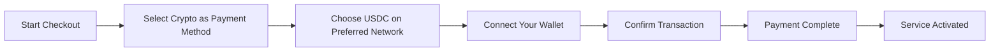
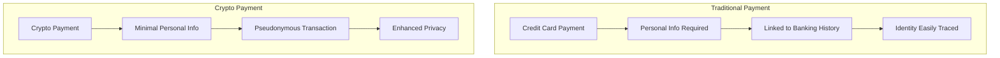
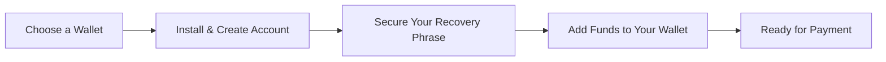

# 暗号通貨決済のご紹介: メールサービスのプライバシー強化 {#introducing-crypto-payments-enhanced-privacy-for-your-email-service}

## 目次 {#table-of-contents}

* [序文](#foreword)
* [暗号通貨決済が重要な理由](#why-crypto-payments-matter)
* [仕組み](#how-it-works)
* [プライバシーの利点](#privacy-benefits)
* [技術的な詳細](#technical-details)
* [暗号通貨ウォレットの設定](#setting-up-your-crypto-wallet)
  * [メタマスク](#metamask)
  * [ファントム](#phantom)
  * [コインベースウォレット](#coinbase-wallet)
  * [ウォレットコネクト](#walletconnect)
* [はじめる](#getting-started)
* [楽しみにしている](#looking-forward)

## 序文 {#foreword}

[メールを転送する](https://forwardemail.net)では、[プライバシー](https://en.wikipedia.org/wiki/Privacy)の利便性とセキュリティの向上を図りながら、サービスの利便性向上に努めています。本日、[ストライプの](https://stripe.com)暗号決済統合を通じて、[暗号通貨](https://en.wikipedia.org/wiki/Cryptocurrency)決済に対応できるようになりましたことをお知らせいたします。

## 暗号通貨決済が重要な理由 {#why-crypto-payments-matter}

[プライバシー](https://en.wikipedia.org/wiki/Internet_privacy)は常に当社のサービスの中核を成しています。これまで様々な決済方法をご提供してきましたが、暗号通貨による決済は、当社の使命に合致する、より一層のプライバシー保護を実現します。暗号通貨でお支払いいただくことで、以下のメリットが得られます。

* メールサービスをご購入いただく際の匿名性の向上
* メールアカウントに関連付けられた個人情報の削減
* 財務情報とメールIDの分離
* 成長を続ける[分散型金融](https://en.wikipedia.org/wiki/Decentralized_finance)エコシステムのサポート

## 仕組み {#how-it-works}

プロセスを可能な限りスムーズにするため、[ストライプの](https://docs.stripe.com/crypto)暗号決済システムを統合しました。Forward Emailサービスへのお支払いは、暗号資産を使って以下の手順で行うことができます。

1. **お支払い方法として暗号通貨を選択**: チェックアウト時に、クレジットカードなどの従来の支払い方法の他に、「暗号通貨」が支払いオプションとして表示されます。

2. **暗号通貨を選択してください**: 現在、[USDC](https://en.wikipedia.org/wiki/USD_Coin) (USD Coin) は、[イーサリアム](https://ethereum.org)、[ソラナ](https://solana.com)、[ポリゴン](https://polygon.technology) を含む複数のブロックチェーンでご利用いただけます。USDC は米ドルと1:1の価値を維持する安定した暗号通貨です。

3. **ウォレットを接続**: ご希望の暗号資産ウォレットを接続できる安全なページにリダイレクトされます。以下の複数のウォレットオプションに対応しています:
* [メタマスク](https://metamask.io)
* [ファントム](https://phantom.app)
* [コインベースウォレット](https://www.coinbase.com/wallet)
* [ウォレットコネクト](https://walletconnect.com) (他の多くのウォレットと互換性があります)

4. **お支払いを完了する**: ウォレットで取引を確認すれば、設定完了です。お支払いが処理され、メール転送サービスがすぐに有効になります。

## プライバシーのメリット {#privacy-benefits}

Forward Email サブスクリプションに暗号通貨を使用すると、いくつかの方法でプライバシーが強化されます。

* **個人情報の削減**：クレジットカード決済とは異なり、暗号通貨取引では氏名、請求先住所、その他の個人情報の入力は不要です。詳しくは[取引のプライバシー](https://en.wikipedia.org/wiki/Privacy_coin)をご覧ください。
* **従来の銀行取引との分離**：お支払い情報は銀行口座や信用履歴に紐付けられません。詳しくは[金融プライバシー](https://en.wikipedia.org/wiki/Financial_privacy)をご覧ください。
* **ブロックチェーンのプライバシー**：ブロックチェーン取引は公開されていますが、匿名性があり、現実世界の個人情報と直接結び付けられることはありません。詳しくは[ブロックチェーンのプライバシー技術](https://en.wikipedia.org/wiki/Privacy_and_blockchain)をご覧ください。
* **私たちの価値観との整合性**：プライバシー重視のメールサービスとして、私たちはお客様があらゆる段階で個人情報を管理できるようにすることを大切にしています。詳しくは[プライバシーポリシー](/privacy)をご覧ください。

## 技術詳細 {#technical-details}

技術的な側面に興味のある方:

* 当社は、ブロックチェーン取引の複雑な処理をすべて処理する[ストライプの](https://docs.stripe.com/crypto/stablecoin-payments)暗号決済インフラストラクチャを使用しています。
* 支払いは、[イーサリアム](https://ethereum.org)、[ソラナ](https://solana.com)、[ポリゴン](https://polygon.technology)を含む複数のブロックチェーン上の[USDC](https://www.circle.com/en/usdc)で行われます。
* お客様が暗号資産でお支払いいただくと、当社は同等の価値を米ドルで受け取るため、安定した価格設定を維持できます。

## 暗号ウォレットの設定 {#setting-up-your-crypto-wallet}

暗号通貨は初めてですか？サポートしているウォレットの設定方法は次のとおりです。

### メタマスク {#metamask}

[メタマスク](https://metamask.io) は最も人気のある Ethereum ウォレットの 1 つです。

1. [MetaMaskのダウンロードページ](https://metamask.io/download/) にアクセスします
2. ブラウザ拡張機能またはモバイルアプリをインストールします
3. 設定手順に従って新しいウォレットを作成します
4. **重要**: 復元フレーズを安全に保管してください
5. 取引所または直接購入を通じて、ETH または USDC をウォレットに追加します
6. [MetaMaskの詳細な設定ガイド](https://metamask.io/faqs/)

### ファントム {#phantom}

[ファントム](https://phantom.app) は主要な Solana ウォレットです。

1. [ファントムウェブサイト](https://phantom.app/) にアクセスします。
2. お使いのデバイスに適したバージョンをダウンロードします。
3. 画面の指示に従って新しいウォレットを作成します。
4. 復元フレーズを安全にバックアップします。
5. SOL または USDC をウォレットに追加します。
6. [ファントムウォレットガイド](https://help.phantom.app/hc/en-us/articles/4406388623251-How-to-create-a-new-wallet)

### Coinbaseウォレット {#coinbase-wallet}

[コインベースウォレット](https://www.coinbase.com/wallet) は複数のブロックチェーンをサポートします。

1. [コインベースウォレット](https://www.coinbase.com/wallet/downloads) をダウンロードする
2. 新しいウォレットを作成する（Coinbase 取引所アカウントとは別）
3. 復元フレーズを取得する
4. アプリ内で直接暗号資産を送金または購入する
5. [Coinbaseウォレットガイド](https://www.coinbase.com/learn/tips-and-tutorials/how-to-set-up-a-crypto-wallet)

### ウォレットコネクト {#walletconnect}

[ウォレットコネクト](https://walletconnect.com) はウォレットを Web サイトに接続するプロトコルです。

1. まず、WalletConnect対応のウォレットをダウンロードします（複数のオプションがあります）
2. チェックアウト時にWalletConnectを選択します
3. ウォレットアプリでQRコードをスキャンします
4. 接続を承認します
5. [WalletConnect対応ウォレット](https://walletconnect.com/registry/wallets)

## はじめに {#getting-started}

暗号通貨決済でプライバシーを強化してみませんか？次回のサブスクリプション更新時またはプランのアップグレード時に、チェックアウト時に「暗号通貨」オプションを選択するだけです。

暗号通貨とブロックチェーン技術の詳細については、以下のリソースをご覧ください。

* [暗号通貨とは何ですか?](https://www.investopedia.com/terms/c/cryptocurrency.asp) - Investopedia
* [ブロックチェーンの説明](https://www.investopedia.com/terms/b/blockchain.asp) - Investopedia
* [デジタルプライバシーガイド](https://www.eff.org/issues/privacy) - 電子フロンティア財団

## 今後の展望 {#looking-forward}

暗号通貨決済の追加は、[プライバシー](https://en.wikipedia.org/wiki/Privacy)、[安全](https://en.wikipedia.org/wiki/Computer_security)、そしてユーザーの選択肢に対する継続的な取り組みの新たな一歩に過ぎません。私たちは、メールサービスは、送信するメッセージからサービス料金の支払い方法に至るまで、あらゆるレベルでユーザーのプライバシーを尊重すべきだと考えています。

いつものように、この新しいお支払い方法についてのご意見をお待ちしております。Forward Emailでの暗号通貨のご利用についてご質問がございましたら、[サポートチーム](/help)までお問い合わせください。

---

**参考文献:**

1. [Stripe Crypto ドキュメント](https://docs.stripe.com/crypto)
2. [USDCステーブルコイン](https://www.circle.com/en/usdc)
3. [イーサリアムブロックチェーン](https://ethereum.org)
4. [ソラナブロックチェーン](https://solana.com)
5. [ポリゴンネットワーク](https://polygon.technology)
6. [電子フロンティア財団 - プライバシー](https://www.eff.org/issues/privacy)
7. [メール転送プライバシーポリシー](/privacy)