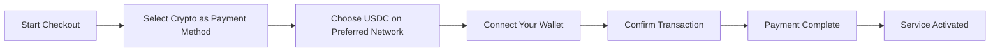
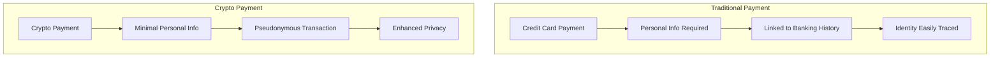
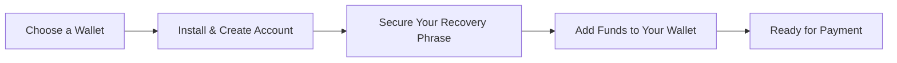

# 암호화폐 결제 소개: 이메일 서비스의 개인 정보 보호 강화 {#introducing-crypto-payments-enhanced-privacy-for-your-email-service}

## 목차 {#table-of-contents}

* [머리말](#foreword)
* [암호화폐 결제가 중요한 이유](#why-crypto-payments-matter)
* [작동 원리](#how-it-works)
* [개인정보 보호 혜택](#privacy-benefits)
* [기술적 세부 사항](#technical-details)
* [암호화폐 지갑 설정](#setting-up-your-crypto-wallet)
  * [메타마스크](#metamask)
  * [환상](#phantom)
  * [코인베이스 지갑](#coinbase-wallet)
  * [월렛커넥트](#walletconnect)
* [시작하기](#getting-started)
* [기대하다](#looking-forward)

## 서문 {#foreword}

[이메일 전달](https://forwardemail.net)에서는 [은둔](https://en.wikipedia.org/wiki/Privacy) 및 보안을 개선하는 동시에 서비스 접근성을 높이기 위한 방법을 끊임없이 모색하고 있습니다. 오늘, [문](https://stripe.com) 암호화폐 결제 통합을 통해 [암호화폐](https://en.wikipedia.org/wiki/Cryptocurrency) 결제를 지원하게 되어 기쁩니다.

## 암호화폐 결제가 중요한 이유 {#why-crypto-payments-matter}

[은둔](https://en.wikipedia.org/wiki/Internet_privacy)은 항상 저희 서비스의 핵심이었습니다. 과거에도 다양한 결제 수단을 제공해 왔지만, 암호화폐 결제는 저희의 사명에 완벽하게 부합하는 추가적인 개인 정보 보호 기능을 제공합니다. 암호화폐로 결제하시면 다음과 같은 혜택을 누리실 수 있습니다.

* 이메일 서비스 구매 시 익명성 강화
* 이메일 계정에 연결된 개인 정보 감소
* 금융 정보와 이메일 정보를 분리하세요
* 성장하는 [탈중앙화 금융](https://en.wikipedia.org/wiki/Decentralized_finance) 생태계를 지원하세요

## 작동 원리 {#how-it-works}

[문](https://docs.stripe.com/crypto) 암호화폐 결제 시스템을 통합하여 원활한 결제 과정을 제공합니다. 암호화폐를 사용하여 Forward Email 서비스 비용을 결제하는 방법은 다음과 같습니다.

1. **결제 수단으로 암호화폐 선택**: 체크아웃 시, 신용카드 등 기존 결제 수단과 함께 "암호화폐"가 결제 옵션으로 표시됩니다.

2. **암호화폐 선택**: 현재 [이더리움](https://ethereum.org), [솔라나](https://solana.com), [다각형](https://polygon.technology)을 포함한 여러 블록체인에서 [USDC](https://en.wikipedia.org/wiki/USD_Coin)(USD 코인)을 사용할 수 있습니다. USDC는 미국 달러와 1:1의 가치를 유지하는 안정적인 암호화폐입니다.

3. **지갑 연결**: 원하는 암호화폐 지갑을 연결할 수 있는 보안 페이지로 리디렉션됩니다. 다음을 포함한 다양한 지갑 옵션을 지원합니다.
* [메타마스크](https://metamask.io)
* [환상](https://phantom.app)
* [코인베이스 지갑](https://www.coinbase.com/wallet)
* [월렛커넥트](https://walletconnect.com) (다른 여러 지갑과 호환 가능)

4. **결제 완료**: 지갑에서 거래를 확인하시면 모든 준비가 완료됩니다! 결제가 처리되고 이메일 전달 서비스가 즉시 활성화됩니다.

## 개인정보 보호 혜택 {#privacy-benefits}

Forward Email 구독에 암호화폐를 사용하면 여러 가지 방법으로 개인 정보 보호가 강화됩니다.

* **개인 정보 축소**: 신용카드 결제와 달리 암호화폐 거래에는 이름, 청구지 주소 또는 기타 개인 정보가 필요하지 않습니다. [거래 개인 정보 보호](https://en.wikipedia.org/wiki/Privacy_coin)에 대해 자세히 알아보세요.
* **기존 은행과의 분리**: 결제 내역을 은행 계좌 또는 신용 기록과 연결할 수 없습니다. [재정적 프라이버시](https://en.wikipedia.org/wiki/Financial_privacy)에 대해 자세히 알아보세요.
* **블록체인 개인 정보 보호**: 블록체인 거래는 공개되지만 가명 처리되며 실제 신원과 직접적으로 연결되지 않습니다. [블록체인 개인 정보 보호 기술](https://en.wikipedia.org/wiki/Privacy_and_blockchain)를 참조하세요.
* **저희 가치에 부합합니다**: 저희는 개인 정보 보호에 중점을 둔 이메일 서비스로서 모든 단계에서 개인 정보를 제어할 수 있도록 최선을 다합니다. [개인정보 보호정책](/privacy)을 확인해 보세요.

## 기술 세부 정보 {#technical-details}

기술적인 측면에 관심이 있는 분들을 위해:

* 저희는 블록체인 거래의 모든 복잡성을 처리하는 [문](https://docs.stripe.com/crypto/stablecoin-payments) 암호화폐 결제 인프라를 사용합니다.
* 결제는 [이더리움](https://ethereum.org), [솔라나](https://solana.com), [다각형](https://polygon.technology)를 포함한 여러 블록체인의 [USDC](https://www.circle.com/en/usdc)에서 이루어집니다.
* 암호화폐로 결제하시면, 저희는 USD로 동일한 가치를 받으므로 안정적인 가격을 유지할 수 있습니다.

## 암호화폐 지갑 설정 {#setting-up-your-crypto-wallet}

암호화폐를 처음 사용하시나요? 저희가 지원하는 지갑을 설정하는 방법은 다음과 같습니다.

### 메타마스크 {#metamask}

[메타마스크](https://metamask.io)은 가장 인기 있는 이더리움 지갑 중 하나입니다.

1. [MetaMask 다운로드 페이지](https://metamask.io/download/)을 방문하세요.
2. 브라우저 확장 프로그램이나 모바일 앱을 설치하세요.
3. 설정 지침에 따라 새 지갑을 생성하세요.
4. **중요**: 복구 문구를 안전하게 보관하세요.
5. 거래소 또는 직접 구매를 통해 ETH 또는 USDC를 지갑에 추가하세요.
6. [자세한 MetaMask 설정 가이드](https://metamask.io/faqs/)

### 팬텀 {#phantom}

[환상](https://phantom.app)은 선도적인 솔라나 지갑입니다.

1. [팬텀 웹사이트](https://phantom.app/)을 방문하세요.
2. 기기에 맞는 버전을 다운로드하세요.
3. 화면의 안내에 따라 새 지갑을 생성하세요.
4. 복구 문구를 안전하게 백업하세요.
5. 지갑에 SOL 또는 USDC를 추가하세요.
6. [팬텀 지갑 가이드](https://help.phantom.app/hc/en-us/articles/4406388623251-How-to-create-a-new-wallet)

### 코인베이스 지갑 {#coinbase-wallet}

[코인베이스 지갑](https://www.coinbase.com/wallet)은 여러 블록체인을 지원합니다.

1. [코인베이스 지갑](https://www.coinbase.com/wallet/downloads) 다운로드
2. Coinbase 거래소 계정과 별도로 새 지갑을 만드세요.
3. 복구 문구를 입력하세요.
4. 앱에서 직접 암호화폐를 전송하거나 구매하세요.
5. [코인베이스 지갑 가이드](https://www.coinbase.com/learn/tips-and-tutorials/how-to-set-up-a-crypto-wallet)

### WalletConnect {#walletconnect}

[월렛커넥트](https://walletconnect.com)은 지갑과 웹사이트를 연결하는 프로토콜입니다.

1. 먼저 WalletConnect 호환 지갑을 다운로드하세요(다양한 옵션 제공).
2. 결제 시 WalletConnect를 선택하세요.
3. 지갑 앱으로 QR 코드를 스캔하세요.
4. 연결을 승인하세요.
5. [WalletConnect 호환 지갑](https://walletconnect.com/registry/wallets)

## 시작하기 {#getting-started}

암호화폐 결제로 개인 정보 보호 기능을 강화할 준비가 되셨나요? 다음 구독 갱신 또는 요금제 업그레이드 시 결제 단계에서 "암호화폐" 옵션을 선택하시면 됩니다.

암호화폐와 블록체인 기술에 대한 자세한 내용은 다음 자료를 확인하세요.

* [암호화폐란 무엇인가요?](https://www.investopedia.com/terms/c/cryptocurrency.asp) - 인베스토피디아
* [블록체인 설명](https://www.investopedia.com/terms/b/blockchain.asp) - 인베스토피디아
* [디지털 개인 정보 보호 가이드](https://www.eff.org/issues/privacy) - 일렉트로닉 프런티어 재단

## 기대합니다 {#looking-forward}

암호화폐 결제 기능 추가는 [은둔](https://en.wikipedia.org/wiki/Privacy), [보안](https://en.wikipedia.org/wiki/Computer_security) 및 사용자 선택권에 대한 저희의 지속적인 노력의 한 단계일 뿐입니다. 저희는 이메일 서비스가 전송하는 메시지부터 서비스 결제 방식까지 모든 측면에서 귀하의 개인정보를 존중해야 한다고 믿습니다.

언제나처럼 새로운 결제 옵션에 대한 여러분의 의견을 환영합니다. Forward Email을 통한 암호화폐 사용에 대해 궁금한 점이 있으시면 [지원팀](/help)으로 문의해 주세요.

---

**참고문헌:**

1. [Stripe Crypto 문서](https://docs.stripe.com/crypto)
2. [USDC 스테이블코인](https://www.circle.com/en/usdc)
3. [이더리움 블록체인](https://ethereum.org)
4. [솔라나 블록체인](https://solana.com)
5. [폴리곤 네트워크](https://polygon.technology)
6. [일렉트로닉 프런티어 재단 - 개인정보 보호](https://www.eff.org/issues/privacy)
7. [이메일 전달 개인정보 보호정책](/privacy)