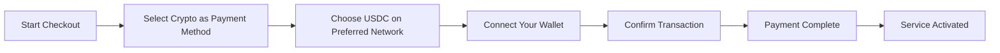
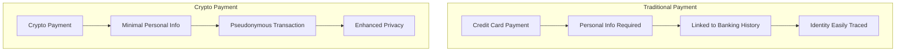
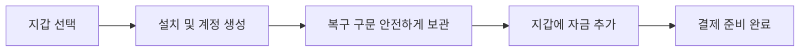

# 암호화폐 결제 소개: 이메일 서비스의 향상된 프라이버시 {#introducing-crypto-payments-enhanced-privacy-for-your-email-service}

## 목차 {#table-of-contents}

* [서문](#foreword)
* [암호화폐 결제가 중요한 이유](#why-crypto-payments-matter)
* [작동 방식](#how-it-works)
* [프라이버시 혜택](#privacy-benefits)
* [기술적 세부사항](#technical-details)
* [암호화폐 지갑 설정하기](#setting-up-your-crypto-wallet)
  * [MetaMask](#metamask)
  * [Phantom](#phantom)
  * [Coinbase Wallet](#coinbase-wallet)
  * [WalletConnect](#walletconnect)
* [시작하기](#getting-started)
* [앞으로의 전망](#looking-forward)

## 서문 {#foreword}

[Forward Email](https://forwardemail.net)에서는 여러분의 [프라이버시](https://en.wikipedia.org/wiki/Privacy)와 보안을 개선하고 서비스를 더 쉽게 이용할 수 있도록 항상 노력하고 있습니다. 오늘, 저희는 [Stripe](https://stripe.com)의 암호화폐 결제 통합을 통해 이제 [암호화폐](https://en.wikipedia.org/wiki/Cryptocurrency) 결제를 지원하게 되었음을 기쁜 마음으로 알려드립니다.

## 암호화폐 결제가 중요한 이유 {#why-crypto-payments-matter}

[프라이버시](https://en.wikipedia.org/wiki/Internet_privacy)는 항상 저희 서비스의 핵심이었습니다. 과거에도 다양한 결제 수단을 제공해왔지만, 암호화폐 결제는 저희 미션과 완벽히 부합하는 추가적인 프라이버시 계층을 제공합니다. 암호화폐로 결제함으로써 다음과 같은 이점을 누릴 수 있습니다:

* 이메일 서비스를 구매할 때 더 높은 익명성 유지
* 이메일 계정과 연결된 개인 정보 감소
* 금융 정보와 이메일 신원 분리 유지
* 성장하는 [탈중앙화 금융](https://en.wikipedia.org/wiki/Decentralized_finance) 생태계 지원

## 작동 방식 {#how-it-works}

저희는 [Stripe](https://docs.stripe.com/crypto)의 암호화폐 결제 시스템을 통합하여 가능한 한 원활한 과정을 제공하고 있습니다. Forward Email 서비스를 암호화폐로 결제하는 방법은 다음과 같습니다:

```mermaid
flowchart LR
    A[Start Checkout] --> B[Select Crypto as Payment Method]
    B --> C[Choose USDC on Preferred Network]
    C --> D[Connect Your Wallet]
    D --> E[Confirm Transaction]
    E --> F[Payment Complete]
    F --> G[Service Activated]
```

1. **결제 수단으로 암호화폐 선택**: 결제 시 신용카드 등 기존 결제 수단과 함께 "Crypto" 옵션이 표시됩니다.

2. **암호화폐 선택**: 현재 저희는 [Ethereum](https://ethereum.org), [Solana](https://solana.com), [Polygon](https://polygon.technology) 등 여러 블록체인에서 사용 가능한 [USDC](https://en.wikipedia.org/wiki/USD_Coin) (USD 코인)을 지원합니다. USDC는 미국 달러와 1:1 가치를 유지하는 스테이블 코인입니다.

3. **지갑 연결**: 선호하는 암호화폐 지갑을 연결할 수 있는 안전한 페이지로 리디렉션됩니다. 지원하는 지갑은 다음과 같습니다:
   * [MetaMask](https://metamask.io)
   * [Phantom](https://phantom.app)
   * [Coinbase Wallet](https://www.coinbase.com/wallet)
   * [WalletConnect](https://walletconnect.com) (다양한 지갑과 호환)

4. **결제 완료**: 지갑에서 거래를 확인하면 결제가 처리되고, 즉시 Forward Email 서비스가 활성화됩니다.

## 프라이버시 혜택 {#privacy-benefits}

Forward Email 구독에 암호화폐를 사용하면 여러 면에서 프라이버시가 향상됩니다:

```mermaid
graph TD
    subgraph "Traditional Payment"
    A[Credit Card Payment] --> B[Personal Info Required]
    B --> C[Linked to Banking History]
    C --> D[Identity Easily Traced]
    end

    subgraph "Crypto Payment"
    E[Crypto Payment] --> F[Minimal Personal Info]
    F --> G[Pseudonymous Transaction]
    G --> H[Enhanced Privacy]
    end
```

* **개인 정보 감소**: 신용카드 결제와 달리, 암호화폐 거래는 이름, 청구 주소 등 개인 정보를 요구하지 않습니다. [거래 프라이버시](https://en.wikipedia.org/wiki/Privacy_coin)에 대해 더 알아보세요.
* **기존 은행과 분리**: 결제가 은행 계좌나 신용 기록과 연결되지 않습니다. [금융 프라이버시](https://en.wikipedia.org/wiki/Financial_privacy)에 대해 읽어보세요.
* **블록체인 프라이버시**: 블록체인 거래는 공개적이지만, 가명으로 처리되어 실제 신원과 직접 연결되지 않습니다. [블록체인 프라이버시 기법](https://en.wikipedia.org/wiki/Privacy_and_blockchain)을 참고하세요.
* **저희 가치와 일치**: 프라이버시 중심 이메일 서비스로서, 저희는 여러분이 개인 정보를 모든 단계에서 통제할 수 있도록 믿습니다. 저희 [개인정보 보호정책](/privacy)을 확인해보세요.
## 기술 세부사항 {#technical-details}

기술적인 측면에 관심 있는 분들을 위해:

* 우리는 [Stripe의](https://docs.stripe.com/crypto/stablecoin-payments) 암호화폐 결제 인프라를 사용하며, 이는 블록체인 거래의 모든 복잡성을 처리합니다.
* 결제는 [Ethereum](https://ethereum.org), [Solana](https://solana.com), [Polygon](https://polygon.technology) 등 여러 블록체인에서 [USDC](https://www.circle.com/en/usdc)로 이루어집니다.
* 암호화폐로 결제하지만, 우리는 동등한 가치를 USD로 받기 때문에 안정적인 가격을 유지할 수 있습니다.

## 암호화폐 지갑 설정하기 {#setting-up-your-crypto-wallet}

암호화폐가 처음이신가요? 우리가 지원하는 지갑을 설정하는 방법은 다음과 같습니다:

```mermaid
flowchart LR
    A[지갑 선택] --> B[설치 및 계정 생성]
    B --> C[복구 구문 안전하게 보관]
    C --> D[지갑에 자금 추가]
    D --> E[결제 준비 완료]
```

### MetaMask {#metamask}

[MetaMask](https://metamask.io)는 가장 인기 있는 Ethereum 지갑 중 하나입니다.

1. [MetaMask 다운로드 페이지](https://metamask.io/download/)를 방문하세요
2. 브라우저 확장 프로그램 또는 모바일 앱을 설치하세요
3. 새 지갑을 만들기 위한 설정 지침을 따르세요
4. **중요**: 복구 구문을 안전하게 보관하세요
5. 거래소나 직접 구매를 통해 지갑에 ETH 또는 USDC를 추가하세요
6. [자세한 MetaMask 설정 가이드](https://metamask.io/faqs/)

### Phantom {#phantom}

[Phantom](https://phantom.app)은 선도적인 Solana 지갑입니다.

1. [Phantom 웹사이트](https://phantom.app/)를 방문하세요
2. 기기에 맞는 버전을 다운로드하세요
3. 화면 지침에 따라 새 지갑을 만드세요
4. 복구 구문을 안전하게 백업하세요
5. 지갑에 SOL 또는 USDC를 추가하세요
6. [Phantom 지갑 가이드](https://help.phantom.app/hc/en-us/articles/4406388623251-How-to-create-a-new-wallet)

### Coinbase Wallet {#coinbase-wallet}

[Coinbase Wallet](https://www.coinbase.com/wallet)은 여러 블록체인을 지원합니다.

1. [Coinbase Wallet 다운로드](https://www.coinbase.com/wallet/downloads)
2. 새 지갑을 만드세요 (Coinbase 거래소 계정과 별개)
3. 복구 구문을 안전하게 보관하세요
4. 앱 내에서 암호화폐를 직접 전송하거나 구매하세요
5. [Coinbase Wallet 가이드](https://www.coinbase.com/learn/tips-and-tutorials/how-to-set-up-a-crypto-wallet)

### WalletConnect {#walletconnect}

[WalletConnect](https://walletconnect.com)는 지갑을 웹사이트에 연결하는 프로토콜입니다.

1. 먼저 WalletConnect 호환 지갑을 다운로드하세요 (다양한 옵션이 있습니다)
2. 결제 시 WalletConnect를 선택하세요
3. 지갑 앱으로 QR 코드를 스캔하세요
4. 연결을 승인하세요
5. [WalletConnect 호환 지갑 목록](https://walletconnect.com/registry/wallets)

## 시작하기 {#getting-started}

암호화폐 결제로 개인정보 보호를 강화할 준비가 되셨나요? 다음에 구독 갱신이나 요금제 업그레이드 시 결제 단계에서 "Crypto" 옵션을 선택하세요.

암호화폐와 블록체인 기술에 대해 더 알고 싶다면, 다음 자료들을 참고하세요:

* [암호화폐란?](https://www.investopedia.com/terms/c/cryptocurrency.asp) - Investopedia
* [블록체인 설명](https://www.investopedia.com/terms/b/blockchain.asp) - Investopedia
* [디지털 개인정보 보호 가이드](https://www.eff.org/issues/privacy) - 전자 프런티어 재단

## 앞으로의 계획 {#looking-forward}

암호화폐 결제 도입은 [개인정보 보호](https://en.wikipedia.org/wiki/Privacy), [보안](https://en.wikipedia.org/wiki/Computer_security), 사용자 선택권에 대한 우리의 지속적인 약속의 또 다른 단계입니다. 우리는 이메일 서비스가 메시지 전송부터 결제 방식까지 모든 단계에서 사용자의 개인정보를 존중해야 한다고 믿습니다.

항상 그렇듯이, 이 새로운 결제 옵션에 대한 여러분의 의견을 환영합니다. Forward Email에서 암호화폐 사용에 관한 질문이 있으시면, 저희 [지원팀](/help)에 문의해 주세요.

---

**참고 문헌:**

1. [Stripe 암호화폐 문서](https://docs.stripe.com/crypto)
2. [USDC 스테이블코인](https://www.circle.com/en/usdc)
3. [Ethereum 블록체인](https://ethereum.org)
4. [Solana 블록체인](https://solana.com)
5. [Polygon 네트워크](https://polygon.technology)
6. [전자 프런티어 재단 - 개인정보 보호](https://www.eff.org/issues/privacy)
7. [Forward Email 개인정보 보호정책](/privacy)
