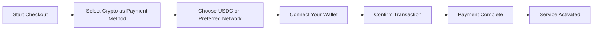
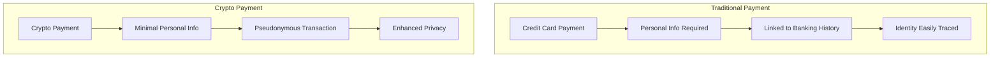
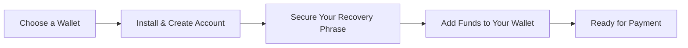

# Introductie van Crypto Payments: Verbeterde privacy voor uw e-mailservice {#introducing-crypto-payments-enhanced-privacy-for-your-email-service}

## Inhoudsopgave {#table-of-contents}

* [Voorwoord](#foreword)
* [Waarom cryptobetalingen belangrijk zijn](#why-crypto-payments-matter)
* [Hoe het werkt](#how-it-works)
* [Privacyvoordelen](#privacy-benefits)
* [Technische details](#technical-details)
* [Uw crypto-wallet instellen](#setting-up-your-crypto-wallet)
  * [MetaMask](#metamask)
  * [Fantoom](#phantom)
  * [Coinbase-portemonnee](#coinbase-wallet)
  * [WalletConnect](#walletconnect)
* [Aan de slag](#getting-started)
* [Vooruitkijken](#looking-forward)

## Voorwoord {#foreword}

Bij [E-mail doorsturen](https://forwardemail.net) zijn we constant op zoek naar manieren om uw [privacy](https://en.wikipedia.org/wiki/Privacy)-betalingen en de beveiliging ervan te verbeteren en tegelijkertijd onze service toegankelijker te maken. Vandaag kondigen we met trots aan dat we nu [cryptovaluta](https://en.wikipedia.org/wiki/Cryptocurrency)-betalingen accepteren via de cryptobetalingsintegratie van [Streep's](https://stripe.com).

## Waarom cryptobetalingen belangrijk zijn {#why-crypto-payments-matter}

[Privacy](https://en.wikipedia.org/wiki/Internet_privacy) is altijd de kern van onze dienstverlening geweest. Hoewel we in het verleden verschillende betaalmethoden hebben aangeboden, bieden betalingen met cryptovaluta een extra laag privacy die perfect aansluit bij onze missie. Door met crypto te betalen, kunt u:

* Behoud meer anonimiteit bij de aanschaf van onze e-maildiensten
* Beperk de persoonlijke gegevens die aan uw e-mailaccount zijn gekoppeld
* Houd uw financiële en e-mailidentiteiten gescheiden
* Ondersteun het groeiende [gedecentraliseerde financiën](https://en.wikipedia.org/wiki/Decentralized_finance)-ecosysteem

## Hoe het werkt {#how-it-works}

We hebben het cryptobetalingssysteem [Streep's](https://docs.stripe.com/crypto) geïntegreerd om het proces zo soepel mogelijk te laten verlopen. Zo kunt u betalen voor Forward Email-diensten met cryptocurrency:

1. **Selecteer Crypto als betaalmethode**: Bij het afrekenen ziet u "Crypto" als betaaloptie naast traditionele methoden zoals creditcards.

2. **Kies je cryptocurrency**: Momenteel accepteren we [USDC](https://en.wikipedia.org/wiki/USD_Coin) (USD Coin) op meerdere blockchains, waaronder [Ethereum](https://ethereum.org), [Solana](https://solana.com) en [Veelhoek](https://polygon.technology). USDC is een stabiele cryptocurrency met een 1:1-waarde ten opzichte van de Amerikaanse dollar.

3. **Koppel je wallet**: Je wordt doorgestuurd naar een beveiligde pagina waar je je favoriete cryptowallet kunt koppelen. We ondersteunen meerdere walletopties, waaronder:
* [MetaMask](https://metamask.io)
* [Fantoom](https://phantom.app)
* [Coinbase-portemonnee](https://www.coinbase.com/wallet)
* [WalletConnect](https://walletconnect.com) (compatibel met veel andere wallets)

4. **Voltooi je betaling**: Bevestig de transactie in je wallet en je bent klaar! De betaling wordt verwerkt en je e-mail doorsturen-service wordt direct geactiveerd.

## Privacyvoordelen {#privacy-benefits}

Het gebruik van cryptocurrency voor uw Forward Email-abonnement verbetert uw privacy op verschillende manieren:

* **Beperkte persoonlijke gegevens**: In tegenstelling tot creditcardbetalingen zijn bij cryptotransacties uw naam, factuuradres of andere persoonlijke gegevens niet nodig. Lees meer over [transactieprivacy](https://en.wikipedia.org/wiki/Privacy_coin).
* **Scheiding van traditioneel bankieren**: Uw betaling kan niet worden gekoppeld aan uw bankrekening of kredietgeschiedenis. Lees meer over [financiële privacy](https://en.wikipedia.org/wiki/Financial_privacy).
* **Blockchain-privacy**: Hoewel blockchaintransacties openbaar zijn, zijn ze pseudoniem en niet direct gekoppeld aan uw identiteit in de echte wereld. Zie [blockchain privacytechnieken](https://en.wikipedia.org/wiki/Privacy_and_blockchain).
* **Consistent met onze waarden**: Als een privacygerichte e-mailservice geloven wij erin u bij elke stap controle te geven over uw persoonlijke gegevens. Bekijk onze [privacybeleid](/privacy).

## Technische details {#technical-details}

Voor degenen die geïnteresseerd zijn in de technische aspecten:

* We gebruiken de cryptobetaalinfrastructuur [Streep's](https://docs.stripe.com/crypto/stablecoin-payments), die alle complexiteit van blockchaintransacties aankan.
* Betalingen worden gedaan in [USDC](https://www.circle.com/en/usdc) op meerdere blockchains, waaronder [Ethereum](https://ethereum.org), [Solana](https://solana.com) en [Veelhoek](https://polygon.technology).
* Wanneer u in cryptocurrency betaalt, ontvangen wij de tegenwaarde in USD, waardoor we stabiele prijzen kunnen handhaven.

## Uw crypto-wallet instellen {#setting-up-your-crypto-wallet}

Nieuw in cryptocurrency? Zo stel je de wallets in die we ondersteunen:

### MetaMask {#metamask}

[MetaMask](https://metamask.io) is een van de populairste Ethereum-wallets.

1. Ga naar [MetaMask downloadpagina](https://metamask.io/download/)
2. Installeer de browserextensie of mobiele app
3. Volg de installatie-instructies om een nieuwe wallet aan te maken
4. **Belangrijk**: Bewaar je herstelzin veilig
5. Voeg ETH of USDC toe aan je wallet via een exchange of directe aankoop
6. [Gedetailleerde MetaMask-installatiehandleiding](https://metamask.io/faqs/)

### Spook {#phantom}

[Fantoom](https://phantom.app) is een toonaangevende Solana-wallet.

1. Ga naar [Phantom-website](https://phantom.app/)
2. Download de juiste versie voor uw apparaat
3. Maak een nieuwe wallet aan volgens de instructies op het scherm
4. Maak een veilige back-up van uw herstelzin
5. Voeg SOL of USDC toe aan uw wallet
6. [Phantom Wallet-gids](https://help.phantom.app/hc/en-us/articles/4406388623251-How-to-create-a-new-wallet)

### Coinbase-portemonnee {#coinbase-wallet}

[Coinbase-portemonnee](https://www.coinbase.com/wallet) ondersteunt meerdere blockchains.

1. Download [Coinbase-portemonnee](https://www.coinbase.com/wallet/downloads)
2. Maak een nieuwe wallet aan (los van je Coinbase-account)
3. Beveilig je herstelzin
4. Verstuur of koop crypto rechtstreeks in de app
5. [Coinbase Wallet-gids](https://www.coinbase.com/learn/tips-and-tutorials/how-to-set-up-a-crypto-wallet)

### WalletConnect {#walletconnect}

[WalletConnect](https://walletconnect.com) is een protocol dat wallets verbindt met websites.

1. Download eerst een WalletConnect-compatibele wallet (er zijn veel opties beschikbaar)
2. Selecteer WalletConnect tijdens het afrekenen
3. Scan de QR-code met je wallet-app
4. Keur de verbinding goed
5. [WalletConnect-compatibele wallets](https://walletconnect.com/registry/wallets)

## Aan de slag {#getting-started}

Klaar om je privacy te verbeteren met cryptobetalingen? Selecteer gewoon de optie 'Crypto' tijdens het afrekenen wanneer je je abonnement verlengt of je abonnement upgradet.

Voor meer informatie over cryptovaluta en blockchaintechnologie kunt u de volgende bronnen raadplegen:

* [Wat is cryptocurrency?](https://www.investopedia.com/terms/c/cryptocurrency.asp) - Investopedia
* [Blockchain uitgelegd](https://www.investopedia.com/terms/b/blockchain.asp) - Investopedia
* [Gids voor digitale privacy](https://www.eff.org/issues/privacy) - Electronic Frontier Foundation

## Ik kijk uit naar {#looking-forward}

Het toevoegen van cryptobetalingen is slechts één stap in onze voortdurende toewijding aan [privacy](https://en.wikipedia.org/wiki/Privacy), [beveiliging](https://en.wikipedia.org/wiki/Computer_security) en de keuzevrijheid van gebruikers. Wij zijn van mening dat uw e-mailservice uw privacy op elk niveau moet respecteren: van de berichten die u verstuurt tot de manier waarop u voor de service betaalt.

Zoals altijd stellen we uw feedback over deze nieuwe betaaloptie op prijs. Heeft u vragen over het gebruik van cryptocurrency met Forward Email? Neem dan contact op met onze [ondersteuningsteam](/help).

---

**Referenties:**

1. [Stripe Crypto-documentatie](https://docs.stripe.com/crypto)
2. [USDC Stablecoin](https://www.circle.com/en/usdc)
3. [Ethereum-blockchain](https://ethereum.org)
4. [Solana Blockchain](https://solana.com)
5. [Polygoonnetwerk](https://polygon.technology)
6. [Stichting Elektronische Frontier - Privacy](https://www.eff.org/issues/privacy)
7. [Privacybeleid voor doorsturen van e-mail](/privacy)