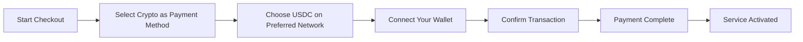
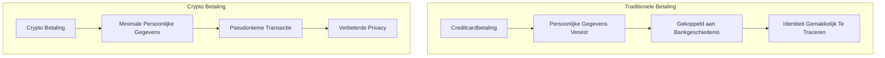
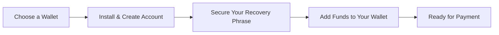

# Introductie van Crypto Betalingen: Verbeterde Privacy voor Uw E-mailservice {#introducing-crypto-payments-enhanced-privacy-for-your-email-service}

## Inhoudsopgave {#table-of-contents}

* [Voorwoord](#foreword)
* [Waarom Crypto Betalingen Belangrijk Zijn](#why-crypto-payments-matter)
* [Hoe Het Werkt](#how-it-works)
* [Privacyvoordelen](#privacy-benefits)
* [Technische Details](#technical-details)
* [Uw Crypto Wallet Instellen](#setting-up-your-crypto-wallet)
  * [MetaMask](#metamask)
  * [Phantom](#phantom)
  * [Coinbase Wallet](#coinbase-wallet)
  * [WalletConnect](#walletconnect)
* [Aan de Slag](#getting-started)
* [Vooruitkijken](#looking-forward)

## Voorwoord {#foreword}

Bij [Forward Email](https://forwardemail.net) zijn we voortdurend op zoek naar manieren om uw [privacy](https://en.wikipedia.org/wiki/Privacy) en beveiliging te verbeteren terwijl we onze service toegankelijker maken. Vandaag zijn we verheugd aan te kondigen dat we nu [cryptocurrency](https://en.wikipedia.org/wiki/Cryptocurrency) betalingen accepteren via de crypto betalingsintegratie van [Stripe](https://stripe.com).

## Waarom Crypto Betalingen Belangrijk Zijn {#why-crypto-payments-matter}

[Privacy](https://en.wikipedia.org/wiki/Internet_privacy) is altijd de kern van onze service geweest. Hoewel we in het verleden verschillende betaalmethoden hebben aangeboden, bieden crypto betalingen een extra laag privacy die perfect aansluit bij onze missie. Door met crypto te betalen, kunt u:

* Meer anonimiteit behouden bij het aanschaffen van onze e-mailservices
* De persoonlijke informatie die aan uw e-mailaccount is gekoppeld verminderen
* Uw financiële en e-mailidentiteiten gescheiden houden
* Het groeiende [gedecentraliseerde financiële](https://en.wikipedia.org/wiki/Decentralized_finance) ecosysteem ondersteunen

## Hoe Het Werkt {#how-it-works}

We hebben het crypto betalingssysteem van [Stripe](https://docs.stripe.com/crypto) geïntegreerd om het proces zo soepel mogelijk te maken. Zo kunt u betalen voor Forward Email diensten met cryptocurrency:

```mermaid
flowchart LR
    A[Start Checkout] --> B[Select Crypto as Payment Method]
    B --> C[Choose USDC on Preferred Network]
    C --> D[Connect Your Wallet]
    D --> E[Confirm Transaction]
    E --> F[Payment Complete]
    F --> G[Service Activated]
```

1. **Selecteer Crypto als Uw Betaalmethode**: Bij het afrekenen ziet u "Crypto" als betaaloptie naast traditionele methoden zoals creditcards.

2. **Kies Uw Cryptocurrency**: Momenteel accepteren we [USDC](https://en.wikipedia.org/wiki/USD_Coin) (USD Coin) op meerdere blockchains waaronder [Ethereum](https://ethereum.org), [Solana](https://solana.com) en [Polygon](https://polygon.technology). USDC is een stabiele cryptocurrency die een 1:1 waarde behoudt met de Amerikaanse dollar.

3. **Verbind Uw Wallet**: U wordt doorgestuurd naar een beveiligde pagina waar u uw favoriete crypto wallet kunt verbinden. We ondersteunen meerdere wallet-opties waaronder:
   * [MetaMask](https://metamask.io)
   * [Phantom](https://phantom.app)
   * [Coinbase Wallet](https://www.coinbase.com/wallet)
   * [WalletConnect](https://walletconnect.com) (compatibel met veel andere wallets)

4. **Voltooi Uw Betaling**: Bevestig de transactie in uw wallet en u bent klaar! De betaling wordt verwerkt en uw Forward Email service wordt direct geactiveerd.

## Privacyvoordelen {#privacy-benefits}

Het gebruik van cryptocurrency voor uw Forward Email abonnement verbetert uw privacy op verschillende manieren:

```mermaid
graph TD
    subgraph "Traditionele Betaling"
    A[Creditcardbetaling] --> B[Persoonlijke Gegevens Vereist]
    B --> C[Gekoppeld aan Bankgeschiedenis]
    C --> D[Identiteit Gemakkelijk Te Traceren]
    end

    subgraph "Crypto Betaling"
    E[Crypto Betaling] --> F[Minimale Persoonlijke Gegevens]
    F --> G[Pseudonieme Transactie]
    G --> H[Verbeterde Privacy]
    end
```

* **Minder Persoonlijke Informatie**: In tegenstelling tot creditcardbetalingen vereisen crypto transacties uw naam, factuuradres of andere persoonlijke gegevens niet. Lees meer over [transactieprivacy](https://en.wikipedia.org/wiki/Privacy_coin).
* **Scheiding van Traditionele Banken**: Uw betaling kan niet worden gekoppeld aan uw bankrekening of kredietgeschiedenis. Lees over [financiële privacy](https://en.wikipedia.org/wiki/Financial_privacy).
* **Blockchain Privacy**: Hoewel blockchain transacties openbaar zijn, zijn ze pseudoniem en niet direct gekoppeld aan uw echte identiteit. Zie [blockchain privacy technieken](https://en.wikipedia.org/wiki/Privacy_and_blockchain).
* **In Overeenstemming met Onze Waarden**: Als een privacygerichte e-mailservice geloven we in het geven van controle over uw persoonlijke informatie bij elke stap. Bekijk ons [privacybeleid](/privacy).
## Technische Details {#technical-details}

Voor degenen die geïnteresseerd zijn in de technische aspecten:

* We gebruiken de crypto-betaalinfrastructuur van [Stripe](https://docs.stripe.com/crypto/stablecoin-payments), die alle complexiteit van blockchain-transacties afhandelt.
* Betalingen worden gedaan in [USDC](https://www.circle.com/en/usdc) op meerdere blockchains, waaronder [Ethereum](https://ethereum.org), [Solana](https://solana.com) en [Polygon](https://polygon.technology).
* Terwijl je betaalt in cryptocurrency, ontvangen wij de equivalente waarde in USD, waardoor we stabiele prijzen kunnen handhaven.

## Je Crypto Wallet Instellen {#setting-up-your-crypto-wallet}

Nieuw met cryptocurrency? Zo stel je de wallets in die wij ondersteunen:

```mermaid
flowchart LR
    A[Choose a Wallet] --> B[Install & Create Account]
    B --> C[Secure Your Recovery Phrase]
    C --> D[Add Funds to Your Wallet]
    D --> E[Ready for Payment]
```

### MetaMask {#metamask}

[MetaMask](https://metamask.io) is een van de populairste Ethereum-wallets.

1. Bezoek de [MetaMask downloadpagina](https://metamask.io/download/)
2. Installeer de browserextensie of mobiele app
3. Volg de installatie-instructies om een nieuwe wallet aan te maken
4. **Belangrijk**: Bewaar je herstelzin veilig
5. Voeg ETH of USDC toe aan je wallet via een exchange of directe aankoop
6. [Gedetailleerde MetaMask Installatiegids](https://metamask.io/faqs/)

### Phantom {#phantom}

[Phantom](https://phantom.app) is een toonaangevende Solana-wallet.

1. Bezoek de [Phantom website](https://phantom.app/)
2. Download de juiste versie voor je apparaat
3. Maak een nieuwe wallet aan volgens de instructies op het scherm
4. Maak een veilige back-up van je herstelzin
5. Voeg SOL of USDC toe aan je wallet
6. [Phantom Wallet Gids](https://help.phantom.app/hc/en-us/articles/4406388623251-How-to-create-a-new-wallet)

### Coinbase Wallet {#coinbase-wallet}

[Coinbase Wallet](https://www.coinbase.com/wallet) ondersteunt meerdere blockchains.

1. Download [Coinbase Wallet](https://www.coinbase.com/wallet/downloads)
2. Maak een nieuwe wallet aan (apart van je Coinbase exchange-account)
3. Beveilig je herstelzin
4. Stuur of koop crypto direct in de app
5. [Coinbase Wallet Gids](https://www.coinbase.com/learn/tips-and-tutorials/how-to-set-up-a-crypto-wallet)

### WalletConnect {#walletconnect}

[WalletConnect](https://walletconnect.com) is een protocol dat wallets verbindt met websites.

1. Download eerst een WalletConnect-compatibele wallet (er zijn veel opties)
2. Kies tijdens het afrekenen WalletConnect
3. Scan de QR-code met je wallet-app
4. Bevestig de verbinding
5. [WalletConnect Compatibele Wallets](https://walletconnect.com/registry/wallets)

## Aan de Slag {#getting-started}

Klaar om je privacy te verbeteren met crypto-betalingen? Selecteer gewoon de optie "Crypto" tijdens het afrekenen de volgende keer dat je je abonnement verlengt of je plan upgrade.

Voor meer informatie over cryptocurrencies en blockchain-technologie, bekijk deze bronnen:

* [Wat is Cryptocurrency?](https://www.investopedia.com/terms/c/cryptocurrency.asp) - Investopedia
* [Blockchain Uitgelegd](https://www.investopedia.com/terms/b/blockchain.asp) - Investopedia
* [Digitale Privacy Gids](https://www.eff.org/issues/privacy) - Electronic Frontier Foundation

## Vooruitkijken {#looking-forward}

Het toevoegen van cryptocurrency-betalingen is slechts een volgende stap in onze voortdurende inzet voor [privacy](https://en.wikipedia.org/wiki/Privacy), [beveiliging](https://en.wikipedia.org/wiki/Computer_security) en gebruikerskeuze. Wij geloven dat je e-maildienst je privacy op elk niveau moet respecteren — van de berichten die je verstuurt tot hoe je betaalt voor de dienst.

Zoals altijd waarderen we je feedback over deze nieuwe betaaloptie. Als je vragen hebt over het gebruik van cryptocurrency met Forward Email, neem dan contact op met ons [ondersteuningsteam](/help).

---

**Referenties:**

1. [Stripe Crypto Documentatie](https://docs.stripe.com/crypto)
2. [USDC Stablecoin](https://www.circle.com/en/usdc)
3. [Ethereum Blockchain](https://ethereum.org)
4. [Solana Blockchain](https://solana.com)
5. [Polygon Network](https://polygon.technology)
6. [Electronic Frontier Foundation - Privacy](https://www.eff.org/issues/privacy)
7. [Forward Email Privacybeleid](/privacy)
