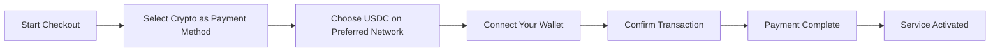
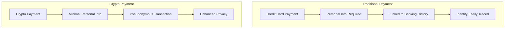
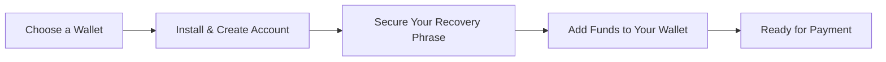

# Vi introduserer kryptobetalinger: Forbedret personvern for e-posttjenesten din {#introducing-crypto-payments-enhanced-privacy-for-your-email-service}

## Innholdsfortegnelse {#table-of-contents}

* [Forord](#foreword)
* [Hvorfor kryptobetalinger er viktige](#why-crypto-payments-matter)
* [Hvordan det fungerer](#how-it-works)
* [Fordeler med personvern](#privacy-benefits)
* [Tekniske detaljer](#technical-details)
* [Sette opp kryptolommeboken din](#setting-up-your-crypto-wallet)
  * [MetaMaske](#metamask)
  * [Fantomet](#phantom)
  * [Coinbase-lommebok](#coinbase-wallet)
  * [WalletConnect](#walletconnect)
* [Komme i gang](#getting-started)
* [Ser fremover](#looking-forward)

## Forord {#foreword}

Hos [Videresend e-post](https://forwardemail.net) ser vi stadig etter måter å forbedre [privatliv](https://en.wikipedia.org/wiki/Privacy)-tjenesten og sikkerheten din, samtidig som vi gjør tjenesten vår mer tilgjengelig. I dag er vi glade for å kunne kunngjøre at vi nå godtar [kryptovaluta](https://en.wikipedia.org/wiki/Cryptocurrency)-betalinger gjennom [Stripes](https://stripe.com)-kryptobetalingsintegrasjon.

## Hvorfor kryptobetalinger er viktige {#why-crypto-payments-matter}

[Privatliv](https://en.wikipedia.org/wiki/Internet_privacy) har alltid vært kjernen i tjenesten vår. Selv om vi har tilbudt ulike betalingsmetoder tidligere, gir kryptovalutabetalinger et ekstra lag med personvern som er perfekt i tråd med vårt oppdrag. Ved å betale med krypto kan du:

* Oppretthold større anonymitet når du kjøper e-posttjenestene våre
* Reduser mengden personlig informasjon knyttet til e-postkontoen din
* Hold din økonomiske identitet og e-postidentitet adskilt
* Støtt det voksende [desentralisert finans](https://en.wikipedia.org/wiki/Decentralized_finance)-økosystemet

## Slik fungerer det {#how-it-works}

Vi har integrert kryptobetalingssystemet [Stripes](https://docs.stripe.com/crypto) for å gjøre prosessen så sømløs som mulig. Slik kan du betale for videresending av e-post med kryptovaluta:

1. **Velg krypto som betalingsmåte**: Når du betaler, vil du se «Krypto» som et betalingsalternativ sammen med tradisjonelle metoder som kredittkort.

2. **Velg din kryptovaluta**: For øyeblikket aksepterer vi [USDC](https://en.wikipedia.org/wiki/USD_Coin) (USD-mynt) på flere blokkjeder, inkludert [Ethereum](https://ethereum.org), [Solana](https://solana.com) og [Polygon](https://polygon.technology). USDC er en stabil kryptovaluta som opprettholder en verdi på 1:1 i forhold til amerikanske dollar.

3. **Koble til lommeboken din**: Du blir omdirigert til en sikker side der du kan koble til din foretrukne kryptolommebok. Vi støtter flere lommebokalternativer, inkludert:
* [MetaMaske](https://metamask.io)
* [Fantomet](https://phantom.app)
* [Coinbase-lommebok](https://www.coinbase.com/wallet)
* [WalletConnect](https://walletconnect.com) (kompatibel med mange andre lommebøker)

4. **Fullfør betalingen**: Bekreft transaksjonen i lommeboken din, så er du klar! Betalingen vil bli behandlet, og tjenesten din for videresending av e-post vil bli aktivert umiddelbart.

## Fordeler med personvern {#privacy-benefits}

Bruk av kryptovaluta for ditt abonnement på videresendt e-post forbedrer personvernet ditt på flere måter:

* **Redusert personopplysninger**: I motsetning til kredittkortbetalinger krever ikke kryptotransaksjoner navn, faktureringsadresse eller andre personlige opplysninger. Lær mer om [transaksjonspersonvern](https://en.wikipedia.org/wiki/Privacy_coin).
* **Avstand fra tradisjonell bankvirksomhet**: Betalingen din kan ikke kobles til bankkontoen eller kreditthistorikken din. Les om [økonomisk personvern](https://en.wikipedia.org/wiki/Financial_privacy).
* **Blokkkjedepersonvern**: Selv om blokkkjedetransaksjoner er offentlige, er de pseudonyme og ikke direkte knyttet til din virkelige identitet. Se [blokkjedepersonvernteknikker](https://en.wikipedia.org/wiki/Privacy_and_blockchain).
* **I samsvar med våre verdier**: Som en personvernfokusert e-posttjeneste tror vi på å gi deg kontroll over din personlige informasjon i hvert trinn. Sjekk ut vår [personvernregler](/privacy).

## Tekniske detaljer {#technical-details}

For de som er interessert i de tekniske aspektene:

* Vi bruker kryptobetalingsinfrastrukturen [Stripes](https://docs.stripe.com/crypto/stablecoin-payments), som håndterer all kompleksiteten ved blokkjedetransaksjoner.

* Betalinger gjøres i [USDC](https://www.circle.com/en/usdc) på flere blokkjeder, inkludert [Ethereum](https://ethereum.org), [Solana](https://solana.com) og [Polygon](https://polygon.technology).

* Mens du betaler i kryptovaluta, mottar vi tilsvarende verdi i USD, slik at vi kan opprettholde stabile priser.

## Konfigurering av kryptolommeboken din {#setting-up-your-crypto-wallet}

Nybegynner innen kryptovaluta? Slik konfigurerer du lommebøkene vi støtter:

### MetaMaske {#metamask}

[MetaMaske](https://metamask.io) er en av de mest populære Ethereum-lommebøkene.

1. Gå til [MetaMask nedlastingsside](https://metamask.io/download/)
2. Installer nettleserutvidelsen eller mobilappen
3. Følg konfigurasjonsinstruksjonene for å opprette en ny lommebok
4. **Viktig**: Lagre gjenopprettingsfrasen din sikkert
5. Legg til ETH eller USDC i lommeboken din gjennom en børs eller et direkte kjøp
6. [Detaljert oppsettsveiledning for MetaMask](https://metamask.io/faqs/)

### Fantom {#phantom}

[Fantomet](https://phantom.app) er en ledende Solana-lommebok.

1. Gå til [Phantom-nettsted](https://phantom.app/)
2. Last ned riktig versjon for enheten din
3. Opprett en ny lommebok ved å følge instruksjonene på skjermen
4. Sikkerhetskopier gjenopprettingsfrasen din på en sikker måte
5. Legg til SOL eller USDC i lommeboken din
6. [Guide til Phantom-lommeboken](https://help.phantom.app/hc/en-us/articles/4406388623251-How-to-create-a-new-wallet)

### Coinbase-lommebok {#coinbase-wallet}

[Coinbase-lommebok](https://www.coinbase.com/wallet) støtter flere blokkjeder.

1. Last ned [Coinbase-lommebok](https://www.coinbase.com/wallet/downloads)
2. Opprett en ny lommebok (separat fra Coinbase-børskontoen)
3. Sikre gjenopprettingsfrasen din
4. Overfør eller kjøp kryptovaluta direkte i appen
5. [Coinbase lommebokguide](https://www.coinbase.com/learn/tips-and-tutorials/how-to-set-up-a-crypto-wallet)

### WalletConnect {#walletconnect}

[WalletConnect](https://walletconnect.com) er en protokoll som kobler lommebøker til nettsteder.

1. Først laster du ned en WalletConnect-kompatibel lommebok (mange alternativer tilgjengelig)
2. Velg WalletConnect under betaling
3. Skann QR-koden med lommebokappen din
4. Godkjenn tilkoblingen
5. [WalletConnect-kompatible lommebøker](https://walletconnect.com/registry/wallets)

## Komme i gang {#getting-started}

Klar til å forbedre personvernet ditt med kryptobetalinger? Bare velg alternativet «Krypto» i kassen neste gang du fornyer abonnementet eller oppgraderer planen.

For mer informasjon om kryptovalutaer og blokkjedeteknologi, sjekk ut disse ressursene:

* [Hva er kryptovaluta?](https://www.investopedia.com/terms/c/cryptocurrency.asp) - Investopedia
* [Blokkjede forklart](https://www.investopedia.com/terms/b/blockchain.asp) - Investopedia
* [Digital personvernveiledning](https://www.eff.org/issues/privacy) - Electronic Frontier Foundation

## Ser fremover {#looking-forward}

Å legge til kryptovalutabetalinger er bare ett steg til i vår pågående forpliktelse til [privatliv](https://en.wikipedia.org/wiki/Privacy), [sikkerhet](https://en.wikipedia.org/wiki/Computer_security) og brukerens valg. Vi mener at e-posttjenesten din bør respektere personvernet ditt på alle nivåer – fra meldingene du sender til hvordan du betaler for tjenesten.

Som alltid setter vi pris på tilbakemeldinger om dette nye betalingsalternativet. Hvis du har spørsmål om bruk av kryptovaluta med videresendt e-post, kan du kontakte [støtteteam](/help).

---

**Referanser:**

1. [Stripe Crypto-dokumentasjon](https://docs.stripe.com/crypto)
2. [USDC Stablecoin](https://www.circle.com/en/usdc)
3. [Ethereum-blokkjeden](https://ethereum.org)
4. [Solana Blockchain](https://solana.com)
5. [Polygonnettverk](https://polygon.technology)
6. [Electronic Frontier Foundation – Personvern](https://www.eff.org/issues/privacy)
7. [Personvernerklæring for videresending av e-post](/privacy)