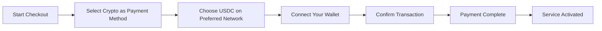
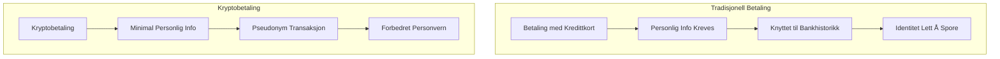
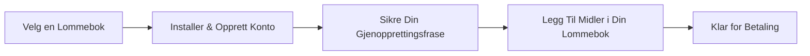

# Introduksjon av Crypto Payments: Forbedret personvern for din e-posttjeneste {#introducing-crypto-payments-enhanced-privacy-for-your-email-service}

## Innholdsfortegnelse {#table-of-contents}

* [Forord](#foreword)
* [Hvorfor Crypto Payments er Viktig](#why-crypto-payments-matter)
* [Hvordan Det Fungerer](#how-it-works)
* [Personvernfordeler](#privacy-benefits)
* [Tekniske Detaljer](#technical-details)
* [Slik Setter Du Opp Din Crypto-lommebok](#setting-up-your-crypto-wallet)
  * [MetaMask](#metamask)
  * [Phantom](#phantom)
  * [Coinbase Wallet](#coinbase-wallet)
  * [WalletConnect](#walletconnect)
* [Komme i Gang](#getting-started)
* [Fremtidsutsikter](#looking-forward)

## Forord {#foreword}

Hos [Forward Email](https://forwardemail.net) søker vi stadig etter måter å forbedre ditt [personvern](https://en.wikipedia.org/wiki/Privacy) og sikkerhet på, samtidig som vi gjør tjenesten vår mer tilgjengelig. I dag er vi glade for å kunngjøre at vi nå aksepterer betalinger med [kryptovaluta](https://en.wikipedia.org/wiki/Cryptocurrency) gjennom [Stripes](https://stripe.com) integrasjon for kryptobetalinger.

## Hvorfor Crypto Payments er Viktig {#why-crypto-payments-matter}

[Personvern](https://en.wikipedia.org/wiki/Internet_privacy) har alltid vært kjernen i vår tjeneste. Selv om vi tidligere har tilbudt ulike betalingsmetoder, gir kryptobetalinger et ekstra lag med personvern som passer perfekt med vårt oppdrag. Ved å betale med krypto kan du:

* Opprettholde større anonymitet når du kjøper våre e-posttjenester
* Redusere personlig informasjon knyttet til din e-postkonto
* Holde dine finansielle og e-postidentiteter adskilt
* Støtte det voksende [desentraliserte finans]-økosystemet (https://en.wikipedia.org/wiki/Decentralized_finance)

## Hvordan Det Fungerer {#how-it-works}

Vi har integrert [Stripes](https://docs.stripe.com/crypto) kryptobetalingssystem for å gjøre prosessen så sømløs som mulig. Slik kan du betale for Forward Email-tjenester med kryptovaluta:

```mermaid
flowchart LR
    A[Start Checkout] --> B[Select Crypto as Payment Method]
    B --> C[Choose USDC on Preferred Network]
    C --> D[Connect Your Wallet]
    D --> E[Confirm Transaction]
    E --> F[Payment Complete]
    F --> G[Service Activated]
```

1. **Velg Krypto som Betalingsmetode**: Når du går til kassen, vil du se "Crypto" som et betalingsalternativ ved siden av tradisjonelle metoder som kredittkort.

2. **Velg Din Kryptovaluta**: For øyeblikket aksepterer vi [USDC](https://en.wikipedia.org/wiki/USD_Coin) (USD Coin) på flere blokkjeder inkludert [Ethereum](https://ethereum.org), [Solana](https://solana.com), og [Polygon](https://polygon.technology). USDC er en stabil kryptovaluta som opprettholder en 1:1 verdi med amerikanske dollar.

3. **Koble Til Din Lommebok**: Du blir omdirigert til en sikker side hvor du kan koble til din foretrukne kryptolommebok. Vi støtter flere lommebøker inkludert:
   * [MetaMask](https://metamask.io)
   * [Phantom](https://phantom.app)
   * [Coinbase Wallet](https://www.coinbase.com/wallet)
   * [WalletConnect](https://walletconnect.com) (kompatibel med mange andre lommebøker)

4. **Fullfør Betalingen**: Bekreft transaksjonen i lommeboken din, og du er klar! Betalingen vil bli behandlet, og din Forward Email-tjeneste aktiveres umiddelbart.

## Personvernfordeler {#privacy-benefits}

Å bruke kryptovaluta for ditt Forward Email-abonnement forbedrer personvernet ditt på flere måter:

```mermaid
graph TD
    subgraph "Tradisjonell Betaling"
    A[Betaling med Kredittkort] --> B[Personlig Info Kreves]
    B --> C[Knyttet til Bankhistorikk]
    C --> D[Identitet Lett Å Spore]
    end

    subgraph "Kryptobetaling"
    E[Kryptobetaling] --> F[Minimal Personlig Info]
    F --> G[Pseudonym Transaksjon]
    G --> H[Forbedret Personvern]
    end
```

* **Redusert Personlig Informasjon**: I motsetning til kredittkortbetalinger krever ikke kryptotransaksjoner ditt navn, fakturaadresse eller andre personopplysninger. Lær mer om [transaksjonsprivatliv](https://en.wikipedia.org/wiki/Privacy_coin).
* **Separasjon fra Tradisjonell Bankvirksomhet**: Din betaling kan ikke knyttes til bankkontoen eller kreditt historikken din. Les om [finansielt personvern](https://en.wikipedia.org/wiki/Financial_privacy).
* **Blokkjede Personvern**: Selv om blokkjede-transaksjoner er offentlige, er de pseudonyme og ikke direkte knyttet til din virkelige identitet. Se [blokkjede personvern-teknikker](https://en.wikipedia.org/wiki/Privacy_and_blockchain).
* **I Tråd med Våre Verdier**: Som en personvernfokusert e-posttjeneste tror vi på å gi deg kontroll over din personlige informasjon i alle ledd. Sjekk ut vår [personvernerklæring](/privacy).
## Tekniske Detaljer {#technical-details}

For de som er interessert i de tekniske aspektene:

* Vi bruker [Stripes](https://docs.stripe.com/crypto/stablecoin-payments) kryptobetalinginfrastruktur, som håndterer all kompleksitet knyttet til blokkjede-transaksjoner.
* Betalinger gjøres i [USDC](https://www.circle.com/en/usdc) på flere blokkjeder inkludert [Ethereum](https://ethereum.org), [Solana](https://solana.com), og [Polygon](https://polygon.technology).
* Selv om du betaler med kryptovaluta, mottar vi tilsvarende verdi i USD, noe som gjør at vi kan opprettholde stabile priser.

## Sette Opp Din Kryptolommebok {#setting-up-your-crypto-wallet}

Ny til kryptovaluta? Slik setter du opp lommebøkene vi støtter:

```mermaid
flowchart LR
    A[Velg en Lommebok] --> B[Installer & Opprett Konto]
    B --> C[Sikre Din Gjenopprettingsfrase]
    C --> D[Legg Til Midler i Din Lommebok]
    D --> E[Klar for Betaling]
```

### MetaMask {#metamask}

[MetaMask](https://metamask.io) er en av de mest populære Ethereum-lommebøkene.

1. Besøk [MetaMask nedlastingsside](https://metamask.io/download/)
2. Installer nettleserutvidelsen eller mobilappen
3. Følg oppsettsinstruksjonene for å opprette en ny lommebok
4. **Viktig**: Oppbevar gjenopprettingsfrasen din sikkert
5. Legg til ETH eller USDC i lommeboken via en børs eller direkte kjøp
6. [Detaljert MetaMask Oppsettsguide](https://metamask.io/faqs/)

### Phantom {#phantom}

[Phantom](https://phantom.app) er en ledende Solana-lommebok.

1. Besøk [Phantom-nettsiden](https://phantom.app/)
2. Last ned riktig versjon for din enhet
3. Opprett en ny lommebok ved å følge instruksjonene på skjermen
4. Sikkerhetskopier gjenopprettingsfrasen din på en trygg måte
5. Legg til SOL eller USDC i lommeboken
6. [Phantom Lommebokguide](https://help.phantom.app/hc/en-us/articles/4406388623251-How-to-create-a-new-wallet)

### Coinbase Wallet {#coinbase-wallet}

[Coinbase Wallet](https://www.coinbase.com/wallet) støtter flere blokkjeder.

1. Last ned [Coinbase Wallet](https://www.coinbase.com/wallet/downloads)
2. Opprett en ny lommebok (separat fra Coinbase børs-konto)
3. Sikre gjenopprettingsfrasen din
4. Overfør eller kjøp krypto direkte i appen
5. [Coinbase Lommebokguide](https://www.coinbase.com/learn/tips-and-tutorials/how-to-set-up-a-crypto-wallet)

### WalletConnect {#walletconnect}

[WalletConnect](https://walletconnect.com) er en protokoll som kobler lommebøker til nettsider.

1. Last først ned en WalletConnect-kompatibel lommebok (mange alternativer tilgjengelig)
2. Velg WalletConnect under utsjekk
3. Skann QR-koden med lommebok-appen din
4. Godkjenn tilkoblingen
5. [WalletConnect Kompatible Lommebøker](https://walletconnect.com/registry/wallets)

## Komme I Gang {#getting-started}

Klar til å forbedre personvernet ditt med kryptobetalinger? Velg bare "Crypto"-alternativet under utsjekk neste gang du fornyer abonnementet eller oppgraderer planen din.

For mer informasjon om kryptovaluta og blokkjede-teknologi, sjekk ut disse ressursene:

* [Hva er Kryptovaluta?](https://www.investopedia.com/terms/c/cryptocurrency.asp) - Investopedia
* [Blokkjede Forklart](https://www.investopedia.com/terms/b/blockchain.asp) - Investopedia
* [Digital Personvern Guide](https://www.eff.org/issues/privacy) - Electronic Frontier Foundation

## Fremover {#looking-forward}

Å legge til kryptobetalinger er bare ett skritt til i vårt pågående engasjement for [personvern](https://en.wikipedia.org/wiki/Privacy), [sikkerhet](https://en.wikipedia.org/wiki/Computer_security) og brukerens valg. Vi mener at e-posttjenesten din skal respektere ditt personvern på alle nivåer—fra meldingene du sender til hvordan du betaler for tjenesten.

Som alltid, tar vi gjerne imot tilbakemeldinger på dette nye betalingsalternativet. Hvis du har spørsmål om bruk av kryptovaluta med Forward Email, vennligst kontakt vårt [supportteam](/help).

---

**Referanser:**

1. [Stripe Crypto Dokumentasjon](https://docs.stripe.com/crypto)
2. [USDC Stablecoin](https://www.circle.com/en/usdc)
3. [Ethereum Blokkjede](https://ethereum.org)
4. [Solana Blokkjede](https://solana.com)
5. [Polygon Nettverk](https://polygon.technology)
6. [Electronic Frontier Foundation - Personvern](https://www.eff.org/issues/privacy)
7. [Forward Email Personvernpolicy](/privacy)
