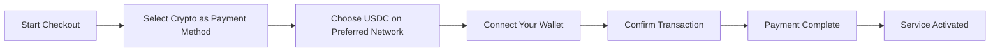
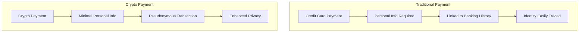
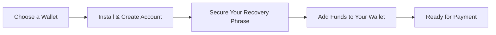

# Przedstawiamy płatności kryptowalutowe: zwiększona prywatność Twojej usługi poczty e-mail {#introducing-crypto-payments-enhanced-privacy-for-your-email-service}

## Spis treści {#table-of-contents}

* [Przedmowa](#foreword)
* [Dlaczego płatności kryptowalutowe są ważne](#why-crypto-payments-matter)
* [Jak to działa](#how-it-works)
* [Korzyści z prywatności](#privacy-benefits)
* [Szczegóły techniczne](#technical-details)
* [Konfigurowanie portfela kryptowalutowego](#setting-up-your-crypto-wallet)
  * [MetaMaska](#metamask)
  * [Fantom](#phantom)
  * [Portfel Coinbase](#coinbase-wallet)
  * [WalletConnect](#walletconnect)
* [Rozpoczęcie pracy](#getting-started)
* [Oczekiwanie na coś](#looking-forward)

## Przedmowa {#foreword}

W [Przekaż dalej e-mail](https://forwardemail.net) stale poszukujemy sposobów na poprawę bezpieczeństwa i podwyższenie dostępności usługi [prywatność](https://en.wikipedia.org/wiki/Privacy). Z przyjemnością ogłaszamy, że akceptujemy teraz płatności [kryptowaluta](https://en.wikipedia.org/wiki/Cryptocurrency) za pośrednictwem integracji płatności kryptowalutowych [Stripe'a](https://stripe.com).

## Dlaczego płatności kryptowalutowe są ważne {#why-crypto-payments-matter}

[Prywatność](https://en.wikipedia.org/wiki/Internet_privacy) zawsze stanowiło istotę naszej usługi. Chociaż w przeszłości oferowaliśmy różne metody płatności, płatności kryptowalutowe zapewniają dodatkową warstwę prywatności, która idealnie wpisuje się w naszą misję. Płacąc kryptowalutami, możesz:

* Zachowaj większą anonimowość, kupując nasze usługi e-mail
* Zmniejsz ilość danych osobowych powiązanych z Twoim kontem e-mail
* Oddziel dane finansowe od danych e-mail
* Wspieraj rozwijający się ekosystem [zdecentralizowane finanse](https://en.wikipedia.org/wiki/Decentralized_finance)

## Jak to działa {#how-it-works}

Zintegrowaliśmy system płatności kryptowalutowych [Stripe'a](https://docs.stripe.com/crypto), aby proces przebiegał jak najsprawniej. Oto jak możesz płacić za usługi Forward Email za pomocą kryptowaluty:

1. **Wybierz kryptowalutę jako metodę płatności**: Podczas realizacji transakcji zobaczysz „Kryptowaluty” jako opcję płatności obok tradycyjnych metod, takich jak karty kredytowe.

2. **Wybierz swoją kryptowalutę**: Obecnie akceptujemy [USDC](https://en.wikipedia.org/wiki/USD_Coin) (USD Coin) na wielu blockchainach, w tym [Ethereum](https://ethereum.org), [Solana](https://solana.com) i [Wielokąt](https://polygon.technology). USDC to stabilna kryptowaluta, której kurs w stosunku do dolara amerykańskiego wynosi 1:1.

3. **Połącz swój portfel**: Zostaniesz przekierowany na bezpieczną stronę, na której możesz podłączyć swój preferowany portfel kryptowalutowy. Obsługujemy wiele opcji portfeli, w tym:
* [MetaMaska](https://metamask.io)
* [Fantom](https://phantom.app)
* [Portfel Coinbase](https://www.coinbase.com/wallet)
* [WalletConnect](https://walletconnect.com) (kompatybilny z wieloma innymi portfelami)

4. **Zakończ płatność**: Potwierdź transakcję w portfelu i gotowe! Płatność zostanie przetworzona, a usługa Forward Email zostanie natychmiast aktywowana.

## Korzyści z prywatności {#privacy-benefits}

Korzystanie z kryptowaluty w celu subskrypcji usługi Forward Email zwiększa Twoją prywatność na kilka sposobów:

* **Zmniejszona ilość danych osobowych**: W przeciwieństwie do płatności kartą kredytową, transakcje kryptowalutowe nie wymagają podawania imienia i nazwiska, adresu rozliczeniowego ani innych danych osobowych. Dowiedz się więcej o [prywatność transakcji](https://en.wikipedia.org/wiki/Privacy_coin).
* **Oddzielenie od tradycyjnej bankowości**: Płatności nie można powiązać z kontem bankowym ani historią kredytową. Przeczytaj o [prywatność finansowa](https://en.wikipedia.org/wiki/Financial_privacy).
* **Prywatność blockchain**: Chociaż transakcje blockchain są publiczne, są one pseudonimowe i nie są bezpośrednio powiązane z Twoją tożsamością w świecie rzeczywistym. Zobacz [techniki prywatności blockchain](https://en.wikipedia.org/wiki/Privacy_and_blockchain).
* **Zgodnie z naszymi wartościami**: Jako usługa poczty e-mail nastawiona na prywatność, wierzymy w zapewnienie Ci kontroli nad Twoimi danymi osobowymi na każdym kroku. Sprawdź nasz [polityka prywatności](/privacy).

## Szczegóły techniczne {#technical-details}

Dla zainteresowanych aspektami technicznymi:

* Korzystamy z infrastruktury płatności kryptowalutowych [Stripe'a](https://docs.stripe.com/crypto/stablecoin-payments), która obsługuje całą złożoność transakcji blockchain.
* Płatności są realizowane w [USDC](https://www.circle.com/en/usdc) na wielu blockchainach, w tym [Ethereum](https://ethereum.org), [Solana](https://solana.com) i [Wielokąt](https://polygon.technology).
* Podczas gdy płacisz w kryptowalucie, otrzymujemy równowartość w USD, co pozwala nam utrzymać stabilne ceny.

## Konfigurowanie portfela kryptowalutowego {#setting-up-your-crypto-wallet}

Jesteś nowy w świecie kryptowalut? Oto jak skonfigurować obsługiwane przez nas portfele:

### MetaMaska {#metamask}

[MetaMaska](https://metamask.io) to jeden z najpopularniejszych portfeli Ethereum.

1. Odwiedź [Strona pobierania MetaMask](https://metamask.io/download/)
2. Zainstaluj rozszerzenie przeglądarki lub aplikację mobilną
3. Postępuj zgodnie z instrukcjami konfiguracji, aby utworzyć nowy portfel
4. **Ważne**: Bezpiecznie przechowuj frazę odzyskiwania
5. Dodaj ETH lub USDC do swojego portfela za pośrednictwem giełdy lub zakupu bezpośredniego
6. [Szczegółowy przewodnik konfiguracji MetaMask](https://metamask.io/faqs/)

### Fantom {#phantom}

[Fantom](https://phantom.app) jest wiodącym portfelem Solana.

1. Odwiedź [Strona internetowa Phantom](https://phantom.app/)
2. Pobierz odpowiednią wersję dla swojego urządzenia
3. Utwórz nowy portfel, postępując zgodnie z instrukcjami wyświetlanymi na ekranie
4. Bezpiecznie utwórz kopię zapasową frazy odzyskiwania
5. Dodaj SOL lub USDC do swojego portfela
6. [Przewodnik po portfelu Phantom](https://help.phantom.app/hc/en-us/articles/4406388623251-How-to-create-a-new-wallet)

### Portfel Coinbase {#coinbase-wallet}

[Portfel Coinbase](https://www.coinbase.com/wallet) obsługuje wiele blockchainów.

1. Pobierz [Portfel Coinbase](https://www.coinbase.com/wallet/downloads)
2. Utwórz nowy portfel (oddzielny od konta giełdowego Coinbase)
3. Zabezpiecz swoją frazę odzyskiwania
4. Przelej lub kup kryptowalutę bezpośrednio w aplikacji
5. [Przewodnik po portfelu Coinbase](https://www.coinbase.com/learn/tips-and-tutorials/how-to-set-up-a-crypto-wallet)

### Portfel Connect {#walletconnect}

[WalletConnect](https://walletconnect.com) to protokół łączący portfele ze stronami internetowymi.

1. Najpierw pobierz portfel kompatybilny z WalletConnect (dostępnych jest wiele opcji).
2. Podczas finalizacji zamówienia wybierz WalletConnect.
3. Zeskanuj kod QR za pomocą aplikacji portfela.
4. Zatwierdź połączenie.
5. [Portfele kompatybilne z WalletConnect](https://walletconnect.com/registry/wallets)

## Wprowadzenie {#getting-started}

Chcesz zwiększyć swoją prywatność dzięki płatnościom kryptowalutami? Wystarczy wybrać opcję „Kryptowaluty” podczas realizacji transakcji przy następnym odnawianiu subskrypcji lub zmianie planu.

Więcej informacji na temat kryptowalut i technologii blockchain znajdziesz w następujących zasobach:

* [Czym jest kryptowaluta?](https://www.investopedia.com/terms/c/cryptocurrency.asp) - Investopedia
* [Wyjaśnienie Blockchain](https://www.investopedia.com/terms/b/blockchain.asp) - Investopedia
* [Przewodnik po prywatności cyfrowej](https://www.eff.org/issues/privacy) - Electronic Frontier Foundation

## Z niecierpliwością {#looking-forward}

Dodanie płatności kryptowalutami to kolejny krok w naszym stałym zaangażowaniu w [prywatność](https://en.wikipedia.org/wiki/Privacy), [bezpieczeństwo](https://en.wikipedia.org/wiki/Computer_security) i swobodę wyboru użytkownika. Wierzymy, że Twoja usługa poczty e-mail powinna szanować Twoją prywatność na każdym poziomie – od wysyłanych wiadomości po sposób, w jaki płacisz za usługę.

Jak zawsze, chętnie poznamy Twoją opinię na temat tej nowej opcji płatności. W razie pytań dotyczących korzystania z kryptowaluty w usłudze Forward Email, skontaktuj się z naszym [zespół wsparcia](/help).

---

**Odniesienia:**

1. [Dokumentacja Stripe Crypto](https://docs.stripe.com/crypto)
2. [USDC Stablecoin](https://www.circle.com/en/usdc)
3. [Łańcuch bloków Ethereum](https://ethereum.org)
4. [Solana Blockchain](https://solana.com)
5. [Sieć wielokątów](https://polygon.technology)
6. [Fundacja Electronic Frontier – Prywatność](https://www.eff.org/issues/privacy)
7. [Polityka prywatności dotycząca przesyłania wiadomości e-mail](/privacy)