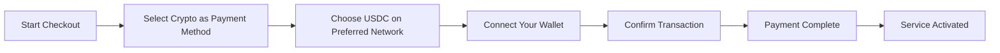
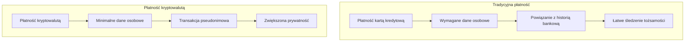
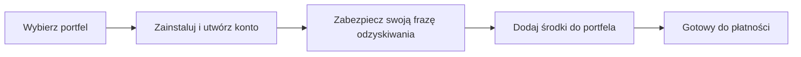

# Wprowadzenie płatności kryptowalutowych: Zwiększona prywatność dla Twojej usługi e-mail {#introducing-crypto-payments-enhanced-privacy-for-your-email-service}

## Spis treści {#table-of-contents}

* [Przedmowa](#foreword)
* [Dlaczego płatności kryptowalutowe są ważne](#why-crypto-payments-matter)
* [Jak to działa](#how-it-works)
* [Korzyści dla prywatności](#privacy-benefits)
* [Szczegóły techniczne](#technical-details)
* [Konfiguracja portfela kryptowalutowego](#setting-up-your-crypto-wallet)
  * [MetaMask](#metamask)
  * [Phantom](#phantom)
  * [Coinbase Wallet](#coinbase-wallet)
  * [WalletConnect](#walletconnect)
* [Pierwsze kroki](#getting-started)
* [Perspektywy na przyszłość](#looking-forward)

## Przedmowa {#foreword}

W [Forward Email](https://forwardemail.net) nieustannie szukamy sposobów na poprawę Twojej [prywatności](https://pl.wikipedia.org/wiki/Prywatność) i bezpieczeństwa, jednocześnie czyniąc naszą usługę bardziej dostępną. Dziś z radością ogłaszamy, że akceptujemy teraz płatności [kryptowalutami](https://pl.wikipedia.org/wiki/Kryptowaluta) za pośrednictwem integracji płatności kryptowalutowych [Stripe](https://stripe.com).

## Dlaczego płatności kryptowalutowe są ważne {#why-crypto-payments-matter}

[Prywatność](https://pl.wikipedia.org/wiki/Prywatność_w_internecie) zawsze była fundamentem naszej usługi. Choć w przeszłości oferowaliśmy różne metody płatności, płatności kryptowalutowe zapewniają dodatkową warstwę prywatności, która idealnie wpisuje się w naszą misję. Płacąc kryptowalutą, możesz:

* Zachować większą anonimowość przy zakupie naszych usług e-mail
* Ograniczyć ilość danych osobowych powiązanych z Twoim kontem e-mail
* Oddzielić swoją tożsamość finansową od tożsamości e-mailowej
* Wspierać rozwijający się ekosystem [zdecentralizowanych finansów](https://pl.wikipedia.org/wiki/Zdecentralizowane_finanse)

## Jak to działa {#how-it-works}

Zintegrowaliśmy system płatności kryptowalutowych [Stripe](https://docs.stripe.com/crypto), aby proces był jak najbardziej płynny. Oto jak możesz zapłacić za usługi Forward Email za pomocą kryptowalut:

```mermaid
flowchart LR
    A[Start Checkout] --> B[Select Crypto as Payment Method]
    B --> C[Choose USDC on Preferred Network]
    C --> D[Connect Your Wallet]
    D --> E[Confirm Transaction]
    E --> F[Payment Complete]
    F --> G[Service Activated]
```

1. **Wybierz kryptowalutę jako metodę płatności**: Podczas finalizacji zamówienia zobaczysz opcję „Crypto” obok tradycyjnych metod, takich jak karty kredytowe.

2. **Wybierz swoją kryptowalutę**: Obecnie akceptujemy [USDC](https://en.wikipedia.org/wiki/USD_Coin) (USD Coin) na wielu blockchainach, w tym [Ethereum](https://ethereum.org), [Solana](https://solana.com) i [Polygon](https://polygon.technology). USDC to stabilna kryptowaluta utrzymująca wartość 1:1 względem dolara amerykańskiego.

3. **Połącz swój portfel**: Zostaniesz przekierowany na bezpieczną stronę, gdzie możesz połączyć swój preferowany portfel kryptowalutowy. Obsługujemy wiele opcji portfeli, w tym:
   * [MetaMask](https://metamask.io)
   * [Phantom](https://phantom.app)
   * [Coinbase Wallet](https://www.coinbase.com/wallet)
   * [WalletConnect](https://walletconnect.com) (kompatybilny z wieloma innymi portfelami)

4. **Zakończ płatność**: Potwierdź transakcję w swoim portfelu i gotowe! Płatność zostanie przetworzona, a Twoja usługa Forward Email aktywowana natychmiast.

## Korzyści dla prywatności {#privacy-benefits}

Korzystanie z kryptowalut do subskrypcji Forward Email zwiększa Twoją prywatność na kilka sposobów:

```mermaid
graph TD
    subgraph "Tradycyjna płatność"
    A[Płatność kartą kredytową] --> B[Wymagane dane osobowe]
    B --> C[Powiązanie z historią bankową]
    C --> D[Łatwe śledzenie tożsamości]
    end

    subgraph "Płatność kryptowalutą"
    E[Płatność kryptowalutą] --> F[Minimalne dane osobowe]
    F --> G[Transakcja pseudonimowa]
    G --> H[Zwiększona prywatność]
    end
```

* **Mniej danych osobowych**: W przeciwieństwie do płatności kartą, transakcje kryptowalutowe nie wymagają podawania imienia, adresu rozliczeniowego ani innych danych osobowych. Dowiedz się więcej o [prywatności transakcji](https://en.wikipedia.org/wiki/Privacy_coin).
* **Oddzielenie od tradycyjnego bankowości**: Twoja płatność nie może być powiązana z Twoim kontem bankowym ani historią kredytową. Przeczytaj o [prywatności finansowej](https://en.wikipedia.org/wiki/Financial_privacy).
* **Prywatność blockchain**: Choć transakcje na blockchainie są publiczne, są pseudonimowe i nie są bezpośrednio powiązane z Twoją rzeczywistą tożsamością. Zobacz [techniki prywatności blockchain](https://en.wikipedia.org/wiki/Privacy_and_blockchain).
* **Zgodność z naszymi wartościami**: Jako usługa e-mail skoncentrowana na prywatności, wierzymy w dawanie Ci kontroli nad Twoimi danymi osobowymi na każdym etapie. Zapoznaj się z naszą [polityką prywatności](/privacy).
## Szczegóły techniczne {#technical-details}

Dla zainteresowanych aspektami technicznymi:

* Korzystamy z infrastruktury płatności kryptowalutowych [Stripe'a](https://docs.stripe.com/crypto/stablecoin-payments), która obsługuje całą złożoność transakcji blockchain.
* Płatności dokonywane są w [USDC](https://www.circle.com/en/usdc) na wielu blockchainach, w tym [Ethereum](https://ethereum.org), [Solana](https://solana.com) oraz [Polygon](https://polygon.technology).
* Chociaż płacisz w kryptowalucie, my otrzymujemy równowartość w USD, co pozwala nam utrzymać stabilne ceny.

## Konfiguracja portfela kryptowalutowego {#setting-up-your-crypto-wallet}

Nowy w świecie kryptowalut? Oto jak skonfigurować portfele, które wspieramy:

```mermaid
flowchart LR
    A[Wybierz portfel] --> B[Zainstaluj i utwórz konto]
    B --> C[Zabezpiecz swoją frazę odzyskiwania]
    C --> D[Dodaj środki do portfela]
    D --> E[Gotowy do płatności]
```

### MetaMask {#metamask}

[MetaMask](https://metamask.io) to jeden z najpopularniejszych portfeli Ethereum.

1. Odwiedź [stronę pobierania MetaMask](https://metamask.io/download/)
2. Zainstaluj rozszerzenie do przeglądarki lub aplikację mobilną
3. Postępuj zgodnie z instrukcjami, aby utworzyć nowy portfel
4. **Ważne**: Bezpiecznie przechowuj swoją frazę odzyskiwania
5. Dodaj ETH lub USDC do portfela za pośrednictwem giełdy lub bezpośredniego zakupu
6. [Szczegółowy przewodnik konfiguracji MetaMask](https://metamask.io/faqs/)

### Phantom {#phantom}

[Phantom](https://phantom.app) to wiodący portfel Solana.

1. Odwiedź [stronę Phantom](https://phantom.app/)
2. Pobierz odpowiednią wersję dla swojego urządzenia
3. Utwórz nowy portfel, postępując zgodnie z instrukcjami na ekranie
4. Bezpiecznie wykonaj kopię zapasową frazy odzyskiwania
5. Dodaj SOL lub USDC do portfela
6. [Przewodnik po portfelu Phantom](https://help.phantom.app/hc/en-us/articles/4406388623251-How-to-create-a-new-wallet)

### Coinbase Wallet {#coinbase-wallet}

[Coinbase Wallet](https://www.coinbase.com/wallet) obsługuje wiele blockchainów.

1. Pobierz [Coinbase Wallet](https://www.coinbase.com/wallet/downloads)
2. Utwórz nowy portfel (oddzielny od konta giełdowego Coinbase)
3. Zabezpiecz swoją frazę odzyskiwania
4. Przelej lub kup kryptowaluty bezpośrednio w aplikacji
5. [Przewodnik po portfelu Coinbase](https://www.coinbase.com/learn/tips-and-tutorials/how-to-set-up-a-crypto-wallet)

### WalletConnect {#walletconnect}

[WalletConnect](https://walletconnect.com) to protokół łączący portfele ze stronami internetowymi.

1. Najpierw pobierz portfel kompatybilny z WalletConnect (dostępnych jest wiele opcji)
2. Podczas realizacji zamówienia wybierz WalletConnect
3. Zeskanuj kod QR za pomocą aplikacji portfela
4. Zatwierdź połączenie
5. [Portfele kompatybilne z WalletConnect](https://walletconnect.com/registry/wallets)

## Pierwsze kroki {#getting-started}

Gotowy, aby zwiększyć swoją prywatność dzięki płatnościom kryptowalutowym? Po prostu wybierz opcję „Krypto” podczas realizacji zamówienia następnym razem, gdy odnowisz subskrypcję lub zmienisz plan.

Aby dowiedzieć się więcej o kryptowalutach i technologii blockchain, sprawdź te zasoby:

* [Czym jest kryptowaluta?](https://www.investopedia.com/terms/c/cryptocurrency.asp) – Investopedia
* [Wyjaśnienie blockchain](https://www.investopedia.com/terms/b/blockchain.asp) – Investopedia
* [Przewodnik po prywatności cyfrowej](https://www.eff.org/issues/privacy) – Electronic Frontier Foundation

## Patrząc w przyszłość {#looking-forward}

Dodanie płatności kryptowalutowych to kolejny krok w naszym ciągłym zaangażowaniu na rzecz [prywatności](https://en.wikipedia.org/wiki/Privacy), [bezpieczeństwa](https://en.wikipedia.org/wiki/Computer_security) i wyboru użytkownika. Wierzymy, że Twoja usługa e-mail powinna szanować Twoją prywatność na każdym poziomie — od wysyłanych wiadomości po sposób płacenia za usługę.

Jak zawsze, czekamy na Twoją opinię na temat tej nowej opcji płatności. Jeśli masz pytania dotyczące korzystania z kryptowalut z Forward Email, skontaktuj się z naszym [zespołem wsparcia](/help).

---

**Bibliografia:**

1. [Dokumentacja Stripe Crypto](https://docs.stripe.com/crypto)
2. [Stablecoin USDC](https://www.circle.com/en/usdc)
3. [Blockchain Ethereum](https://ethereum.org)
4. [Blockchain Solana](https://solana.com)
5. [Sieć Polygon](https://polygon.technology)
6. [Electronic Frontier Foundation – Prywatność](https://www.eff.org/issues/privacy)
7. [Polityka prywatności Forward Email](/privacy)
