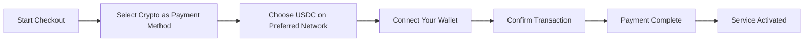
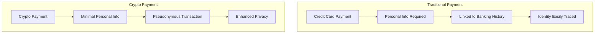
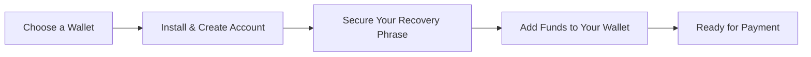

# Apresentando pagamentos criptográficos: privacidade aprimorada para seu serviço de e-mail {#introducing-crypto-payments-enhanced-privacy-for-your-email-service}

## Índice {#table-of-contents}

* [Prefácio](#foreword)
* [Por que os pagamentos com criptomoedas são importantes](#why-crypto-payments-matter)
* [Como funciona](#how-it-works)
* [Benefícios de privacidade](#privacy-benefits)
* [Detalhes técnicos](#technical-details)
* [Configurando sua carteira de criptomoedas](#setting-up-your-crypto-wallet)
  * [MetaMáscara](#metamask)
  * [Fantasma](#phantom)
  * [Carteira Coinbase](#coinbase-wallet)
  * [WalletConnect](#walletconnect)
* [Começando](#getting-started)
* [Esperando ansiosamente](#looking-forward)

## Prefácio {#foreword}

Na [Encaminhar e-mail](https://forwardemail.net), buscamos constantemente maneiras de aprimorar seu [privacidade](https://en.wikipedia.org/wiki/Privacy) e sua segurança, além de tornar nosso serviço mais acessível. Hoje, temos o prazer de anunciar que agora aceitamos pagamentos [criptomoeda](https://en.wikipedia.org/wiki/Cryptocurrency) por meio da integração de pagamento com criptomoedas [Listras](https://stripe.com).

## Por que os pagamentos com criptomoedas são importantes {#why-crypto-payments-matter}

[Privacidade](https://en.wikipedia.org/wiki/Internet_privacy) sempre esteve no centro do nosso serviço. Embora já tenhamos oferecido diversos métodos de pagamento no passado, os pagamentos em criptomoedas oferecem uma camada adicional de privacidade que se alinha perfeitamente com a nossa missão. Ao pagar com criptomoedas, você pode:

* Mantenha maior anonimato ao adquirir nossos serviços de e-mail
* Reduza as informações pessoais vinculadas à sua conta de e-mail
* Mantenha suas identidades financeiras e de e-mail separadas
* Apoie o crescente ecossistema [finanças descentralizadas](https://en.wikipedia.org/wiki/Decentralized_finance)

## Como funciona {#how-it-works}

Integramos o sistema de pagamento com criptomoedas [Listras](https://docs.stripe.com/crypto) para tornar o processo o mais simples possível. Veja como você pode pagar pelos serviços de Encaminhamento de E-mails usando criptomoedas:

1. **Selecione Criptomoedas como seu método de pagamento**: Ao finalizar a compra, você verá "Criptomoedas" como opção de pagamento, além de métodos tradicionais, como cartões de crédito.

2. **Escolha sua criptomoeda**: Atualmente, aceitamos [USDC](https://en.wikipedia.org/wiki/USD_Coin) (USD Coin) em diversas blockchains, incluindo [Ethereum](https://ethereum.org), [Solana](https://solana.com) e [Polígono](https://polygon.technology). USDC é uma criptomoeda estável que mantém um valor de 1:1 em relação ao dólar americano.

3. **Conecte sua carteira**: Você será redirecionado para uma página segura onde poderá conectar sua carteira de criptomoedas preferida. Oferecemos suporte a diversas opções de carteira, incluindo:
* [MetaMáscara](https://metamask.io)
* [Fantasma](https://phantom.app)
* [Carteira Coinbase](https://www.coinbase.com/wallet)
* [WalletConnect](https://walletconnect.com) (compatível com muitas outras carteiras)

4. **Conclua seu pagamento**: Confirme a transação na sua carteira e pronto! O pagamento será processado e seu serviço de Encaminhamento de E-mails será ativado imediatamente.

## Benefícios de privacidade {#privacy-benefits}

Usar criptomoeda para sua assinatura do Forward Email aumenta sua privacidade de várias maneiras:

* **Informações Pessoais Reduzidas**: Ao contrário dos pagamentos com cartão de crédito, as transações com criptomoedas não exigem seu nome, endereço de cobrança ou outros dados pessoais. Saiba mais sobre [privacidade de transações](https://en.wikipedia.org/wiki/Privacy_coin).
* **Separação do sistema bancário tradicional**: Seu pagamento não pode ser vinculado à sua conta bancária ou histórico de crédito. Saiba mais sobre [privacidade financeira](https://en.wikipedia.org/wiki/Financial_privacy).
* **Privacidade em Blockchain**: Embora as transações em blockchain sejam públicas, elas são pseudônimas e não estão diretamente vinculadas à sua identidade no mundo real. Consulte [técnicas de privacidade de blockchain](https://en.wikipedia.org/wiki/Privacy_and_blockchain).
* **Consistente com nossos valores**: Como um serviço de e-mail com foco em privacidade, acreditamos em dar a você controle sobre suas informações pessoais em todas as etapas. Confira nosso [política de Privacidade](/privacy).

## Detalhes técnicos {#technical-details}

Para os interessados nos aspectos técnicos:

* Utilizamos a infraestrutura de pagamento com criptomoedas [Listras](https://docs.stripe.com/crypto/stablecoin-payments), que lida com toda a complexidade das transações em blockchain.
* Os pagamentos são feitos em [USDC](https://www.circle.com/en/usdc) em diversas blockchains, incluindo [Ethereum](https://ethereum.org), [Solana](https://solana.com) e [Polígono](https://polygon.technology).
* Enquanto você paga em criptomoeda, recebemos o valor equivalente em dólares americanos (USD), o que nos permite manter preços estáveis.

## Configurando sua carteira de criptomoedas {#setting-up-your-crypto-wallet}

Novo em criptomoedas? Veja como configurar as carteiras que oferecemos:

### MetaMáscara {#metamask}

[MetaMáscara](https://metamask.io) é uma das carteiras Ethereum mais populares.

1. Acesse [Página de download do MetaMask](https://metamask.io/download/)
2. Instale a extensão do navegador ou o aplicativo móvel
3. Siga as instruções de configuração para criar uma nova carteira
4. **Importante**: Armazene sua frase de recuperação com segurança
5. Adicione ETH ou USDC à sua carteira por meio de uma corretora ou compra direta
6. [Guia detalhado de configuração do MetaMask](https://metamask.io/faqs/)

### Fantasma {#phantom}

[Fantasma](https://phantom.app) é uma carteira Solana líder.

1. Acesse [Site fantasma](https://phantom.app/)
2. Baixe a versão apropriada para o seu dispositivo
3. Crie uma nova carteira seguindo as instruções na tela
4. Faça um backup seguro da sua frase de recuperação
5. Adicione SOL ou USDC à sua carteira
6. [Guia da Carteira Fantasma](https://help.phantom.app/hc/en-us/articles/4406388623251-How-to-create-a-new-wallet)

### Carteira Coinbase {#coinbase-wallet}

[Carteira Coinbase](https://www.coinbase.com/wallet) suporta múltiplos blockchains.

1. Baixe [Carteira Coinbase](https://www.coinbase.com/wallet/downloads)
2. Crie uma nova carteira (separada da conta da corretora Coinbase)
3. Proteja sua frase de recuperação
4. Transfira ou compre criptomoedas diretamente no aplicativo
5. [Guia da Carteira Coinbase](https://www.coinbase.com/learn/tips-and-tutorials/how-to-set-up-a-crypto-wallet)

### WalletConnect {#walletconnect}

[WalletConnect](https://walletconnect.com) é um protocolo que conecta carteiras a sites.

1. Primeiro, baixe uma carteira compatível com WalletConnect (várias opções disponíveis)
2. Durante a finalização da compra, selecione WalletConnect
3. Escaneie o código QR com o aplicativo da sua carteira
4. Aprove a conexão
5. [Carteiras compatíveis com WalletConnect](https://walletconnect.com/registry/wallets)

## Introdução {#getting-started}

Pronto para aprimorar sua privacidade com pagamentos em criptomoedas? Basta selecionar a opção "Cripto" durante a finalização da compra na próxima vez que renovar sua assinatura ou atualizar seu plano.

Para mais informações sobre criptomoedas e tecnologia blockchain, confira estes recursos:

* [O que é criptomoeda?](https://www.investopedia.com/terms/c/cryptocurrency.asp) - Investopedia
* [Blockchain Explicado](https://www.investopedia.com/terms/b/blockchain.asp) - Investopedia
* [Guia de Privacidade Digital](https://www.eff.org/issues/privacy) - Electronic Frontier Foundation

## Olhando para o futuro {#looking-forward}

Adicionar pagamentos em criptomoedas é apenas mais um passo em nosso compromisso contínuo com [privacidade](https://en.wikipedia.org/wiki/Privacy), [segurança](https://en.wikipedia.org/wiki/Computer_security) e a escolha do usuário. Acreditamos que seu serviço de e-mail deve respeitar sua privacidade em todos os níveis — desde as mensagens que você envia até a forma como você paga pelo serviço.

Como sempre, agradecemos seu feedback sobre esta nova opção de pagamento. Se tiver dúvidas sobre o uso de criptomoedas com o Forward Email, entre em contato com nosso [equipe de suporte](/help).

---

**Referências:**

1. [Documentação do Stripe Crypto](https://docs.stripe.com/crypto)
2. [Moeda estável USDC](https://www.circle.com/en/usdc)
3. [Blockchain Ethereum](https://ethereum.org)
4. [Blockchain Solana](https://solana.com)
5. [Rede de polígonos](https://polygon.technology)
6. [Electronic Frontier Foundation - Privacidade](https://www.eff.org/issues/privacy)
7. [Política de Privacidade de Encaminhamento de E-mail](/privacy)