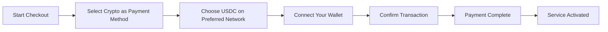
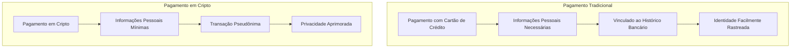
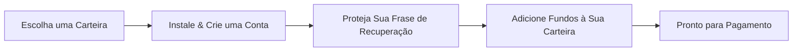

# Apresentando Pagamentos em Cripto: Privacidade Aprimorada para Seu Serviço de Email {#introducing-crypto-payments-enhanced-privacy-for-your-email-service}

## Índice {#table-of-contents}

* [Prefácio](#foreword)
* [Por Que Pagamentos em Cripto São Importantes](#why-crypto-payments-matter)
* [Como Funciona](#how-it-works)
* [Benefícios de Privacidade](#privacy-benefits)
* [Detalhes Técnicos](#technical-details)
* [Configurando Sua Carteira Cripto](#setting-up-your-crypto-wallet)
  * [MetaMask](#metamask)
  * [Phantom](#phantom)
  * [Coinbase Wallet](#coinbase-wallet)
  * [WalletConnect](#walletconnect)
* [Começando](#getting-started)
* [Perspectivas Futuras](#looking-forward)

## Prefácio {#foreword}

Na [Forward Email](https://forwardemail.net), estamos constantemente buscando maneiras de melhorar sua [privacidade](https://en.wikipedia.org/wiki/Privacy) e segurança enquanto tornamos nosso serviço mais acessível. Hoje, estamos entusiasmados em anunciar que agora aceitamos pagamentos em [criptomoeda](https://en.wikipedia.org/wiki/Cryptocurrency) através da integração de pagamentos cripto da [Stripe](https://stripe.com).

## Por Que Pagamentos em Cripto São Importantes {#why-crypto-payments-matter}

A [privacidade](https://en.wikipedia.org/wiki/Internet_privacy) sempre esteve no centro do nosso serviço. Embora já tenhamos oferecido vários métodos de pagamento no passado, os pagamentos em criptomoeda fornecem uma camada adicional de privacidade que se alinha perfeitamente com nossa missão. Ao pagar com cripto, você pode:

* Manter maior anonimato ao adquirir nossos serviços de email
* Reduzir as informações pessoais vinculadas à sua conta de email
* Manter suas identidades financeira e de email separadas
* Apoiar o crescente ecossistema de [finanças descentralizadas](https://en.wikipedia.org/wiki/Decentralized_finance)

## Como Funciona {#how-it-works}

Integramos o sistema de pagamento cripto da [Stripe](https://docs.stripe.com/crypto) para tornar o processo o mais simples possível. Veja como você pode pagar pelos serviços da Forward Email usando criptomoeda:

```mermaid
flowchart LR
    A[Start Checkout] --> B[Select Crypto as Payment Method]
    B --> C[Choose USDC on Preferred Network]
    C --> D[Connect Your Wallet]
    D --> E[Confirm Transaction]
    E --> F[Payment Complete]
    F --> G[Service Activated]
```

1. **Selecione Cripto como Seu Método de Pagamento**: Ao finalizar a compra, você verá "Cripto" como uma opção de pagamento ao lado dos métodos tradicionais, como cartão de crédito.

2. **Escolha Sua Criptomoeda**: Atualmente, aceitamos [USDC](https://en.wikipedia.org/wiki/USD_Coin) (USD Coin) em múltiplas blockchains, incluindo [Ethereum](https://ethereum.org), [Solana](https://solana.com) e [Polygon](https://polygon.technology). USDC é uma criptomoeda estável que mantém valor 1:1 com o dólar americano.

3. **Conecte Sua Carteira**: Você será redirecionado para uma página segura onde poderá conectar sua carteira cripto preferida. Suportamos várias opções de carteira, incluindo:
   * [MetaMask](https://metamask.io)
   * [Phantom](https://phantom.app)
   * [Coinbase Wallet](https://www.coinbase.com/wallet)
   * [WalletConnect](https://walletconnect.com) (compatível com muitas outras carteiras)

4. **Complete Seu Pagamento**: Confirme a transação em sua carteira, e pronto! O pagamento será processado e seu serviço Forward Email será ativado imediatamente.

## Benefícios de Privacidade {#privacy-benefits}

Usar criptomoeda para sua assinatura Forward Email aprimora sua privacidade de várias maneiras:

```mermaid
graph TD
    subgraph "Pagamento Tradicional"
    A[Pagamento com Cartão de Crédito] --> B[Informações Pessoais Necessárias]
    B --> C[Vinculado ao Histórico Bancário]
    C --> D[Identidade Facilmente Rastreada]
    end

    subgraph "Pagamento em Cripto"
    E[Pagamento em Cripto] --> F[Informações Pessoais Mínimas]
    F --> G[Transação Pseudônima]
    G --> H[Privacidade Aprimorada]
    end
```

* **Redução de Informações Pessoais**: Diferente dos pagamentos com cartão de crédito, transações em cripto não exigem seu nome, endereço de cobrança ou outros dados pessoais. Saiba mais sobre [privacidade em transações](https://en.wikipedia.org/wiki/Privacy_coin).
* **Separação do Sistema Bancário Tradicional**: Seu pagamento não pode ser vinculado à sua conta bancária ou histórico de crédito. Leia sobre [privacidade financeira](https://en.wikipedia.org/wiki/Financial_privacy).
* **Privacidade na Blockchain**: Embora as transações na blockchain sejam públicas, elas são pseudônimas e não estão diretamente ligadas à sua identidade no mundo real. Veja [técnicas de privacidade na blockchain](https://en.wikipedia.org/wiki/Privacy_and_blockchain).
* **Consistente com Nossos Valores**: Como um serviço de email focado em privacidade, acreditamos em dar a você controle sobre suas informações pessoais em cada etapa. Confira nossa [política de privacidade](/privacy).
## Detalhes Técnicos {#technical-details}

Para quem se interessa pelos aspectos técnicos:

* Usamos a infraestrutura de pagamento em criptomoeda da [Stripe](https://docs.stripe.com/crypto/stablecoin-payments), que lida com toda a complexidade das transações em blockchain.
* Os pagamentos são feitos em [USDC](https://www.circle.com/en/usdc) em múltiplas blockchains, incluindo [Ethereum](https://ethereum.org), [Solana](https://solana.com) e [Polygon](https://polygon.technology).
* Embora você pague em criptomoeda, recebemos o valor equivalente em USD, permitindo que mantenhamos preços estáveis.

## Configurando Sua Carteira Cripto {#setting-up-your-crypto-wallet}

Novo em criptomoedas? Veja como configurar as carteiras que suportamos:

```mermaid
flowchart LR
    A[Escolha uma Carteira] --> B[Instale & Crie uma Conta]
    B --> C[Proteja Sua Frase de Recuperação]
    C --> D[Adicione Fundos à Sua Carteira]
    D --> E[Pronto para Pagamento]
```

### MetaMask {#metamask}

[MetaMask](https://metamask.io) é uma das carteiras Ethereum mais populares.

1. Visite a [página de download do MetaMask](https://metamask.io/download/)
2. Instale a extensão do navegador ou o aplicativo móvel
3. Siga as instruções de configuração para criar uma nova carteira
4. **Importante**: Armazene sua frase de recuperação com segurança
5. Adicione ETH ou USDC à sua carteira através de uma exchange ou compra direta
6. [Guia Detalhado de Configuração do MetaMask](https://metamask.io/faqs/)

### Phantom {#phantom}

[Phantom](https://phantom.app) é uma carteira líder para Solana.

1. Visite o [site do Phantom](https://phantom.app/)
2. Baixe a versão apropriada para seu dispositivo
3. Crie uma nova carteira seguindo as instruções na tela
4. Faça backup seguro da sua frase de recuperação
5. Adicione SOL ou USDC à sua carteira
6. [Guia da Carteira Phantom](https://help.phantom.app/hc/en-us/articles/4406388623251-How-to-create-a-new-wallet)

### Coinbase Wallet {#coinbase-wallet}

[Coinbase Wallet](https://www.coinbase.com/wallet) suporta múltiplas blockchains.

1. Baixe a [Coinbase Wallet](https://www.coinbase.com/wallet/downloads)
2. Crie uma nova carteira (separada da conta da exchange Coinbase)
3. Proteja sua frase de recuperação
4. Transfira ou compre cripto diretamente no app
5. [Guia da Coinbase Wallet](https://www.coinbase.com/learn/tips-and-tutorials/how-to-set-up-a-crypto-wallet)

### WalletConnect {#walletconnect}

[WalletConnect](https://walletconnect.com) é um protocolo que conecta carteiras a sites.

1. Primeiro, baixe uma carteira compatível com WalletConnect (várias opções disponíveis)
2. Durante o checkout, selecione WalletConnect
3. Escaneie o código QR com seu app de carteira
4. Aprove a conexão
5. [Carteiras Compatíveis com WalletConnect](https://walletconnect.com/registry/wallets)

## Começando {#getting-started}

Pronto para aumentar sua privacidade com pagamentos em cripto? Basta selecionar a opção "Crypto" durante o checkout na próxima vez que renovar sua assinatura ou atualizar seu plano.

Para mais informações sobre criptomoedas e tecnologia blockchain, confira estes recursos:

* [O que é Criptomoeda?](https://www.investopedia.com/terms/c/cryptocurrency.asp) - Investopedia
* [Blockchain Explicado](https://www.investopedia.com/terms/b/blockchain.asp) - Investopedia
* [Guia de Privacidade Digital](https://www.eff.org/issues/privacy) - Electronic Frontier Foundation

## Olhando para o Futuro {#looking-forward}

Adicionar pagamentos em criptomoeda é mais um passo em nosso compromisso contínuo com a [privacidade](https://en.wikipedia.org/wiki/Privacy), [segurança](https://en.wikipedia.org/wiki/Computer_security) e escolha do usuário. Acreditamos que seu serviço de e-mail deve respeitar sua privacidade em todos os níveis — desde as mensagens que você envia até como você paga pelo serviço.

Como sempre, agradecemos seu feedback sobre esta nova opção de pagamento. Se tiver dúvidas sobre o uso de criptomoedas com o Forward Email, por favor, entre em contato com nossa [equipe de suporte](/help).

---

**Referências:**

1. [Documentação Crypto da Stripe](https://docs.stripe.com/crypto)
2. [Stablecoin USDC](https://www.circle.com/en/usdc)
3. [Blockchain Ethereum](https://ethereum.org)
4. [Blockchain Solana](https://solana.com)
5. [Rede Polygon](https://polygon.technology)
6. [Electronic Frontier Foundation - Privacidade](https://www.eff.org/issues/privacy)
7. [Política de Privacidade do Forward Email](/privacy)
