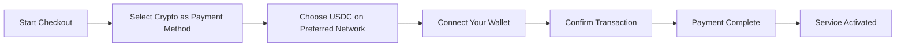
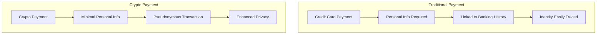
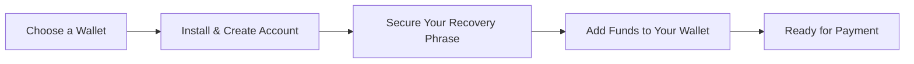

# Представляем криптовалютные платежи: улучшенная конфиденциальность вашей электронной почты {#introducing-crypto-payments-enhanced-privacy-for-your-email-service}

## Содержание {#table-of-contents}

* [Предисловие](#foreword)
* [Почему важны криптовалютные платежи](#why-crypto-payments-matter)
* [Как это работает](#how-it-works)
* [Преимущества конфиденциальности](#privacy-benefits)
* [Технические подробности](#technical-details)
* [Настройка вашего криптокошелька](#setting-up-your-crypto-wallet)
  * [МетаМаска](#metamask)
  * [Фантом](#phantom)
  * [Кошелек Coinbase](#coinbase-wallet)
  * [WalletConnect](#walletconnect)
* [Начиная](#getting-started)
* [С нетерпением жду](#looking-forward)

## Предисловие {#foreword}

В [Переслать письмо](https://forwardemail.net) мы постоянно ищем способы улучшить вашу [конфиденциальность](https://en.wikipedia.org/wiki/Privacy) безопасность, одновременно делая наш сервис более доступным. Сегодня мы рады сообщить, что теперь принимаем платежи [криптовалюта](https://en.wikipedia.org/wiki/Cryptocurrency) через интеграцию криптовалютных платежей [Stripe's](https://stripe.com).

## Почему важны криптовалютные платежи {#why-crypto-payments-matter}

[Конфиденциальность](https://en.wikipedia.org/wiki/Internet_privacy) всегда был основой нашего сервиса. Хотя мы и раньше предлагали различные способы оплаты, криптовалютные платежи обеспечивают дополнительный уровень конфиденциальности, что идеально соответствует нашей миссии. Оплачивая криптовалютой, вы можете:

* Сохраняйте большую анонимность при покупке наших почтовых услуг
* Сократите объем личной информации, привязанной к вашему почтовому аккаунту
* Разделяйте свои финансовые данные и данные электронной почты
* Поддерживайте растущую экосистему [децентрализованные финансы](https://en.wikipedia.org/wiki/Decentralized_finance)

## Как это работает {#how-it-works}

Мы интегрировали криптовалютную платёжную систему [Stripe's](https://docs.stripe.com/crypto), чтобы сделать процесс максимально удобным. Вот как можно оплатить услуги пересылки писем криптовалютой:

1. **Выберите криптовалюту в качестве способа оплаты**: при оформлении заказа вы увидите «криптовалюту» в качестве варианта оплаты наряду с традиционными способами, такими как кредитные карты.

2. **Выберите свою криптовалюту**: В настоящее время мы принимаем [USDC](https://en.wikipedia.org/wiki/USD_Coin) (USD Coin) на нескольких блокчейнах, включая [Эфириум](https://ethereum.org), [Солана](https://solana.com) и [Полигон](https://polygon.technology). USDC — стабильная криптовалюта, курс которой составляет 1:1 по отношению к доллару США.

3. **Подключите свой кошелёк**: Вы будете перенаправлены на защищенную страницу, где сможете подключить выбранный вами криптокошелёк. Мы поддерживаем несколько вариантов кошельков, включая:
* [МетаМаска](https://metamask.io)
* [Фантом](https://phantom.app)
* [Кошелек Coinbase](https://www.coinbase.com/wallet)
* [WalletConnect](https://walletconnect.com) (совместимо со многими другими кошельками)

4. **Завершите платеж**: Подтвердите транзакцию в своем кошельке, и все готово! Платеж будет обработан, и ваша услуга пересылки электронной почты будет активирована немедленно.

## Преимущества конфиденциальности {#privacy-benefits}

Использование криптовалюты для подписки на пересылку электронной почты повышает вашу конфиденциальность несколькими способами:

* **Сокращение объема персональных данных**: В отличие от платежей по кредитным картам, для криптовалютных транзакций не требуется ваше имя, платежный адрес или другие личные данные. Узнайте больше о [конфиденциальность транзакций](https://en.wikipedia.org/wiki/Privacy_coin).
* **Отделение от традиционного банкинга**: Ваш платеж не может быть связан с вашим банковским счетом или кредитной историей. Узнайте больше о [финансовая конфиденциальность](https://en.wikipedia.org/wiki/Financial_privacy).
* **Конфиденциальность блокчейна**: Хотя транзакции в блокчейне являются публичными, они анонимны и не связаны напрямую с вашей реальной личностью. См. [методы конфиденциальности блокчейна](https://en.wikipedia.org/wiki/Privacy_and_blockchain).
* **Соответствие нашим ценностям**: Как сервис электронной почты, ориентированный на конфиденциальность, мы стремимся предоставить вам контроль над вашей личной информацией на каждом этапе. Ознакомьтесь с нашим [политика конфиденциальности](/privacy).

## Технические подробности {#technical-details}

Для интересующихся техническими аспектами:

* Мы используем инфраструктуру криптовалютных платежей [Stripe's](https://docs.stripe.com/crypto/stablecoin-payments), которая обрабатывает всю сложность блокчейн-транзакций.
* Платежи осуществляются в [USDC](https://www.circle.com/en/usdc) на нескольких блокчейнах, включая [Эфириум](https://ethereum.org), [Солана](https://solana.com) и [Полигон](https://polygon.technology).
* Вы платите криптовалютой, а мы получаем эквивалент в долларах США, что позволяет нам поддерживать стабильные цены.

## Настройка вашего криптокошелька {#setting-up-your-crypto-wallet}

Вы новичок в криптовалюте? Вот как настроить кошельки, которые мы поддерживаем:

### MetaMask {#metamask}

[МетаМаска](https://metamask.io) — один из самых популярных кошельков Ethereum.

1. Перейдите по ссылке [Страница загрузки MetaMask](https://metamask.io/download/)
2. Установите расширение для браузера или мобильное приложение
3. Следуйте инструкциям по настройке, чтобы создать новый кошелёк
4. **Важно**: надёжно сохраните фразу восстановления
5. Добавьте ETH или USDC в свой кошелёк через обмен или прямую покупку
6. [Подробное руководство по настройке MetaMask](https://metamask.io/faqs/)

### Фантом {#phantom}

[Фантом](https://phantom.app) — ведущий кошелек Solana.

1. Перейдите по ссылке [Фантомный веб-сайт](https://phantom.app/)
2. Загрузите подходящую версию для вашего устройства
3. Создайте новый кошелёк, следуя инструкциям на экране
4. Создайте резервную копию вашей фразы восстановления
5. Добавьте SOL или USDC в свой кошелёк
6. [Руководство по использованию кошелька Phantom](https://help.phantom.app/hc/en-us/articles/4406388623251-How-to-create-a-new-wallet)

### Кошелек Coinbase {#coinbase-wallet}

[Кошелек Coinbase](https://www.coinbase.com/wallet) поддерживает несколько блокчейнов.

1. Скачайте [Кошелек Coinbase](https://www.coinbase.com/wallet/downloads)
2. Создайте новый кошелёк (отдельно от учётной записи биржи Coinbase)
3. Защитите свою фразу восстановления
4. Переведите или купите криптовалюту прямо в приложении
5. [Руководство по кошельку Coinbase](https://www.coinbase.com/learn/tips-and-tutorials/how-to-set-up-a-crypto-wallet)

### WalletConnect {#walletconnect}

[WalletConnect](https://walletconnect.com) — это протокол, который соединяет кошельки с веб-сайтами.

1. Сначала скачайте кошелек, совместимый с WalletConnect (доступно множество вариантов).
2. Во время оформления заказа выберите WalletConnect.
3. Отсканируйте QR-код с помощью приложения вашего кошелька.
4. Подтвердите подключение.
5. [Кошельки, совместимые с WalletConnect](https://walletconnect.com/registry/wallets)

## Начало работы {#getting-started}

Готовы повысить свою конфиденциальность с помощью криптовалютных платежей? Просто выберите опцию «Крипто» во время оформления заказа в следующий раз, когда вы продлите подписку или обновите свой тарифный план.

Дополнительную информацию о криптовалютах и технологии блокчейн можно найти на следующих ресурсах:

* [Что такое криптовалюта?](https://www.investopedia.com/terms/c/cryptocurrency.asp) - Investopedia
* [Объяснение блокчейна](https://www.investopedia.com/terms/b/blockchain.asp) - Investopedia
* [Руководство по цифровой конфиденциальности](https://www.eff.org/issues/privacy) - Electronic Frontier Foundation

## С нетерпением ждем {#looking-forward}

Добавление криптовалютных платежей — это ещё один шаг в нашем неизменном стремлении к [конфиденциальность](https://en.wikipedia.org/wiki/Privacy), [безопасность](https://en.wikipedia.org/wiki/Computer_security) и свободе выбора пользователей. Мы считаем, что ваш почтовый сервис должен уважать вашу конфиденциальность на всех уровнях — от отправляемых сообщений до способа оплаты услуг.

Как всегда, мы будем рады вашим отзывам об этом новом способе оплаты. Если у вас есть вопросы об использовании криптовалюты для пересылки писем, свяжитесь с нами по адресу [команда поддержки](/help).

---

**Ссылки:**

1. [Документация по криптографии Stripe](https://docs.stripe.com/crypto)
2. [Стейблкоин USDC](https://www.circle.com/en/usdc)
3. [Блокчейн Эфириума](https://ethereum.org)
4. [Солана Блокчейн](https://solana.com)
5. [Сеть полигонов](https://polygon.technology)
6. [Фонд электронных рубежей - Конфиденциальность](https://www.eff.org/issues/privacy)
7. [Политика конфиденциальности пересылки электронных писем](/privacy)