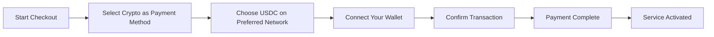
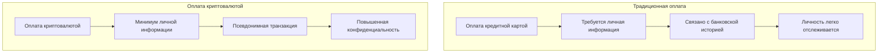
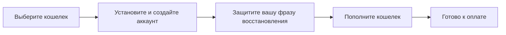

# Введение криптовалютных платежей: повышенная конфиденциальность для вашего почтового сервиса {#introducing-crypto-payments-enhanced-privacy-for-your-email-service}

## Содержание {#table-of-contents}

* [Предисловие](#foreword)
* [Почему криптовалютные платежи важны](#why-crypto-payments-matter)
* [Как это работает](#how-it-works)
* [Преимущества конфиденциальности](#privacy-benefits)
* [Технические детали](#technical-details)
* [Настройка вашего криптокошелька](#setting-up-your-crypto-wallet)
  * [MetaMask](#metamask)
  * [Phantom](#phantom)
  * [Coinbase Wallet](#coinbase-wallet)
  * [WalletConnect](#walletconnect)
* [Начало работы](#getting-started)
* [Взгляд в будущее](#looking-forward)

## Предисловие {#foreword}

В [Forward Email](https://forwardemail.net) мы постоянно ищем способы улучшить вашу [конфиденциальность](https://ru.wikipedia.org/wiki/Конфиденциальность) и безопасность, делая наш сервис более доступным. Сегодня мы рады объявить, что теперь принимаем платежи в [криптовалюте](https://ru.wikipedia.org/wiki/Криптовалюта) через интеграцию криптоплатежей от [Stripe](https://stripe.com).

## Почему криптовалютные платежи важны {#why-crypto-payments-matter}

[Конфиденциальность](https://ru.wikipedia.org/wiki/Конфиденциальность_в_интернете) всегда была в основе нашего сервиса. Хотя ранее мы предлагали различные способы оплаты, криптовалютные платежи обеспечивают дополнительный уровень конфиденциальности, который идеально соответствует нашей миссии. Оплачивая криптовалютой, вы можете:

* Сохранять большую анонимность при покупке наших почтовых услуг
* Сократить количество личной информации, связанной с вашим почтовым аккаунтом
* Разделить ваши финансовые и почтовые идентичности
* Поддержать растущую экосистему [децентрализованных финансов](https://ru.wikipedia.org/wiki/Децентрализованные_финансы)

## Как это работает {#how-it-works}

Мы интегрировали криптоплатежную систему [Stripe](https://docs.stripe.com/crypto), чтобы сделать процесс максимально простым. Вот как вы можете оплатить услуги Forward Email с помощью криптовалюты:

```mermaid
flowchart LR
    A[Start Checkout] --> B[Select Crypto as Payment Method]
    B --> C[Choose USDC on Preferred Network]
    C --> D[Connect Your Wallet]
    D --> E[Confirm Transaction]
    E --> F[Payment Complete]
    F --> G[Service Activated]
```

1. **Выберите криптовалюту как способ оплаты**: При оформлении заказа вы увидите опцию «Crypto» наряду с традиционными методами, такими как кредитные карты.

2. **Выберите криптовалюту**: В настоящее время мы принимаем [USDC](https://en.wikipedia.org/wiki/USD_Coin) (USD Coin) на нескольких блокчейнах, включая [Ethereum](https://ethereum.org), [Solana](https://solana.com) и [Polygon](https://polygon.technology). USDC — это стабильная криптовалюта, которая поддерживает соотношение 1:1 с долларом США.

3. **Подключите ваш кошелек**: Вы будете перенаправлены на защищённую страницу, где сможете подключить предпочитаемый криптокошелек. Мы поддерживаем несколько вариантов кошельков, включая:
   * [MetaMask](https://metamask.io)
   * [Phantom](https://phantom.app)
   * [Coinbase Wallet](https://www.coinbase.com/wallet)
   * [WalletConnect](https://walletconnect.com) (совместим с множеством других кошельков)

4. **Завершите оплату**: Подтвердите транзакцию в вашем кошельке, и всё готово! Платёж будет обработан, а ваш сервис Forward Email активирован немедленно.

## Преимущества конфиденциальности {#privacy-benefits}

Использование криптовалюты для подписки на Forward Email повышает вашу конфиденциальность несколькими способами:

```mermaid
graph TD
    subgraph "Традиционная оплата"
    A[Оплата кредитной картой] --> B[Требуется личная информация]
    B --> C[Связано с банковской историей]
    C --> D[Личность легко отслеживается]
    end

    subgraph "Оплата криптовалютой"
    E[Оплата криптовалютой] --> F[Минимум личной информации]
    F --> G[Псевдонимная транзакция]
    G --> H[Повышенная конфиденциальность]
    end
```

* **Меньше личной информации**: В отличие от оплаты кредитной картой, криптотранзакции не требуют вашего имени, адреса для выставления счета или других личных данных. Подробнее о [конфиденциальности транзакций](https://en.wikipedia.org/wiki/Privacy_coin).
* **Отделение от традиционного банковского сектора**: Ваш платеж не может быть связан с вашим банковским счетом или кредитной историей. Узнайте о [финансовой конфиденциальности](https://en.wikipedia.org/wiki/Financial_privacy).
* **Конфиденциальность блокчейна**: Хотя транзакции в блокчейне публичны, они псевдонимны и не связаны напрямую с вашей реальной личностью. Смотрите [техники конфиденциальности в блокчейне](https://en.wikipedia.org/wiki/Privacy_and_blockchain).
* **Соответствие нашим ценностям**: Как сервис, ориентированный на конфиденциальность, мы верим в предоставление вам контроля над вашей личной информацией на каждом этапе. Ознакомьтесь с нашей [политикой конфиденциальности](/privacy).
## Технические детали {#technical-details}

Для тех, кто интересуется техническими аспектами:

* Мы используем криптовалютную платежную инфраструктуру [Stripe](https://docs.stripe.com/crypto/stablecoin-payments), которая обрабатывает всю сложность блокчейн-транзакций.
* Платежи осуществляются в [USDC](https://www.circle.com/en/usdc) на нескольких блокчейнах, включая [Ethereum](https://ethereum.org), [Solana](https://solana.com) и [Polygon](https://polygon.technology).
* Хотя вы платите в криптовалюте, мы получаем эквивалентную сумму в долларах США, что позволяет нам поддерживать стабильные цены.

## Настройка вашего криптокошелька {#setting-up-your-crypto-wallet}

Новичок в криптовалюте? Вот как настроить поддерживаемые нами кошельки:

```mermaid
flowchart LR
    A[Выберите кошелек] --> B[Установите и создайте аккаунт]
    B --> C[Защитите вашу фразу восстановления]
    C --> D[Пополните кошелек]
    D --> E[Готово к оплате]
```

### MetaMask {#metamask}

[MetaMask](https://metamask.io) — один из самых популярных кошельков Ethereum.

1. Посетите [страницу загрузки MetaMask](https://metamask.io/download/)
2. Установите расширение для браузера или мобильное приложение
3. Следуйте инструкциям по созданию нового кошелька
4. **Важно**: надежно сохраните вашу фразу восстановления
5. Добавьте ETH или USDC в кошелек через обменник или прямую покупку
6. [Подробное руководство по настройке MetaMask](https://metamask.io/faqs/)

### Phantom {#phantom}

[Phantom](https://phantom.app) — ведущий кошелек Solana.

1. Посетите [сайт Phantom](https://phantom.app/)
2. Скачайте подходящую версию для вашего устройства
3. Создайте новый кошелек, следуя инструкциям на экране
4. Надежно сохраните вашу фразу восстановления
5. Добавьте SOL или USDC в кошелек
6. [Руководство по кошельку Phantom](https://help.phantom.app/hc/en-us/articles/4406388623251-How-to-create-a-new-wallet)

### Coinbase Wallet {#coinbase-wallet}

[Coinbase Wallet](https://www.coinbase.com/wallet) поддерживает несколько блокчейнов.

1. Скачайте [Coinbase Wallet](https://www.coinbase.com/wallet/downloads)
2. Создайте новый кошелек (отдельно от аккаунта на бирже Coinbase)
3. Защитите вашу фразу восстановления
4. Переводите или покупайте криптовалюту прямо в приложении
5. [Руководство по Coinbase Wallet](https://www.coinbase.com/learn/tips-and-tutorials/how-to-set-up-a-crypto-wallet)

### WalletConnect {#walletconnect}

[WalletConnect](https://walletconnect.com) — протокол, который соединяет кошельки с веб-сайтами.

1. Сначала скачайте кошелек, совместимый с WalletConnect (доступно много вариантов)
2. При оформлении заказа выберите WalletConnect
3. Отсканируйте QR-код с помощью приложения кошелька
4. Подтвердите подключение
5. [Кошельки, совместимые с WalletConnect](https://walletconnect.com/registry/wallets)

## Начало работы {#getting-started}

Готовы повысить свою конфиденциальность с помощью криптовалютных платежей? Просто выберите опцию «Крипто» при оформлении заказа в следующий раз, когда будете продлевать подписку или улучшать тариф.

Для получения дополнительной информации о криптовалютах и технологии блокчейн ознакомьтесь с этими ресурсами:

* [Что такое криптовалюта?](https://www.investopedia.com/terms/c/cryptocurrency.asp) — Investopedia
* [Объяснение блокчейна](https://www.investopedia.com/terms/b/blockchain.asp) — Investopedia
* [Руководство по цифровой конфиденциальности](https://www.eff.org/issues/privacy) — Electronic Frontier Foundation

## Взгляд в будущее {#looking-forward}

Добавление криптовалютных платежей — это еще один шаг в нашей постоянной приверженности [конфиденциальности](https://ru.wikipedia.org/wiki/Конфиденциальность), [безопасности](https://ru.wikipedia.org/wiki/Компьютерная_безопасность) и выбору пользователя. Мы считаем, что ваш почтовый сервис должен уважать вашу конфиденциальность на всех уровнях — от отправляемых сообщений до способов оплаты сервиса.

Как всегда, мы приветствуем ваши отзывы о новой опции оплаты. Если у вас есть вопросы по использованию криптовалют с Forward Email, пожалуйста, свяжитесь с нашей [службой поддержки](/help).

---

**Ссылки:**

1. [Документация Stripe Crypto](https://docs.stripe.com/crypto)
2. [USDC Stablecoin](https://www.circle.com/en/usdc)
3. [Блокчейн Ethereum](https://ethereum.org)
4. [Блокчейн Solana](https://solana.com)
5. [Сеть Polygon](https://polygon.technology)
6. [Electronic Frontier Foundation — Конфиденциальность](https://www.eff.org/issues/privacy)
7. [Политика конфиденциальности Forward Email](/privacy)
