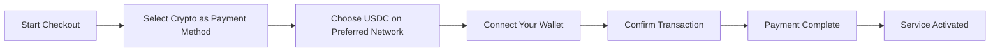
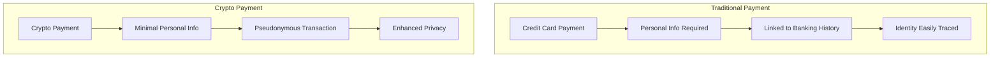
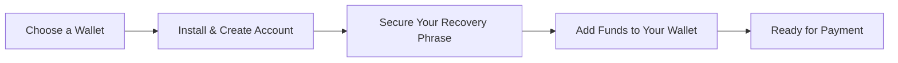

# Introduktion av kryptobetalningar: Förbättrad integritet för din e-posttjänst {#introducing-crypto-payments-enhanced-privacy-for-your-email-service}

## Innehållsförteckning {#table-of-contents}

* [Förord](#foreword)
* [Varför kryptobetalningar är viktiga](#why-crypto-payments-matter)
* [Hur det fungerar](#how-it-works)
* [Fördelar med integritet](#privacy-benefits)
* [Tekniska detaljer](#technical-details)
* [Konfigurera din krypto-plånbok](#setting-up-your-crypto-wallet)
  * [MetaMask](#metamask)
  * [Fantom](#phantom)
  * [Coinbase-plånbok](#coinbase-wallet)
  * [WalletConnect](#walletconnect)
* [Komma igång](#getting-started)
* [Ser framåt](#looking-forward)

## Förord {#foreword}

På [Vidarebefordra e-post](https://forwardemail.net) letar vi ständigt efter sätt att förbättra din [privatliv](https://en.wikipedia.org/wiki/Privacy)-säkerhet och samtidigt göra vår tjänst mer tillgänglig. Idag är vi glada att kunna meddela att vi nu accepterar [kryptovaluta](https://en.wikipedia.org/wiki/Cryptocurrency)-betalningar via [Stripes](https://stripe.com)-kryptobetalningsintegrationen.

## Varför kryptobetalningar är viktiga {#why-crypto-payments-matter}

[Privatliv](https://en.wikipedia.org/wiki/Internet_privacy) har alltid varit kärnan i vår tjänst. Även om vi tidigare har erbjudit olika betalningsmetoder, ger kryptovalutabetalningar ett extra lager av integritet som passar perfekt i linje med vårt uppdrag. Genom att betala med krypto kan du:

* Bibehåll större anonymitet när du köper våra e-posttjänster
* Minska den personliga information som är kopplad till ditt e-postkonto
* Håll dina ekonomiska och e-postidentiteter separerade
* Stöd det växande [decentraliserad finansiering](https://en.wikipedia.org/wiki/Decentralized_finance)-ekosystemet

## Så fungerar det {#how-it-works}

Vi har integrerat kryptobetalningssystemet [Stripes](https://docs.stripe.com/crypto) för att göra processen så smidig som möjligt. Så här kan du betala för vidarebefordran av e-post med kryptovaluta:

1. **Välj krypto som betalningsmetod**: När du betalar ser du "Krypto" som ett betalningsalternativ tillsammans med traditionella metoder som kreditkort.

2. **Välj din kryptovaluta**: För närvarande accepterar vi [USDC](https://en.wikipedia.org/wiki/USD_Coin) (USD-mynt) på flera blockkedjor, inklusive [Ethereum](https://ethereum.org), [Solana](https://solana.com) och [Polygon](https://polygon.technology). USDC är en stabil kryptovaluta som bibehåller ett värde på 1:1 i förhållande till den amerikanska dollarn.

3. **Anslut din plånbok**: Du kommer att omdirigeras till en säker sida där du kan ansluta din föredragna kryptoplånbok. Vi stöder flera plånboksalternativ, inklusive:
* [MetaMask](https://metamask.io)
* [Fantom](https://phantom.app)
* [Coinbase-plånbok](https://www.coinbase.com/wallet)
* [WalletConnect](https://walletconnect.com) (kompatibel med många andra plånböcker)

4. **Slutför din betalning**: Bekräfta transaktionen i din plånbok, så är du klar! Betalningen kommer att behandlas och din vidarebefordran av e-post aktiveras omedelbart.

## Sekretessfördelar {#privacy-benefits}

Att använda kryptovaluta för din prenumeration på vidarebefordran av e-post förbättrar din integritet på flera sätt:

* **Minskad personlig information**: Till skillnad från kreditkortsbetalningar kräver inte kryptotransaktioner ditt namn, faktureringsadress eller andra personliga uppgifter. Läs mer om [transaktionssekretess](https://en.wikipedia.org/wiki/Privacy_coin).
* **Separation från traditionell bankverksamhet**: Din betalning kan inte kopplas till ditt bankkonto eller din kredithistorik. Läs om [ekonomisk integritet](https://en.wikipedia.org/wiki/Financial_privacy).
* **Blockchain-sekretess**: Även om blockchain-transaktioner är offentliga är de pseudonyma och inte direkt kopplade till din verkliga identitet. Se [blockkedjeintegritetstekniker](https://en.wikipedia.org/wiki/Privacy_and_blockchain).
* **I överensstämmelse med våra värderingar**: Som en integritetsfokuserad e-posttjänst tror vi på att ge dig kontroll över din personliga information i varje steg. Kolla in vår [integritetspolicy](/privacy).

## Tekniska detaljer {#technical-details}

För er som är intresserade av de tekniska aspekterna:

* Vi använder kryptobetalningsinfrastrukturen [Stripes](https://docs.stripe.com/crypto/stablecoin-payments), som hanterar all komplexitet i blockkedjetransaktioner.
* Betalningar görs i [USDC](https://www.circle.com/en/usdc) på flera blockkedjor, inklusive [Ethereum](https://ethereum.org), [Solana](https://solana.com) och [Polygon](https://polygon.technology).
* Medan du betalar i kryptovaluta får vi motsvarande värde i USD, vilket gör att vi kan upprätthålla stabila priser.

## Konfigurera din kryptoplånbok {#setting-up-your-crypto-wallet}

Nybörjare på kryptovalutor? Så här konfigurerar du plånböckerna vi stöder:

### MetaMask {#metamask}

[MetaMask](https://metamask.io) är en av de mest populära Ethereum-plånböckerna.

1. Besök [MetaMask nedladdningssida](https://metamask.io/download/)
2. Installera webbläsartillägget eller mobilappen
3. Följ installationsanvisningarna för att skapa en ny plånbok
4. **Viktigt**: Lagra din återställningsfras säkert
5. Lägg till ETH eller USDC i din plånbok genom en växling eller direktköp
6. [Detaljerad installationsguide för MetaMask](https://metamask.io/faqs/)

### Fantom {#phantom}

[Fantom](https://phantom.app) är en ledande Solana-plånbok.

1. Besök [Phantom-webbplats](https://phantom.app/)
2. Ladda ner rätt version för din enhet
3. Skapa en ny plånbok genom att följa instruktionerna på skärmen
4. Säkerhetskopiera din återställningsfras på ett säkert sätt
5. Lägg till SOL eller USDC i din plånbok
6. [Guide till Phantom-plånboken](https://help.phantom.app/hc/en-us/articles/4406388623251-How-to-create-a-new-wallet)

### Coinbase-plånbok {#coinbase-wallet}

[Coinbase-plånbok](https://www.coinbase.com/wallet) stöder flera blockkedjor.

1. Ladda ner [Coinbase-plånbok](https://www.coinbase.com/wallet/downloads)
2. Skapa en ny plånbok (separat från Coinbase-börskontot)
3. Säkra din återställningsfras
4. Överför eller köp kryptovaluta direkt i appen
5. [Coinbase plånboksguide](https://www.coinbase.com/learn/tips-and-tutorials/how-to-set-up-a-crypto-wallet)

### WalletConnect {#walletconnect}

[WalletConnect](https://walletconnect.com) är ett protokoll som kopplar plånböcker till webbplatser.

1. Ladda först ner en WalletConnect-kompatibel plånbok (många alternativ finns tillgängliga)
2. Välj WalletConnect i kassan
3. Skanna QR-koden med din plånboksapp
4. Godkänn anslutningen
5. [WalletConnect-kompatibla plånböcker](https://walletconnect.com/registry/wallets)

## Komma igång {#getting-started}

Redo att förbättra din integritet med kryptobetalningar? Välj helt enkelt alternativet "Krypto" i kassan nästa gång du förnyar din prenumeration eller uppgraderar din plan.

För mer information om kryptovalutor och blockkedjeteknik, kolla in dessa resurser:

* [Vad är kryptovaluta?](https://www.investopedia.com/terms/c/cryptocurrency.asp) - Investopedia
* [Blockkedjan förklaras](https://www.investopedia.com/terms/b/blockchain.asp) - Investopedia
* [Guide för digital integritet](https://www.eff.org/issues/privacy) - Electronic Frontier Foundation

## Ser fram emot {#looking-forward}

Att lägga till kryptovalutabetalningar är bara ytterligare ett steg i vårt fortsatta engagemang för [privatliv](https://en.wikipedia.org/wiki/Privacy), [säkerhet](https://en.wikipedia.org/wiki/Computer_security) och användarnas val. Vi anser att din e-posttjänst bör respektera din integritet på alla nivåer – från de meddelanden du skickar till hur du betalar för tjänsten.

Som alltid välkomnar vi din feedback om detta nya betalningsalternativ. Om du har frågor om hur du använder kryptovaluta med vidarebefordran av e-post, vänligen kontakta vår [supportteam](/help).

---

**Referenser:**

1. [Stripe Crypto-dokumentation](https://docs.stripe.com/crypto)
2. [USDC Stablecoin](https://www.circle.com/en/usdc)
3. [Ethereum Blockchain](https://ethereum.org)
4. [Solana Blockchain](https://solana.com)
5. [Polygonnätverk](https://polygon.technology)
6. [Electronic Frontier Foundation - Sekretesspolicy](https://www.eff.org/issues/privacy)
7. [Sekretesspolicy för vidarebefordran av e-post](/privacy)