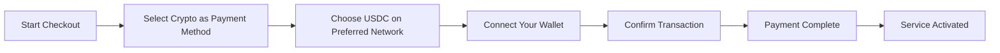
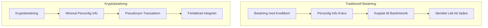
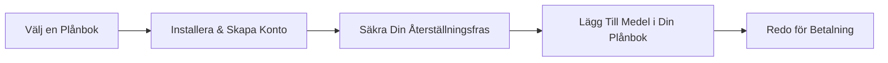

# Introduktion av Crypto Payments: Förbättrad Integritet för Din E-posttjänst {#introducing-crypto-payments-enhanced-privacy-for-your-email-service}

## Innehållsförteckning {#table-of-contents}

* [Förord](#foreword)
* [Varför Crypto Payments är Viktigt](#why-crypto-payments-matter)
* [Hur Det Fungerar](#how-it-works)
* [Integritetsfördelar](#privacy-benefits)
* [Tekniska Detaljer](#technical-details)
* [Ställa In Din Crypto Wallet](#setting-up-your-crypto-wallet)
  * [MetaMask](#metamask)
  * [Phantom](#phantom)
  * [Coinbase Wallet](#coinbase-wallet)
  * [WalletConnect](#walletconnect)
* [Komma Igång](#getting-started)
* [Framtidsutsikter](#looking-forward)

## Förord {#foreword}

På [Forward Email](https://forwardemail.net) letar vi ständigt efter sätt att förbättra din [integritet](https://en.wikipedia.org/wiki/Privacy) och säkerhet samtidigt som vi gör vår tjänst mer tillgänglig. Idag är vi glada att kunna meddela att vi nu accepterar [kryptovalutabetalningar](https://en.wikipedia.org/wiki/Cryptocurrency) via [Stripes](https://stripe.com) integration för kryptobetalningar.

## Varför Crypto Payments är Viktigt {#why-crypto-payments-matter}

[Integritet](https://en.wikipedia.org/wiki/Internet_privacy) har alltid varit kärnan i vår tjänst. Medan vi tidigare erbjudit olika betalningsmetoder, ger kryptovalutabetalningar ett extra lager av integritet som passar perfekt med vårt uppdrag. Genom att betala med krypto kan du:

* Behålla större anonymitet när du köper våra e-posttjänster
* Minska den personliga informationen kopplad till ditt e-postkonto
* Hålla dina finansiella och e-postidentiteter separata
* Stödja det växande [decentraliserade finans](https://en.wikipedia.org/wiki/Decentralized_finance)-ekosystemet

## Hur Det Fungerar {#how-it-works}

Vi har integrerat [Stripes](https://docs.stripe.com/crypto) kryptobetalningssystem för att göra processen så smidig som möjligt. Så här kan du betala för Forward Email-tjänster med kryptovaluta:

```mermaid
flowchart LR
    A[Start Checkout] --> B[Select Crypto as Payment Method]
    B --> C[Choose USDC on Preferred Network]
    C --> D[Connect Your Wallet]
    D --> E[Confirm Transaction]
    E --> F[Payment Complete]
    F --> G[Service Activated]
```

1. **Välj Krypto som Betalningsmetod**: När du checkar ut kommer du att se "Crypto" som ett betalningsalternativ bredvid traditionella metoder som kreditkort.

2. **Välj Din Kryptovaluta**: För närvarande accepterar vi [USDC](https://en.wikipedia.org/wiki/USD_Coin) (USD Coin) på flera blockkedjor inklusive [Ethereum](https://ethereum.org), [Solana](https://solana.com) och [Polygon](https://polygon.technology). USDC är en stabil kryptovaluta som behåller ett värde på 1:1 med den amerikanska dollarn.

3. **Anslut Din Wallet**: Du kommer att omdirigeras till en säker sida där du kan ansluta din föredragna kryptoplånbok. Vi stödjer flera wallet-alternativ inklusive:
   * [MetaMask](https://metamask.io)
   * [Phantom](https://phantom.app)
   * [Coinbase Wallet](https://www.coinbase.com/wallet)
   * [WalletConnect](https://walletconnect.com) (kompatibel med många andra wallets)

4. **Slutför Din Betalning**: Bekräfta transaktionen i din wallet, och du är klar! Betalningen kommer att behandlas och din Forward Email-tjänst aktiveras omedelbart.

## Integritetsfördelar {#privacy-benefits}

Att använda kryptovaluta för din Forward Email-prenumeration förbättrar din integritet på flera sätt:

```mermaid
graph TD
    subgraph "Traditionell Betalning"
    A[Betalning med Kreditkort] --> B[Personlig Info Krävs]
    B --> C[Kopplat till Bankhistorik]
    C --> D[Identitet Lätt Att Spåra]
    end

    subgraph "Kryptobetalning"
    E[Kryptobetalning] --> F[Minimal Personlig Info]
    F --> G[Pseudonym Transaktion]
    G --> H[Förbättrad Integritet]
    end
```

* **Minskad Personlig Information**: Till skillnad från kreditkortsbetalningar kräver kryptotransaktioner inte ditt namn, faktureringsadress eller andra personuppgifter. Läs mer om [transaktionsintegritet](https://en.wikipedia.org/wiki/Privacy_coin).
* **Separation från Traditionell Bankverksamhet**: Din betalning kan inte kopplas till ditt bankkonto eller kredit historia. Läs om [finansiell integritet](https://en.wikipedia.org/wiki/Financial_privacy).
* **Blockkedjeintegritet**: Även om blockkedjetransaktioner är offentliga är de pseudonyma och inte direkt kopplade till din verkliga identitet. Se [blockkedjeintegritetstekniker](https://en.wikipedia.org/wiki/Privacy_and_blockchain).
* **I Linje med Våra Värderingar**: Som en integritetsfokuserad e-posttjänst tror vi på att ge dig kontroll över din personliga information i varje steg. Kolla in vår [integritetspolicy](/privacy).
## Tekniska Detaljer {#technical-details}

För de som är intresserade av de tekniska aspekterna:

* Vi använder [Stripes](https://docs.stripe.com/crypto/stablecoin-payments) kryptobetalningsinfrastruktur, som hanterar all komplexitet kring blockkedjetransaktioner.
* Betalningar görs i [USDC](https://www.circle.com/en/usdc) på flera blockkedjor inklusive [Ethereum](https://ethereum.org), [Solana](https://solana.com) och [Polygon](https://polygon.technology).
* Även om du betalar med kryptovaluta, tar vi emot motsvarande värde i USD, vilket gör att vi kan behålla stabila priser.

## Ställa In Din Kryptoplånbok {#setting-up-your-crypto-wallet}

Ny inom kryptovalutor? Så här ställer du in de plånböcker vi stödjer:

```mermaid
flowchart LR
    A[Välj en Plånbok] --> B[Installera & Skapa Konto]
    B --> C[Säkra Din Återställningsfras]
    C --> D[Lägg Till Medel i Din Plånbok]
    D --> E[Redo för Betalning]
```

### MetaMask {#metamask}

[MetaMask](https://metamask.io) är en av de mest populära Ethereum-plånböckerna.

1. Besök [MetaMask nedladdningssida](https://metamask.io/download/)
2. Installera webbläsartillägget eller mobilappen
3. Följ installationsinstruktionerna för att skapa en ny plånbok
4. **Viktigt**: Säkra din återställningsfras på ett säkert sätt
5. Lägg till ETH eller USDC i din plånbok via en börs eller direktköp
6. [Detaljerad MetaMask installationsguide](https://metamask.io/faqs/)

### Phantom {#phantom}

[Phantom](https://phantom.app) är en ledande Solana-plånbok.

1. Besök [Phantom webbplats](https://phantom.app/)
2. Ladda ner rätt version för din enhet
3. Skapa en ny plånbok enligt instruktionerna på skärmen
4. Säkerhetskopiera din återställningsfras på ett säkert sätt
5. Lägg till SOL eller USDC i din plånbok
6. [Phantom Plånboksguide](https://help.phantom.app/hc/en-us/articles/4406388623251-How-to-create-a-new-wallet)

### Coinbase Wallet {#coinbase-wallet}

[Coinbase Wallet](https://www.coinbase.com/wallet) stödjer flera blockkedjor.

1. Ladda ner [Coinbase Wallet](https://www.coinbase.com/wallet/downloads)
2. Skapa en ny plånbok (separat från Coinbase-börskonto)
3. Säkra din återställningsfras
4. Överför eller köp kryptovaluta direkt i appen
5. [Coinbase Wallet Guide](https://www.coinbase.com/learn/tips-and-tutorials/how-to-set-up-a-crypto-wallet)

### WalletConnect {#walletconnect}

[WalletConnect](https://walletconnect.com) är ett protokoll som kopplar plånböcker till webbplatser.

1. Ladda först ner en WalletConnect-kompatibel plånbok (många alternativ finns)
2. Välj WalletConnect vid utcheckning
3. Skanna QR-koden med din plånboksapp
4. Godkänn anslutningen
5. [WalletConnect Kompatibla Plånböcker](https://walletconnect.com/registry/wallets)

## Komma Igång {#getting-started}

Redo att förbättra din integritet med kryptobetalningar? Välj helt enkelt alternativet "Krypto" vid utcheckningen nästa gång du förnyar din prenumeration eller uppgraderar din plan.

För mer information om kryptovalutor och blockkedjeteknik, kolla in dessa resurser:

* [Vad är Kryptovaluta?](https://www.investopedia.com/terms/c/cryptocurrency.asp) - Investopedia
* [Blockkedjan Förklarad](https://www.investopedia.com/terms/b/blockchain.asp) - Investopedia
* [Guide till Digital Integritet](https://www.eff.org/issues/privacy) - Electronic Frontier Foundation

## Framåtblickande {#looking-forward}

Att lägga till kryptobetalningar är bara ett steg till i vårt pågående engagemang för [integritet](https://en.wikipedia.org/wiki/Privacy), [säkerhet](https://en.wikipedia.org/wiki/Computer_security) och användarval. Vi tror att din e-posttjänst ska respektera din integritet på alla nivåer – från de meddelanden du skickar till hur du betalar för tjänsten.

Som alltid välkomnar vi din feedback om detta nya betalningsalternativ. Om du har frågor om att använda kryptovaluta med Forward Email, vänligen kontakta vårt [supportteam](/help).

---

**Referenser:**

1. [Stripe Crypto Dokumentation](https://docs.stripe.com/crypto)
2. [USDC Stablecoin](https://www.circle.com/en/usdc)
3. [Ethereum Blockkedja](https://ethereum.org)
4. [Solana Blockkedja](https://solana.com)
5. [Polygon Nätverk](https://polygon.technology)
6. [Electronic Frontier Foundation - Integritet](https://www.eff.org/issues/privacy)
7. [Forward Email Integritetspolicy](/privacy)
