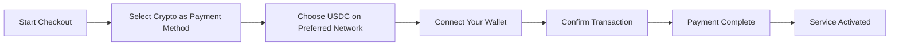
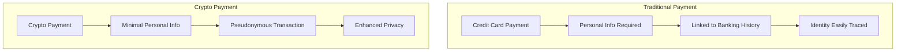
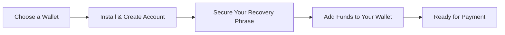

# แนะนำการชำระเงินด้วย Crypto: ความเป็นส่วนตัวที่ได้รับการปรับปรุงสำหรับบริการอีเมลของคุณ {#introducing-crypto-payments-enhanced-privacy-for-your-email-service}

## สารบัญ {#table-of-contents}

* [คำนำ](#foreword)
* [เหตุใดการชำระเงินด้วย Crypto จึงมีความสำคัญ](#why-crypto-payments-matter)
* [วิธีการทำงาน](#how-it-works)
* [ประโยชน์ด้านความเป็นส่วนตัว](#privacy-benefits)
* [รายละเอียดทางเทคนิค](#technical-details)
* [การตั้งค่ากระเป๋าเงิน Crypto ของคุณ](#setting-up-your-crypto-wallet)
  * [เมตามาสก์](#metamask)
  * [ผีหลอก](#phantom)
  * [กระเป๋าเงิน Coinbase](#coinbase-wallet)
  * [วอลเล็ตคอนเนค](#walletconnect)
* [การเริ่มต้น](#getting-started)
* [มองไปข้างหน้า](#looking-forward)

## คำนำ {#foreword}

ที่ [ส่งต่ออีเมล์](https://forwardemail.net) เรามุ่งมั่นค้นหาวิธีปรับปรุง [ความเป็นส่วนตัว](https://en.wikipedia.org/wiki/Privacy) และความปลอดภัยของคุณอย่างต่อเนื่อง พร้อมกับทำให้บริการของเราเข้าถึงได้ง่ายขึ้น วันนี้ เรามีความยินดีที่จะประกาศว่าขณะนี้เรารับชำระเงินผ่าน [สกุลเงินดิจิทัล](https://en.wikipedia.org/wiki/Cryptocurrency) ผ่านการผสานรวมการชำระเงินด้วยคริปโต [สไตรป์](https://stripe.com) แล้ว

## เหตุใดการชำระเงินด้วย Crypto จึงมีความสำคัญ {#why-crypto-payments-matter}

[ความเป็นส่วนตัว](https://en.wikipedia.org/wiki/Internet_privacy) คือหัวใจสำคัญของบริการของเราเสมอมา แม้ว่าที่ผ่านมาเราจะมีวิธีการชำระเงินที่หลากหลาย แต่การชำระเงินด้วยสกุลเงินดิจิทัลก็มอบความเป็นส่วนตัวอีกระดับที่สอดคล้องกับพันธกิจของเราอย่างสมบูรณ์แบบ การชำระเงินด้วยสกุลเงินดิจิทัลช่วยให้คุณสามารถ:

* รักษาความเป็นส่วนตัวให้มากขึ้นเมื่อซื้อบริการอีเมลของเรา
* ลดข้อมูลส่วนบุคคลที่ผูกกับบัญชีอีเมลของคุณ
* แยกข้อมูลทางการเงินและอีเมลออกจากกัน
* สนับสนุนระบบนิเวศ [การเงินแบบกระจายอำนาจ](https://en.wikipedia.org/wiki/Decentralized_finance) ที่กำลังเติบโต

## วิธีการทำงาน {#how-it-works}

เราได้ผสานรวมระบบการชำระเงินด้วยคริปโต [สไตรป์](https://docs.stripe.com/crypto) ไว้เพื่อให้กระบวนการราบรื่นที่สุด นี่คือวิธีการชำระเงินสำหรับบริการส่งต่ออีเมลโดยใช้คริปโตเคอร์เรนซี:

1. **เลือก Crypto เป็นวิธีการชำระเงินของคุณ**: เมื่อชำระเงิน คุณจะเห็น "Crypto" เป็นตัวเลือกการชำระเงินควบคู่ไปกับวิธีการชำระเงินแบบดั้งเดิม เช่น บัตรเครดิต

2. **เลือกสกุลเงินดิจิทัลของคุณ**: ปัจจุบัน เรายอมรับ [USDC](https://en.wikipedia.org/wiki/USD_Coin) (USD Coin) บนบล็อกเชนหลายตัว รวมถึง [อีเธอเรียม](https://ethereum.org), [โซลานา](https://solana.com) และ [รูปหลายเหลี่ยม](https://polygon.technology) USDC เป็นสกุลเงินดิจิทัลที่มีเสถียรภาพซึ่งรักษามูลค่า 1:1 เมื่อเทียบกับดอลลาร์สหรัฐ

3. **เชื่อมต่อกระเป๋าเงินของคุณ**: คุณจะถูกนำไปยังหน้าที่ปลอดภัยซึ่งคุณสามารถเชื่อมต่อกระเป๋าเงินคริปโตที่คุณต้องการได้ เรารองรับกระเป๋าเงินหลายแบบ ได้แก่:
* [เมตามาสก์](https://metamask.io)
* [ผีหลอก](https://phantom.app)
* [กระเป๋าเงิน Coinbase](https://www.coinbase.com/wallet)
* [วอลเล็ตคอนเนค](https://walletconnect.com) (ใช้งานได้กับกระเป๋าเงินอื่นๆ อีกมากมาย)

4. **ชำระเงินให้เสร็จสมบูรณ์**: ยืนยันธุรกรรมในกระเป๋าเงินของคุณ เท่านี้ก็เรียบร้อย! การชำระเงินจะได้รับการดำเนินการ และบริการส่งต่ออีเมลของคุณจะเปิดใช้งานทันที

## สิทธิประโยชน์ด้านความเป็นส่วนตัวของ {#privacy-benefits}

การใช้สกุลเงินดิจิทัลสำหรับการสมัครรับอีเมลส่งต่อจะช่วยเพิ่มความเป็นส่วนตัวของคุณได้หลายวิธี:

* **ข้อมูลส่วนบุคคลที่ลดลง**: ต่างจากการชำระเงินด้วยบัตรเครดิต ธุรกรรมคริปโตไม่จำเป็นต้องใช้ชื่อ ที่อยู่สำหรับการเรียกเก็บเงิน หรือรายละเอียดส่วนตัวอื่นๆ ของคุณ เรียนรู้เพิ่มเติมเกี่ยวกับ [ความเป็นส่วนตัวของการทำธุรกรรม](https://en.wikipedia.org/wiki/Privacy_coin)
* **การแยกจากธนาคารแบบดั้งเดิม**: การชำระเงินของคุณไม่สามารถเชื่อมโยงกับบัญชีธนาคารหรือประวัติเครดิตของคุณได้ อ่านเกี่ยวกับ [ความเป็นส่วนตัวทางการเงิน](https://en.wikipedia.org/wiki/Financial_privacy)
* **ความเป็นส่วนตัวของบล็อกเชน**: แม้ว่าธุรกรรมบล็อกเชนจะเป็นแบบสาธารณะ แต่จะเป็นแบบไม่ระบุตัวตนและไม่เชื่อมโยงโดยตรงกับตัวตนในโลกแห่งความเป็นจริงของคุณ ดู [เทคนิคความเป็นส่วนตัวของบล็อคเชน](https://en.wikipedia.org/wiki/Privacy_and_blockchain)
* **สอดคล้องกับค่านิยมของเรา**: ในฐานะบริการอีเมลที่มุ่งเน้นความเป็นส่วนตัว เราเชื่อมั่นในการให้คุณควบคุมข้อมูลส่วนบุคคลของคุณได้ในทุกขั้นตอน ดู [นโยบายความเป็นส่วนตัว](/privacy) ของเรา

## รายละเอียดทางเทคนิคของ {#technical-details}

สำหรับผู้ที่สนใจด้านเทคนิค:

* เราใช้โครงสร้างพื้นฐานการชำระเงินคริปโต [สไตรป์](https://docs.stripe.com/crypto/stablecoin-payments) ซึ่งรองรับธุรกรรมบล็อกเชนที่ซับซ้อนทั้งหมด
* การชำระเงินจะดำเนินการใน [USDC](https://www.circle.com/en/usdc) บนบล็อกเชนหลายบล็อก ได้แก่ [อีเธอเรียม](https://ethereum.org), [โซลานา](https://solana.com) และ [รูปหลายเหลี่ยม](https://polygon.technology)
* แม้ว่าคุณจะชำระเงินด้วยคริปโตเคอร์เรนซี เราจะได้รับมูลค่าเทียบเท่าเป็นดอลลาร์สหรัฐฯ ซึ่งทำให้เราสามารถรักษาราคาให้คงที่ได้

## การตั้งค่ากระเป๋าเงิน Crypto ของคุณ {#setting-up-your-crypto-wallet}

มือใหม่กับสกุลเงินดิจิทัลใช่ไหม? นี่คือวิธีตั้งค่ากระเป๋าเงินที่เรารองรับ:

### เมตามาสก์ {#metamask}

[เมตามาสก์](https://metamask.io) เป็นหนึ่งในกระเป๋าเงิน Ethereum ที่ได้รับความนิยมมากที่สุด

1. ไปที่ [หน้าดาวน์โหลด MetaMask](https://metamask.io/download/)
2. ติดตั้งส่วนขยายเบราว์เซอร์หรือแอปพลิเคชันมือถือ
3. ทำตามคำแนะนำการตั้งค่าเพื่อสร้างกระเป๋าเงินใหม่
4. **สำคัญ**: จัดเก็บวลีการกู้คืนของคุณอย่างปลอดภัย
5. เพิ่ม ETH หรือ USDC ลงในกระเป๋าเงินของคุณผ่านการแลกเปลี่ยนหรือการซื้อโดยตรง
6. [คู่มือการตั้งค่า MetaMask โดยละเอียด](https://metamask.io/faqs/)

### ผี {#phantom}

[ผีหลอก](https://phantom.app) เป็นกระเป๋าเงิน Solana ชั้นนำ

1. ไปที่ [เว็บไซต์ผี](https://phantom.app/)
2. ดาวน์โหลดเวอร์ชันที่เหมาะสมกับอุปกรณ์ของคุณ
3. สร้างกระเป๋าเงินใหม่ตามคำแนะนำบนหน้าจอ
4. สำรองข้อมูลวลีการกู้คืนของคุณอย่างปลอดภัย
5. เพิ่ม SOL หรือ USDC ลงในกระเป๋าเงินของคุณ
6. [คู่มือกระเป๋าสตางค์ Phantom](https://help.phantom.app/hc/en-us/articles/4406388623251-How-to-create-a-new-wallet)

### กระเป๋าเงิน Coinbase {#coinbase-wallet}

[กระเป๋าเงิน Coinbase](https://www.coinbase.com/wallet) รองรับบล็อคเชนหลายอัน

1. ดาวน์โหลด [กระเป๋าเงิน Coinbase](https://www.coinbase.com/wallet/downloads)
2. สร้างกระเป๋าเงินใหม่ (แยกจากบัญชีแลกเปลี่ยน Coinbase)
3. รักษาความปลอดภัยรหัสผ่านการกู้คืนของคุณ
4. โอนหรือซื้อคริปโตได้โดยตรงในแอป
5. [คู่มือกระเป๋าเงิน Coinbase](https://www.coinbase.com/learn/tips-and-tutorials/how-to-set-up-a-crypto-wallet)

### กระเป๋าสตางค์เชื่อมต่อ {#walletconnect}

[วอลเล็ตคอนเนค](https://walletconnect.com) เป็นโปรโตคอลที่เชื่อมต่อกระเป๋าเงินกับเว็บไซต์

1. ขั้นแรก ดาวน์โหลดกระเป๋าสตางค์ที่รองรับ WalletConnect (มีตัวเลือกมากมาย)
2. เลือก WalletConnect ระหว่างการชำระเงิน
3. สแกนคิวอาร์โค้ดด้วยแอป Wallet ของคุณ
4. อนุมัติการเชื่อมต่อ
5. [กระเป๋าสตางค์ที่รองรับ WalletConnect](https://walletconnect.com/registry/wallets)

## เริ่มต้นใช้งาน {#getting-started}

พร้อมยกระดับความเป็นส่วนตัวของคุณด้วยการชำระเงินด้วยคริปโตแล้วหรือยัง? เพียงเลือกตัวเลือก "คริปโต" ระหว่างการชำระเงินในครั้งถัดไปที่คุณต่ออายุการสมัครสมาชิกหรืออัปเกรดแพ็กเกจ

สำหรับข้อมูลเพิ่มเติมเกี่ยวกับสกุลเงินดิจิทัลและเทคโนโลยีบล็อคเชน โปรดดูทรัพยากรเหล่านี้:

* [Cryptocurrency คืออะไร?](https://www.investopedia.com/terms/c/cryptocurrency.asp) - Investopedia
* [บล็อคเชนอธิบาย](https://www.investopedia.com/terms/b/blockchain.asp) - Investopedia
* [คู่มือความเป็นส่วนตัวทางดิจิทัล](https://www.eff.org/issues/privacy) - มูลนิธิพรมแดนอิเล็กทรอนิกส์

## มองไปข้างหน้า {#looking-forward}

การเพิ่มการชำระเงินด้วยสกุลเงินดิจิทัลเป็นเพียงอีกหนึ่งก้าวสำคัญในความมุ่งมั่นของเราที่มีต่อ [ความเป็นส่วนตัว](https://en.wikipedia.org/wiki/Privacy), [ความปลอดภัย](https://en.wikipedia.org/wiki/Computer_security) และทางเลือกของผู้ใช้ เราเชื่อว่าบริการอีเมลของคุณควรเคารพความเป็นส่วนตัวของคุณในทุกระดับ ตั้งแต่ข้อความที่คุณส่งไปจนถึงวิธีการชำระเงิน

เช่นเคย เรายินดีรับฟังความคิดเห็นของคุณเกี่ยวกับตัวเลือกการชำระเงินใหม่นี้ หากคุณมีคำถามเกี่ยวกับการใช้สกุลเงินดิจิทัลร่วมกับการส่งต่ออีเมล โปรดติดต่อ [ทีมสนับสนุน](/help) ของเรา

---

**อ้างอิง:**

1. [เอกสารการเข้ารหัส Stripe](https://docs.stripe.com/crypto)
2. [USDC สเตเบิลคอยน์](https://www.circle.com/en/usdc)
3. [บล็อคเชน Ethereum](https://ethereum.org)
4. [โซลานา บล็อคเชน](https://solana.com)
5. [เครือข่ายรูปหลายเหลี่ยม](https://polygon.technology)
6. [มูลนิธิพรมแดนอิเล็กทรอนิกส์ - ความเป็นส่วนตัว](https://www.eff.org/issues/privacy)
7. [นโยบายความเป็นส่วนตัวในการส่งต่ออีเมล](/privacy)