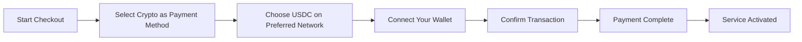
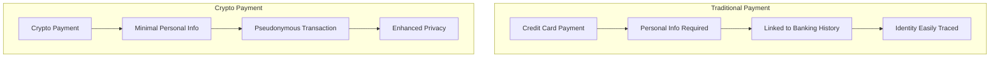
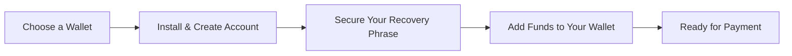

# แนะนำการชำระเงินด้วยคริปโต: ความเป็นส่วนตัวที่เพิ่มขึ้นสำหรับบริการอีเมลของคุณ {#introducing-crypto-payments-enhanced-privacy-for-your-email-service}

## สารบัญ {#table-of-contents}

* [คำนำ](#foreword)
* [ทำไมการชำระเงินด้วยคริปโตจึงสำคัญ](#why-crypto-payments-matter)
* [วิธีการทำงาน](#how-it-works)
* [ประโยชน์ด้านความเป็นส่วนตัว](#privacy-benefits)
* [รายละเอียดทางเทคนิค](#technical-details)
* [การตั้งค่ากระเป๋าเงินคริปโตของคุณ](#setting-up-your-crypto-wallet)
  * [MetaMask](#metamask)
  * [Phantom](#phantom)
  * [Coinbase Wallet](#coinbase-wallet)
  * [WalletConnect](#walletconnect)
* [เริ่มต้นใช้งาน](#getting-started)
* [มองไปข้างหน้า](#looking-forward)

## คำนำ {#foreword}

ที่ [Forward Email](https://forwardemail.net) เรามุ่งมั่นหาวิธีปรับปรุง [ความเป็นส่วนตัว](https://en.wikipedia.org/wiki/Privacy) และความปลอดภัยของคุณอย่างต่อเนื่อง พร้อมทั้งทำให้บริการของเราสามารถเข้าถึงได้ง่ายขึ้น วันนี้เรารู้สึกตื่นเต้นที่จะประกาศว่าเรารองรับการชำระเงินด้วย [สกุลเงินดิจิทัล](https://en.wikipedia.org/wiki/Cryptocurrency) ผ่านการผสานรวมระบบชำระเงินคริปโตของ [Stripe](https://stripe.com) แล้ว

## ทำไมการชำระเงินด้วยคริปโตจึงสำคัญ {#why-crypto-payments-matter}

[ความเป็นส่วนตัว](https://en.wikipedia.org/wiki/Internet_privacy) เป็นหัวใจหลักของบริการของเราเสมอ แม้ว่าเราจะมีวิธีการชำระเงินหลากหลายรูปแบบในอดีต การชำระเงินด้วยคริปโตช่วยเพิ่มชั้นความเป็นส่วนตัวที่สอดคล้องกับพันธกิจของเราอย่างสมบูรณ์แบบ โดยการชำระเงินด้วยคริปโต คุณสามารถ:

* รักษาความไม่เปิดเผยตัวตนมากขึ้นเมื่อซื้อบริการอีเมลของเรา
* ลดข้อมูลส่วนบุคคลที่เชื่อมโยงกับบัญชีอีเมลของคุณ
* แยกแยะตัวตนทางการเงินและอีเมลของคุณออกจากกัน
* สนับสนุนระบบ [การเงินแบบกระจายศูนย์](https://en.wikipedia.org/wiki/Decentralized_finance) ที่กำลังเติบโต

## วิธีการทำงาน {#how-it-works}

เราได้ผสานรวมระบบชำระเงินคริปโตของ [Stripe](https://docs.stripe.com/crypto) เพื่อให้กระบวนการเป็นไปอย่างราบรื่นที่สุด นี่คือวิธีที่คุณสามารถชำระเงินสำหรับบริการ Forward Email ด้วยสกุลเงินดิจิทัล:

```mermaid
flowchart LR
    A[Start Checkout] --> B[Select Crypto as Payment Method]
    B --> C[Choose USDC on Preferred Network]
    C --> D[Connect Your Wallet]
    D --> E[Confirm Transaction]
    E --> F[Payment Complete]
    F --> G[Service Activated]
```

1. **เลือก Crypto เป็นวิธีการชำระเงินของคุณ**: เมื่อทำการชำระเงิน คุณจะเห็นตัวเลือก "Crypto" อยู่เคียงข้างกับวิธีการชำระเงินแบบดั้งเดิม เช่น บัตรเครดิต

2. **เลือกสกุลเงินดิจิทัลของคุณ**: ปัจจุบันเรารองรับ [USDC](https://en.wikipedia.org/wiki/USD_Coin) (USD Coin) บนหลายบล็อกเชนรวมถึง [Ethereum](https://ethereum.org), [Solana](https://solana.com), และ [Polygon](https://polygon.technology) USDC เป็นสกุลเงินดิจิทัลแบบเสถียรที่รักษามูลค่า 1:1 กับดอลลาร์สหรัฐ

3. **เชื่อมต่อกระเป๋าเงินของคุณ**: คุณจะถูกเปลี่ยนเส้นทางไปยังหน้าที่ปลอดภัยเพื่อเชื่อมต่อกระเป๋าเงินคริปโตที่คุณต้องการ เรารองรับตัวเลือกกระเป๋าเงินหลายแบบ รวมถึง:
   * [MetaMask](https://metamask.io)
   * [Phantom](https://phantom.app)
   * [Coinbase Wallet](https://www.coinbase.com/wallet)
   * [WalletConnect](https://walletconnect.com) (รองรับกระเป๋าเงินอื่นๆ อีกมากมาย)

4. **ดำเนินการชำระเงินให้เสร็จสมบูรณ์**: ยืนยันธุรกรรมในกระเป๋าเงินของคุณ และเสร็จเรียบร้อย! การชำระเงินจะถูกดำเนินการ และบริการ Forward Email ของคุณจะถูกเปิดใช้งานทันที

## ประโยชน์ด้านความเป็นส่วนตัว {#privacy-benefits}

การใช้สกุลเงินดิจิทัลสำหรับการสมัครสมาชิก Forward Email ของคุณช่วยเพิ่มความเป็นส่วนตัวในหลายๆ ด้าน:

```mermaid
graph TD
    subgraph "Traditional Payment"
    A[Credit Card Payment] --> B[Personal Info Required]
    B --> C[Linked to Banking History]
    C --> D[Identity Easily Traced]
    end

    subgraph "Crypto Payment"
    E[Crypto Payment] --> F[Minimal Personal Info]
    F --> G[Pseudonymous Transaction]
    G --> H[Enhanced Privacy]
    end
```

* **ลดข้อมูลส่วนบุคคล**: ต่างจากการชำระเงินด้วยบัตรเครดิต ธุรกรรมคริปโตไม่ต้องการชื่อ ที่อยู่สำหรับเรียกเก็บเงิน หรือข้อมูลส่วนตัวอื่นๆ เรียนรู้เพิ่มเติมเกี่ยวกับ [ความเป็นส่วนตัวของธุรกรรม](https://en.wikipedia.org/wiki/Privacy_coin)
* **แยกจากระบบธนาคารแบบดั้งเดิม**: การชำระเงินของคุณไม่สามารถเชื่อมโยงกับบัญชีธนาคารหรือประวัติเครดิตของคุณได้ อ่านเกี่ยวกับ [ความเป็นส่วนตัวทางการเงิน](https://en.wikipedia.org/wiki/Financial_privacy)
* **ความเป็นส่วนตัวบนบล็อกเชน**: แม้ว่าธุรกรรมบนบล็อกเชนจะเป็นสาธารณะ แต่จะเป็นแบบนามแฝงและไม่เชื่อมโยงโดยตรงกับตัวตนในโลกจริงของคุณ ดูเทคนิค [ความเป็นส่วนตัวบนบล็อกเชน](https://en.wikipedia.org/wiki/Privacy_and_blockchain)
* **สอดคล้องกับค่านิยมของเรา**: ในฐานะบริการอีเมลที่เน้นความเป็นส่วนตัว เราเชื่อในการให้คุณควบคุมข้อมูลส่วนตัวของคุณในทุกขั้นตอน ตรวจสอบ [นโยบายความเป็นส่วนตัว](/privacy) ของเรา
## รายละเอียดทางเทคนิค {#technical-details}

สำหรับผู้ที่สนใจในแง่มุมทางเทคนิค:

* เราใช้โครงสร้างพื้นฐานการชำระเงินคริปโตของ [Stripe's](https://docs.stripe.com/crypto/stablecoin-payments) ซึ่งจัดการความซับซ้อนทั้งหมดของธุรกรรมบล็อกเชน
* การชำระเงินทำในรูปแบบ [USDC](https://www.circle.com/en/usdc) บนหลายบล็อกเชนรวมถึง [Ethereum](https://ethereum.org), [Solana](https://solana.com), และ [Polygon](https://polygon.technology)
* ในขณะที่คุณชำระเงินด้วยสกุลเงินคริปโต เราจะได้รับมูลค่าเทียบเท่าในสกุลเงิน USD ซึ่งช่วยให้เราสามารถรักษาราคาคงที่ได้

## การตั้งค่ากระเป๋าเงินคริปโตของคุณ {#setting-up-your-crypto-wallet}

ใหม่กับสกุลเงินคริปโต? นี่คือวิธีการตั้งค่ากระเป๋าเงินที่เรารองรับ:

```mermaid
flowchart LR
    A[Choose a Wallet] --> B[Install & Create Account]
    B --> C[Secure Your Recovery Phrase]
    C --> D[Add Funds to Your Wallet]
    D --> E[Ready for Payment]
```

### MetaMask {#metamask}

[MetaMask](https://metamask.io) เป็นหนึ่งในกระเป๋าเงิน Ethereum ที่ได้รับความนิยมมากที่สุด

1. เยี่ยมชม [หน้าโหลด MetaMask](https://metamask.io/download/)
2. ติดตั้งส่วนขยายเบราว์เซอร์หรือแอปมือถือ
3. ทำตามคำแนะนำการตั้งค่าเพื่อสร้างกระเป๋าเงินใหม่
4. **สำคัญ**: เก็บวลีการกู้คืนของคุณอย่างปลอดภัย
5. เติม ETH หรือ USDC เข้ากระเป๋าของคุณผ่านการแลกเปลี่ยนหรือการซื้อโดยตรง
6. [คู่มือการตั้งค่า MetaMask อย่างละเอียด](https://metamask.io/faqs/)

### Phantom {#phantom}

[Phantom](https://phantom.app) เป็นกระเป๋าเงินชั้นนำของ Solana

1. เยี่ยมชม [เว็บไซต์ Phantom](https://phantom.app/)
2. ดาวน์โหลดเวอร์ชันที่เหมาะสมกับอุปกรณ์ของคุณ
3. สร้างกระเป๋าเงินใหม่ตามคำแนะนำบนหน้าจอ
4. สำรองวลีการกู้คืนของคุณอย่างปลอดภัย
5. เติม SOL หรือ USDC เข้ากระเป๋าของคุณ
6. [คู่มือกระเป๋าเงิน Phantom](https://help.phantom.app/hc/en-us/articles/4406388623251-How-to-create-a-new-wallet)

### Coinbase Wallet {#coinbase-wallet}

[Coinbase Wallet](https://www.coinbase.com/wallet) รองรับหลายบล็อกเชน

1. ดาวน์โหลด [Coinbase Wallet](https://www.coinbase.com/wallet/downloads)
2. สร้างกระเป๋าเงินใหม่ (แยกจากบัญชีแลกเปลี่ยน Coinbase)
3. เก็บวลีการกู้คืนของคุณอย่างปลอดภัย
4. โอนหรือซื้อคริปโตโดยตรงในแอป
5. [คู่มือ Coinbase Wallet](https://www.coinbase.com/learn/tips-and-tutorials/how-to-set-up-a-crypto-wallet)

### WalletConnect {#walletconnect}

[WalletConnect](https://walletconnect.com) เป็นโปรโตคอลที่เชื่อมต่อกระเป๋าเงินกับเว็บไซต์

1. ดาวน์โหลดกระเป๋าเงินที่รองรับ WalletConnect ก่อน (มีตัวเลือกมากมาย)
2. ในขั้นตอนชำระเงิน เลือก WalletConnect
3. สแกน QR โค้ดด้วยแอปกระเป๋าเงินของคุณ
4. อนุมัติการเชื่อมต่อ
5. [กระเป๋าเงินที่รองรับ WalletConnect](https://walletconnect.com/registry/wallets)

## การเริ่มต้นใช้งาน {#getting-started}

พร้อมที่จะเพิ่มความเป็นส่วนตัวของคุณด้วยการชำระเงินคริปโตหรือยัง? เพียงเลือกตัวเลือก "Crypto" ในขั้นตอนชำระเงินครั้งถัดไปเมื่อคุณต่ออายุการสมัครสมาชิกหรืออัปเกรดแผนของคุณ

สำหรับข้อมูลเพิ่มเติมเกี่ยวกับสกุลเงินคริปโตและเทคโนโลยีบล็อกเชน โปรดดูแหล่งข้อมูลเหล่านี้:

* [สกุลเงินคริปโตคืออะไร?](https://www.investopedia.com/terms/c/cryptocurrency.asp) - Investopedia
* [อธิบายบล็อกเชน](https://www.investopedia.com/terms/b/blockchain.asp) - Investopedia
* [คู่มือความเป็นส่วนตัวดิจิทัล](https://www.eff.org/issues/privacy) - Electronic Frontier Foundation

## มองไปข้างหน้า {#looking-forward}

การเพิ่มการชำระเงินด้วยสกุลเงินคริปโตเป็นเพียงก้าวหนึ่งในความมุ่งมั่นอย่างต่อเนื่องของเราในเรื่อง [ความเป็นส่วนตัว](https://en.wikipedia.org/wiki/Privacy), [ความปลอดภัย](https://en.wikipedia.org/wiki/Computer_security) และทางเลือกของผู้ใช้ เราเชื่อว่าบริการอีเมลของคุณควรเคารพความเป็นส่วนตัวของคุณในทุกระดับ—ตั้งแต่ข้อความที่คุณส่งไปจนถึงวิธีที่คุณชำระเงินสำหรับบริการ

เช่นเคย เรายินดีรับฟังความคิดเห็นของคุณเกี่ยวกับตัวเลือกการชำระเงินใหม่นี้ หากคุณมีคำถามเกี่ยวกับการใช้สกุลเงินคริปโตกับ Forward Email โปรดติดต่อทีม [สนับสนุนของเรา](/help)

---

**แหล่งอ้างอิง:**

1. [เอกสาร Stripe Crypto](https://docs.stripe.com/crypto)
2. [USDC Stablecoin](https://www.circle.com/en/usdc)
3. [Ethereum Blockchain](https://ethereum.org)
4. [Solana Blockchain](https://solana.com)
5. [Polygon Network](https://polygon.technology)
6. [Electronic Frontier Foundation - ความเป็นส่วนตัว](https://www.eff.org/issues/privacy)
7. [นโยบายความเป็นส่วนตัวของ Forward Email](/privacy)
