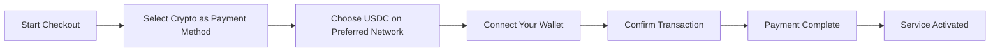
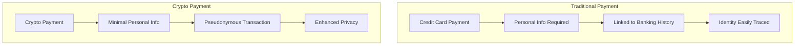
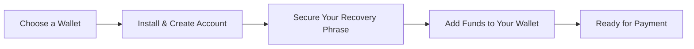

# Kripto Ödemeleri Tanıtılıyor: E-posta Servisiniz İçin Gelişmiş Gizlilik {#introducing-crypto-payments-enhanced-privacy-for-your-email-service}

## İçindekiler {#table-of-contents}

* [Önsöz](#foreword)
* [Kripto Ödemeleri Neden Önemlidir?](#why-crypto-payments-matter)
* [Nasıl Çalışır?](#how-it-works)
* [Gizlilik Avantajları](#privacy-benefits)
* [Teknik Detaylar](#technical-details)
* [Kripto Cüzdanınızı Kurma](#setting-up-your-crypto-wallet)
  * [MetaMask](#metamask)
  * [Hayalet](#phantom)
  * [Coinbase Cüzdanı](#coinbase-wallet)
  * [CüzdanBağlantısı](#walletconnect)
* [Başlarken](#getting-started)
* [İleriye dönük](#looking-forward)

## Önsöz {#foreword}

[E-postayı İlet](https://forwardemail.net) olarak, hizmetimizi daha erişilebilir hale getirirken [mahremiyet](https://en.wikipedia.org/wiki/Privacy)'inizi ve güvenliğinizi iyileştirmenin yollarını sürekli olarak arıyoruz. Bugün, [Stripe'ın](https://stripe.com) kripto ödeme entegrasyonu aracılığıyla artık [kripto para birimi](https://en.wikipedia.org/wiki/Cryptocurrency) ödemelerini kabul ettiğimizi duyurmaktan heyecan duyuyoruz.

## Kripto Ödemeleri Neden Önemlidir? {#why-crypto-payments-matter}

[Mahremiyet](https://en.wikipedia.org/wiki/Internet_privacy) her zaman hizmetimizin merkezinde yer almıştır. Geçmişte çeşitli ödeme yöntemleri sunmuş olsak da, kripto para ödemeleri misyonumuzla mükemmel bir şekilde örtüşen ek bir gizlilik katmanı sağlar. Kripto para ile ödeme yaparak şunları yapabilirsiniz:

* E-posta hizmetlerimizi satın alırken daha fazla anonimlik sağlayın
* E-posta hesabınıza bağlı kişisel bilgileri azaltın
* Finansal ve e-posta kimliklerinizi ayrı tutun
* Büyüyen [merkezi olmayan finans](https://en.wikipedia.org/wiki/Decentralized_finance) ekosistemini destekleyin

## Nasıl Çalışır? {#how-it-works}

Süreci olabildiğince sorunsuz hale getirmek için [Stripe'ın](https://docs.stripe.com/crypto) kripto ödeme sistemini entegre ettik. Kripto para kullanarak E-posta Yönlendirme hizmetleri için nasıl ödeme yapabileceğinizi aşağıda bulabilirsiniz:

1. **Ödeme Yönteminiz Olarak Kriptoyu Seçin**: Ödeme yaparken, kredi kartı gibi geleneksel yöntemlerin yanında bir ödeme seçeneği olarak "Kripto"yu göreceksiniz.

2. **Kripto Paranızı Seçin**: Şu anda [Ethereum](https://ethereum.org), [Solana](https://solana.com) ve [Çokgen](https://polygon.technology) dahil olmak üzere birden fazla blok zincirinde [USDC](https://en.wikipedia.org/wiki/USD_Coin) (USD Coin) kabul ediyoruz. USDC, ABD doları ile 1:1 değere sahip istikrarlı bir kripto para birimidir.

3. **Cüzdanınızı Bağlayın**: Tercih ettiğiniz kripto cüzdanını bağlayabileceğiniz güvenli bir sayfaya yönlendirileceksiniz. Aşağıdakiler de dahil olmak üzere birden fazla cüzdan seçeneğini destekliyoruz:
* [MetaMask](https://metamask.io)
* [Hayalet](https://phantom.app)
* [Coinbase Cüzdanı](https://www.coinbase.com/wallet)
* [CüzdanBağlantısı](https://walletconnect.com) (diğer birçok cüzdanla uyumludur)

4. **Ödemenizi Tamamlayın**: Cüzdanınızdaki işlemi onaylayın, işte hazırsınız! Ödemeniz işlenecek ve E-posta Yönlendirme hizmetiniz hemen etkinleştirilecektir.

## Gizlilik Avantajları {#privacy-benefits}

Kripto para birimini E-posta İletme aboneliğiniz için kullanmak gizliliğinizi çeşitli şekillerde artırır:

* **Azaltılmış Kişisel Bilgiler**: Kredi kartı ödemelerinin aksine, kripto para işlemleri adınızı, fatura adresinizi veya diğer kişisel bilgilerinizi gerektirmez. [işlem gizliliği](https://en.wikipedia.org/wiki/Privacy_coin) hakkında daha fazla bilgi edinin.
* **Geleneksel Bankacılıktan Ayrım**: Ödemeniz banka hesabınıza veya kredi geçmişinize bağlanamaz. [finansal gizlilik](https://en.wikipedia.org/wiki/Financial_privacy) hakkında bilgi edinin.
* **Blok Zinciri Gizliliği**: Blok zinciri işlemleri herkese açık olsa da, takma adla çalışır ve gerçek dünyadaki kimliğinizle doğrudan bağlantılı değildir. [blok zinciri gizlilik teknikleri](https://en.wikipedia.org/wiki/Privacy_and_blockchain)'ye bakın.
* **Değerlerimizle Uyumlu**: Gizlilik odaklı bir e-posta hizmeti olarak, her adımda kişisel bilgileriniz üzerinde kontrol sahibi olmanızı sağlamaya inanıyoruz. [gizlilik politikası](/privacy)'e göz atın.

## Teknik Detaylar {#technical-details}

Teknik yönleriyle ilgilenenler için:

* Blockchain işlemlerinin tüm karmaşıklığını yöneten [Stripe'ın](https://docs.stripe.com/crypto/stablecoin-payments) kripto ödeme altyapısını kullanıyoruz.
* Ödemeler, [Ethereum](https://ethereum.org), [Solana](https://solana.com) ve [Çokgen](https://polygon.technology) dahil olmak üzere birden fazla blockchain'de [USDC](https://www.circle.com/en/usdc) ile yapılır.
* Siz kripto para birimiyle ödeme yaparken, biz de aynı tutarı USD cinsinden alırız, bu da istikrarlı fiyatlandırmamızı korumamızı sağlar.

## Kripto Cüzdanınızı Kurma {#setting-up-your-crypto-wallet}

Kripto para birimine yeni misiniz? Desteklediğimiz cüzdanları nasıl kuracağınız aşağıda açıklanmıştır:

### MetaMask {#metamask}

[MetaMask](https://metamask.io) en popüler Ethereum cüzdanlarından biridir.

1. [MetaMask indirme sayfası](https://metamask.io/download/) adresini ziyaret edin
2. Tarayıcı eklentisini veya mobil uygulamayı yükleyin
3. Yeni bir cüzdan oluşturmak için kurulum talimatlarını izleyin
4. **Önemli**: Kurtarma ifadenizi güvenli bir şekilde saklayın
5. ETH veya USDC'yi bir borsa veya doğrudan satın alma yoluyla cüzdanınıza ekleyin
6. [Ayrıntılı MetaMask Kurulum Kılavuzu](https://metamask.io/faqs/)

### Hayalet {#phantom}

[Hayalet](https://phantom.app) önde gelen bir Solana cüzdanıdır.

1. [Hayalet web sitesi](https://phantom.app/) adresini ziyaret edin
2. Cihazınız için uygun sürümü indirin
3. Ekrandaki talimatları izleyerek yeni bir cüzdan oluşturun
4. Kurtarma ifadenizi güvenli bir şekilde yedekleyin
5. Cüzdanınıza SOL veya USDC ekleyin
6. [Phantom Cüzdan Rehberi](https://help.phantom.app/hc/en-us/articles/4406388623251-How-to-create-a-new-wallet)

### Coinbase Cüzdanı {#coinbase-wallet}

[Coinbase Cüzdanı](https://www.coinbase.com/wallet) birden fazla blok zincirini destekler.

1. [Coinbase Cüzdanı](https://www.coinbase.com/wallet/downloads)'ı indirin
2. Yeni bir cüzdan oluşturun (Coinbase borsa hesabından ayrı)
3. Kurtarma ifadenizi güvence altına alın
4. Kripto paraları doğrudan uygulama üzerinden transfer edin veya satın alın
5. [Coinbase Cüzdan Rehberi](https://www.coinbase.com/learn/tips-and-tutorials/how-to-set-up-a-crypto-wallet)

### WalletConnect {#walletconnect}

[CüzdanBağlantısı](https://walletconnect.com), cüzdanları web sitelerine bağlayan bir protokoldür.

1. İlk olarak, WalletConnect uyumlu bir cüzdan indirin (birçok seçenek mevcuttur)
2. Ödeme sırasında WalletConnect'i seçin
3. QR kodunu cüzdan uygulamanızla tarayın
4. Bağlantıyı onaylayın
5. [WalletConnect Uyumlu Cüzdanlar](https://walletconnect.com/registry/wallets)

## Başlarken {#getting-started}

Kripto ödemeleriyle gizliliğinizi artırmaya hazır mısınız? Aboneliğinizi yenilediğinizde veya planınızı yükselttiğinizde, ödeme sırasında "Kripto" seçeneğini seçmeniz yeterlidir.

Kripto paralar ve blockchain teknolojisi hakkında daha fazla bilgi edinmek için şu kaynaklara göz atın:

* [Kripto Para Nedir?](https://www.investopedia.com/terms/c/cryptocurrency.asp) - Investopedia
* [Blockchain Açıklaması](https://www.investopedia.com/terms/b/blockchain.asp) - Investopedia
* [Dijital Gizlilik Rehberi](https://www.eff.org/issues/privacy) - Elektronik Sınır Vakfı

## İleriye Bakmak {#looking-forward}

Kripto para ödemelerini eklemek, [mahremiyet](https://en.wikipedia.org/wiki/Privacy), [güvenlik](https://en.wikipedia.org/wiki/Computer_security) ve kullanıcı tercihlerine olan bağlılığımızın sadece bir adımıdır. E-posta hizmetinizin, gönderdiğiniz mesajlardan hizmet için nasıl ödeme yaptığınıza kadar her düzeyde gizliliğinize saygı göstermesi gerektiğine inanıyoruz.

Her zaman olduğu gibi, bu yeni ödeme seçeneği hakkındaki geri bildirimlerinizi memnuniyetle karşılıyoruz. Forward Email ile kripto para birimi kullanımı hakkında sorularınız varsa, lütfen [destek ekibi](/help) ile iletişime geçin.

---

**Referanslar:**

1. [Stripe Kripto Belgeleri](https://docs.stripe.com/crypto)
2. [USDC Sabit Parası](https://www.circle.com/en/usdc)
3. [Ethereum Blockchain](https://ethereum.org)
4. [Solana Blockchain](https://solana.com)
5. [Çokgen Ağı](https://polygon.technology)
6. [Electronic Frontier Foundation - Gizlilik](https://www.eff.org/issues/privacy)
7. [E-posta İletme Gizlilik Politikası](/privacy)