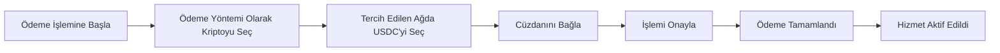
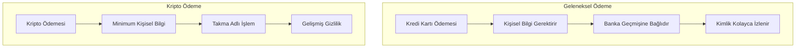
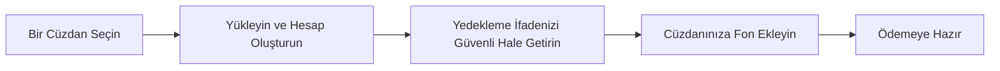

# Kripto Ödemeleri Tanıtıyoruz: E-posta Servisiniz İçin Gelişmiş Gizlilik {#introducing-crypto-payments-enhanced-privacy-for-your-email-service}

## İçindekiler {#table-of-contents}

* [Önsöz](#foreword)
* [Neden Kripto Ödemeleri Önemlidir](#why-crypto-payments-matter)
* [Nasıl Çalışır](#how-it-works)
* [Gizlilik Avantajları](#privacy-benefits)
* [Teknik Detaylar](#technical-details)
* [Kripto Cüzdanınızı Kurma](#setting-up-your-crypto-wallet)
  * [MetaMask](#metamask)
  * [Phantom](#phantom)
  * [Coinbase Wallet](#coinbase-wallet)
  * [WalletConnect](#walletconnect)
* [Başlarken](#getting-started)
* [Geleceğe Bakış](#looking-forward)

## Önsöz {#foreword}

[Forward Email](https://forwardemail.net) olarak, hizmetimizi daha erişilebilir kılarken sizin [gizliliğinizi](https://en.wikipedia.org/wiki/Privacy) ve güvenliğinizi artırmanın yollarını sürekli arıyoruz. Bugün, artık [Stripe](https://stripe.com)'ın kripto ödeme entegrasyonu aracılığıyla [kripto para](https://en.wikipedia.org/wiki/Cryptocurrency) ödemelerini kabul ettiğimizi duyurmaktan heyecan duyuyoruz.

## Neden Kripto Ödemeleri Önemlidir {#why-crypto-payments-matter}

[Gizlilik](https://en.wikipedia.org/wiki/Internet_privacy) her zaman hizmetimizin merkezinde olmuştur. Geçmişte çeşitli ödeme yöntemleri sunmamıza rağmen, kripto para ödemeleri misyonumuzla mükemmel uyum sağlayan ek bir gizlilik katmanı sunar. Kripto ile ödeme yaparak:

* E-posta hizmetlerimizi satın alırken daha fazla anonimlik sağlayabilirsiniz
* E-posta hesabınıza bağlı kişisel bilgileri azaltabilirsiniz
* Finansal ve e-posta kimliklerinizi ayrı tutabilirsiniz
* Büyüyen [merkeziyetsiz finans](https://en.wikipedia.org/wiki/Decentralized_finance) ekosistemini destekleyebilirsiniz

## Nasıl Çalışır {#how-it-works}

Süreç mümkün olduğunca sorunsuz olsun diye [Stripe](https://docs.stripe.com/crypto)'ın kripto ödeme sistemini entegre ettik. İşte Forward Email hizmetleri için kripto para ile nasıl ödeme yapabileceğiniz:

```mermaid
flowchart LR
    A[Ödeme İşlemine Başla] --> B[Ödeme Yöntemi Olarak Kriptoyu Seç]
    B --> C[Tercih Edilen Ağda USDC'yi Seç]
    C --> D[Cüzdanını Bağla]
    D --> E[İşlemi Onayla]
    E --> F[Ödeme Tamamlandı]
    F --> G[Hizmet Aktif Edildi]
```

1. **Ödeme Yöntemi Olarak Kriptoyu Seçin**: Ödeme yaparken, kredi kartı gibi geleneksel yöntemlerin yanında "Kripto" seçeneğini göreceksiniz.

2. **Kripto Paranızı Seçin**: Şu anda [Ethereum](https://ethereum.org), [Solana](https://solana.com) ve [Polygon](https://polygon.technology) dahil olmak üzere birden fazla blok zincirinde [USDC](https://en.wikipedia.org/wiki/USD_Coin) (USD Coin) kabul ediyoruz. USDC, ABD doları ile 1:1 değerde sabit bir kripto paradır.

3. **Cüzdanınızı Bağlayın**: Tercih ettiğiniz kripto cüzdanını bağlayabileceğiniz güvenli bir sayfaya yönlendirileceksiniz. Birden fazla cüzdan seçeneğini destekliyoruz:
   * [MetaMask](https://metamask.io)
   * [Phantom](https://phantom.app)
   * [Coinbase Wallet](https://www.coinbase.com/wallet)
   * [WalletConnect](https://walletconnect.com) (birçok diğer cüzdanla uyumlu)

4. **Ödemenizi Tamamlayın**: Cüzdanınızda işlemi onaylayın, hepsi bu kadar! Ödeme işlenecek ve Forward Email hizmetiniz hemen aktif edilecektir.

## Gizlilik Avantajları {#privacy-benefits}

Forward Email aboneliğiniz için kripto para kullanmak gizliliğinizi birkaç şekilde artırır:

```mermaid
graph TD
    subgraph "Geleneksel Ödeme"
    A[Kredi Kartı Ödemesi] --> B[Kişisel Bilgi Gerektirir]
    B --> C[Banka Geçmişine Bağlıdır]
    C --> D[Kimlik Kolayca İzlenir]
    end

    subgraph "Kripto Ödeme"
    E[Kripto Ödemesi] --> F[Minimum Kişisel Bilgi]
    F --> G[Takma Adlı İşlem]
    G --> H[Gelişmiş Gizlilik]
    end
```

* **Azaltılmış Kişisel Bilgi**: Kredi kartı ödemelerinin aksine, kripto işlemleri adınız, fatura adresiniz veya diğer kişisel bilgilerinizi gerektirmez. [işlem gizliliği](https://en.wikipedia.org/wiki/Privacy_coin) hakkında daha fazla bilgi edinin.
* **Geleneksel Bankacılıktan Ayrım**: Ödemeniz banka hesabınıza veya kredi geçmişinize bağlanamaz. [finansal gizlilik](https://en.wikipedia.org/wiki/Financial_privacy) hakkında bilgi alın.
* **Blok Zinciri Gizliliği**: Blok zinciri işlemleri herkese açıktır ancak takma adlıdır ve doğrudan gerçek dünya kimliğinize bağlı değildir. [blok zinciri gizlilik teknikleri](https://en.wikipedia.org/wiki/Privacy_and_blockchain) hakkında bilgi edinin.
* **Değerlerimizle Tutarlı**: Gizlilik odaklı bir e-posta servisi olarak, kişisel bilgileriniz üzerinde her adımda kontrol sahibi olmanızı sağlıyoruz. [gizlilik politikamıza](/privacy) göz atın.
## Teknik Detaylar {#technical-details}

Teknik konularla ilgilenenler için:

* Tüm blok zinciri işlemlerinin karmaşıklığını yöneten [Stripe'ın](https://docs.stripe.com/crypto/stablecoin-payments) kripto ödeme altyapısını kullanıyoruz.
* Ödemeler, [Ethereum](https://ethereum.org), [Solana](https://solana.com) ve [Polygon](https://polygon.technology) dahil olmak üzere birden fazla blok zincirinde [USDC](https://www.circle.com/en/usdc) ile yapılır.
* Kripto para ile ödeme yaparken, biz eşdeğer değeri USD olarak alıyoruz, böylece sabit fiyatlandırmayı koruyabiliyoruz.

## Kripto Cüzdanınızı Kurma {#setting-up-your-crypto-wallet}

Kripto para dünyasına yeni misiniz? Desteklediğimiz cüzdanları nasıl kuracağınız burada:

```mermaid
flowchart LR
    A[Bir Cüzdan Seçin] --> B[Yükleyin ve Hesap Oluşturun]
    B --> C[Yedekleme İfadenizi Güvenli Hale Getirin]
    C --> D[Cüzdanınıza Fon Ekleyin]
    D --> E[Ödemeye Hazır]
```

### MetaMask {#metamask}

[MetaMask](https://metamask.io), en popüler Ethereum cüzdanlarından biridir.

1. [MetaMask indirme sayfasını](https://metamask.io/download/) ziyaret edin
2. Tarayıcı eklentisini veya mobil uygulamayı yükleyin
3. Yeni bir cüzdan oluşturmak için kurulum talimatlarını izleyin
4. **Önemli**: Yedekleme ifadenizi güvenli bir şekilde saklayın
5. Cüzdanınıza ETH veya USDC ekleyin, bunu bir borsa veya doğrudan satın alma yoluyla yapabilirsiniz
6. [Detaylı MetaMask Kurulum Kılavuzu](https://metamask.io/faqs/)

### Phantom {#phantom}

[Phantom](https://phantom.app), önde gelen bir Solana cüzdanıdır.

1. [Phantom web sitesini](https://phantom.app/) ziyaret edin
2. Cihazınıza uygun sürümü indirin
3. Ekrandaki talimatları izleyerek yeni bir cüzdan oluşturun
4. Yedekleme ifadenizi güvenli bir şekilde yedekleyin
5. Cüzdanınıza SOL veya USDC ekleyin
6. [Phantom Cüzdan Kılavuzu](https://help.phantom.app/hc/en-us/articles/4406388623251-How-to-create-a-new-wallet)

### Coinbase Wallet {#coinbase-wallet}

[Coinbase Wallet](https://www.coinbase.com/wallet) birden fazla blok zincirini destekler.

1. [Coinbase Wallet'ı indirin](https://www.coinbase.com/wallet/downloads)
2. Yeni bir cüzdan oluşturun (Coinbase borsa hesabından ayrı)
3. Yedekleme ifadenizi güvence altına alın
4. Uygulama içinde doğrudan kripto transferi veya satın alma yapın
5. [Coinbase Wallet Kılavuzu](https://www.coinbase.com/learn/tips-and-tutorials/how-to-set-up-a-crypto-wallet)

### WalletConnect {#walletconnect}

[WalletConnect](https://walletconnect.com), cüzdanları web sitelerine bağlayan bir protokoldür.

1. Öncelikle, WalletConnect uyumlu bir cüzdan indirin (birçok seçenek mevcut)
2. Ödeme sırasında WalletConnect'i seçin
3. QR kodunu cüzdan uygulamanızla tarayın
4. Bağlantıyı onaylayın
5. [WalletConnect Uyumlu Cüzdanlar](https://walletconnect.com/registry/wallets)

## Başlarken {#getting-started}

Kripto ödemelerle gizliliğinizi artırmaya hazır mısınız? Aboneliğinizi yenilerken veya planınızı yükseltirken ödeme sırasında "Kripto" seçeneğini seçmeniz yeterlidir.

Kripto paralar ve blok zinciri teknolojisi hakkında daha fazla bilgi için şu kaynaklara göz atabilirsiniz:

* [Kripto Para Nedir?](https://www.investopedia.com/terms/c/cryptocurrency.asp) - Investopedia
* [Blok Zinciri Açıklaması](https://www.investopedia.com/terms/b/blockchain.asp) - Investopedia
* [Dijital Gizlilik Rehberi](https://www.eff.org/issues/privacy) - Electronic Frontier Foundation

## Geleceğe Bakış {#looking-forward}

Kripto para ödemelerini eklemek, [gizlilik](https://en.wikipedia.org/wiki/Privacy), [güvenlik](https://en.wikipedia.org/wiki/Computer_security) ve kullanıcı tercihlerine olan sürekli bağlılığımızın bir adımıdır. E-posta hizmetinizin, gönderdiğiniz mesajlardan hizmet için nasıl ödeme yaptığınıza kadar her seviyede gizliliğinize saygı göstermesi gerektiğine inanıyoruz.

Her zaman olduğu gibi, bu yeni ödeme seçeneği hakkında geri bildirimlerinizi bekliyoruz. Forward Email ile kripto para kullanımı hakkında sorularınız varsa, lütfen [destek ekibimizle](/help) iletişime geçin.

---

**Referanslar:**

1. [Stripe Kripto Dokümantasyonu](https://docs.stripe.com/crypto)
2. [USDC Stablecoin](https://www.circle.com/en/usdc)
3. [Ethereum Blok Zinciri](https://ethereum.org)
4. [Solana Blok Zinciri](https://solana.com)
5. [Polygon Ağı](https://polygon.technology)
6. [Electronic Frontier Foundation - Gizlilik](https://www.eff.org/issues/privacy)
7. [Forward Email Gizlilik Politikası](/privacy)
