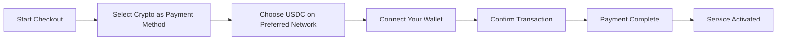
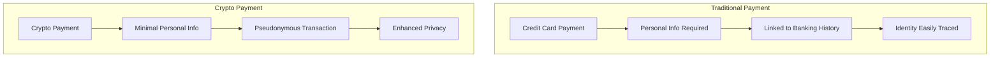
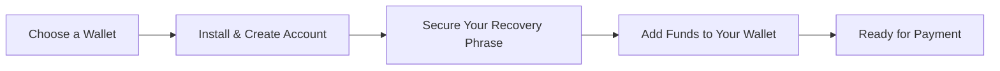

# Представляємо крипто-платежі: покращена конфіденційність для вашої поштової служби {#introducing-crypto-payments-enhanced-privacy-for-your-email-service}

## Зміст {#table-of-contents}

* [Передмова](#foreword)
* [Чому криптоплатежі важливі](#why-crypto-payments-matter)
* [Як це працює](#how-it-works)
* [Переваги конфіденційності](#privacy-benefits)
* [Технічні деталі](#technical-details)
* [Налаштування вашого криптогаманця](#setting-up-your-crypto-wallet)
  * [МетаМаска](#metamask)
  * [Фантом](#phantom)
  * [Гаманець Coinbase](#coinbase-wallet)
  * [WalletConnect](#walletconnect)
* [Початок роботи](#getting-started)
* [Дивлячись у майбутнє](#looking-forward)

## Передмова {#foreword}

У [Переслати електронний лист](https://forwardemail.net) ми постійно шукаємо способи покращити вашу [конфіденційність](https://en.wikipedia.org/wiki/Privacy) безпеку, одночасно роблячи наш сервіс доступнішим. Сьогодні ми раді оголосити, що тепер ми приймаємо платежі [криптовалюта](https://en.wikipedia.org/wiki/Cryptocurrency) через інтеграцію криптовалютних платежів [Stripe's](https://stripe.com).

## Чому криптовалютні платежі важливі {#why-crypto-payments-matter}

[Конфіденційність](https://en.wikipedia.org/wiki/Internet_privacy) завжди був основою нашого сервісу. Хоча в минулому ми пропонували різні способи оплати, платежі в криптовалюті забезпечують додатковий рівень конфіденційності, що ідеально відповідає нашій місії. Сплачуючи криптовалютою, ви можете:

* Зберігайте більшу анонімність під час придбання наших послуг електронної пошти
* Зменшуйте обсяг особистої інформації, пов’язаної з вашим обліковим записом електронної пошти
* Розділяйте свої фінансові дані та електронні листи
* Підтримуйте зростаючу екосистему [децентралізовані фінанси](https://en.wikipedia.org/wiki/Decentralized_finance)

## Як це працює {#how-it-works}

Ми інтегрували криптовалютну платіжну систему [Stripe's](https://docs.stripe.com/crypto), щоб зробити процес максимально безпроблемним. Ось як ви можете оплатити послуги пересилання електронної пошти за допомогою криптовалюти:

1. **Виберіть криптовалюту як спосіб оплати**: Під час оформлення замовлення ви побачите опцію «Криптовалюта» як варіант оплати поряд із традиційними методами, такими як кредитні картки.

2. **Оберіть свою криптовалюту**: Наразі ми приймаємо [USDC](https://en.wikipedia.org/wiki/USD_Coin) (USD Coin) на кількох блокчейнах, включаючи [Етереум](https://ethereum.org), [Солана](https://solana.com) та [Багатокутник](https://polygon.technology). USDC – це стабільна криптовалюта, яка підтримує співвідношення 1:1 до долара США.

3. **Підключіть свій гаманець**: Вас буде перенаправлено на безпечну сторінку, де ви зможете підключити свій бажаний криптогаманець. Ми підтримуємо кілька варіантів гаманців, зокрема:
* [МетаМаска](https://metamask.io)
* [Фантом](https://phantom.app)
* [Гаманець Coinbase](https://www.coinbase.com/wallet)
* [WalletConnect](https://walletconnect.com) (сумісний з багатьма іншими гаманцями)

4. **Завершіть платіж**: Підтвердьте транзакцію у своєму гаманці, і все готово! Платіж буде оброблено, а послугу пересилання електронної пошти буде негайно активовано.

## Переваги конфіденційності {#privacy-benefits}

Використання криптовалюти для вашої підписки на Forward Email покращує вашу конфіденційність кількома способами:

* **Зменшений обсяг персональної інформації**: На відміну від платежів кредитною карткою, для криптовалютних транзакцій не потрібно вводити ваше ім'я, платіжну адресу чи інші персональні дані. Дізнайтеся більше про [конфіденційність транзакцій](https://en.wikipedia.org/wiki/Privacy_coin).
* **Відокремлення від традиційного банківського обслуговування**: Ваш платіж не може бути пов'язаний з вашим банківським рахунком або кредитною історією. Дізнайтеся більше про [фінансова конфіденційність](https://en.wikipedia.org/wiki/Financial_privacy).
* **Конфіденційність блокчейну**: Хоча блокчейн-транзакції є публічними, вони є псевдонімними та не пов'язані безпосередньо з вашою реальною особистістю. Див. [методи конфіденційності блокчейну](https://en.wikipedia.org/wiki/Privacy_and_blockchain).
* **Відповідність нашим цінностям**: Як сервіс електронної пошти, орієнтований на конфіденційність, ми віримо в те, що вам потрібно контролювати свою персональну інформацію на кожному кроці. Перегляньте наш [політика конфіденційності](/privacy).

## Технічні деталі {#technical-details}

Для тих, хто цікавиться технічними аспектами:

* Ми використовуємо криптоплатіжну інфраструктуру [Stripe's](https://docs.stripe.com/crypto/stablecoin-payments), яка обробляє всю складність блокчейн-транзакцій.
* Платежі здійснюються в [USDC](https://www.circle.com/en/usdc) на кількох блокчейнах, включаючи [Етереум](https://ethereum.org), [Солана](https://solana.com) та [Багатокутник](https://polygon.technology).
* Хоча ви платите в криптовалюті, ми отримуємо еквівалентну вартість у доларах США, що дозволяє нам підтримувати стабільне ціноутворення.

## Налаштування вашого криптогаманця {#setting-up-your-crypto-wallet}

Новачок у криптовалюті? Ось як налаштувати гаманці, які ми підтримуємо:

### Метамаска {#metamask}

[МетаМаска](https://metamask.io) – один із найпопулярніших гаманців Ethereum.

1. Відвідайте сторінку [Сторінка завантаження MetaMask](https://metamask.io/download/)
2. Встановіть розширення для браузера або мобільний додаток
3. Дотримуйтесь інструкцій з налаштування, щоб створити новий гаманець
4. **Важливо**: Безпечно зберігайте свою фразу відновлення
5. Додайте ETH або USDC до свого гаманця через обмін або пряму покупку
6. [Детальний посібник з налаштування MetaMask](https://metamask.io/faqs/)

### Фантом {#phantom}

[Фантом](https://phantom.app) – провідний гаманець Solana.

1. Відвідайте сторінку [Вебсайт Фантома](https://phantom.app/)
2. Завантажте відповідну версію для вашого пристрою
3. Створіть новий гаманець, дотримуючись інструкцій на екрані
4. Безпечно зробіть резервну копію вашої фрази відновлення
5. Додайте SOL або USDC до вашого гаманця
6. [Посібник з фантомного гаманця](https://help.phantom.app/hc/en-us/articles/4406388623251-How-to-create-a-new-wallet)

### Гаманець Coinbase {#coinbase-wallet}

[Гаманець Coinbase](https://www.coinbase.com/wallet) підтримує кілька блокчейнів.

1. Завантажте [Гаманець Coinbase](https://www.coinbase.com/wallet/downloads)
2. Створіть новий гаманець (окремо від облікового запису біржі Coinbase)
3. Захистіть свою фразу відновлення
4. Перекажіть або купіть криптовалюту безпосередньо в додатку
5. [Посібник з гаманців Coinbase](https://www.coinbase.com/learn/tips-and-tutorials/how-to-set-up-a-crypto-wallet)

### WalletConnect {#walletconnect}

[WalletConnect](https://walletconnect.com) – це протокол, який підключає гаманці до вебсайтів.

1. Спочатку завантажте гаманець, сумісний з WalletConnect (доступно багато варіантів)
2. Під час оформлення замовлення виберіть WalletConnect
3. Відскануйте QR-код за допомогою програми-гаманця
4. Підтвердьте підключення
5. [Сумісні гаманці WalletConnect](https://walletconnect.com/registry/wallets)

## Початок роботи {#getting-started}

Готові покращити свою конфіденційність за допомогою криптовалютних платежів? Просто виберіть опцію «Крипто» під час оформлення замовлення наступного разу, коли ви поновлюватимете підписку або оновлюватимете свій план.

Щоб отримати більше інформації про криптовалюти та технологію блокчейн, перегляньте ці ресурси:

* [Що таке криптовалюта?](https://www.investopedia.com/terms/c/cryptocurrency.asp) - Інвестопедія
* [Пояснення блокчейну](https://www.investopedia.com/terms/b/blockchain.asp) - Інвестопедія
* [Посібник із цифрової конфіденційності](https://www.eff.org/issues/privacy) - Фонд електронних рубежів

## Плани на майбутнє {#looking-forward}

Додавання платежів у криптовалюті – це лише ще один крок у нашому постійному зобов’язанні щодо [конфіденційність](https://en.wikipedia.org/wiki/Privacy), [безпека](https://en.wikipedia.org/wiki/Computer_security) та вибору користувача. Ми вважаємо, що ваш сервіс електронної пошти повинен поважати вашу конфіденційність на кожному рівні – від повідомлень, які ви надсилаєте, до способу оплати послуги.

Як завжди, ми раді вашим відгукам щодо цього нового способу оплати. Якщо у вас є запитання щодо використання криптовалюти з функцією пересилання електронної пошти, зверніться до нашого [команда підтримки](/help).

---

**Посилання:**

1. [Документація Stripe Crypto](https://docs.stripe.com/crypto)
2. [Стейблкоїн USDC](https://www.circle.com/en/usdc)
3. [Блокчейн Етереуму](https://ethereum.org)
4. [Блокчейн Солани](https://solana.com)
5. [Полігональна мережа](https://polygon.technology)
6. [Фонд електронних рубежів – Конфіденційність](https://www.eff.org/issues/privacy)
7. [Політика конфіденційності пересилання електронної пошти](/privacy)