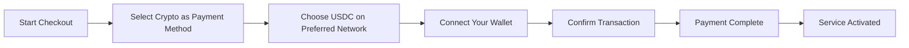
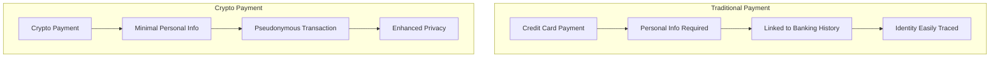
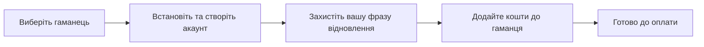

# Впровадження криптовалютних платежів: покращена конфіденційність для вашої поштової служби {#introducing-crypto-payments-enhanced-privacy-for-your-email-service}

## Зміст {#table-of-contents}

* [Передмова](#foreword)
* [Чому криптовалютні платежі важливі](#why-crypto-payments-matter)
* [Як це працює](#how-it-works)
* [Переваги конфіденційності](#privacy-benefits)
* [Технічні деталі](#technical-details)
* [Налаштування вашого криптогаманця](#setting-up-your-crypto-wallet)
  * [MetaMask](#metamask)
  * [Phantom](#phantom)
  * [Coinbase Wallet](#coinbase-wallet)
  * [WalletConnect](#walletconnect)
* [Початок роботи](#getting-started)
* [Погляд у майбутнє](#looking-forward)

## Передмова {#foreword}

У [Forward Email](https://forwardemail.net) ми постійно шукаємо способи покращити вашу [конфіденційність](https://en.wikipedia.org/wiki/Privacy) та безпеку, одночасно роблячи наш сервіс більш доступним. Сьогодні ми раді оголосити, що тепер приймаємо [криптовалютні](https://en.wikipedia.org/wiki/Cryptocurrency) платежі через інтеграцію криптоплатежів від [Stripe](https://stripe.com).

## Чому криптовалютні платежі важливі {#why-crypto-payments-matter}

[Конфіденційність](https://en.wikipedia.org/wiki/Internet_privacy) завжди була в центрі нашого сервісу. Хоча раніше ми пропонували різні способи оплати, криптовалютні платежі забезпечують додатковий рівень конфіденційності, що ідеально відповідає нашій місії. Оплачуючи криптою, ви можете:

* Зберігати більшу анонімність при купівлі наших поштових послуг
* Зменшити обсяг особистої інформації, пов’язаної з вашим поштовим акаунтом
* Тримати ваші фінансові та поштові ідентичності окремо
* Підтримувати зростаючу екосистему [децентралізованих фінансів](https://en.wikipedia.org/wiki/Decentralized_finance)

## Як це працює {#how-it-works}

Ми інтегрували криптоплатіжну систему [Stripe](https://docs.stripe.com/crypto), щоб зробити процес максимально простим. Ось як ви можете оплатити послуги Forward Email за допомогою криптовалюти:

```mermaid
flowchart LR
    A[Start Checkout] --> B[Select Crypto as Payment Method]
    B --> C[Choose USDC on Preferred Network]
    C --> D[Connect Your Wallet]
    D --> E[Confirm Transaction]
    E --> F[Payment Complete]
    F --> G[Service Activated]
```

1. **Виберіть криптовалюту як спосіб оплати**: Під час оформлення замовлення ви побачите опцію "Crypto" поряд із традиційними методами, такими як кредитні картки.

2. **Виберіть вашу криптовалюту**: Наразі ми приймаємо [USDC](https://en.wikipedia.org/wiki/USD_Coin) (USD Coin) на кількох блокчейнах, включно з [Ethereum](https://ethereum.org), [Solana](https://solana.com) та [Polygon](https://polygon.technology). USDC — це стабільна криптовалюта, яка підтримує співвідношення 1:1 з доларом США.

3. **Підключіть ваш гаманець**: Вас буде перенаправлено на безпечну сторінку, де ви зможете підключити ваш улюблений криптогаманець. Ми підтримуємо кілька варіантів гаманців, зокрема:
   * [MetaMask](https://metamask.io)
   * [Phantom](https://phantom.app)
   * [Coinbase Wallet](https://www.coinbase.com/wallet)
   * [WalletConnect](https://walletconnect.com) (сумісний з багатьма іншими гаманцями)

4. **Завершіть оплату**: Підтвердіть транзакцію у вашому гаманці, і все готово! Платіж буде оброблено, а ваша послуга Forward Email активована негайно.

## Переваги конфіденційності {#privacy-benefits}

Використання криптовалюти для підписки Forward Email покращує вашу конфіденційність у кількох аспектах:

```mermaid
graph TD
    subgraph "Traditional Payment"
    A[Credit Card Payment] --> B[Personal Info Required]
    B --> C[Linked to Banking History]
    C --> D[Identity Easily Traced]
    end

    subgraph "Crypto Payment"
    E[Crypto Payment] --> F[Minimal Personal Info]
    F --> G[Pseudonymous Transaction]
    G --> H[Enhanced Privacy]
    end
```

* **Менше особистої інформації**: На відміну від платежів кредитними картками, криптотранзакції не вимагають вашого імені, адреси для виставлення рахунку чи інших особистих даних. Дізнайтеся більше про [конфіденційність транзакцій](https://en.wikipedia.org/wiki/Privacy_coin).
* **Відокремлення від традиційного банкінгу**: Ваш платіж не може бути пов’язаний з вашим банківським рахунком або кредитною історією. Читайте про [фінансову конфіденційність](https://en.wikipedia.org/wiki/Financial_privacy).
* **Конфіденційність блокчейну**: Хоча транзакції в блокчейні публічні, вони є псевдонімними і не пов’язані безпосередньо з вашою реальною особою. Дивіться [техніки конфіденційності блокчейну](https://en.wikipedia.org/wiki/Privacy_and_blockchain).
* **Відповідність нашим цінностям**: Як сервіс, орієнтований на конфіденційність, ми віримо у надання вам контролю над вашою особистою інформацією на кожному кроці. Ознайомтеся з нашою [політикою конфіденційності](/privacy).
## Технічні деталі {#technical-details}

Для тих, хто цікавиться технічними аспектами:

* Ми використовуємо криптовалютну платіжну інфраструктуру [Stripe's](https://docs.stripe.com/crypto/stablecoin-payments), яка обробляє всю складність блокчейн-транзакцій.
* Платежі здійснюються в [USDC](https://www.circle.com/en/usdc) на кількох блокчейнах, включно з [Ethereum](https://ethereum.org), [Solana](https://solana.com) та [Polygon](https://polygon.technology).
* Хоча ви платите криптовалютою, ми отримуємо еквівалентну вартість у доларах США, що дозволяє нам підтримувати стабільні ціни.

## Налаштування вашого криптогаманця {#setting-up-your-crypto-wallet}

Новачок у криптовалюті? Ось як налаштувати гаманці, які ми підтримуємо:

```mermaid
flowchart LR
    A[Виберіть гаманець] --> B[Встановіть та створіть акаунт]
    B --> C[Захистіть вашу фразу відновлення]
    C --> D[Додайте кошти до гаманця]
    D --> E[Готово до оплати]
```

### MetaMask {#metamask}

[MetaMask](https://metamask.io) — один із найпопулярніших Ethereum-гаманців.

1. Відвідайте [сторінку завантаження MetaMask](https://metamask.io/download/)
2. Встановіть розширення для браузера або мобільний додаток
3. Дотримуйтесь інструкцій для створення нового гаманця
4. **Важливо**: Надійно збережіть вашу фразу відновлення
5. Додайте ETH або USDC до гаманця через біржу або пряму покупку
6. [Детальна інструкція з налаштування MetaMask](https://metamask.io/faqs/)

### Phantom {#phantom}

[Phantom](https://phantom.app) — провідний гаманець для Solana.

1. Відвідайте [офіційний сайт Phantom](https://phantom.app/)
2. Завантажте відповідну версію для вашого пристрою
3. Створіть новий гаманець, слідуючи інструкціям на екрані
4. Надійно збережіть вашу фразу відновлення
5. Додайте SOL або USDC до гаманця
6. [Інструкція для гаманця Phantom](https://help.phantom.app/hc/en-us/articles/4406388623251-How-to-create-a-new-wallet)

### Coinbase Wallet {#coinbase-wallet}

[Coinbase Wallet](https://www.coinbase.com/wallet) підтримує кілька блокчейнів.

1. Завантажте [Coinbase Wallet](https://www.coinbase.com/wallet/downloads)
2. Створіть новий гаманець (окремо від акаунту біржі Coinbase)
3. Захистіть вашу фразу відновлення
4. Переведіть або купіть криптовалюту безпосередньо в додатку
5. [Інструкція для Coinbase Wallet](https://www.coinbase.com/learn/tips-and-tutorials/how-to-set-up-a-crypto-wallet)

### WalletConnect {#walletconnect}

[WalletConnect](https://walletconnect.com) — протокол, що з’єднує гаманці з вебсайтами.

1. Спочатку завантажте гаманець, сумісний з WalletConnect (доступно багато варіантів)
2. Під час оформлення замовлення виберіть WalletConnect
3. Відскануйте QR-код за допомогою додатку гаманця
4. Підтвердіть підключення
5. [Гаманці, сумісні з WalletConnect](https://walletconnect.com/registry/wallets)

## Початок роботи {#getting-started}

Готові покращити вашу конфіденційність за допомогою криптоплатежів? Просто виберіть опцію "Крипто" під час оформлення замовлення наступного разу, коли поновлюватимете підписку або оновлюватимете план.

Для отримання додаткової інформації про криптовалюти та технологію блокчейн перегляньте ці ресурси:

* [Що таке криптовалюта?](https://www.investopedia.com/terms/c/cryptocurrency.asp) — Investopedia
* [Пояснення блокчейну](https://www.investopedia.com/terms/b/blockchain.asp) — Investopedia
* [Посібник з цифрової конфіденційності](https://www.eff.org/issues/privacy) — Electronic Frontier Foundation

## Погляд у майбутнє {#looking-forward}

Додавання криптовалютних платежів — це ще один крок у нашій постійній відданості [конфіденційності](https://en.wikipedia.org/wiki/Privacy), [безпеці](https://en.wikipedia.org/wiki/Computer_security) та вибору користувача. Ми віримо, що ваша поштовий сервіс має поважати вашу конфіденційність на кожному рівні — від повідомлень, які ви надсилаєте, до способу оплати послуги.

Як завжди, ми раді отримати ваші відгуки про цю нову опцію оплати. Якщо у вас є питання щодо використання криптовалюти з Forward Email, будь ласка, звертайтеся до нашої [служби підтримки](/help).

---

**Джерела:**

1. [Документація Stripe Crypto](https://docs.stripe.com/crypto)
2. [USDC Stablecoin](https://www.circle.com/en/usdc)
3. [Ethereum Blockchain](https://ethereum.org)
4. [Solana Blockchain](https://solana.com)
5. [Polygon Network](https://polygon.technology)
6. [Electronic Frontier Foundation - Конфіденційність](https://www.eff.org/issues/privacy)
7. [Політика конфіденційності Forward Email](/privacy)
