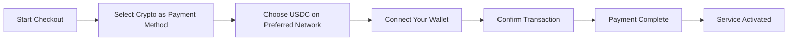
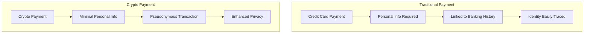
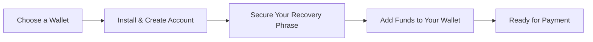

# Giới thiệu Thanh toán bằng tiền điện tử: Nâng cao quyền riêng tư cho dịch vụ email của bạn {#introducing-crypto-payments-enhanced-privacy-for-your-email-service}

## Mục lục {#table-of-contents}

* [Lời nói đầu](#foreword)
* [Tại sao thanh toán bằng tiền điện tử lại quan trọng](#why-crypto-payments-matter)
* [Nó hoạt động như thế nào](#how-it-works)
* [Lợi ích về quyền riêng tư](#privacy-benefits)
* [Chi tiết kỹ thuật](#technical-details)
* [Thiết lập ví tiền điện tử của bạn](#setting-up-your-crypto-wallet)
  * [MetaMask](#metamask)
  * [Ma](#phantom)
  * [Ví Coinbase](#coinbase-wallet)
  * [Ví Connect](#walletconnect)
* [Bắt đầu](#getting-started)
* [Nhìn về phía trước](#looking-forward)

## Lời nói đầu {#foreword}

Tại [Chuyển tiếp Email](https://forwardemail.net), chúng tôi luôn tìm kiếm các giải pháp để cải thiện [sự riêng tư](https://en.wikipedia.org/wiki/Privacy) và bảo mật của bạn, đồng thời giúp dịch vụ dễ tiếp cận hơn. Hôm nay, chúng tôi vui mừng thông báo rằng chúng tôi hiện đã chấp nhận thanh toán [tiền điện tử](https://en.wikipedia.org/wiki/Cryptocurrency) thông qua tích hợp thanh toán tiền điện tử [của Stripe](https://stripe.com).

## Tại sao thanh toán bằng tiền điện tử lại quan trọng {#why-crypto-payments-matter}

[Sự riêng tư](https://en.wikipedia.org/wiki/Internet_privacy) luôn là cốt lõi trong dịch vụ của chúng tôi. Mặc dù chúng tôi đã cung cấp nhiều phương thức thanh toán khác nhau trong quá khứ, thanh toán bằng tiền điện tử cung cấp thêm một lớp bảo mật, hoàn toàn phù hợp với sứ mệnh của chúng tôi. Bằng cách thanh toán bằng tiền điện tử, bạn có thể:

* Duy trì tính ẩn danh cao hơn khi mua dịch vụ email của chúng tôi
* Giảm thiểu thông tin cá nhân liên quan đến tài khoản email của bạn
* Tách biệt thông tin tài chính và email của bạn
* Hỗ trợ hệ sinh thái [tài chính phi tập trung](https://en.wikipedia.org/wiki/Decentralized_finance) đang phát triển

## Cách thức hoạt động {#how-it-works}

Chúng tôi đã tích hợp hệ thống thanh toán tiền điện tử [của Stripe](https://docs.stripe.com/crypto) để quá trình này diễn ra liền mạch nhất có thể. Sau đây là cách bạn có thể thanh toán cho dịch vụ Forward Email bằng tiền điện tử:

1. **Chọn Tiền điện tử làm Phương thức thanh toán**: Khi thanh toán, bạn sẽ thấy "Tiền điện tử" là tùy chọn thanh toán bên cạnh các phương thức truyền thống như thẻ tín dụng.

2. **Chọn loại tiền điện tử của bạn**: Hiện tại, chúng tôi chấp nhận [USDC](https://en.wikipedia.org/wiki/USD_Coin) (USD Coin) trên nhiều blockchain bao gồm [Ethereum](https://ethereum.org), [Solana](https://solana.com) và [Đa giác](https://polygon.technology). USDC là một loại tiền điện tử ổn định, duy trì giá trị 1:1 với đô la Mỹ.

3. **Kết nối Ví của bạn**: Bạn sẽ được chuyển hướng đến một trang bảo mật, nơi bạn có thể kết nối ví tiền điện tử ưa thích của mình. Chúng tôi hỗ trợ nhiều tùy chọn ví, bao gồm:
* [MetaMask](https://metamask.io)
* [Ma](https://phantom.app)
* [Ví Coinbase](https://www.coinbase.com/wallet)
* [Ví Connect](https://walletconnect.com) (tương thích với nhiều ví khác)

4. **Hoàn tất Thanh toán**: Xác nhận giao dịch trong ví của bạn và thế là xong! Thanh toán sẽ được xử lý và dịch vụ Chuyển tiếp Email của bạn sẽ được kích hoạt ngay lập tức.

## Quyền lợi riêng tư {#privacy-benefits}

Sử dụng tiền điện tử cho đăng ký Email Chuyển tiếp của bạn sẽ tăng cường quyền riêng tư của bạn theo nhiều cách:

* **Thông tin Cá nhân được Giảm thiểu**: Không giống như thanh toán bằng thẻ tín dụng, giao dịch tiền điện tử không yêu cầu tên, địa chỉ thanh toán hoặc các thông tin cá nhân khác của bạn. Tìm hiểu thêm về [quyền riêng tư giao dịch](https://en.wikipedia.org/wiki/Privacy_coin).
* **Tách biệt với Ngân hàng Truyền thống**: Khoản thanh toán của bạn không thể được liên kết với tài khoản ngân hàng hoặc lịch sử tín dụng của bạn. Đọc thêm về [quyền riêng tư tài chính](https://en.wikipedia.org/wiki/Financial_privacy).
* **Quyền riêng tư của Blockchain**: Mặc dù các giao dịch Blockchain được công khai, nhưng chúng được ẩn danh và không liên quan trực tiếp đến danh tính ngoài đời thực của bạn. Xem [kỹ thuật bảo mật blockchain](https://en.wikipedia.org/wiki/Privacy_and_blockchain).
* **Phù hợp với các Giá trị của Chúng tôi**: Là một dịch vụ email tập trung vào quyền riêng tư, chúng tôi tin tưởng vào việc trao cho bạn quyền kiểm soát thông tin cá nhân của mình ở mọi bước. Hãy xem [chính sách bảo mật](/privacy) của chúng tôi.

## Chi tiết kỹ thuật {#technical-details}

Đối với những người quan tâm đến khía cạnh kỹ thuật:

* Chúng tôi sử dụng cơ sở hạ tầng thanh toán tiền điện tử [của Stripe](https://docs.stripe.com/crypto/stablecoin-payments), xử lý mọi tính phức tạp của giao dịch blockchain.
* Thanh toán được thực hiện bằng [USDC](https://www.circle.com/en/usdc) trên nhiều blockchain, bao gồm [Ethereum](https://ethereum.org), [Solana](https://solana.com) và [Đa giác](https://polygon.technology).
* Khi bạn thanh toán bằng tiền điện tử, chúng tôi nhận được giá trị tương đương bằng USD, cho phép chúng tôi duy trì mức giá ổn định.

## Thiết lập ví tiền điện tử của bạn {#setting-up-your-crypto-wallet}

Bạn mới biết đến tiền điện tử? Sau đây là cách thiết lập các ví mà chúng tôi hỗ trợ:

### MetaMask {#metamask}

[MetaMask](https://metamask.io) là một trong những ví Ethereum phổ biến nhất.

1. Truy cập [Trang tải xuống MetaMask](https://metamask.io/download/)
2. Cài đặt tiện ích mở rộng trình duyệt hoặc ứng dụng di động
3. Làm theo hướng dẫn thiết lập để tạo ví mới
4. **Quan trọng**: Lưu trữ cụm từ khôi phục của bạn một cách an toàn
5. Thêm ETH hoặc USDC vào ví của bạn thông qua sàn giao dịch hoặc mua trực tiếp
6. [Hướng dẫn thiết lập MetaMask chi tiết](https://metamask.io/faqs/)

### Bóng ma {#phantom}

[Ma](https://phantom.app) là ví Solana hàng đầu.

1. Truy cập [Trang web ma](https://phantom.app/)
2. Tải xuống phiên bản phù hợp với thiết bị của bạn
3. Tạo ví mới theo hướng dẫn trên màn hình
4. Sao lưu cụm từ khôi phục của bạn một cách an toàn
5. Thêm SOL hoặc USDC vào ví của bạn
6. [Hướng dẫn về Ví Phantom](https://help.phantom.app/hc/en-us/articles/4406388623251-How-to-create-a-new-wallet)

### Ví Coinbase {#coinbase-wallet}

[Ví Coinbase](https://www.coinbase.com/wallet) hỗ trợ nhiều blockchain.

1. Tải xuống [Ví Coinbase](https://www.coinbase.com/wallet/downloads)
2. Tạo ví mới (tách biệt với tài khoản sàn giao dịch Coinbase)
3. Bảo mật cụm từ khôi phục của bạn
4. Chuyển hoặc mua tiền điện tử trực tiếp trong ứng dụng
5. [Hướng dẫn về ví Coinbase](https://www.coinbase.com/learn/tips-and-tutorials/how-to-set-up-a-crypto-wallet)

### Kết nối ví {#walletconnect}

[Ví Connect](https://walletconnect.com) là giao thức kết nối ví với trang web.

1. Trước tiên, hãy tải xuống ví tương thích với WalletConnect (có nhiều tùy chọn)
2. Trong quá trình thanh toán, hãy chọn WalletConnect
3. Quét mã QR bằng ứng dụng ví của bạn
4. Chấp thuận kết nối
5. [Ví tương thích với WalletConnect](https://walletconnect.com/registry/wallets)

## Bắt đầu {#getting-started}

Bạn đã sẵn sàng nâng cao quyền riêng tư của mình với thanh toán bằng tiền điện tử chưa? Chỉ cần chọn tùy chọn "Tiền điện tử" khi thanh toán vào lần tiếp theo bạn gia hạn đăng ký hoặc nâng cấp gói cước.

Để biết thêm thông tin về tiền điện tử và công nghệ blockchain, hãy xem các tài nguyên sau:

* [Tiền điện tử là gì?](https://www.investopedia.com/terms/c/cryptocurrency.asp) - Investopedia
* [Giải thích về Blockchain](https://www.investopedia.com/terms/b/blockchain.asp) - Investopedia
* [Hướng dẫn về quyền riêng tư kỹ thuật số](https://www.eff.org/issues/privacy) - Tổ chức Biên giới Điện tử

## Mong đợi {#looking-forward}

Việc bổ sung thanh toán bằng tiền điện tử chỉ là một bước tiến nữa trong cam kết liên tục của chúng tôi đối với [sự riêng tư](https://en.wikipedia.org/wiki/Privacy), [bảo vệ](https://en.wikipedia.org/wiki/Computer_security) và quyền lựa chọn của người dùng. Chúng tôi tin rằng dịch vụ email của bạn phải tôn trọng quyền riêng tư của bạn ở mọi cấp độ—từ tin nhắn bạn gửi đến cách bạn thanh toán cho dịch vụ.

Như thường lệ, chúng tôi hoan nghênh phản hồi của bạn về phương thức thanh toán mới này. Nếu bạn có thắc mắc về việc sử dụng tiền điện tử với Forward Email, vui lòng liên hệ với [đội ngũ hỗ trợ](/help) của chúng tôi.

---

**Tài liệu tham khảo:**

1. [Tài liệu về Stripe Crypto](https://docs.stripe.com/crypto)
2. [Đồng tiền ổn định USDC](https://www.circle.com/en/usdc)
3. [Chuỗi khối Ethereum](https://ethereum.org)
4. [Chuỗi khối Solana](https://solana.com)
5. [Mạng lưới đa giác](https://polygon.technology)
6. [Electronic Frontier Foundation - Quyền riêng tư](https://www.eff.org/issues/privacy)
7. [Chính sách bảo mật email chuyển tiếp](/privacy)