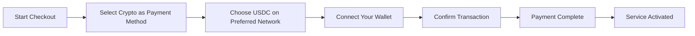
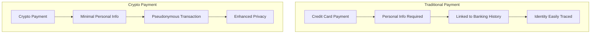
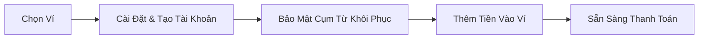

# Giới thiệu Thanh toán Crypto: Tăng cường Quyền riêng tư cho Dịch vụ Email của Bạn {#introducing-crypto-payments-enhanced-privacy-for-your-email-service}

## Mục lục {#table-of-contents}

* [Lời nói đầu](#foreword)
* [Tại sao Thanh toán Crypto Quan trọng](#why-crypto-payments-matter)
* [Cách Thức Hoạt Động](#how-it-works)
* [Lợi ích về Quyền riêng tư](#privacy-benefits)
* [Chi tiết Kỹ thuật](#technical-details)
* [Thiết lập Ví Crypto của Bạn](#setting-up-your-crypto-wallet)
  * [MetaMask](#metamask)
  * [Phantom](#phantom)
  * [Coinbase Wallet](#coinbase-wallet)
  * [WalletConnect](#walletconnect)
* [Bắt đầu](#getting-started)
* [Nhìn về phía trước](#looking-forward)

## Lời nói đầu {#foreword}

Tại [Forward Email](https://forwardemail.net), chúng tôi luôn tìm cách cải thiện [quyền riêng tư](https://en.wikipedia.org/wiki/Privacy) và bảo mật của bạn đồng thời làm cho dịch vụ của chúng tôi dễ tiếp cận hơn. Hôm nay, chúng tôi rất vui mừng thông báo rằng chúng tôi hiện chấp nhận thanh toán bằng [tiền điện tử](https://en.wikipedia.org/wiki/Cryptocurrency) thông qua tích hợp thanh toán crypto của [Stripe](https://stripe.com).

## Tại sao Thanh toán Crypto Quan trọng {#why-crypto-payments-matter}

[Quyền riêng tư](https://en.wikipedia.org/wiki/Internet_privacy) luôn là cốt lõi của dịch vụ chúng tôi. Trong khi trước đây chúng tôi đã cung cấp nhiều phương thức thanh toán khác nhau, thanh toán bằng tiền điện tử mang lại một lớp quyền riêng tư bổ sung phù hợp hoàn hảo với sứ mệnh của chúng tôi. Bằng cách thanh toán bằng crypto, bạn có thể:

* Duy trì sự ẩn danh cao hơn khi mua dịch vụ email của chúng tôi
* Giảm thiểu thông tin cá nhân liên kết với tài khoản email của bạn
* Giữ cho danh tính tài chính và email của bạn tách biệt
* Hỗ trợ hệ sinh thái [tài chính phi tập trung](https://en.wikipedia.org/wiki/Decentralized_finance) đang phát triển

## Cách Thức Hoạt Động {#how-it-works}

Chúng tôi đã tích hợp hệ thống thanh toán crypto của [Stripe](https://docs.stripe.com/crypto) để làm cho quá trình trở nên liền mạch nhất có thể. Dưới đây là cách bạn có thể thanh toán dịch vụ Forward Email bằng tiền điện tử:

```mermaid
flowchart LR
    A[Start Checkout] --> B[Select Crypto as Payment Method]
    B --> C[Choose USDC on Preferred Network]
    C --> D[Connect Your Wallet]
    D --> E[Confirm Transaction]
    E --> F[Payment Complete]
    F --> G[Service Activated]
```

1. **Chọn Crypto làm Phương thức Thanh toán**: Khi thanh toán, bạn sẽ thấy "Crypto" là một tùy chọn thanh toán bên cạnh các phương thức truyền thống như thẻ tín dụng.

2. **Chọn Tiền điện tử của Bạn**: Hiện tại, chúng tôi chấp nhận [USDC](https://en.wikipedia.org/wiki/USD_Coin) (USD Coin) trên nhiều blockchain bao gồm [Ethereum](https://ethereum.org), [Solana](https://solana.com), và [Polygon](https://polygon.technology). USDC là một loại tiền điện tử ổn định giữ giá trị 1:1 với đô la Mỹ.

3. **Kết nối Ví của Bạn**: Bạn sẽ được chuyển hướng đến một trang an toàn nơi bạn có thể kết nối ví crypto ưa thích của mình. Chúng tôi hỗ trợ nhiều tùy chọn ví bao gồm:
   * [MetaMask](https://metamask.io)
   * [Phantom](https://phantom.app)
   * [Coinbase Wallet](https://www.coinbase.com/wallet)
   * [WalletConnect](https://walletconnect.com) (tương thích với nhiều ví khác)

4. **Hoàn tất Thanh toán**: Xác nhận giao dịch trong ví của bạn, và bạn đã sẵn sàng! Thanh toán sẽ được xử lý và dịch vụ Forward Email của bạn sẽ được kích hoạt ngay lập tức.

## Lợi ích về Quyền riêng tư {#privacy-benefits}

Sử dụng tiền điện tử cho đăng ký Forward Email của bạn tăng cường quyền riêng tư theo nhiều cách:

```mermaid
graph TD
    subgraph "Traditional Payment"
    A[Credit Card Payment] --> B[Personal Info Required]
    B --> C[Linked to Banking History]
    C --> D[Identity Easily Traced]
    end

    subgraph "Crypto Payment"
    E[Crypto Payment] --> F[Minimal Personal Info]
    F --> G[Pseudonymous Transaction]
    G --> H[Enhanced Privacy]
    end
```

* **Giảm Thông tin Cá nhân**: Khác với thanh toán bằng thẻ tín dụng, giao dịch crypto không yêu cầu tên, địa chỉ thanh toán hoặc các thông tin cá nhân khác. Tìm hiểu thêm về [quyền riêng tư giao dịch](https://en.wikipedia.org/wiki/Privacy_coin).
* **Tách biệt với Ngân hàng Truyền thống**: Thanh toán của bạn không thể liên kết với tài khoản ngân hàng hoặc lịch sử tín dụng của bạn. Đọc về [quyền riêng tư tài chính](https://en.wikipedia.org/wiki/Financial_privacy).
* **Quyền riêng tư trên Blockchain**: Mặc dù các giao dịch blockchain là công khai, chúng mang tính ẩn danh giả danh và không liên kết trực tiếp với danh tính thực của bạn. Xem [kỹ thuật quyền riêng tư trên blockchain](https://en.wikipedia.org/wiki/Privacy_and_blockchain).
* **Phù hợp với Giá trị của Chúng tôi**: Là một dịch vụ email tập trung vào quyền riêng tư, chúng tôi tin tưởng vào việc trao quyền kiểm soát thông tin cá nhân của bạn ở mọi bước. Xem chính sách [quyền riêng tư](/privacy).
## Chi Tiết Kỹ Thuật {#technical-details}

Dành cho những ai quan tâm đến các khía cạnh kỹ thuật:

* Chúng tôi sử dụng cơ sở hạ tầng thanh toán tiền điện tử của [Stripe's](https://docs.stripe.com/crypto/stablecoin-payments), xử lý tất cả sự phức tạp của các giao dịch blockchain.
* Thanh toán được thực hiện bằng [USDC](https://www.circle.com/en/usdc) trên nhiều blockchain bao gồm [Ethereum](https://ethereum.org), [Solana](https://solana.com), và [Polygon](https://polygon.technology).
* Trong khi bạn thanh toán bằng tiền điện tử, chúng tôi nhận giá trị tương đương bằng USD, cho phép chúng tôi duy trì giá cả ổn định.

## Thiết Lập Ví Tiền Điện Tử Của Bạn {#setting-up-your-crypto-wallet}

Mới với tiền điện tử? Đây là cách thiết lập các ví mà chúng tôi hỗ trợ:

```mermaid
flowchart LR
    A[Chọn Ví] --> B[Cài Đặt & Tạo Tài Khoản]
    B --> C[Bảo Mật Cụm Từ Khôi Phục]
    C --> D[Thêm Tiền Vào Ví]
    D --> E[Sẵn Sàng Thanh Toán]
```

### MetaMask {#metamask}

[MetaMask](https://metamask.io) là một trong những ví Ethereum phổ biến nhất.

1. Truy cập [trang tải MetaMask](https://metamask.io/download/)
2. Cài đặt tiện ích mở rộng trình duyệt hoặc ứng dụng di động
3. Làm theo hướng dẫn thiết lập để tạo ví mới
4. **Quan trọng**: Lưu trữ cụm từ khôi phục của bạn một cách an toàn
5. Thêm ETH hoặc USDC vào ví của bạn thông qua sàn giao dịch hoặc mua trực tiếp
6. [Hướng Dẫn Thiết Lập MetaMask Chi Tiết](https://metamask.io/faqs/)

### Phantom {#phantom}

[Phantom](https://phantom.app) là ví hàng đầu cho Solana.

1. Truy cập [trang web Phantom](https://phantom.app/)
2. Tải phiên bản phù hợp cho thiết bị của bạn
3. Tạo ví mới theo hướng dẫn trên màn hình
4. Sao lưu cụm từ khôi phục một cách an toàn
5. Thêm SOL hoặc USDC vào ví của bạn
6. [Hướng Dẫn Ví Phantom](https://help.phantom.app/hc/en-us/articles/4406388623251-How-to-create-a-new-wallet)

### Coinbase Wallet {#coinbase-wallet}

[Coinbase Wallet](https://www.coinbase.com/wallet) hỗ trợ nhiều blockchain.

1. Tải xuống [Coinbase Wallet](https://www.coinbase.com/wallet/downloads)
2. Tạo ví mới (tách biệt với tài khoản sàn Coinbase)
3. Bảo mật cụm từ khôi phục của bạn
4. Chuyển hoặc mua tiền điện tử trực tiếp trong ứng dụng
5. [Hướng Dẫn Ví Coinbase](https://www.coinbase.com/learn/tips-and-tutorials/how-to-set-up-a-crypto-wallet)

### WalletConnect {#walletconnect}

[WalletConnect](https://walletconnect.com) là giao thức kết nối ví với các trang web.

1. Trước tiên, tải ví tương thích WalletConnect (có nhiều lựa chọn)
2. Khi thanh toán, chọn WalletConnect
3. Quét mã QR bằng ứng dụng ví của bạn
4. Phê duyệt kết nối
5. [Ví Tương Thích WalletConnect](https://walletconnect.com/registry/wallets)

## Bắt Đầu {#getting-started}

Sẵn sàng nâng cao quyền riêng tư với thanh toán tiền điện tử? Chỉ cần chọn tùy chọn "Crypto" khi thanh toán lần tiếp theo khi bạn gia hạn đăng ký hoặc nâng cấp gói.

Để biết thêm thông tin về tiền điện tử và công nghệ blockchain, hãy xem các tài nguyên sau:

* [Tiền Điện Tử Là Gì?](https://www.investopedia.com/terms/c/cryptocurrency.asp) - Investopedia
* [Giải Thích Blockchain](https://www.investopedia.com/terms/b/blockchain.asp) - Investopedia
* [Hướng Dẫn Quyền Riêng Tư Kỹ Thuật Số](https://www.eff.org/issues/privacy) - Electronic Frontier Foundation

## Hướng Tới Tương Lai {#looking-forward}

Việc thêm thanh toán bằng tiền điện tử chỉ là một bước nữa trong cam kết liên tục của chúng tôi về [quyền riêng tư](https://en.wikipedia.org/wiki/Privacy), [bảo mật](https://en.wikipedia.org/wiki/Computer_security), và sự lựa chọn của người dùng. Chúng tôi tin rằng dịch vụ email của bạn nên tôn trọng quyền riêng tư ở mọi cấp độ—từ các tin nhắn bạn gửi đến cách bạn thanh toán cho dịch vụ.

Như thường lệ, chúng tôi hoan nghênh phản hồi của bạn về tùy chọn thanh toán mới này. Nếu bạn có câu hỏi về việc sử dụng tiền điện tử với Forward Email, vui lòng liên hệ với [đội ngũ hỗ trợ](/help) của chúng tôi.

---

**Tài liệu tham khảo:**

1. [Tài liệu Crypto của Stripe](https://docs.stripe.com/crypto)
2. [USDC Stablecoin](https://www.circle.com/en/usdc)
3. [Blockchain Ethereum](https://ethereum.org)
4. [Blockchain Solana](https://solana.com)
5. [Mạng Polygon](https://polygon.technology)
6. [Electronic Frontier Foundation - Quyền Riêng Tư](https://www.eff.org/issues/privacy)
7. [Chính Sách Quyền Riêng Tư Forward Email](/privacy)
