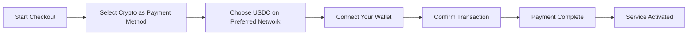
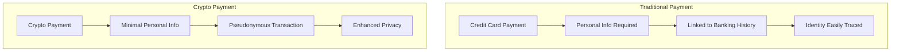
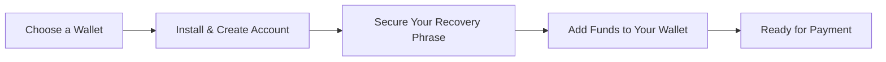

# 推出加密支付：增强您的电子邮件服务的隐私性 {#introducing-crypto-payments-enhanced-privacy-for-your-email-service}

## 目录 {#table-of-contents}

* [前言](#foreword)
* [为什么加密支付很重要](#why-crypto-payments-matter)
* [工作原理](#how-it-works)
* [隐私优势](#privacy-benefits)
* [技术细节](#technical-details)
* [设置你的加密钱包](#setting-up-your-crypto-wallet)
  * [MetaMask](#metamask)
  * [幻影](#phantom)
  * [Coinbase钱包](#coinbase-wallet)
  * [WalletConnect](#walletconnect)
* [入门](#getting-started)
* [期待](#looking-forward)

## 前言 {#foreword}

在 [转发电子邮件](https://forwardemail.net)，我们不断探索提升您的 [隐私](https://en.wikipedia.org/wiki/Privacy) 体验和安全性的方法，同时让我们的服务更便捷。今天，我们很高兴地宣布，我们现已通过 [Stripe的](https://stripe.com) 加密支付集成接受 [加密货币](https://en.wikipedia.org/wiki/Cryptocurrency) 付款。

## 为什么加密支付很重要 {#why-crypto-payments-matter}

[隐私](https://en.wikipedia.org/wiki/Internet_privacy) 始终是我们服务的核心。虽然我们过去提供过多种支付方式，但加密货币支付提供了额外的隐私保障，这与我们的使命完美契合。使用加密货币支付，您可以：

* 购买我们的电子邮件服务时，保持更高的匿名性
* 减少与您的电子邮件帐户绑定的个人信息
* 将您的财务身份和电子邮件身份分开
* 支持不断发展的 [去中心化金融](https://en.wikipedia.org/wiki/Decentralized_finance) 生态系统

## 工作原理 {#how-it-works}

我们已集成 [Stripe的](https://docs.stripe.com/crypto) 加密支付系统，使流程尽可能流畅。以下是使用加密货币支付转发邮件服务的方法：

1. **选择加密货币作为您的付款方式**：结账时，您会看到“加密货币”作为付款选项，与信用卡等传统方式并列。

2. **选择您的加密货币**：目前，我们接受多个区块链上的 [USDC](https://en.wikipedia.org/wiki/USD_Coin)（USD 币），包括 [以太坊](https://ethereum.org)、[索拉纳](https://solana.com) 和 [多边形](https://polygon.technology)。USDC 是一种稳定的加密货币，与美元保持 1:1 的汇率。

3. **连接您的钱包**：您将被重定向到一个安全页面，您可以在此连接您首选的加密钱包。我们支持多种钱包选项，包括：
* [MetaMask](https://metamask.io)
* [幻影](https://phantom.app)
* [Coinbase钱包](https://www.coinbase.com/wallet)
* [WalletConnect](https://walletconnect.com)（兼容许多其他钱包）

4. **完成付款**：在您的钱包中确认交易，一切就绪！付款将被处理，您的“转发电子邮件”服务将立即激活。

## 隐私权益 {#privacy-benefits}

使用加密货币订阅转发电子邮件可以通过多种方式增强您的隐私：

* **减少个人信息**：与信用卡支付不同，加密货币交易不需要您的姓名、账单地址或其他个人信息。了解更多关于 [交易隐私](https://en.wikipedia.org/wiki/Privacy_coin) 的信息。
* **与传统银行业务分离**：您的付款无法与您的银行账户或信用记录关联。了解 [财务隐私](https://en.wikipedia.org/wiki/Financial_privacy) 的信息。
* **区块链隐私**：虽然区块链交易是公开的，但它们是匿名的，不会直接与您的真实身份关联。请参阅 [区块链隐私技术](https://en.wikipedia.org/wiki/Privacy_and_blockchain)。
* **与我们的价值观一致**：作为一家注重隐私的电子邮件服务公司，我们致力于让您在每一步都掌控自己的个人信息。查看我们的 [隐私政策](/privacy)。

## 技术细节 {#technical-details}

对于那些对技术方面感兴趣的人：

* 我们使用 [Stripe的](https://docs.stripe.com/crypto/stablecoin-payments) 加密支付基础设施，它可以处理区块链交易的所有复杂性。
* 付款在 [USDC](https://www.circle.com/en/usdc) 中进行，涉及多个区块链，包括 [以太坊](https://ethereum.org)、[索拉纳](https://solana.com) 和 [多边形](https://polygon.technology)。
* 当您使用加密货币付款时，我们会收到等值的美元，从而使我们能够保持价格稳定。

## 设置您的加密钱包 {#setting-up-your-crypto-wallet}

加密货币新手？以下是如何设置我们支持的钱包：

### 元掩码 {#metamask}

[MetaMask](https://metamask.io) 是最受欢迎的以太坊钱包之一。

1. 访问 [MetaMask 下载页面](https://metamask.io/download/)
2. 安装浏览器扩展程序或移动应用
3. 按照设置说明创建新钱包
4. **重要提示**：请安全存储您的恢复短语
5. 通过交易所或直接购买将 ETH 或 USDC 添加到您的钱包
6. [MetaMask 详细设置指南](https://metamask.io/faqs/)

### 幻影 {#phantom}

[幻影](https://phantom.app) 是领先的 Solana 钱包。

1. 访问 [幻影网站](https://phantom.app/)
2. 下载适合您设备的版本
3. 按照屏幕上的说明创建新钱包
4. 安全备份您的恢复短语
5. 将 SOL 或 USDC 添加到您的钱包
6. [Phantom 钱包指南](https://help.phantom.app/hc/en-us/articles/4406388623251-How-to-create-a-new-wallet)

### Coinbase 钱包 {#coinbase-wallet}

[Coinbase钱包](https://www.coinbase.com/wallet) 支持多个区块链。

1. 下载 [Coinbase钱包](https://www.coinbase.com/wallet/downloads)
2. 创建新钱包（独立于 Coinbase 交易账户）
3. 保护您的恢复短语
4. 直接在应用中转账或购买加密货币
5. [Coinbase 钱包指南](https://www.coinbase.com/learn/tips-and-tutorials/how-to-set-up-a-crypto-wallet)

### 钱包连接 {#walletconnect}

[WalletConnect](https://walletconnect.com) 是一种将钱包连接到网站的协议。

1. 首先，下载一个兼容 WalletConnect 的钱包（有很多选项可用）
2. 结账时，选择 WalletConnect
3. 使用钱包应用扫描二维码
4. 批准连接
5. [WalletConnect 兼容钱包](https://walletconnect.com/registry/wallets)

## 入门指南 {#getting-started}

准备好通过加密支付增强您的隐私了吗？下次续订或升级套餐时，只需在结账时选择“加密”选项即可。

有关加密货币和区块链技术的更多信息，请查看以下资源：

* [什么是加密货币？](https://www.investopedia.com/terms/c/cryptocurrency.asp) - Investopedia
* [区块链解释](https://www.investopedia.com/terms/b/blockchain.asp) - Investopedia
* [数字隐私指南](https://www.eff.org/issues/privacy) - 电子前沿基金会

## 期待 {#looking-forward}

添加加密货币支付功能只是我们持续致力于 [隐私](https://en.wikipedia.org/wiki/Privacy)、[安全](https://en.wikipedia.org/wiki/Computer_security) 和用户选择的承诺的又一步。我们相信，您的电子邮件服务应该在各个层面尊重您的隐私——从您发送的邮件到您支付服务的方式。

与往常一样，我们欢迎您就此新付款方式提出反馈。如果您对使用加密货币转发电子邮件有任何疑问，请联系我们的 [支持团队](/help)。

---

**参考：**

1. [Stripe 加密文档](https://docs.stripe.com/crypto)
2. [USDC 稳定币](https://www.circle.com/en/usdc)
3. [以太坊区块链](https://ethereum.org)
4. [Solana 区块链](https://solana.com)
5. [多边形网络](https://polygon.technology)
6. [电子前沿基金会 - 隐私](https://www.eff.org/issues/privacy)
7. [转发电子邮件隐私政策](/privacy)