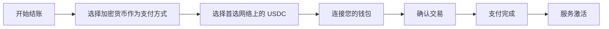
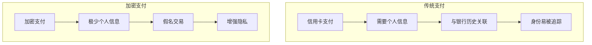
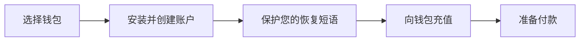

# 介绍加密支付：为您的电子邮件服务增强隐私保护 {#introducing-crypto-payments-enhanced-privacy-for-your-email-service}

## 目录 {#table-of-contents}

* [前言](#foreword)
* [为什么加密支付很重要](#why-crypto-payments-matter)
* [工作原理](#how-it-works)
* [隐私优势](#privacy-benefits)
* [技术细节](#technical-details)
* [设置您的加密钱包](#setting-up-your-crypto-wallet)
  * [MetaMask](#metamask)
  * [Phantom](#phantom)
  * [Coinbase Wallet](#coinbase-wallet)
  * [WalletConnect](#walletconnect)
* [开始使用](#getting-started)
* [展望未来](#looking-forward)

## 前言 {#foreword}

在 [Forward Email](https://forwardemail.net)，我们不断寻找提升您的[隐私](https://en.wikipedia.org/wiki/Privacy)和安全性的方式，同时让我们的服务更易于访问。今天，我们很高兴地宣布，我们现在通过 [Stripe](https://stripe.com) 的加密支付集成接受[加密货币](https://en.wikipedia.org/wiki/Cryptocurrency)支付。

## 为什么加密支付很重要 {#why-crypto-payments-matter}

[隐私](https://en.wikipedia.org/wiki/Internet_privacy)一直是我们服务的核心。虽然我们过去提供了多种支付方式，但加密货币支付为隐私提供了额外的保护层，这与我们的使命完美契合。通过使用加密货币支付，您可以：

* 在购买我们的电子邮件服务时保持更高的匿名性
* 减少与您的电子邮件账户相关的个人信息
* 保持您的财务身份和电子邮件身份分离
* 支持不断发展的[去中心化金融](https://en.wikipedia.org/wiki/Decentralized_finance)生态系统

## 工作原理 {#how-it-works}

我们集成了 [Stripe](https://docs.stripe.com/crypto) 的加密支付系统，使流程尽可能顺畅。以下是您如何使用加密货币支付 Forward Email 服务：

```mermaid
flowchart LR
    A[开始结账] --> B[选择加密货币作为支付方式]
    B --> C[选择首选网络上的 USDC]
    C --> D[连接您的钱包]
    D --> E[确认交易]
    E --> F[支付完成]
    F --> G[服务激活]
```

1. **选择加密货币作为支付方式**：结账时，您会看到“加密货币”作为支付选项，与信用卡等传统方式并列。

2. **选择您的加密货币**：目前，我们接受多条区块链上的 [USDC](https://en.wikipedia.org/wiki/USD_Coin)（美元硬币），包括 [Ethereum](https://ethereum.org)、[Solana](https://solana.com) 和 [Polygon](https://polygon.technology)。USDC 是一种稳定币，价值与美元保持1:1。

3. **连接您的钱包**：您将被重定向到一个安全页面，连接您首选的加密钱包。我们支持多种钱包选项，包括：
   * [MetaMask](https://metamask.io)
   * [Phantom](https://phantom.app)
   * [Coinbase Wallet](https://www.coinbase.com/wallet)
   * [WalletConnect](https://walletconnect.com)（兼容许多其他钱包）

4. **完成支付**：在您的钱包中确认交易，完成支付！支付将被处理，您的 Forward Email 服务将立即激活。

## 隐私优势 {#privacy-benefits}

使用加密货币订阅 Forward Email 可在多个方面增强您的隐私：

```mermaid
graph TD
    subgraph "传统支付"
    A[信用卡支付] --> B[需要个人信息]
    B --> C[与银行历史关联]
    C --> D[身份易被追踪]
    end

    subgraph "加密支付"
    E[加密支付] --> F[极少个人信息]
    F --> G[假名交易]
    G --> H[增强隐私]
    end
```

* **减少个人信息**：与信用卡支付不同，加密交易不需要您的姓名、账单地址或其他个人信息。了解更多关于[交易隐私](https://en.wikipedia.org/wiki/Privacy_coin)。
* **与传统银行分离**：您的支付无法与银行账户或信用历史关联。阅读关于[金融隐私](https://en.wikipedia.org/wiki/Financial_privacy)的内容。
* **区块链隐私**：虽然区块链交易是公开的，但它们是以假名方式进行的，不直接关联您的真实身份。参见[区块链隐私技术](https://en.wikipedia.org/wiki/Privacy_and_blockchain)。
* **符合我们的价值观**：作为一家注重隐私的电子邮件服务，我们相信在每一步都让您掌控个人信息。查看我们的[隐私政策](/privacy)。
## 技术细节 {#technical-details}

对于关注技术细节的用户：

* 我们使用 [Stripe](https://docs.stripe.com/crypto/stablecoin-payments) 的加密支付基础设施，处理所有区块链交易的复杂性。
* 支付使用多条区块链上的 [USDC](https://www.circle.com/en/usdc)，包括 [Ethereum](https://ethereum.org)、[Solana](https://solana.com) 和 [Polygon](https://polygon.technology)。
* 虽然您使用加密货币支付，但我们收到的是等值的美元，从而保持价格稳定。

## 设置您的加密钱包 {#setting-up-your-crypto-wallet}

刚接触加密货币？以下是我们支持的钱包设置方法：

```mermaid
flowchart LR
    A[选择钱包] --> B[安装并创建账户]
    B --> C[保护您的恢复短语]
    C --> D[向钱包充值]
    D --> E[准备付款]
```

### MetaMask {#metamask}

[MetaMask](https://metamask.io) 是最受欢迎的以太坊钱包之一。

1. 访问 [MetaMask 下载页面](https://metamask.io/download/)
2. 安装浏览器扩展或移动应用
3. 按照设置说明创建新钱包
4. **重要**：安全保存您的恢复短语
5. 通过交易所或直接购买向钱包添加 ETH 或 USDC
6. [详细的 MetaMask 设置指南](https://metamask.io/faqs/)

### Phantom {#phantom}

[Phantom](https://phantom.app) 是领先的 Solana 钱包。

1. 访问 [Phantom 官网](https://phantom.app/)
2. 下载适合您设备的版本
3. 按照屏幕指示创建新钱包
4. 安全备份您的恢复短语
5. 向钱包添加 SOL 或 USDC
6. [Phantom 钱包指南](https://help.phantom.app/hc/en-us/articles/4406388623251-How-to-create-a-new-wallet)

### Coinbase Wallet {#coinbase-wallet}

[Coinbase Wallet](https://www.coinbase.com/wallet) 支持多条区块链。

1. 下载 [Coinbase Wallet](https://www.coinbase.com/wallet/downloads)
2. 创建新钱包（与 Coinbase 交易账户分开）
3. 保护您的恢复短语
4. 在应用内直接转账或购买加密货币
5. [Coinbase 钱包指南](https://www.coinbase.com/learn/tips-and-tutorials/how-to-set-up-a-crypto-wallet)

### WalletConnect {#walletconnect}

[WalletConnect](https://walletconnect.com) 是连接钱包与网站的协议。

1. 首先，下载支持 WalletConnect 的钱包（有多种选择）
2. 结账时选择 WalletConnect
3. 用钱包应用扫描二维码
4. 批准连接
5. [WalletConnect 支持的钱包列表](https://walletconnect.com/registry/wallets)

## 入门指南 {#getting-started}

准备好通过加密支付提升您的隐私了吗？下次续订订阅或升级套餐时，只需选择结账时的“加密货币”选项即可。

想了解更多关于加密货币和区块链技术的信息，请查看以下资源：

* [什么是加密货币？](https://www.investopedia.com/terms/c/cryptocurrency.asp) - Investopedia
* [区块链解析](https://www.investopedia.com/terms/b/blockchain.asp) - Investopedia
* [数字隐私指南](https://www.eff.org/issues/privacy) - 电子前沿基金会

## 展望未来 {#looking-forward}

添加加密货币支付只是我们持续致力于[隐私](https://en.wikipedia.org/wiki/Privacy)、[安全](https://en.wikipedia.org/wiki/Computer_security)和用户选择的又一步。我们相信您的电子邮件服务应在每个层面尊重您的隐私——从您发送的邮件到您支付服务的方式。

一如既往，我们欢迎您对这一新支付选项的反馈。如果您对使用 Forward Email 的加密货币有任何疑问，请联系我们的[支持团队](/help)。

---

**参考资料：**

1. [Stripe 加密文档](https://docs.stripe.com/crypto)
2. [USDC 稳定币](https://www.circle.com/en/usdc)
3. [以太坊区块链](https://ethereum.org)
4. [Solana 区块链](https://solana.com)
5. [Polygon 网络](https://polygon.technology)
6. [电子前沿基金会 - 隐私](https://www.eff.org/issues/privacy)
7. [Forward Email 隐私政策](/privacy)
