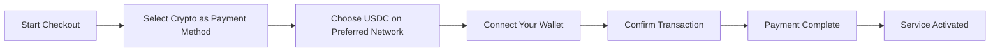
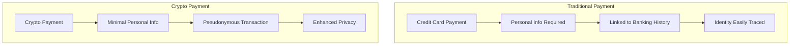
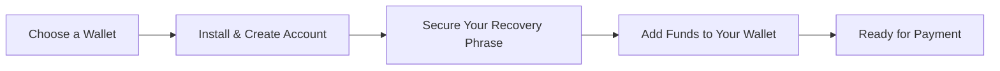

# Introducing Crypto Payments: Enhanced Privacy for Your Email Service

## Table of Contents

* [Foreword](#foreword)
* [Why Crypto Payments Matter](#why-crypto-payments-matter)
* [How It Works](#how-it-works)
* [Privacy Benefits](#privacy-benefits)
* [Technical Details](#technical-details)
* [Setting Up Your Crypto Wallet](#setting-up-your-crypto-wallet)
  * [MetaMask](#metamask)
  * [Phantom](#phantom)
  * [Coinbase Wallet](#coinbase-wallet)
  * [WalletConnect](#walletconnect)
* [Getting Started](#getting-started)
* [Looking Forward](#looking-forward)

## Foreword

At [Forward Email](https://forwardemail.net), we're constantly looking for ways to improve your [privacy](https://en.wikipedia.org/wiki/Privacy) and security while making our service more accessible. Today, we're excited to announce that we now accept [cryptocurrency](https://en.wikipedia.org/wiki/Cryptocurrency) payments through [Stripe's](https://stripe.com) crypto payment integration.

## Why Crypto Payments Matter

[Privacy](https://en.wikipedia.org/wiki/Internet_privacy) has always been at the core of our service. While we've offered various payment methods in the past, cryptocurrency payments provide an additional layer of privacy that aligns perfectly with our mission. By paying with crypto, you can:

* Maintain greater anonymity when purchasing our email services
* Reduce the personal information tied to your email account
* Keep your financial and email identities separate
* Support the growing [decentralized finance](https://en.wikipedia.org/wiki/Decentralized_finance) ecosystem

## How It Works

We've integrated [Stripe's](https://docs.stripe.com/crypto) crypto payment system to make the process as seamless as possible. Here's how you can pay for Forward Email services using cryptocurrency:

1. **Select Crypto as Your Payment Method**: When checking out, you'll see "Crypto" as a payment option alongside traditional methods like credit cards.

2. **Choose Your Cryptocurrency**: Currently, we accept [USDC](https://en.wikipedia.org/wiki/USD_Coin) (USD Coin) on multiple blockchains including [Ethereum](https://ethereum.org), [Solana](https://solana.com), and [Polygon](https://polygon.technology). USDC is a stable cryptocurrency that maintains a 1:1 value with the US dollar.

3. **Connect Your Wallet**: You'll be redirected to a secure page where you can connect your preferred crypto wallet. We support multiple wallet options including:
   * [MetaMask](https://metamask.io)
   * [Phantom](https://phantom.app)
   * [Coinbase Wallet](https://www.coinbase.com/wallet)
   * [WalletConnect](https://walletconnect.com) (compatible with many other wallets)

4. **Complete Your Payment**: Confirm the transaction in your wallet, and you're all set! The payment will be processed, and your Forward Email service will be activated immediately.

## Privacy Benefits

Using cryptocurrency for your Forward Email subscription enhances your privacy in several ways:

* **Reduced Personal Information**: Unlike credit card payments, crypto transactions don't require your name, billing address, or other personal details. Learn more about [transaction privacy](https://en.wikipedia.org/wiki/Privacy_coin).
* **Separation from Traditional Banking**: Your payment can't be linked to your bank account or credit history. Read about [financial privacy](https://en.wikipedia.org/wiki/Financial_privacy).
* **Blockchain Privacy**: While blockchain transactions are public, they're pseudonymous and not directly tied to your real-world identity. See [blockchain privacy techniques](https://en.wikipedia.org/wiki/Privacy_and_blockchain).
* **Consistent with Our Values**: As a privacy-focused email service, we believe in giving you control over your personal information at every step. Check out our [privacy policy](/privacy).

## Technical Details

For those interested in the technical aspects:

* We use [Stripe's](https://docs.stripe.com/crypto/stablecoin-payments) crypto payment infrastructure, which handles all the complexity of blockchain transactions.
* Payments are made in [USDC](https://www.circle.com/en/usdc) on multiple blockchains including [Ethereum](https://ethereum.org), [Solana](https://solana.com), and [Polygon](https://polygon.technology).
* While you pay in cryptocurrency, we receive the equivalent value in USD, allowing us to maintain stable pricing.

## Setting Up Your Crypto Wallet

New to cryptocurrency? Here's how to set up the wallets we support:

### MetaMask

[MetaMask](https://metamask.io) is one of the most popular Ethereum wallets.

1. Visit the [MetaMask download page](https://metamask.io/download/)
2. Install the browser extension or mobile app
3. Follow the setup instructions to create a new wallet
4. **Important**: Securely store your recovery phrase
5. Add ETH or USDC to your wallet through an exchange or direct purchase
6. [Detailed MetaMask Setup Guide](https://metamask.io/faqs/)

### Phantom

[Phantom](https://phantom.app) is a leading Solana wallet.

1. Visit the [Phantom website](https://phantom.app/)
2. Download the appropriate version for your device
3. Create a new wallet following the on-screen instructions
4. Securely back up your recovery phrase
5. Add SOL or USDC to your wallet
6. [Phantom Wallet Guide](https://help.phantom.app/hc/en-us/articles/4406388623251-How-to-create-a-new-wallet)

### Coinbase Wallet

[Coinbase Wallet](https://www.coinbase.com/wallet) supports multiple blockchains.

1. Download [Coinbase Wallet](https://www.coinbase.com/wallet/downloads)
2. Create a new wallet (separate from Coinbase exchange account)
3. Secure your recovery phrase
4. Transfer or purchase crypto directly in the app
5. [Coinbase Wallet Guide](https://www.coinbase.com/learn/tips-and-tutorials/how-to-set-up-a-crypto-wallet)

### WalletConnect

[WalletConnect](https://walletconnect.com) is a protocol that connects wallets to websites.

1. First, download a WalletConnect-compatible wallet (many options available)
2. During checkout, select WalletConnect
3. Scan the QR code with your wallet app
4. Approve the connection
5. [WalletConnect Compatible Wallets](https://walletconnect.com/registry/wallets)

## Getting Started

Ready to enhance your privacy with crypto payments? Simply select the "Crypto" option during checkout the next time you renew your subscription or upgrade your plan.

For more information about cryptocurrencies and blockchain technology, check out these resources:

* [What is Cryptocurrency?](https://www.investopedia.com/terms/c/cryptocurrency.asp) - Investopedia
* [Blockchain Explained](https://www.investopedia.com/terms/b/blockchain.asp) - Investopedia
* [Digital Privacy Guide](https://www.eff.org/issues/privacy) - Electronic Frontier Foundation

## Looking Forward

Adding cryptocurrency payments is just one more step in our ongoing commitment to [privacy](https://en.wikipedia.org/wiki/Privacy), [security](https://en.wikipedia.org/wiki/Computer_security), and user choice. We believe that your email service should respect your privacy at every level—from the messages you send to how you pay for the service.

As always, we welcome your feedback on this new payment option. If you have questions about using cryptocurrency with Forward Email, please reach out to our [support team](/help).

---

**References:**

1. [Stripe Crypto Documentation](https://docs.stripe.com/crypto)
2. [USDC Stablecoin](https://www.circle.com/en/usdc)
3. [Ethereum Blockchain](https://ethereum.org)
4. [Solana Blockchain](https://solana.com)
5. [Polygon Network](https://polygon.technology)
6. [Electronic Frontier Foundation - Privacy](https://www.eff.org/issues/privacy)
7. [Forward Email Privacy Policy](/privacy)
