# دعم بروتوكولات RFC للبريد الإلكتروني - دليل كامل للمعايير والمواصفات {#email-rfc-protocol-support---complete-standards--specifications-guide}


## جدول المحتويات {#table-of-contents}

* [حول هذا المستند](#about-this-document)
  * [نظرة عامة على البنية](#architecture-overview)
* [مقارنة خدمات البريد الإلكتروني - دعم البروتوكولات والامتثال لمعايير RFC](#email-service-comparison---protocol-support--rfc-standards-compliance)
  * [تصور دعم البروتوكولات](#protocol-support-visualization)
* [بروتوكولات البريد الإلكتروني الأساسية](#core-email-protocols)
  * [تدفق بروتوكول البريد الإلكتروني](#email-protocol-flow)
* [بروتوكول IMAP4 للبريد الإلكتروني والامتدادات](#imap4-email-protocol-and-extensions)
  * [اختلافات بروتوكول IMAP عن مواصفات RFC](#imap-protocol-differences-from-rfc-specifications)
  * [امتدادات IMAP غير مدعومة](#imap-extensions-not-supported)
* [بروتوكول POP3 للبريد الإلكتروني والامتدادات](#pop3-email-protocol-and-extensions)
  * [اختلافات بروتوكول POP3 عن مواصفات RFC](#pop3-protocol-differences-from-rfc-specifications)
  * [امتدادات POP3 غير مدعومة](#pop3-extensions-not-supported)
* [بروتوكول SMTP للبريد الإلكتروني والامتدادات](#smtp-email-protocol-and-extensions)
  * [إشعارات حالة التسليم (DSN)](#delivery-status-notifications-dsn)
  * [دعم REQUIRETLS](#requiretls-support)
  * [امتدادات SMTP غير مدعومة](#smtp-extensions-not-supported)
* [بروتوكول JMAP للبريد الإلكتروني](#jmap-email-protocol)
* [أمان البريد الإلكتروني](#email-security)
  * [بنية أمان البريد الإلكتروني](#email-security-architecture)
* [بروتوكولات مصادقة رسائل البريد الإلكتروني](#email-message-authentication-protocols)
  * [دعم بروتوكولات المصادقة](#authentication-protocol-support)
  * [DKIM (المفاتيح المعرفّة للبريد الإلكتروني)](#dkim-domainkeys-identified-mail)
  * [SPF (إطار سياسة المرسل)](#spf-sender-policy-framework)
  * [DMARC (مصادقة الرسائل المعتمدة على النطاق، والتقارير والامتثال)](#dmarc-domain-based-message-authentication-reporting--conformance)
  * [ARC (سلسلة الاستلام المصادق عليها)](#arc-authenticated-received-chain)
  * [تدفق المصادقة](#authentication-flow)
* [بروتوكولات أمان نقل البريد الإلكتروني](#email-transport-security-protocols)
  * [دعم أمان النقل](#transport-security-support)
  * [TLS (أمان طبقة النقل)](#tls-transport-layer-security)
  * [MTA-STS (أمان النقل الصارم لوكيل نقل البريد)](#mta-sts-mail-transfer-agent-strict-transport-security)
  * [DANE (مصادقة DNS للكيانات المسماة)](#dane-dns-based-authentication-of-named-entities)
  * [REQUIRETLS](#requiretls)
  * [تدفق أمان النقل](#transport-security-flow)
* [تشفير رسائل البريد الإلكتروني](#email-message-encryption)
  * [دعم التشفير](#encryption-support)
  * [OpenPGP (خصوصية جيدة جدًا)](#openpgp-pretty-good-privacy)
  * [S/MIME (امتدادات البريد الآمن/متعدد الأغراض للإنترنت)](#smime-securemultipurpose-internet-mail-extensions)
  * [تشفير صندوق البريد SQLite](#sqlite-mailbox-encryption)
  * [مقارنة التشفير](#encryption-comparison)
  * [تدفق التشفير](#encryption-flow)
* [الوظائف الموسعة](#extended-functionality)
* [معايير تنسيق رسائل البريد الإلكتروني](#email-message-format-standards)
  * [دعم معايير التنسيق](#format-standards-support)
  * [MIME (امتدادات البريد الإلكتروني متعددة الأغراض للإنترنت)](#mime-multipurpose-internet-mail-extensions)
  * [SMTPUTF8 وعولمة عناوين البريد الإلكتروني](#smtputf8-and-email-address-internationalization)
* [بروتوكولات التقويم وجهات الاتصال](#calendaring-and-contacts-protocols)
  * [دعم CalDAV و CardDAV](#caldav-and-carddav-support)
  * [CalDAV (الوصول إلى التقويم)](#caldav-calendar-access)
  * [CardDAV (الوصول إلى جهات الاتصال)](#carddav-contact-access)
  * [المهام والتذكيرات (CalDAV VTODO)](#tasks-and-reminders-caldav-vtodo)
  * [تدفق مزامنة CalDAV/CardDAV](#caldavcarddav-synchronization-flow)
  * [امتدادات التقويم غير مدعومة](#calendaring-extensions-not-supported)
* [تصفية رسائل البريد الإلكتروني](#email-message-filtering)
  * [Sieve (RFC 5228)](#sieve-rfc-5228)
  * [ManageSieve (RFC 5804)](#managesieve-rfc-5804)
* [تحسين التخزين](#storage-optimization)
  * [البنية: تحسين التخزين بطبقتين](#architecture-dual-layer-storage-optimization)
* [إزالة التكرار في المرفقات](#attachment-deduplication)
  * [كيف يعمل](#how-it-works)
  * [تدفق إزالة التكرار](#deduplication-flow)
  * [نظام الرقم السحري](#magic-number-system)
  * [الاختلافات الرئيسية: WildDuck مقابل Forward Email](#key-differences-wildduck-vs-forward-email)
* [ضغط Brotli](#brotli-compression)
  * [ما يتم ضغطه](#what-gets-compressed)
  * [تكوين الضغط](#compression-configuration)
  * [الرأس السحري: "FEBR"](#magic-header-febr)
  * [عملية الضغط](#compression-process)
  * [عملية فك الضغط](#decompression-process)
  * [التوافق مع الإصدارات السابقة](#backwards-compatibility)
  * [إحصائيات توفير التخزين](#storage-savings-statistics)
  * [عملية الترحيل](#migration-process)
  * [كفاءة التخزين المجمعة](#combined-storage-efficiency)
  * [تفاصيل التنفيذ الفني](#technical-implementation-details)
  * [لماذا لا يقوم أي مزود آخر بذلك](#why-no-other-provider-does-this)
* [الميزات الحديثة](#modern-features)
* [واجهة برمجة تطبيقات REST كاملة لإدارة البريد الإلكتروني](#complete-rest-api-for-email-management)
  * [فئات API (39 نقطة نهاية)](#api-categories-39-endpoints)
  * [التفاصيل الفنية](#technical-details)
  * [حالات الاستخدام الواقعية](#real-world-use-cases)
  * [الميزات الرئيسية لواجهة API](#key-api-features)
  * [بنية API](#api-architecture)
* [إشعارات الدفع لنظام iOS](#ios-push-notifications)
  * [كيف يعمل](#how-it-works-1)
  * [الميزات الرئيسية](#key-features)
  * [ما الذي يجعل هذا مميزًا](#what-makes-this-special)
  * [تفاصيل التنفيذ](#implementation-details)
  * [المقارنة مع الخدمات الأخرى](#comparison-with-other-services)
* [الاختبار والتحقق](#testing-and-verification)
* [اختبارات قدرة البروتوكول](#protocol-capability-tests)
  * [منهجية الاختبار](#test-methodology)
  * [سكريبتات الاختبار](#test-scripts)
  * [ملخص نتائج الاختبار](#test-results-summary)
  * [نتائج الاختبار التفصيلية](#detailed-test-results)
  * [ملاحظات على نتائج الاختبار](#notes-on-test-results)
* [الملخص](#summary)
  * [العوامل المميزة الرئيسية](#key-differentiators)
## حول هذا المستند {#about-this-document}

يوضح هذا المستند دعم بروتوكول RFC (طلب التعليقات) لخدمة Forward Email. نظرًا لأن Forward Email يستخدم [WildDuck](https://github.com/nodemailer/wildduck) تحت الغطاء لوظائف IMAP/POP3، فإن دعم البروتوكول والقيود الموثقة هنا تعكس تنفيذ WildDuck.

> \[!IMPORTANT]
> تستخدم Forward Email [SQLite](https://sqlite.org/) لتخزين الرسائل بدلاً من MongoDB (التي كان يستخدمها WildDuck في الأصل). يؤثر هذا على بعض تفاصيل التنفيذ الموثقة أدناه.

**رمز المصدر:** <https://github.com/forwardemail/forwardemail.net>

### نظرة عامة على البنية {#architecture-overview}

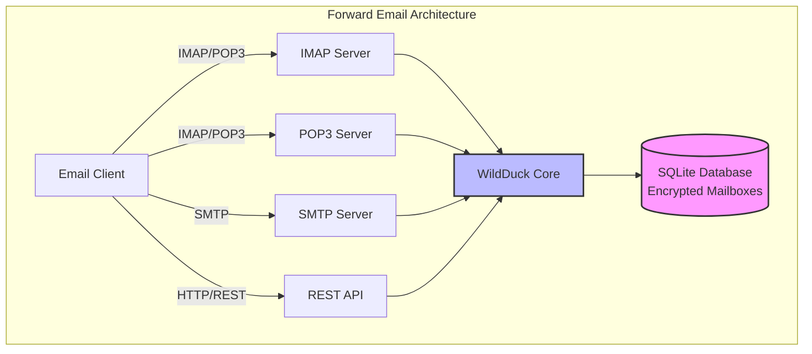

---


## مقارنة خدمات البريد الإلكتروني - دعم البروتوكولات والامتثال لمعايير RFC {#email-service-comparison---protocol-support--rfc-standards-compliance}

> \[!IMPORTANT]
> **التشفير المعزول والمقاوم للحوسبة الكمومية:** Forward Email هي الخدمة الوحيدة للبريد الإلكتروني التي تخزن صناديق بريد SQLite مشفرة بشكل فردي باستخدام كلمة مرورك (التي لا يملكها إلا أنت). يتم تشفير كل صندوق بريد باستخدام [sqleet](https://github.com/resilar/sqleet) (ChaCha20-Poly1305)، وهو مستقل، معزول، وقابل للنقل. إذا نسيت كلمة مرورك، تفقد صندوق بريدك - ولا حتى Forward Email يمكنه استعادته. راجع [البريد الإلكتروني المشفر الآمن الكمومي](https://forwardemail.net/en/blog/docs/best-quantum-safe-encrypted-email-service) للتفاصيل.

قارن دعم بروتوكولات البريد الإلكتروني وتنفيذ معايير RFC عبر مزودي البريد الإلكتروني الرئيسيين:

| الميزة                        | Forward Email                                                                                  | Postfix/Dovecot                                                                    | Gmail                                                                             | iCloud Mail                                           | Outlook.com                                                                                                                                                          | Fastmail                                                                                 | Yahoo/AOL (Verizon)                                                  | ProtonMail                                                                     | Tutanota                                                          |
| ----------------------------- | ---------------------------------------------------------------------------------------------- | ---------------------------------------------------------------------------------- | --------------------------------------------------------------------------------- | ----------------------------------------------------- | -------------------------------------------------------------------------------------------------------------------------------------------------------------------- | ---------------------------------------------------------------------------------------- | -------------------------------------------------------------------- | ------------------------------------------------------------------------------ | ----------------------------------------------------------------- |
| **سعر النطاق المخصص**          | [مجاني](https://forwardemail.net/en/pricing)                                                    | [مجاني](https://www.postfix.org/)                                                   | [$7.20/شهر](https://workspace.google.com/pricing)                                  | [$0.99/شهر](https://support.apple.com/en-us/102622)    | [$7.20/شهر](https://www.microsoft.com/en-us/microsoft-365/business/microsoft-365-business-basic)                                                                      | [$5/شهر](https://www.fastmail.com/pricing/)                                               | [$3.19/شهر](https://www.turbify.com/mail)                             | [$4.99/شهر](https://proton.me/mail/pricing)                                     | [$3.27/شهر](https://tuta.com/pricing)                              |
| **IMAP4rev1 (RFC 3501)**      | ✅ [مدعوم](#imap4-email-protocol-and-extensions)                                            | ✅ [مدعوم](https://www.dovecot.org/)                                            | ✅ [مدعوم](https://developers.google.com/workspace/gmail/imap/imap-extensions) | ✅ [مدعوم](https://support.apple.com/en-us/102431) | ✅ [مدعوم](https://support.microsoft.com/en-us/office/pop-imap-and-smtp-settings-for-outlook-com-d088b986-291d-42b8-9564-9c414e2aa040)                            | ✅ [مدعوم](https://www.fastmail.help/hc/en-us/articles/1500000278382-Email-standards) | ✅ [مدعوم](https://senders.yahooinc.com/developer/documentation/) | ⚠️ [عبر الجسر](https://proton.me/support/imap-smtp-and-pop3-setup)            | ❌ غير مدعوم                                                   |
| **IMAP4rev2 (RFC 9051)**      | ⚠️ [جزئي](https://forwardemail.net/en/blog/docs/best-quantum-safe-encrypted-email-service)  | ⚠️ [جزئي](https://www.dovecot.org/)                                             | ⚠️ [31%](https://developers.google.com/workspace/gmail/imap/imap-extensions)      | ⚠️ [92%](https://support.apple.com/en-us/102431)      | ⚠️ [46%](https://support.microsoft.com/en-us/office/pop-imap-and-smtp-settings-for-outlook-com-d088b986-291d-42b8-9564-9c414e2aa040)                                 | ⚠️ [69%](https://www.fastmail.help/hc/en-us/articles/1500000278382-Email-standards)      | ⚠️ [85%](https://senders.yahooinc.com/developer/documentation/)      | ⚠️ [عبر الجسر](https://proton.me/support/imap-smtp-and-pop3-setup)            | ❌ غير مدعوم                                                   |
| **POP3 (RFC 1939)**           | ✅ [مدعوم](#pop3-email-protocol-and-extensions)                                             | ✅ [مدعوم](https://www.dovecot.org/)                                            | ✅ [مدعوم](https://support.google.com/mail/answer/7104828)                     | ❌ غير مدعوم                                       | ✅ [مدعوم](https://support.microsoft.com/en-us/office/pop-imap-and-smtp-settings-for-outlook-com-d088b986-291d-42b8-9564-9c414e2aa040)                            | ✅ [مدعوم](https://www.fastmail.help/hc/en-us/articles/1500000278382-Email-standards) | ✅ [مدعوم](https://help.yahoo.com/kb/SLN4075.html)                | ⚠️ [عبر الجسر](https://proton.me/support/imap-smtp-and-pop3-setup)            | ❌ غير مدعوم                                                   |
| **SMTP (RFC 5321)**           | ✅ [مدعوم](#smtp-email-protocol-and-extensions)                                             | ✅ [مدعوم](https://www.postfix.org/)                                            | ✅ [مدعوم](https://support.google.com/mail/answer/7126229)                     | ✅ [مدعوم](https://support.apple.com/en-us/102431) | ✅ [مدعوم](https://support.microsoft.com/en-us/office/pop-imap-and-smtp-settings-for-outlook-com-d088b986-291d-42b8-9564-9c414e2aa040)                            | ✅ [مدعوم](https://www.fastmail.help/hc/en-us/articles/1500000278382-Email-standards) | ✅ [مدعوم](https://help.yahoo.com/kb/SLN4075.html)                | ⚠️ [عبر الجسر](https://proton.me/support/imap-smtp-and-pop3-setup)            | ❌ غير مدعوم                                                   |
| **JMAP (RFC 8620)**           | ❌ [غير مدعوم](#jmap-email-protocol)                                                        | ❌ غير مدعوم                                                                    | ❌ غير مدعوم                                                                   | ❌ غير مدعوم                                       | ❌ غير مدعوم                                                                                                                                                      | ✅ [مدعوم](https://www.fastmail.com/dev/)                                             | ❌ غير مدعوم                                                      | ❌ غير مدعوم                                                                | ❌ غير مدعوم                                                   |
| **DKIM (RFC 6376)**           | ✅ [مدعوم](#email-message-authentication-protocols)                                         | ✅ [مدعوم](https://github.com/trusteddomainproject/OpenDKIM)                    | ✅ [مدعوم](https://support.google.com/a/answer/174124)                         | ✅ [مدعوم](https://support.apple.com/en-us/102431) | ✅ [مدعوم](https://learn.microsoft.com/en-us/defender-office-365/email-authentication-dkim-configure)                                                             | ✅ [مدعوم](https://www.fastmail.help/hc/en-us/articles/360060590573)                  | ✅ [مدعوم](https://help.yahoo.com/kb/SLN25426.html)               | ✅ [مدعوم](https://proton.me/support)                                       | ✅ [مدعوم](https://tuta.com/support#dkim)                      |
| **SPF (RFC 7208)**            | ✅ [مدعوم](#email-message-authentication-protocols)                                         | ✅ [مدعوم](https://www.postfix.org/)                                            | ✅ [مدعوم](https://support.google.com/a/answer/33786)                          | ✅ [مدعوم](https://support.apple.com/en-us/102431) | ✅ [مدعوم](https://learn.microsoft.com/en-us/microsoft-365/security/office-365-security/how-office-365-uses-spf-to-prevent-spoofing)                              | ✅ [مدعوم](https://www.fastmail.help/hc/en-us/articles/360060590573)                  | ✅ [مدعوم](https://help.yahoo.com/kb/SLN25426.html)               | ✅ [مدعوم](https://proton.me/support)                                       | ✅ [مدعوم](https://tuta.com/support#dkim)                      |
| **DMARC (RFC 7489)**          | ✅ [مدعوم](#email-message-authentication-protocols)                                         | ✅ [مدعوم](https://www.postfix.org/)                                            | ✅ [مدعوم](https://support.google.com/a/answer/2466580)                        | ✅ [مدعوم](https://support.apple.com/en-us/102431) | ✅ [مدعوم](https://learn.microsoft.com/en-us/microsoft-365/security/office-365-security/use-dmarc-to-validate-email)                                              | ✅ [مدعوم](https://www.fastmail.help/hc/en-us/articles/360060590573)                  | ✅ [مدعوم](https://help.yahoo.com/kb/SLN25426.html)               | ✅ [مدعوم](https://proton.me/support)                                       | ✅ [مدعوم](https://tuta.com/support#dkim)                      |
| **ARC (RFC 8617)**            | ✅ [مدعوم](#email-message-authentication-protocols)                                         | ✅ [مدعوم](https://github.com/trusteddomainproject/OpenARC)                     | ✅ [مدعوم](https://support.google.com/a/answer/2466580)                        | ❌ غير مدعوم                                       | ✅ [مدعوم](https://learn.microsoft.com/en-us/defender-office-365/email-authentication-arc-configure)                                                              | ✅ [مدعوم](https://www.fastmail.help/hc/en-us/articles/360060590573)                  | ✅ [مدعوم](https://senders.yahooinc.com/developer/documentation/) | ✅ [مدعوم](https://proton.me/blog/what-is-authenticated-received-chain-arc) | ❌ غير مدعوم                                                   |
| **MTA-STS (RFC 8461)**        | ✅ [مدعوم](#email-transport-security-protocols)                                             | ✅ [مدعوم](https://www.postfix.org/)                                            | ✅ [مدعوم](https://support.google.com/a/answer/9261504)                        | ✅ [مدعوم](https://support.apple.com/en-us/102431) | ✅ [مدعوم](https://learn.microsoft.com/en-us/defender-office-365/email-authentication-about)                                                                      | ✅ [مدعوم](https://www.fastmail.help/hc/en-us/articles/360060590573)                  | ✅ [مدعوم](https://senders.yahooinc.com/developer/documentation/) | ✅ [مدعوم](https://proton.me/support)                                       | ✅ [مدعوم](https://tuta.com/security)                          |
| **DANE (RFC 7671)**           | ✅ [مدعوم](#email-transport-security-protocols)                                             | ✅ [مدعوم](https://www.postfix.org/)                                            | ❌ غير مدعوم                                                                   | ❌ غير مدعوم                                       | ❌ غير مدعوم                                                                                                                                                      | ❌ غير مدعوم                                                                          | ❌ غير مدعوم                                                      | ✅ [مدعوم](https://proton.me/support)                                       | ✅ [مدعوم](https://tuta.com/support#dane)                      |
| **DSN (RFC 3461)**            | ✅ [مدعوم](#smtp-email-protocol-and-extensions)                                             | ✅ [مدعوم](https://www.postfix.org/DSN_README.html)                             | ❌ غير مدعوم                                                                   | ✅ [مدعوم](#protocol-capability-tests)             | ✅ [مدعوم](#protocol-capability-tests)                                                                                                                            | ⚠️ [غير معروف](https://www.fastmail.help/hc/en-us/articles/1500000278382-Email-standards)  | ❌ غير مدعوم                                                      | ⚠️ [عبر الجسر](https://proton.me/support/imap-smtp-and-pop3-setup)            | ❌ غير مدعوم                                                   |
| **REQUIRETLS (RFC 8689)**     | ✅ [مدعوم](#email-transport-security-protocols)                                             | ✅ [مدعوم](https://www.postfix.org/TLS_README.html#server_require_tls)          | ⚠️ غير معروف                                                                        | ⚠️ غير معروف                                            | ⚠️ غير معروف                                                                                                                                                           | ⚠️ غير معروف                                                                               | ⚠️ غير معروف                                                           | ⚠️ [عبر الجسر](https://proton.me/support/imap-smtp-and-pop3-setup)            | ❌ غير مدعوم                                                   |
| **ManageSieve (RFC 5804)**    | ✅ [مدعوم](#managesieve-rfc-5804)                                                           | ✅ [مدعوم](https://doc.dovecot.org/admin_manual/pigeonhole_managesieve_server/) | ❌ غير مدعوم                                                                   | ❌ غير مدعوم                                       | ❌ غير مدعوم                                                                                                                                                      | ✅ [مدعوم](https://www.fastmail.help/hc/en-us/articles/360060590573)                  | ❌ غير مدعوم                                                      | ❌ غير مدعوم                                                                | ❌ غير مدعوم                                                   |
| **OpenPGP (RFC 9580)**        | ✅ [مدعوم](#email-message-encryption)                                                       | ⚠️ [عبر الإضافات](https://www.gnupg.org/)                                           | ⚠️ [جهة خارجية](https://github.com/google/end-to-end)                            | ⚠️ [جهة خارجية](https://gpgtools.org/)               | ⚠️ [جهة خارجية](https://gpg4win.org/)                                                                                                                               | ⚠️ [جهة خارجية](https://www.fastmail.help/hc/en-us/articles/360060590573)               | ⚠️ [جهة خارجية](https://help.yahoo.com/kb/SLN25426.html)            | ✅ [مضمن](https://proton.me/support/pgp-mime-pgp-inline)                      | ❌ غير مدعوم                                                   |
| **S/MIME (RFC 8551)**         | ✅ [مدعوم](#email-message-encryption)                                                       | ✅ [مدعوم](https://www.openssl.org/)                                            | ✅ [مدعوم](https://support.google.com/mail/answer/81126)                       | ✅ [مدعوم](https://support.apple.com/en-us/102431) | ✅ [مدعوم](https://support.microsoft.com/en-us/office/send-view-and-reply-to-encrypted-messages-in-outlook-for-pc-eaa43495-9bbb-4fca-922a-df90dee51980)           | ⚠️ [جزئي](https://www.fastmail.help/hc/en-us/articles/360060590573)                   | ❌ غير مدعوم                                                      | ✅ [مدعوم](https://proton.me/support/pgp-mime-pgp-inline)                   | ❌ غير مدعوم                                                   |
| **CalDAV (RFC 4791)**         | ✅ [مدعوم](#calendaring-and-contacts-protocols)                                             | ✅ [مدعوم](https://www.davical.org/)                                            | ✅ [مدعوم](https://developers.google.com/calendar/caldav/v2/guide)             | ✅ [مدعوم](https://support.apple.com/en-us/102431) | ❌ غير مدعوم                                                                                                                                                      | ✅ [مدعوم](https://www.fastmail.help/hc/en-us/articles/360060590573)                  | ❌ غير مدعوم                                                      | ✅ [عبر الجسر](https://proton.me/support/proton-calendar)                      | ❌ غير مدعوم                                                   |
| **CardDAV (RFC 6352)**        | ✅ [مدعوم](#calendaring-and-contacts-protocols)                                             | ✅ [مدعوم](https://www.davical.org/)                                            | ✅ [مدعوم](https://developers.google.com/people/carddav)                       | ✅ [مدعوم](https://support.apple.com/en-us/102431) | ❌ غير مدعوم                                                                                                                                                      | ✅ [مدعوم](https://www.fastmail.help/hc/en-us/articles/360060590573)                  | ❌ غير مدعوم                                                      | ✅ [عبر الجسر](https://proton.me/support/proton-contacts)                      | ❌ غير مدعوم                                                   |
| **المهام (VTODO)**             | ✅ [مدعوم](#tasks-and-reminders-caldav-vtodo)                                               | ✅ [مدعوم](https://www.davical.org/)                                            | ❌ غير مدعوم                                                                   | ✅ [مدعوم](https://support.apple.com/en-us/102431) | ❌ غير مدعوم                                                                                                                                                      | ✅ [مدعوم](https://www.fastmail.help/hc/en-us/articles/360060590573)                  | ❌ غير مدعوم                                                      | ❌ غير مدعوم                                                                | ❌ غير مدعوم                                                   |
| **Sieve (RFC 5228)**          | ✅ [مدعوم](#sieve-rfc-5228)                                                                 | ✅ [مدعوم](https://www.dovecot.org/)                                            | ❌ غير مدعوم                                                                   | ❌ غير مدعوم                                       | ❌ غير مدعوم                                                                                                                                                      | ✅ [مدعوم](https://www.fastmail.help/hc/en-us/articles/360060590573)                  | ❌ غير مدعوم                                                      | ❌ غير مدعوم                                                                | ❌ غير مدعوم                                                   |
| **Catch-All**                 | ✅ [مدعوم](https://forwardemail.net/en/faq#can-i-have-multiple-global-catch-all-recipients) | ✅ مدعوم                                                                        | ✅ [مدعوم](https://support.google.com/a/answer/4524505)                        | ❌ غير مدعوم                                       | ❌ [غير مدعوم](https://learn.microsoft.com/en-us/exchange/recipients-in-exchange-online/manage-mail-users)                                                        | ✅ [مدعوم](https://www.fastmail.help/hc/en-us/articles/1500000278382-Email-standards) | ❌ غير مدعوم                                                      | ❌ غير مدعوم                                                                | ✅ [مدعوم](https://tuta.com/support#catch-all-alias)           |
| **أسماء مستعارة غير محدودة** | ✅ [مدعوم](https://forwardemail.net/en/faq#advanced-features)                               | ✅ مدعوم                                                                        | ✅ [مدعوم](https://support.google.com/a/answer/33327)                          | ✅ [مدعوم](https://support.apple.com/en-us/102431) | ✅ [مدعوم](https://support.microsoft.com/en-us/office/add-or-remove-an-email-alias-in-outlook-com-459b1989-356d-40fa-a689-8f285b13f1f2)                           | ✅ [مدعوم](https://www.fastmail.help/hc/en-us/articles/1500000278382-Email-standards) | ❌ غير مدعوم                                                      | ✅ [مدعوم](https://proton.me/support/addresses-and-aliases)                 | ✅ [مدعوم](https://tuta.com/support#aliases)                   |
| **المصادقة الثنائية**          | ✅ [مدعوم](https://forwardemail.net/en/faq#do-you-support-passkeys-and-webauthn)            | ✅ مدعوم                                                                        | ✅ [مدعوم](https://support.google.com/accounts/answer/185839)                  | ✅ [مدعوم](https://support.apple.com/en-us/102431) | ✅ [مدعوم](https://support.microsoft.com/en-us/account-billing/how-to-use-two-step-verification-with-your-microsoft-account-c7910146-672f-01e9-50a0-93b4585e7eb4) | ✅ [مدعوم](https://www.fastmail.help/hc/en-us/articles/1500000278382-Email-standards) | ✅ [مدعوم](https://help.yahoo.com/kb/SLN5013.html)                | ✅ [مدعوم](https://proton.me/support/two-factor-authentication-2fa)         | ✅ [مدعوم](https://tuta.com/support#two-factor-authentication) |
| **إشعارات الدفع**             | ✅ [مدعوم](#ios-push-notifications)                                                         | ⚠️ عبر الإضافات                                                                     | ✅ [مدعوم](https://developers.google.com/gmail/api/guides/push)                | ✅ [مدعوم](https://support.apple.com/en-us/102431) | ✅ [مدعوم](https://learn.microsoft.com/en-us/graph/change-notifications-delivery-webhooks)                                                                        | ✅ [مدعوم](https://www.fastmail.help/hc/en-us/articles/1500000278382-Email-standards) | ❌ غير مدعوم                                                      | ✅ [مدعوم](https://proton.me/support/notifications)                         | ✅ [مدعوم](https://tuta.com/support#push-notifications)        |
| **تقويم/جهات اتصال سطح المكتب** | ✅ [مدعوم](#calendaring-and-contacts-protocols)                                             | ✅ مدعوم                                                                        | ✅ [مدعوم](https://support.google.com/calendar)                                | ✅ [مدعوم](https://support.apple.com/en-us/102431) | ✅ [مدعوم](https://support.microsoft.com/en-us/office/calendar-and-contacts-in-outlook-com-d3e8a6e6-5c1f-4e3e-9f1e-7c0f0e0c0c0c)                                  | ✅ [مدعوم](https://www.fastmail.help/hc/en-us/articles/1500000278382-Email-standards) | ❌ غير مدعوم                                                      | ✅ [مدعوم](https://proton.me/support/proton-calendar)                       | ❌ غير مدعوم                                                   |
| **بحث متقدم**                | ✅ [مدعوم](https://forwardemail.net/en/email-api)                                           | ✅ مدعوم                                                                        | ✅ [مدعوم](https://support.google.com/mail/answer/7190)                        | ✅ [مدعوم](https://support.apple.com/en-us/102431) | ✅ [مدعوم](https://support.microsoft.com/en-us/office/search-for-email-messages-in-outlook-com-6f5f2e92-9d5e-4c4e-9b0e-0c0c0c0c0c0c)                              | ✅ [مدعوم](https://www.fastmail.help/hc/en-us/articles/1500000278382-Email-standards) | ✅ [مدعوم](https://help.yahoo.com/kb/SLN3561.html)                | ✅ [مدعوم](https://proton.me/support/search-and-filters)                    | ✅ [مدعوم](https://tuta.com/support)                           |
| **API/التكاملات**            | ✅ [39 نقطة نهاية](https://forwardemail.net/en/email-api)                                        | ✅ مدعوم                                                                        | ✅ [مدعوم](https://developers.google.com/gmail/api)                            | ❌ غير مدعوم                                       | ✅ [مدعوم](https://learn.microsoft.com/en-us/graph/api/resources/mail-api-overview)                                                                               | ✅ [مدعوم](https://www.fastmail.help/hc/en-us/articles/1500000278382-Email-standards) | ❌ غير مدعوم                                                      | ✅ [مدعوم](https://proton.me/support/proton-mail-api)                       | ❌ غير مدعوم                                                   |
### تصور دعم البروتوكول {#protocol-support-visualization}

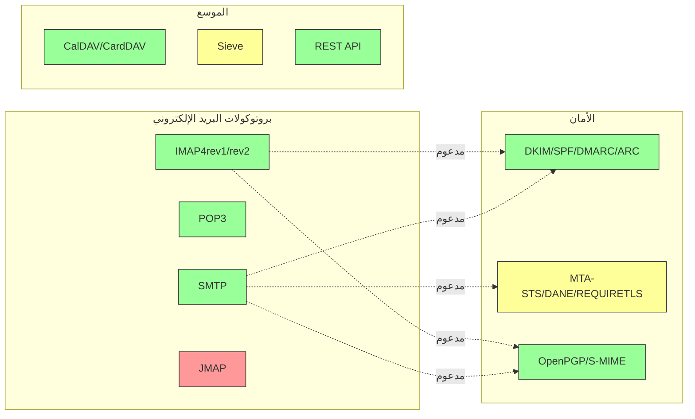

---


## بروتوكولات البريد الإلكتروني الأساسية {#core-email-protocols}

### تدفق بروتوكول البريد الإلكتروني {#email-protocol-flow}

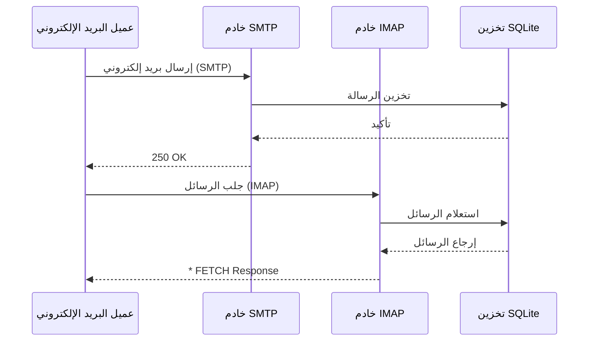


## بروتوكول البريد الإلكتروني IMAP4 والامتدادات {#imap4-email-protocol-and-extensions}

> \[!NOTE]
> يدعم Forward Email بروتوكول IMAP4rev1 (RFC 3501) مع دعم جزئي لميزات IMAP4rev2 (RFC 9051).

يوفر Forward Email دعمًا قويًا لبروتوكول IMAP4 من خلال تنفيذ خادم البريد WildDuck. يقوم الخادم بتنفيذ IMAP4rev1 (RFC 3501) مع دعم جزئي لامتدادات IMAP4rev2 (RFC 9051).

تُقدم وظيفة IMAP في Forward Email بواسطة التبعية [WildDuck](https://github.com/nodemailer/wildduck). البروتوكولات البريدية التالية مدعومة:

| RFC                                                       | العنوان                                                             | ملاحظات التنفيذ                                  |
| --------------------------------------------------------- | ----------------------------------------------------------------- | ----------------------------------------------------- |
| [RFC 3501](https://datatracker.ietf.org/doc/html/rfc3501) | بروتوكول الوصول إلى الرسائل عبر الإنترنت (IMAP) - الإصدار 4rev1           | دعم كامل مع اختلافات مقصودة (انظر أدناه) |
| [RFC 2177](https://datatracker.ietf.org/doc/html/rfc2177) | أمر IMAP4 IDLE                                                | إشعارات بنمط الدفع                              |
| [RFC 2342](https://datatracker.ietf.org/doc/html/rfc2342) | مساحة أسماء IMAP4                                                   | دعم مساحة أسماء صندوق البريد                             |
| [RFC 2087](https://datatracker.ietf.org/doc/html/rfc2087) | امتداد IMAP4 QUOTA                                             | إدارة حصة التخزين                              |
| [RFC 2971](https://datatracker.ietf.org/doc/html/rfc2971) | امتداد IMAP4 ID                                                | تعريف العميل/الخادم                          |
| [RFC 5161](https://datatracker.ietf.org/doc/html/rfc5161) | امتداد IMAP4 ENABLE                                            | تمكين امتدادات IMAP                                |
| [RFC 4959](https://datatracker.ietf.org/doc/html/rfc4959) | امتداد IMAP للاستجابة الأولية للعميل SASL (SASL-IR)         | استجابة العميل الأولية                               |
| [RFC 3691](https://datatracker.ietf.org/doc/html/rfc3691) | أمر IMAP4 UNSELECT                                            | إغلاق صندوق البريد بدون EXPUNGE                         |
| [RFC 4315](https://datatracker.ietf.org/doc/html/rfc4315) | امتداد IMAP UIDPLUS                                            | أوامر UID محسنة                                 |
| [RFC 7162](https://datatracker.ietf.org/doc/html/rfc7162) | امتدادات IMAP: إعادة تزامن تغييرات العلامات السريعة (CONDSTORE) | STORE الشرطية                                     |
| [RFC 6154](https://datatracker.ietf.org/doc/html/rfc6154) | امتداد IMAP لقوائم صناديق البريد الخاصة                     | سمات صندوق البريد الخاصة                            |
| [RFC 6851](https://datatracker.ietf.org/doc/html/rfc6851) | امتداد IMAP MOVE                                               | أمر MOVE الذري                                   |
| [RFC 6855](https://datatracker.ietf.org/doc/html/rfc6855) | دعم IMAP لـ UTF-8                                            | دعم UTF-8                                         |
| [RFC 3348](https://datatracker.ietf.org/doc/html/rfc3348) | امتداد IMAP4 لصندوق البريد الفرعي                                     | معلومات صندوق البريد الفرعي                             |
| [RFC 7889](https://datatracker.ietf.org/doc/html/rfc7889) | امتداد IMAP4 للإعلان عن الحد الأقصى لحجم التحميل (APPENDLIMIT) | الحد الأقصى لحجم التحميل                                   |
**امتدادات IMAP المدعومة:**

| الامتداد          | RFC          | الحالة      | الوصف                          |
| ----------------- | ------------ | ----------- | ------------------------------ |
| IDLE              | RFC 2177     | ✅ مدعوم    | إشعارات بنمط الدفع             |
| NAMESPACE         | RFC 2342     | ✅ مدعوم    | دعم مساحة أسماء صناديق البريد  |
| QUOTA             | RFC 2087     | ✅ مدعوم    | إدارة حصة التخزين             |
| ID                | RFC 2971     | ✅ مدعوم    | تعريف العميل/الخادم           |
| ENABLE            | RFC 5161     | ✅ مدعوم    | تمكين امتدادات IMAP           |
| SASL-IR           | RFC 4959     | ✅ مدعوم    | استجابة العميل الأولية        |
| UNSELECT          | RFC 3691     | ✅ مدعوم    | إغلاق صندوق البريد بدون EXPUNGE |
| UIDPLUS           | RFC 4315     | ✅ مدعوم    | أوامر UID محسنة               |
| CONDSTORE         | RFC 7162     | ✅ مدعوم    | STORE الشرطي                  |
| SPECIAL-USE       | RFC 6154     | ✅ مدعوم    | سمات صندوق البريد الخاصة      |
| MOVE              | RFC 6851     | ✅ مدعوم    | أمر MOVE الذري                |
| UTF8=ACCEPT       | RFC 6855     | ✅ مدعوم    | دعم UTF-8                    |
| CHILDREN          | RFC 3348     | ✅ مدعوم    | معلومات صناديق البريد الفرعية  |
| APPENDLIMIT       | RFC 7889     | ✅ مدعوم    | الحد الأقصى لحجم التحميل      |
| XLIST             | غير قياسي   | ✅ مدعوم    | قائمة مجلدات متوافقة مع Gmail |
| XAPPLEPUSHSERVICE | غير قياسي   | ✅ مدعوم    | خدمة إشعارات الدفع من Apple   |

### اختلافات بروتوكول IMAP عن مواصفات RFC {#imap-protocol-differences-from-rfc-specifications}

> \[!WARNING]
> قد تؤثر الاختلافات التالية عن مواصفات RFC على توافق العميل.

يتعمد Forward Email الانحراف عن بعض مواصفات IMAP RFC. هذه الاختلافات موروثة من WildDuck وموثقة أدناه:

* **لا توجد علامة \Recent:** علامة `\Recent` غير مفعلة. يتم إرجاع جميع الرسائل بدون هذه العلامة.
* **إعادة التسمية لا تؤثر على المجلدات الفرعية:** عند إعادة تسمية مجلد، لا يتم إعادة تسمية المجلدات الفرعية تلقائيًا. هيكل المجلدات مسطح في قاعدة البيانات.
* **لا يمكن إعادة تسمية INBOX:** يسمح [RFC 3501](https://datatracker.ietf.org/doc/html/rfc3501) بإعادة تسمية INBOX، لكن Forward Email يمنع ذلك صراحة. انظر [كود مصدر WildDuck](https://github.com/nodemailer/wildduck/blob/master/imap-core/lib/commands/rename.js#L27).
* **لا توجد استجابات FLAGS غير مرغوب فيها:** عند تغيير العلامات، لا يتم إرسال استجابات FLAGS غير مرغوب فيها إلى العميل.
* **STORE يعيد NO للرسائل المحذوفة:** محاولة تعديل العلامات على الرسائل المحذوفة تعيد NO بدلاً من التجاهل الصامت.
* **تجاهل CHARSET في SEARCH:** يتم تجاهل الوسيط `CHARSET` في أوامر SEARCH. جميع عمليات البحث تستخدم UTF-8.
* **تجاهل بيانات MODSEQ الوصفية:** يتم تجاهل بيانات `MODSEQ` الوصفية في أوامر STORE.
* **SEARCH TEXT و SEARCH BODY:** يستخدم Forward Email [SQLite FTS5](https://www.sqlite.org/fts5.html) (البحث النصي الكامل) بدلاً من بحث `$text` في MongoDB. هذا يوفر:
  * دعم عامل `NOT` (غير مدعوم في MongoDB)
  * نتائج بحث مرتبة
  * أداء بحث أقل من 100 مللي ثانية على صناديق بريد كبيرة
* **سلوك Autoexpunge:** يتم حذف الرسائل المعلمة بـ `\Deleted` تلقائيًا عند إغلاق صندوق البريد.
* **دقة الرسائل:** قد لا تحافظ بعض تعديلات الرسائل على الهيكل الأصلي الدقيق للرسالة.

**دعم جزئي لـ IMAP4rev2:**

ينفذ Forward Email IMAP4rev1 (RFC 3501) مع دعم جزئي لـ IMAP4rev2 (RFC 9051). الميزات التالية من IMAP4rev2 **غير مدعومة بعد**:

* **LIST-STATUS** - أوامر LIST و STATUS مجتمعة
* **LITERAL-** - الحروف الحرفية غير المتزامنة (النسخة السالبة)
* **OBJECTID** - معرفات كائن فريدة
* **SAVEDATE** - خاصية تاريخ الحفظ
* **REPLACE** - استبدال الرسالة الذري
* **UNAUTHENTICATE** - إغلاق المصادقة بدون إغلاق الاتصال

**معالجة هيكل الجسم المرنة:**

يستخدم Forward Email معالجة "الجسم المرن" للهياكل MIME غير الصحيحة، والتي قد تختلف عن التفسير الصارم لـ RFC. هذا يحسن التوافق مع رسائل البريد الواقعية التي لا تتوافق تمامًا مع المعايير.
**امتداد METADATA (RFC 5464):**

امتداد IMAP METADATA **غير مدعوم**. لمزيد من المعلومات حول هذا الامتداد، راجع [RFC 5464](https://datatracker.ietf.org/doc/html/rfc5464). يمكن العثور على مناقشة حول إضافة هذه الميزة في [مشكلة WildDuck رقم 937](https://github.com/zone-eu/wildduck/issues/937).

### امتدادات IMAP غير مدعومة {#imap-extensions-not-supported}

الامتدادات التالية لـ IMAP من [سجل قدرات IMAP الخاص بـ IANA](https://www.iana.org/assignments/imap-capabilities/imap-capabilities.xhtml) غير مدعومة:

| RFC                                                       | العنوان                                                                                                         | السبب                                                                                                                                  |
| --------------------------------------------------------- | --------------------------------------------------------------------------------------------------------------- | --------------------------------------------------------------------------------------------------------------------------------------- |
| [RFC 2086](https://datatracker.ietf.org/doc/html/rfc2086) | امتداد IMAP4 ACL                                                                                                | المجلدات المشتركة غير منفذة. انظر [مشكلة WildDuck رقم 427](https://github.com/zone-eu/wildduck/issues/427)                             |
| [RFC 5256](https://datatracker.ietf.org/doc/html/rfc5256) | امتدادات IMAP SORT و THREAD                                                                                     | تم تنفيذ الترتيب الداخلي ولكن ليس عبر بروتوكول RFC 5256. انظر [مشكلة WildDuck رقم 12](https://github.com/zone-eu/wildduck/issues/12)  |
| [RFC 5162](https://datatracker.ietf.org/doc/html/rfc5162) | امتدادات IMAP4 لإعادة تزامن صندوق البريد السريع (QRESYNC)                                                      | غير منفذ                                                                                                                               |
| [RFC 5464](https://datatracker.ietf.org/doc/html/rfc5464) | امتداد IMAP METADATA                                                                                            | عمليات البيانات الوصفية مهملة. انظر [وثائق WildDuck](https://datatracker.ietf.org/doc/html/rfc5464)                                   |
| [RFC 5258](https://datatracker.ietf.org/doc/html/rfc5258) | امتدادات أمر IMAP4 LIST                                                                                        | غير منفذ                                                                                                                               |
| [RFC 5267](https://datatracker.ietf.org/doc/html/rfc5267) | السياقات لـ IMAP4                                                                                               | غير منفذ                                                                                                                               |
| [RFC 5465](https://datatracker.ietf.org/doc/html/rfc5465) | امتداد IMAP NOTIFY                                                                                              | غير منفذ                                                                                                                               |
| [RFC 5466](https://datatracker.ietf.org/doc/html/rfc5466) | امتداد IMAP4 FILTERS                                                                                            | غير منفذ                                                                                                                               |
| [RFC 6203](https://datatracker.ietf.org/doc/html/rfc6203) | امتداد IMAP4 للبحث التقريبي                                                                                    | غير منفذ                                                                                                                               |
| [RFC 6785](https://datatracker.ietf.org/doc/html/rfc6785) | توصيات تنفيذ IMAP4                                                                                              | لم يتم اتباع التوصيات بالكامل                                                                                                          |
| [RFC 7162](https://datatracker.ietf.org/doc/html/rfc7162) | امتدادات IMAP: إعادة تزامن تغييرات العلامات السريعة (CONDSTORE) وإعادة تزامن صندوق البريد السريع (QRESYNC)      | غير منفذ                                                                                                                               |
| [RFC 8437](https://datatracker.ietf.org/doc/html/rfc8437) | امتداد IMAP UNAUTHENTICATE لإعادة استخدام الاتصال                                                              | غير منفذ                                                                                                                               |
| [RFC 8438](https://datatracker.ietf.org/doc/html/rfc8438) | امتداد IMAP لـ STATUS=SIZE                                                                                      | غير منفذ                                                                                                                               |
| [RFC 8457](https://datatracker.ietf.org/doc/html/rfc8457) | كلمة IMAP "$Important" والخاصية الخاصة "\Important"                                                             | غير منفذ                                                                                                                               |
| [RFC 8474](https://datatracker.ietf.org/doc/html/rfc8474) | امتداد IMAP لمعرفات الكائنات                                                                                   | غير منفذ                                                                                                                               |
| [RFC 9051](https://datatracker.ietf.org/doc/html/rfc9051) | بروتوكول الوصول إلى الرسائل عبر الإنترنت (IMAP) - الإصدار 4rev2                                                | Forward Email ينفذ IMAP4rev1 ([RFC 3501](https://datatracker.ietf.org/doc/html/rfc3501))                                               |
## بروتوكول البريد الإلكتروني POP3 والامتدادات {#pop3-email-protocol-and-extensions}

> \[!NOTE]
> يدعم Forward Email بروتوكول POP3 (RFC 1939) مع الامتدادات القياسية لاسترجاع البريد الإلكتروني.

تُقدّم وظيفة POP3 في Forward Email بواسطة التبعية [WildDuck](https://github.com/nodemailer/wildduck). يتم دعم RFCs البريدية التالية:

| RFC                                                       | العنوان                                  | ملاحظات التنفيذ                                     |
| --------------------------------------------------------- | --------------------------------------- | -------------------------------------------------- |
| [RFC 1939](https://datatracker.ietf.org/doc/html/rfc1939) | بروتوكول مكتب البريد - الإصدار 3 (POP3) | دعم كامل مع اختلافات مقصودة (انظر أدناه)            |
| [RFC 2595](https://datatracker.ietf.org/doc/html/rfc2595) | استخدام TLS مع IMAP و POP3 و ACAP       | دعم STARTTLS                                       |
| [RFC 2449](https://datatracker.ietf.org/doc/html/rfc2449) | آلية امتداد POP3                        | دعم أمر CAPA                                       |

يوفر Forward Email دعم POP3 للعملاء الذين يفضلون هذا البروتوكول الأبسط على IMAP. POP3 مثالي للمستخدمين الذين يرغبون في تنزيل الرسائل إلى جهاز واحد وحذفها من الخادم.

**امتدادات POP3 المدعومة:**

| الامتداد | RFC      | الحالة      | الوصف                      |
| --------- | -------- | ----------- | -------------------------- |
| TOP       | RFC 1939 | ✅ مدعوم    | استرجاع رؤوس الرسائل       |
| USER      | RFC 1939 | ✅ مدعوم    | مصادقة اسم المستخدم        |
| UIDL      | RFC 1939 | ✅ مدعوم    | معرفات الرسائل الفريدة     |
| EXPIRE    | RFC 2449 | ✅ مدعوم    | سياسة انتهاء صلاحية الرسائل |

### اختلافات بروتوكول POP3 عن مواصفات RFC {#pop3-protocol-differences-from-rfc-specifications}

> \[!WARNING]
> يحتوي POP3 على قيود متأصلة مقارنة بـ IMAP.

> \[!IMPORTANT]
> **الفرق الحرج: سلوك حذف POP3 في Forward Email مقابل WildDuck**
>
> ينفذ Forward Email الحذف الدائم المتوافق مع RFC لأوامر `DELE` في POP3، على عكس WildDuck الذي ينقل الرسائل إلى سلة المهملات.

**سلوك Forward Email** ([الكود المصدري](https://github.com/forwardemail/forwardemail.net/blob/master/pop3-server.js)):

* `DELE` → `QUIT` يحذف الرسائل بشكل دائم
* يتبع مواصفة [RFC 1939](https://datatracker.ietf.org/doc/html/rfc1939) بدقة
* يتطابق مع سلوك Dovecot (الافتراضي)، Postfix، وخوادم أخرى متوافقة مع المعايير

**سلوك WildDuck** ([النقاش](https://github.com/zone-eu/wildduck/issues/937)):

* `DELE` → `QUIT` ينقل الرسائل إلى سلة المهملات (مثل Gmail)
* قرار تصميم مقصود لأمان المستخدم
* غير متوافق مع RFC لكنه يمنع فقدان البيانات العرضي

**لماذا يختلف Forward Email:**

* **الامتثال لـ RFC:** يلتزم بمواصفة [RFC 1939](https://datatracker.ietf.org/doc/html/rfc1939)
* **توقعات المستخدم:** سير عمل التنزيل والحذف يتوقع الحذف الدائم
* **إدارة التخزين:** استرداد مساحة القرص بشكل صحيح
* **التوافق:** متسق مع خوادم أخرى متوافقة مع RFC

> \[!NOTE]
> **قائمة رسائل POP3:** يعرض Forward Email جميع الرسائل من INBOX بدون حد. يختلف هذا عن WildDuck الذي يحدّ إلى 250 رسالة بشكل افتراضي. انظر [الكود المصدري](https://github.com/forwardemail/forwardemail.net/blob/master/pop3-server.js).

**الوصول لجهاز واحد:**

تم تصميم POP3 للوصول من جهاز واحد. عادةً ما يتم تنزيل الرسائل وحذفها من الخادم، مما يجعله غير مناسب للمزامنة عبر أجهزة متعددة.

**عدم دعم المجلدات:**

يصل POP3 فقط إلى مجلد INBOX. المجلدات الأخرى (المرسلة، المسودات، المهملات، إلخ) غير متاحة عبر POP3.

**إدارة الرسائل المحدودة:**

يوفر POP3 استرجاع وحذف الرسائل الأساسي. الميزات المتقدمة مثل التمييز، النقل، أو البحث في الرسائل غير متوفرة.

### امتدادات POP3 غير المدعومة {#pop3-extensions-not-supported}

الامتدادات التالية من [سجل آلية امتداد POP3 الخاص بـ IANA](https://www.iana.org/assignments/pop3-extension-mechanism/pop3-extension-mechanism.xhtml) غير مدعومة:
| RFC                                                       | العنوان                                                  | السبب                                  |
| --------------------------------------------------------- | ------------------------------------------------------- | --------------------------------------- |
| [RFC 6856](https://datatracker.ietf.org/doc/html/rfc6856) | دعم بروتوكول مكتب البريد الإصدار 3 (POP3) لـ UTF-8       | غير مُطبق في خادم WildDuck POP3          |
| [RFC 2595](https://datatracker.ietf.org/doc/html/rfc2595) | أمر STLS                                                | مدعوم فقط STARTTLS، وليس STLS             |
| [RFC 3206](https://datatracker.ietf.org/doc/html/rfc3206) | رموز استجابة SYS و AUTH لبروتوكول POP                   | غير مُطبق                             |

---


## بروتوكول البريد الإلكتروني SMTP والامتدادات {#smtp-email-protocol-and-extensions}

> \[!NOTE]
> يدعم Forward Email بروتوكول SMTP (RFC 5321) مع امتدادات حديثة لتوصيل البريد الإلكتروني بشكل آمن وموثوق.

تُقدم وظيفة SMTP في Forward Email من خلال عدة مكونات: [smtp-server](https://github.com/nodemailer/smtp-server) (nodemailer)، [zone-mta](https://github.com/zone-eu/zone-mta)، وتنفيذات مخصصة. يتم دعم RFCs البريدية التالية:

| RFC                                                       | العنوان                                                                           | ملاحظات التنفيذ                   |
| --------------------------------------------------------- | --------------------------------------------------------------------------------- | -------------------------------- |
| [RFC 5321](https://datatracker.ietf.org/doc/html/rfc5321) | بروتوكول نقل البريد البسيط (SMTP)                                                 | دعم كامل                         |
| [RFC 3207](https://datatracker.ietf.org/doc/html/rfc3207) | امتداد خدمة SMTP للبريد الآمن عبر طبقة النقل الآمنة (STARTTLS)                     | دعم TLS/SSL                     |
| [RFC 4954](https://datatracker.ietf.org/doc/html/rfc4954) | امتداد خدمة SMTP للمصادقة (AUTH)                                                  | PLAIN، LOGIN، CRAM-MD5، XOAUTH2  |
| [RFC 6531](https://datatracker.ietf.org/doc/html/rfc6531) | امتداد SMTP للبريد الإلكتروني الدولي (SMTPUTF8)                                  | دعم عناوين البريد الإلكتروني باليونكود الأصلي |
| [RFC 3461](https://datatracker.ietf.org/doc/html/rfc3461) | امتداد خدمة SMTP لإشعارات حالة التسليم (DSN)                                     | دعم كامل لـ DSN                  |
| [RFC 3463](https://datatracker.ietf.org/doc/html/rfc3463) | رموز حالة نظام البريد المحسنة                                                    | رموز حالة محسنة في الردود         |
| [RFC 1870](https://datatracker.ietf.org/doc/html/rfc1870) | امتداد خدمة SMTP لإعلان حجم الرسالة (SIZE)                                       | إعلان الحد الأقصى لحجم الرسالة    |
| [RFC 2920](https://datatracker.ietf.org/doc/html/rfc2920) | امتداد خدمة SMTP لتسلسل الأوامر (PIPELINING)                                    | دعم تسلسل الأوامر                |
| [RFC 1652](https://datatracker.ietf.org/doc/html/rfc1652) | امتداد خدمة SMTP لنقل MIME بثمانية بتات (8BITMIME)                               | دعم MIME بثمانية بتات            |
| [RFC 6152](https://datatracker.ietf.org/doc/html/rfc6152) | امتداد خدمة SMTP لنقل MIME بثمانية بتات                                         | دعم MIME بثمانية بتات            |
| [RFC 2034](https://datatracker.ietf.org/doc/html/rfc2034) | امتداد خدمة SMTP لإرجاع رموز الخطأ المحسنة (ENHANCEDSTATUSCODES)                  | رموز حالة محسنة                 |

يقوم Forward Email بتنفيذ خادم SMTP كامل الميزات مع دعم امتدادات حديثة تعزز الأمان والموثوقية والوظائف.

**الامتدادات المدعومة في SMTP:**

| الامتداد            | RFC      | الحالة      | الوصف                                |
| ------------------- | -------- | ----------- | ----------------------------------- |
| PIPELINING          | RFC 2920 | ✅ مدعوم    | تسلسل الأوامر                       |
| SIZE                | RFC 1870 | ✅ مدعوم    | إعلان حجم الرسالة (حد 52 ميجابايت) |
| ETRN                | RFC 1985 | ✅ مدعوم    | معالجة قائمة الانتظار عن بُعد       |
| STARTTLS            | RFC 3207 | ✅ مدعوم    | الترقية إلى TLS                    |
| ENHANCEDSTATUSCODES | RFC 2034 | ✅ مدعوم    | رموز حالة محسنة                    |
| 8BITMIME            | RFC 6152 | ✅ مدعوم    | نقل MIME بثمانية بتات               |
| DSN                 | RFC 3461 | ✅ مدعوم    | إشعارات حالة التسليم               |
| CHUNKING            | RFC 3030 | ✅ مدعوم    | نقل الرسائل مجزأ                   |
| SMTPUTF8            | RFC 6531 | ⚠️ جزئي    | عناوين البريد الإلكتروني بـ UTF-8 (جزئي) |
| REQUIRETLS          | RFC 8689 | ✅ مدعوم    | طلب TLS للتسليم                    |
### إشعارات حالة التسليم (DSN) {#delivery-status-notifications-dsn}

> \[!TIP]
> توفر DSN معلومات مفصلة عن حالة تسليم الرسائل الإلكترونية المرسلة.

يدعم Forward Email بالكامل **DSN (RFC 3461)**، الذي يسمح للمرسلين بطلب إشعارات حالة التسليم. توفر هذه الميزة:

* **إشعارات النجاح** عند تسليم الرسائل
* **إشعارات الفشل** مع معلومات خطأ مفصلة
* **إشعارات التأخير** عند تأجيل التسليم مؤقتًا

تعتبر DSN مفيدة بشكل خاص لـ:

* تأكيد تسليم الرسائل المهمة
* استكشاف مشكلات التسليم وإصلاحها
* أنظمة معالجة البريد الإلكتروني الآلية
* متطلبات الامتثال والتدقيق

### دعم REQUIRETLS {#requiretls-support}

> \[!IMPORTANT]
> Forward Email هو من بين القلائل الذين يعلنون صراحةً ويفرضون REQUIRETLS.

يدعم Forward Email **REQUIRETLS (RFC 8689)**، الذي يضمن أن الرسائل الإلكترونية تُسلم فقط عبر اتصالات مشفرة بـ TLS. يوفر هذا:

* **تشفير من الطرف إلى الطرف** لمسار التسليم بأكمله
* **فرض للمستخدم** عبر خانة اختيار في محرر البريد الإلكتروني
* **رفض محاولات التسليم غير المشفرة**
* **تعزيز الأمان** للاتصالات الحساسة

### امتدادات SMTP غير المدعومة {#smtp-extensions-not-supported}

الامتدادات التالية لبروتوكول SMTP من [سجل امتدادات خدمة SMTP الخاص بـ IANA](https://www.iana.org/assignments/smtp) غير مدعومة:

| RFC                                                       | العنوان                                                                                           | السبب                 |
| --------------------------------------------------------- | ------------------------------------------------------------------------------------------------- | --------------------- |
| [RFC 4865](https://datatracker.ietf.org/doc/html/rfc4865) | امتداد خدمة تقديم SMTP لإصدار الرسائل المستقبلية (FUTURERELEASE)                                  | غير منفذ              |
| [RFC 6710](https://datatracker.ietf.org/doc/html/rfc6710) | امتداد SMTP لأولويات نقل الرسائل (MT-PRIORITY)                                                   | غير منفذ              |
| [RFC 7293](https://datatracker.ietf.org/doc/html/rfc7293) | حقل رأس Require-Recipient-Valid-Since وامتداد خدمة SMTP                                          | غير منفذ              |
| [RFC 7372](https://datatracker.ietf.org/doc/html/rfc7372) | رموز حالة مصادقة البريد الإلكتروني                                                                | غير منفذ بالكامل      |
| [RFC 4468](https://datatracker.ietf.org/doc/html/rfc4468) | امتداد BURL لتقديم الرسائل                                                                        | غير منفذ              |
| [RFC 3030](https://datatracker.ietf.org/doc/html/rfc3030) | امتدادات خدمة SMTP لنقل رسائل MIME الكبيرة والثنائية (CHUNKING, BINARYMIME)                      | غير منفذ              |
| [RFC 2852](https://datatracker.ietf.org/doc/html/rfc2852) | امتداد خدمة التسليم حسب الموعد المحدد SMTP                                                        | غير منفذ              |

---


## بروتوكول البريد الإلكتروني JMAP {#jmap-email-protocol}

> \[!CAUTION]
> JMAP **غير مدعوم حاليًا** من قبل Forward Email.

| RFC                                                       | العنوان                                   | الحالة          | السبب                                                                 |
| --------------------------------------------------------- | ----------------------------------------- | --------------- | ---------------------------------------------------------------------- |
| [RFC 8620](https://datatracker.ietf.org/doc/html/rfc8620) | بروتوكول تطبيق البيانات الوصفية JSON (JMAP) | ❌ غير مدعوم    | يستخدم Forward Email بروتوكولات IMAP/POP3/SMTP وواجهة REST شاملة بدلاً منه |

**JMAP (بروتوكول تطبيق البيانات الوصفية JSON)** هو بروتوكول بريد إلكتروني حديث مصمم ليحل محل IMAP.

**لماذا JMAP غير مدعوم:**

> "JMAP وحش لم يكن يجب اختراعه. يحاول تحويل TCP/IMAP (وهو بروتوكول سيء بالفعل حسب معايير اليوم) إلى HTTP/JSON، فقط باستخدام نقل مختلف مع الحفاظ على الروح." — أندريس راينمان، [مناقشة HN](https://news.ycombinator.com/item?id=18890011)
> "JMAP عمره أكثر من 10 سنوات، ولا يوجد تقريبًا أي اعتماد عليه" – أندريس راينمان، [مناقشة GitHub](https://github.com/zone-eu/wildduck/issues/2#issuecomment-1765190790)

انظر أيضًا التعليقات الإضافية على <https://hn.algolia.com/?dateRange=all&page=0&prefix=true&query=jmap%20andris&sort=byDate&type=comment>.

يركز Forward Email حاليًا على تقديم دعم ممتاز لـ IMAP و POP3 و SMTP، إلى جانب واجهة REST API شاملة لإدارة البريد الإلكتروني. قد يتم النظر في دعم JMAP في المستقبل بناءً على طلب المستخدمين واعتماد النظام البيئي.

**بديل:** يقدم Forward Email [واجهة REST API كاملة](#complete-rest-api-for-email-management) تحتوي على 39 نقطة نهاية توفر وظائف مشابهة لـ JMAP للوصول البرمجي للبريد الإلكتروني.

---


## أمان البريد الإلكتروني {#email-security}

### هيكلية أمان البريد الإلكتروني {#email-security-architecture}

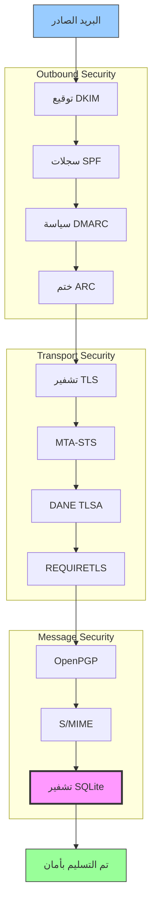


## بروتوكولات مصادقة رسائل البريد الإلكتروني {#email-message-authentication-protocols}

> \[!NOTE]
> يقوم Forward Email بتنفيذ جميع بروتوكولات مصادقة البريد الإلكتروني الرئيسية لمنع التزوير وضمان سلامة الرسائل.

يستخدم Forward Email مكتبة [mailauth](https://github.com/postalsys/mailauth) لمصادقة البريد الإلكتروني. البروتوكولات التالية مدعومة:

| RFC                                                       | العنوان                                                                | ملاحظات التنفيذ                                               |
| --------------------------------------------------------- | --------------------------------------------------------------------- | ------------------------------------------------------------- |
| [RFC 6376](https://datatracker.ietf.org/doc/html/rfc6376) | توقيعات البريد الإلكتروني المعرف بمفاتيح النطاق (DKIM)                | توقيع DKIM كامل والتحقق منه                                   |
| [RFC 8463](https://datatracker.ietf.org/doc/html/rfc8463) | طريقة توقيع تشفيرية جديدة لـ DKIM (Ed25519-SHA256)                    | يدعم خوارزميات التوقيع RSA-SHA256 و Ed25519-SHA256           |
| [RFC 7208](https://datatracker.ietf.org/doc/html/rfc7208) | إطار سياسة المرسل (SPF)                                               | التحقق من سجل SPF                                            |
| [RFC 7489](https://datatracker.ietf.org/doc/html/rfc7489) | مصادقة الرسائل المعتمدة على النطاق، والتقارير، والامتثال (DMARC)       | تنفيذ سياسة DMARC                                           |
| [RFC 8617](https://datatracker.ietf.org/doc/html/rfc8617) | سلسلة الاستلام المصادق عليها (ARC)                                   | ختم ARC والتحقق منه                                         |

تتحقق بروتوكولات مصادقة البريد الإلكتروني من أن الرسائل صادرة فعليًا من المرسل المزعوم ولم يتم التلاعب بها أثناء النقل.

### دعم بروتوكولات المصادقة {#authentication-protocol-support}

| البروتوكول  | RFC      | الحالة       | الوصف                                                               |
| --------- | -------- | ------------ | ------------------------------------------------------------------ |
| **DKIM**  | RFC 6376 | ✅ مدعوم     | البريد الإلكتروني المعرف بمفاتيح النطاق - توقيعات تشفيرية           |
| **SPF**   | RFC 7208 | ✅ مدعوم     | إطار سياسة المرسل - تفويض عنوان IP                                 |
| **DMARC** | RFC 7489 | ✅ مدعوم     | مصادقة الرسائل المعتمدة على النطاق - تنفيذ السياسة                  |
| **ARC**   | RFC 8617 | ✅ مدعوم     | سلسلة الاستلام المصادق عليها - الحفاظ على المصادقة عبر الإعادة     |
### DKIM (توقيع البريد الإلكتروني المعتمد على النطاق) {#dkim-domainkeys-identified-mail}

**DKIM** يضيف توقيعًا تشفيريًا إلى رؤوس البريد الإلكتروني، مما يسمح للمستلمين بالتحقق من أن الرسالة تم تفويضها من قبل مالك النطاق ولم يتم تعديلها أثناء النقل.

يستخدم Forward Email مكتبة [mailauth](https://github.com/postalsys/mailauth) لتوقيع DKIM والتحقق منه.

**الميزات الرئيسية:**

* توقيع DKIM تلقائي لجميع الرسائل الصادرة
* دعم مفاتيح RSA و Ed25519
* دعم متعدد للمحددات
* التحقق من DKIM للرسائل الواردة

### SPF (إطار سياسة المرسل) {#spf-sender-policy-framework}

**SPF** يسمح لمالكي النطاق بتحديد عناوين IP المصرح لها بإرسال البريد الإلكتروني نيابة عن نطاقهم.

**الميزات الرئيسية:**

* التحقق من سجل SPF للرسائل الواردة
* فحص SPF تلقائي مع نتائج مفصلة
* دعم آليات include و redirect و all
* سياسات SPF قابلة للتكوين لكل نطاق

### DMARC (مصادقة الرسائل المستندة إلى النطاق، والتقارير، والامتثال) {#dmarc-domain-based-message-authentication-reporting--conformance}

**DMARC** يبني على SPF و DKIM لتوفير تطبيق السياسات والتقارير.

**الميزات الرئيسية:**

* تطبيق سياسة DMARC (لا شيء، حجر صحي، رفض)
* التحقق من المحاذاة لـ SPF و DKIM
* تقارير DMARC التجميعية
* سياسات DMARC لكل نطاق

### ARC (سلسلة الاستلام المصادق عليها) {#arc-authenticated-received-chain}

**ARC** يحافظ على نتائج مصادقة البريد الإلكتروني عبر عمليات إعادة التوجيه وتعديلات قوائم البريد.

يستخدم Forward Email مكتبة [mailauth](https://github.com/postalsys/mailauth) للتحقق من ARC وختمه.

**الميزات الرئيسية:**

* ختم ARC للرسائل المعاد توجيهها
* التحقق من ARC للرسائل الواردة
* التحقق من السلسلة عبر عدة محطات
* يحافظ على نتائج المصادقة الأصلية

### تدفق المصادقة {#authentication-flow}

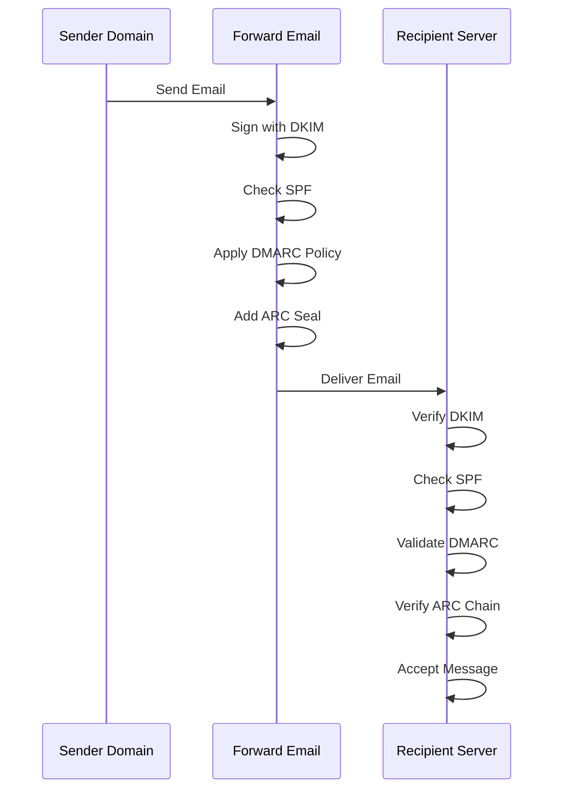

---


## بروتوكولات أمان نقل البريد الإلكتروني {#email-transport-security-protocols}

> \[!IMPORTANT]
> يقوم Forward Email بتنفيذ طبقات متعددة من أمان النقل لحماية الرسائل أثناء النقل.

ينفذ Forward Email بروتوكولات أمان النقل الحديثة:

| RFC                                                       | العنوان                                                                                              | الحالة      | ملاحظات التنفيذ                                                                                                                                                                                                                                                                               |
| --------------------------------------------------------- | ---------------------------------------------------------------------------------------------------- | ----------- | --------------------------------------------------------------------------------------------------------------------------------------------------------------------------------------------------------------------------------------------------------------------------------------------- |
| [RFC 8461](https://datatracker.ietf.org/doc/html/rfc8461) | أمان النقل الصارم لخادم البريد SMTP (MTA-STS)                                                       | ✅ مدعوم    | مستخدم على نطاق واسع في خوادم IMAP و SMTP و MX. انظر [create-mta-sts-cache.js](https://github.com/forwardemail/forwardemail.net/blob/master/helpers/create-mta-sts-cache.js) و [get-transporter.js](https://github.com/forwardemail/forwardemail.net/blob/master/helpers/get-transporter.js) |
| [RFC 8460](https://datatracker.ietf.org/doc/html/rfc8460) | تقارير TLS لـ SMTP                                                                                   | ✅ مدعوم    | عبر مكتبة [mailauth](https://github.com/postalsys/mailauth)                                                                                                                                                                                                                                  |
| [RFC 7671](https://datatracker.ietf.org/doc/html/rfc7671) | بروتوكول مصادقة الكيانات المسماة المعتمد على DNS (DANE): التحديثات والإرشادات التشغيلية              | ✅ مدعوم    | تحقق كامل من DANE لاتصالات SMTP الصادرة. انظر [mx-connect PR #22](https://github.com/zone-eu/mx-connect/pull/22)                                                                                                                                                                           |
| [RFC 6698](https://datatracker.ietf.org/doc/html/rfc6698) | بروتوكول أمان طبقة النقل (TLS) المعتمد على DNS (DANE): TLSA                                         | ✅ مدعوم    | دعم كامل لـ RFC 6698: أنواع الاستخدام PKIX-TA و PKIX-EE و DANE-TA و DANE-EE. انظر [mx-connect PR #22](https://github.com/zone-eu/mx-connect/pull/22)                                                                                                                                          |
| [RFC 8314](https://datatracker.ietf.org/doc/html/rfc8314) | النص الصريح يعتبر قديمًا: استخدام أمان طبقة النقل (TLS) لإرسال البريد والوصول إليه                   | ✅ مدعوم    | TLS مطلوب لجميع الاتصالات                                                                                                                                                                                                                                                                   |
| [RFC 8689](https://datatracker.ietf.org/doc/html/rfc8689) | امتداد خدمة SMTP لطلب TLS (REQUIRETLS)                                                             | ✅ مدعوم    | دعم كامل لامتداد SMTP REQUIRETLS ورأس "TLS-Required"                                                                                                                                                                                                                                        |
تضمن بروتوكولات أمان النقل تشفير رسائل البريد الإلكتروني والتحقق من صحتها أثناء الإرسال بين خوادم البريد.

### دعم أمان النقل {#transport-security-support}

| البروتوكول     | RFC      | الحالة      | الوصف                                            |
| -------------- | -------- | ----------- | ------------------------------------------------ |
| **TLS**        | RFC 8314 | ✅ مدعوم    | أمان طبقة النقل - اتصالات مشفرة                   |
| **MTA-STS**    | RFC 8461 | ✅ مدعوم    | أمان النقل الصارم لوكيل نقل البريد                 |
| **DANE**       | RFC 7671 | ✅ مدعوم    | التحقق من الكيانات المسماة المعتمد على DNS       |
| **REQUIRETLS** | RFC 8689 | ✅ مدعوم    | طلب TLS لمسار التسليم الكامل                       |

### TLS (أمان طبقة النقل) {#tls-transport-layer-security}

تفرض Forward Email تشفير TLS لجميع اتصالات البريد الإلكتروني (SMTP، IMAP، POP3).

**الميزات الرئيسية:**

* دعم TLS 1.2 و TLS 1.3
* إدارة الشهادات تلقائيًا
* السرية التامة للأمام (PFS)
* مجموعات تشفير قوية فقط

### MTA-STS (أمان النقل الصارم لوكيل نقل البريد) {#mta-sts-mail-transfer-agent-strict-transport-security}

**MTA-STS** يضمن أن يتم تسليم البريد الإلكتروني فقط عبر اتصالات مشفرة بـ TLS من خلال نشر سياسة عبر HTTPS.

تطبق Forward Email MTA-STS باستخدام [create-mta-sts-cache.js](https://github.com/forwardemail/forwardemail.net/blob/master/helpers/create-mta-sts-cache.js).

**الميزات الرئيسية:**

* نشر سياسة MTA-STS تلقائيًا
* تخزين مؤقت للسياسة لتحسين الأداء
* منع هجمات التراجع
* فرض التحقق من الشهادة

### DANE (التحقق من الكيانات المسماة المعتمد على DNS) {#dane-dns-based-authentication-of-named-entities}

> \[!NOTE]
> توفر Forward Email الآن دعمًا كاملاً لـ DANE لاتصالات SMTP الصادرة.

يستخدم **DANE** DNSSEC لنشر معلومات شهادة TLS في DNS، مما يسمح لخوادم البريد بالتحقق من الشهادات دون الاعتماد على سلطات الشهادات.

**الميزات الرئيسية:**

* ✅ تحقق كامل من DANE لاتصالات SMTP الصادرة
* ✅ دعم كامل لـ RFC 6698: أنواع الاستخدام PKIX-TA، PKIX-EE، DANE-TA، DANE-EE
* ✅ التحقق من الشهادة مقابل سجلات TLSA أثناء ترقية TLS
* ✅ حل متوازي لسجلات TLSA لعدة مضيفي MX
* ✅ الكشف التلقائي عن `dns.resolveTlsa` الأصلي (Node.js v22.15.0+، v23.9.0+)
* ✅ دعم محلل مخصص لإصدارات Node.js الأقدم عبر [Tangerine](https://github.com/forwardemail/tangerine)
* يتطلب نطاقات موقعة بـ DNSSEC

> \[!TIP]
> **تفاصيل التنفيذ:** تمت إضافة دعم DANE عبر [mx-connect PR #22](https://github.com/zone-eu/mx-connect/pull/22)، الذي يوفر دعمًا شاملاً لـ DANE/TLSA لاتصالات SMTP الصادرة.

### REQUIRETLS {#requiretls}

> \[!TIP]
> Forward Email هي واحدة من القلائل الذين يقدمون دعم REQUIRETLS للمستخدمين.

يضمن **REQUIRETLS** أن يتم تسليم رسائل البريد الإلكتروني فقط عبر اتصالات مشفرة بـ TLS لمسار التسليم الكامل.

**الميزات الرئيسية:**

* خانة اختيار للمستخدم في محرر البريد الإلكتروني
* رفض تلقائي للتسليم غير المشفر
* فرض TLS من الطرف إلى الطرف
* إشعارات تفصيلية عند الفشل

> \[!TIP]
> **فرض TLS للمستخدم:** توفر Forward Email خانة اختيار ضمن **حسابي > النطاقات > الإعدادات** لفرض TLS لجميع الاتصالات الواردة. عند التفعيل، ترفض هذه الميزة أي بريد وارد غير مرسل عبر اتصال مشفر بـ TLS مع رمز الخطأ 530، مما يضمن تشفير جميع البريد الوارد أثناء النقل.

### تدفق أمان النقل {#transport-security-flow}

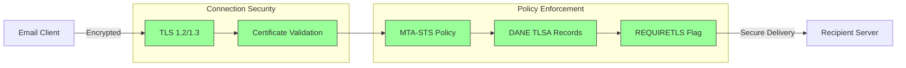
## تشفير رسالة البريد الإلكتروني {#email-message-encryption}

> \[!NOTE]
> يدعم Forward Email كل من OpenPGP و S/MIME لتشفير البريد الإلكتروني من طرف إلى طرف.

يدعم Forward Email تشفير OpenPGP و S/MIME:

| RFC                                                       | العنوان                                                                                  | الحالة      | ملاحظات التنفيذ                                                                                                                                                                                    |
| --------------------------------------------------------- | --------------------------------------------------------------------------------------- | ----------- | ------------------------------------------------------------------------------------------------------------------------------------------------------------------------------------------------- |
| [RFC 9580](https://datatracker.ietf.org/doc/html/rfc9580) | OpenPGP (يحل محل RFC 4880)                                                              | ✅ مدعوم    | عبر تكامل [OpenPGP.js v6+](https://github.com/openpgpjs/openpgpjs). انظر [الأسئلة الشائعة](https://forwardemail.net/en/faq#do-you-support-openpgpmime-end-to-end-encryption-e2ee-and-web-key-directory-wkd) |
| [RFC 8551](https://datatracker.ietf.org/doc/html/rfc8551) | ملحقات البريد الإلكتروني الآمنة/متعددة الأغراض (S/MIME) الإصدار 4.0 مواصفة الرسالة       | ✅ مدعوم    | تدعم كل من خوارزميات RSA و ECC. انظر [الأسئلة الشائعة](https://forwardemail.net/en/faq#do-you-support-smime-encryption)                                                                           |

تحمي بروتوكولات تشفير الرسائل محتوى البريد الإلكتروني من أن يقرأه أي شخص سوى المستلم المقصود، حتى إذا تم اعتراض الرسالة أثناء النقل.

### دعم التشفير {#encryption-support}

| البروتوكول   | RFC      | الحالة      | الوصف                                         |
| ----------- | -------- | ----------- | ---------------------------------------------- |
| **OpenPGP** | RFC 9580 | ✅ مدعوم    | خصوصية جيدة جدًا - تشفير المفتاح العام          |
| **S/MIME**  | RFC 8551 | ✅ مدعوم    | ملحقات البريد الإلكتروني الآمنة/متعددة الأغراض |
| **WKD**     | مسودة    | ✅ مدعوم    | دليل مفتاح الويب - اكتشاف المفتاح التلقائي      |

### OpenPGP (خصوصية جيدة جدًا) {#openpgp-pretty-good-privacy}

يوفر **OpenPGP** تشفيرًا من طرف إلى طرف باستخدام تشفير المفتاح العام. يدعم Forward Email OpenPGP من خلال بروتوكول [دليل مفتاح الويب (WKD)](https://forwardemail.net/en/faq#do-you-support-openpgpmime-end-to-end-encryption-e2ee-and-web-key-directory-wkd).

**الميزات الرئيسية:**

* اكتشاف المفتاح التلقائي عبر WKD
* دعم PGP/MIME للمرفقات المشفرة
* إدارة المفاتيح من خلال عميل البريد الإلكتروني
* متوافق مع GPG و Mailvelope وأدوات OpenPGP الأخرى

**كيفية الاستخدام:**

1. أنشئ زوج مفاتيح PGP في عميل البريد الإلكتروني الخاص بك
2. ارفع مفتاحك العام إلى WKD الخاص بـ Forward Email
3. يصبح مفتاحك قابلاً للاكتشاف تلقائيًا من قبل المستخدمين الآخرين
4. أرسل واستقبل رسائل مشفرة بسلاسة

### S/MIME (ملحقات البريد الإلكتروني الآمنة/متعددة الأغراض) {#smime-securemultipurpose-internet-mail-extensions}

يوفر **S/MIME** تشفير البريد الإلكتروني والتوقيعات الرقمية باستخدام شهادات X.509.

**الميزات الرئيسية:**

* التشفير المعتمد على الشهادة
* التوقيعات الرقمية لمصادقة الرسائل
* دعم أصلي في معظم عملاء البريد الإلكتروني
* أمان بمستوى المؤسسات

**كيفية الاستخدام:**

1. احصل على شهادة S/MIME من سلطة إصدار الشهادات
2. ثبت الشهادة في عميل البريد الإلكتروني الخاص بك
3. قم بتكوين عميلك لتشفير/توقيع الرسائل
4. تبادل الشهادات مع المستلمين

### تشفير صندوق البريد SQLite {#sqlite-mailbox-encryption}

> \[!IMPORTANT]
> يوفر Forward Email طبقة أمان إضافية مع صناديق بريد SQLite المشفرة.

بعيدًا عن تشفير مستوى الرسالة، يقوم Forward Email بتشفير صناديق البريد بالكامل باستخدام [sqleet](https://github.com/resilar/sqleet) (ChaCha20-Poly1305).

**الميزات الرئيسية:**

* **تشفير معتمد على كلمة المرور** - أنت فقط من يملك كلمة المرور
* **مقاوم للحوسبة الكمومية** - تشفير ChaCha20-Poly1305
* **عدم المعرفة** - لا يمكن لـ Forward Email فك تشفير صندوق بريدك
* **معزول** - كل صندوق بريد معزول وقابل للنقل
* **غير قابل للاسترداد** - إذا نسيت كلمة المرور، يفقد صندوق بريدك
### مقارنة التشفير {#encryption-comparison}

| الميزة                | OpenPGP           | S/MIME             | تشفير SQLite       |
| --------------------- | ----------------- | ------------------ | ----------------- |
| **نهاية إلى نهاية**   | ✅ نعم             | ✅ نعم              | ✅ نعم             |
| **إدارة المفاتيح**    | إدارة ذاتية       | صادرة عن CA        | معتمدة على كلمة المرور |
| **دعم العميل**        | يتطلب إضافة       | مدمج               | شفاف              |
| **حالة الاستخدام**    | شخصية             | مؤسسية             | تخزين             |
| **مقاوم للكمبيوتر الكمومي** | ⚠️ يعتمد على المفتاح | ⚠️ يعتمد على الشهادة | ✅ نعم             |

### تدفق التشفير {#encryption-flow}

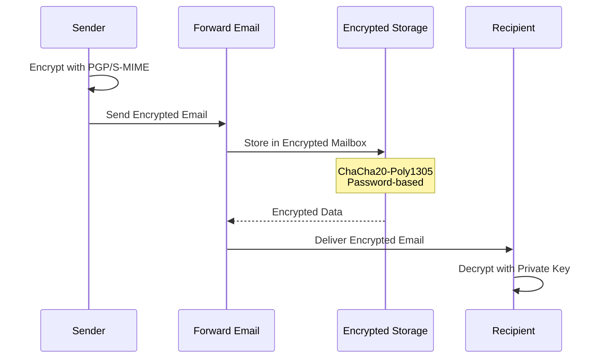

---


## الوظائف الموسعة {#extended-functionality}


## معايير تنسيق رسالة البريد الإلكتروني {#email-message-format-standards}

> \[!NOTE]
> يدعم Forward Email معايير تنسيق البريد الإلكتروني الحديثة للمحتوى الغني والتدويل.

يدعم Forward Email تنسيقات رسائل البريد الإلكتروني القياسية:

| RFC                                                       | العنوان                                                        | ملاحظات التنفيذ     |
| --------------------------------------------------------- | ------------------------------------------------------------- | -------------------- |
| [RFC 5322](https://datatracker.ietf.org/doc/html/rfc5322) | تنسيق رسالة الإنترنت                                          | دعم كامل            |
| [RFC 2045](https://datatracker.ietf.org/doc/html/rfc2045) | MIME الجزء الأول: تنسيق أجسام رسائل الإنترنت                   | دعم كامل لـ MIME     |
| [RFC 2046](https://datatracker.ietf.org/doc/html/rfc2046) | MIME الجزء الثاني: أنواع الوسائط                               | دعم كامل لـ MIME     |
| [RFC 2047](https://datatracker.ietf.org/doc/html/rfc2047) | MIME الجزء الثالث: امتدادات رأس الرسالة للنص غير ASCII         | دعم كامل لـ MIME     |
| [RFC 2048](https://datatracker.ietf.org/doc/html/rfc2048) | MIME الجزء الرابع: إجراءات التسجيل                             | دعم كامل لـ MIME     |
| [RFC 2049](https://datatracker.ietf.org/doc/html/rfc2049) | MIME الجزء الخامس: معايير المطابقة والأمثلة                     | دعم كامل لـ MIME     |

تعرف معايير تنسيق البريد الإلكتروني كيفية هيكلة رسائل البريد الإلكتروني وترميزها وعرضها.

### دعم معايير التنسيق {#format-standards-support}

| المعيار             | RFC           | الحالة      | الوصف                                |
| ------------------ | ------------- | ----------- | ------------------------------------- |
| **MIME**           | RFC 2045-2049 | ✅ مدعوم    | امتدادات البريد الإلكتروني متعددة الأغراض |
| **SMTPUTF8**       | RFC 6531      | ⚠️ جزئي    | عناوين البريد الإلكتروني الدولية     |
| **EAI**            | RFC 6530      | ⚠️ جزئي    | تدويل عناوين البريد الإلكتروني        |
| **تنسيق الرسالة**  | RFC 5322      | ✅ مدعوم    | تنسيق رسالة الإنترنت                 |
| **أمان MIME**      | RFC 1847      | ✅ مدعوم    | أجزاء الأمان لـ MIME                  |

### MIME (امتدادات البريد الإلكتروني متعددة الأغراض) {#mime-multipurpose-internet-mail-extensions}

**MIME** يسمح للبريد الإلكتروني بأن يحتوي على أجزاء متعددة بأنواع محتوى مختلفة (نص، HTML، مرفقات، إلخ).

**ميزات MIME المدعومة:**

* رسائل متعددة الأجزاء (مختلطة، بديلة، مرتبطة)
* رؤوس Content-Type
* ترميز Content-Transfer-Encoding (7bit، 8bit، quoted-printable، base64)
* الصور والمرفقات المضمنة
* محتوى HTML غني

### SMTPUTF8 وتدويل عناوين البريد الإلكتروني {#smtputf8-and-email-address-internationalization}

> \[!WARNING]
> دعم SMTPUTF8 جزئي - ليست كل الميزات مطبقة بالكامل.
**SMTPUTF8** يسمح لعناوين البريد الإلكتروني باحتواء أحرف غير ASCII (مثل `用户@例え.jp`).

**الحالة الحالية:**

* ⚠️ دعم جزئي لعناوين البريد الإلكتروني الدولية
* ✅ محتوى UTF-8 في نصوص الرسائل
* ⚠️ دعم محدود للأجزاء المحلية غير ASCII

---


## بروتوكولات التقويم وجهات الاتصال {#calendaring-and-contacts-protocols}

> \[!NOTE]
> يوفر Forward Email دعمًا كاملاً لـ CalDAV و CardDAV لمزامنة التقويم وجهات الاتصال.

يدعم Forward Email بروتوكولات CalDAV و CardDAV عبر مكتبة [caldav-adapter](https://github.com/forwardemail/caldav-adapter):

| RFC                                                       | العنوان                                                                   | الحالة      | ملاحظات التنفيذ                                                                                                                                                                      |
| --------------------------------------------------------- | ------------------------------------------------------------------------- | ----------- | ------------------------------------------------------------------------------------------------------------------------------------------------------------------------------------ |
| [RFC 4791](https://datatracker.ietf.org/doc/html/rfc4791) | امتدادات التقويم لـ WebDAV (CalDAV)                                      | ✅ مدعوم    | الوصول إلى التقويم وإدارته                                                                                                                                                           |
| [RFC 6352](https://datatracker.ietf.org/doc/html/rfc6352) | CardDAV: امتدادات vCard لـ WebDAV                                        | ✅ مدعوم    | الوصول إلى جهات الاتصال وإدارتها                                                                                                                                                      |
| [RFC 5545](https://datatracker.ietf.org/doc/html/rfc5545) | مواصفة كائنات التقويم والجدولة على الإنترنت (iCalendar)                   | ✅ مدعوم    | دعم تنسيق iCalendar                                                                                                                                                                  |
| [RFC 6350](https://datatracker.ietf.org/doc/html/rfc6350) | مواصفة تنسيق vCard                                                       | ✅ مدعوم    | دعم تنسيق vCard 4.0                                                                                                                                                                  |
| [RFC 6638](https://datatracker.ietf.org/doc/html/rfc6638) | امتدادات الجدولة لـ CalDAV                                               | ✅ مدعوم    | جدولة CalDAV مع دعم iMIP. انظر [commit c4d1629](https://github.com/forwardemail/forwardemail.net/commit/c4d162975a49e38d76d68a032662e873a34a9b80)                                   |
| [RFC 5546](https://datatracker.ietf.org/doc/html/rfc5546) | بروتوكول التشغيل البيني المستقل عن النقل لـ iCalendar (iTIP)             | ✅ مدعوم    | دعم iTIP لطرق REQUEST و REPLY و CANCEL و VFREEBUSY. انظر [commit c4d1629](https://github.com/forwardemail/forwardemail.net/commit/c4d162975a49e38d76d68a032662e873a34a9b80)          |
| [RFC 6047](https://datatracker.ietf.org/doc/html/rfc6047) | بروتوكول التشغيل البيني القائم على الرسائل لـ iCalendar (iMIP)           | ✅ مدعوم    | دعوات التقويم عبر البريد الإلكتروني مع روابط الرد. انظر [commit c4d1629](https://github.com/forwardemail/forwardemail.net/commit/c4d162975a49e38d76d68a032662e873a34a9b80)          |

CalDAV و CardDAV هما بروتوكولات تسمح بالوصول إلى بيانات التقويم وجهات الاتصال ومشاركتها ومزامنتها عبر الأجهزة.

### دعم CalDAV و CardDAV {#caldav-and-carddav-support}

| البروتوكول            | RFC      | الحالة      | الوصف                                  |
| --------------------- | -------- | ----------- | -------------------------------------- |
| **CalDAV**            | RFC 4791 | ✅ مدعوم    | الوصول إلى التقويم والمزامنة           |
| **CardDAV**           | RFC 6352 | ✅ مدعوم    | الوصول إلى جهات الاتصال والمزامنة      |
| **iCalendar**         | RFC 5545 | ✅ مدعوم    | تنسيق بيانات التقويم                   |
| **vCard**             | RFC 6350 | ✅ مدعوم    | تنسيق بيانات جهات الاتصال              |
| **VTODO**             | RFC 5545 | ✅ مدعوم    | دعم المهام/التذكيرات                   |
| **جدولة CalDAV**      | RFC 6638 | ✅ مدعوم    | امتدادات جدولة التقويم                 |
| **iTIP**              | RFC 5546 | ✅ مدعوم    | التشغيل البيني المستقل عن النقل        |
| **iMIP**              | RFC 6047 | ✅ مدعوم    | دعوات التقويم عبر البريد الإلكتروني    |
### CalDAV (الوصول إلى التقويم) {#caldav-calendar-access}

**CalDAV** يتيح لك الوصول إلى التقويمات وإدارتها من أي جهاز أو تطبيق.

**الميزات الرئيسية:**

* مزامنة متعددة الأجهزة
* تقويمات مشتركة
* اشتراكات التقويم
* دعوات الأحداث والردود عليها
* الأحداث المتكررة
* دعم المناطق الزمنية

**العملاء المتوافقون:**

* Apple Calendar (macOS، iOS)
* Mozilla Thunderbird
* Evolution
* GNOME Calendar
* أي عميل متوافق مع CalDAV

### CardDAV (الوصول إلى جهات الاتصال) {#carddav-contact-access}

**CardDAV** يتيح لك الوصول إلى جهات الاتصال وإدارتها من أي جهاز أو تطبيق.

**الميزات الرئيسية:**

* مزامنة متعددة الأجهزة
* دفاتر عناوين مشتركة
* مجموعات جهات الاتصال
* دعم الصور
* حقول مخصصة
* دعم vCard 4.0

**العملاء المتوافقون:**

* Apple Contacts (macOS، iOS)
* Mozilla Thunderbird
* Evolution
* GNOME Contacts
* أي عميل متوافق مع CardDAV

### المهام والتذكيرات (CalDAV VTODO) {#tasks-and-reminders-caldav-vtodo}

> \[!TIP]
> يدعم Forward Email المهام والتذكيرات من خلال CalDAV VTODO.

**VTODO** هو جزء من تنسيق iCalendar ويسمح بإدارة المهام عبر CalDAV.

**الميزات الرئيسية:**

* إنشاء المهام وإدارتها
* تواريخ الاستحقاق والأولويات
* تتبع إكمال المهام
* المهام المتكررة
* قوائم/فئات المهام

**العملاء المتوافقون:**

* Apple Reminders (macOS، iOS)
* Mozilla Thunderbird (مع Lightning)
* Evolution
* GNOME To Do
* أي عميل CalDAV يدعم VTODO

### تدفق مزامنة CalDAV/CardDAV {#caldavcarddav-synchronization-flow}

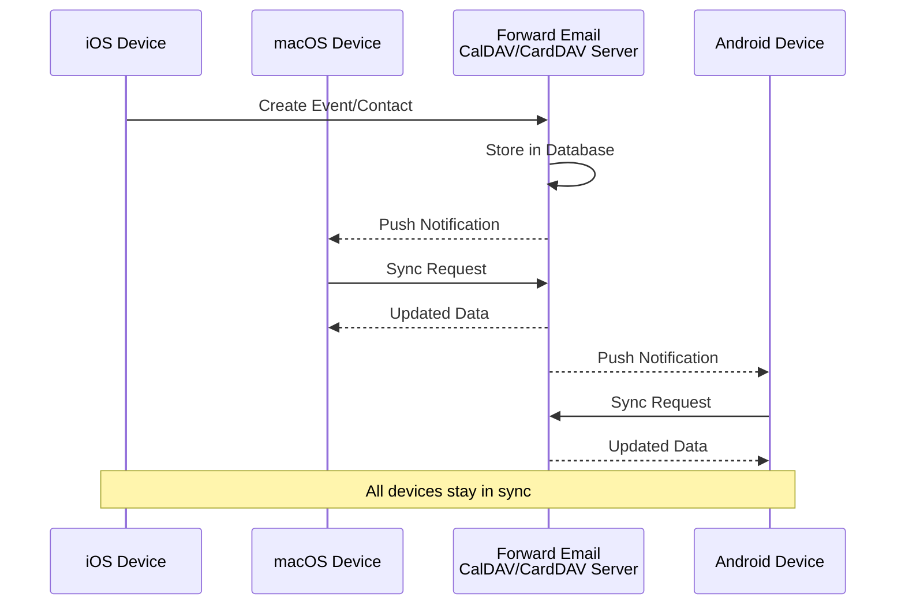

### امتدادات التقويم غير المدعومة {#calendaring-extensions-not-supported}

الامتدادات التالية للتقويم غير مدعومة:

| RFC                                                       | العنوان                                                               | السبب                                                          |
| --------------------------------------------------------- | --------------------------------------------------------------------- | --------------------------------------------------------------- |
| [RFC 4918](https://datatracker.ietf.org/doc/html/rfc4918) | امتدادات HTTP للتأليف والتوزيع عبر الويب (WebDAV)                     | يستخدم CalDAV مفاهيم WebDAV لكنه لا ينفذ RFC 4918 بالكامل       |
| [RFC 6578](https://datatracker.ietf.org/doc/html/rfc6578) | مزامنة المجموعات لـ WebDAV                                           | غير منفذ                                                        |
| [RFC 3744](https://datatracker.ietf.org/doc/html/rfc3744) | بروتوكول التحكم في الوصول لـ WebDAV                                  | غير منفذ                                                        |

---


## تصفية رسائل البريد الإلكتروني {#email-message-filtering}

> \[!IMPORTANT]
> يوفر Forward Email **دعم كامل لـ Sieve و ManageSieve** لتصفية البريد الإلكتروني على جانب الخادم. أنشئ قواعد قوية لفرز الرسائل الواردة وتصفيةها وإعادة توجيهها والرد عليها تلقائيًا.

### Sieve (RFC 5228) {#sieve-rfc-5228}

[Sieve](https://en.wikipedia.org/wiki/Sieve_\(mail_filtering_language\)) هي لغة برمجة معيارية وقوية لتصفية البريد الإلكتروني على جانب الخادم. ينفذ Forward Email دعمًا شاملاً لـ Sieve مع 24 امتدادًا.

**رمز المصدر:** [`helpers/sieve/`](https://github.com/forwardemail/forwardemail.net/tree/master/helpers/sieve)

#### RFCs الأساسية المدعومة لـ Sieve {#core-sieve-rfcs-supported}

| RFC                                                                                    | العنوان                                                        | الحالة          |
| -------------------------------------------------------------------------------------- | -------------------------------------------------------------- | --------------- |
| [RFC 5228](https://datatracker.ietf.org/doc/html/rfc5228)                              | Sieve: لغة تصفية البريد الإلكتروني                             | ✅ دعم كامل      |
| [RFC 5429](https://datatracker.ietf.org/doc/html/rfc5429)                              | Sieve تصفية البريد الإلكتروني: رفض وامتدادات الرفض الموسعة    | ✅ دعم كامل      |
| [RFC 5230](https://datatracker.ietf.org/doc/html/rfc5230)                              | Sieve تصفية البريد الإلكتروني: امتداد الإجازة                  | ✅ دعم كامل      |
| [RFC 6131](https://datatracker.ietf.org/doc/html/rfc6131)                              | Sieve امتداد الإجازة: معلمة "الثواني"                          | ✅ دعم كامل      |
| [RFC 5232](https://datatracker.ietf.org/doc/html/rfc5232)                              | Sieve تصفية البريد الإلكتروني: امتداد علامات Imap4            | ✅ دعم كامل      |
| [RFC 5173](https://datatracker.ietf.org/doc/html/rfc5173)                              | Sieve تصفية البريد الإلكتروني: امتداد الجسم                     | ✅ دعم كامل      |
| [RFC 5229](https://datatracker.ietf.org/doc/html/rfc5229)                              | Sieve تصفية البريد الإلكتروني: امتداد المتغيرات                | ✅ دعم كامل      |
| [RFC 5231](https://datatracker.ietf.org/doc/html/rfc5231)                              | Sieve تصفية البريد الإلكتروني: الامتداد العلاقي                 | ✅ دعم كامل      |
| [RFC 4790](https://datatracker.ietf.org/doc/html/rfc4790)                              | سجل تجميع بروتوكولات تطبيق الإنترنت                            | ✅ دعم كامل      |
| [RFC 3894](https://datatracker.ietf.org/doc/html/rfc3894)                              | امتداد Sieve: النسخ بدون تأثيرات جانبية                        | ✅ دعم كامل      |
| [RFC 5293](https://datatracker.ietf.org/doc/html/rfc5293)                              | Sieve تصفية البريد الإلكتروني: امتداد تحرير الرأس              | ✅ دعم كامل      |
| [RFC 5260](https://datatracker.ietf.org/doc/html/rfc5260)                              | Sieve تصفية البريد الإلكتروني: امتدادات التاريخ والفهرس        | ✅ دعم كامل      |
| [RFC 5435](https://datatracker.ietf.org/doc/html/rfc5435)                              | Sieve تصفية البريد الإلكتروني: امتداد الإشعارات                 | ✅ دعم كامل      |
| [RFC 5183](https://datatracker.ietf.org/doc/html/rfc5183)                              | Sieve تصفية البريد الإلكتروني: امتداد البيئة                    | ✅ دعم كامل      |
| [RFC 5490](https://datatracker.ietf.org/doc/html/rfc5490)                              | Sieve تصفية البريد الإلكتروني: امتدادات لفحص حالة صندوق البريد | ✅ دعم كامل      |
| [RFC 8579](https://datatracker.ietf.org/doc/html/rfc8579)                              | Sieve تصفية البريد الإلكتروني: التسليم إلى صناديق البريد الخاصة | ✅ دعم كامل      |
| [RFC 7352](https://datatracker.ietf.org/doc/html/rfc7352)                              | Sieve تصفية البريد الإلكتروني: اكتشاف التسليمات المكررة         | ✅ دعم كامل      |
| [RFC 5463](https://datatracker.ietf.org/doc/html/rfc5463)                              | Sieve تصفية البريد الإلكتروني: امتداد Ihave                    | ✅ دعم كامل      |
| [RFC 5233](https://datatracker.ietf.org/doc/html/rfc5233)                              | Sieve تصفية البريد الإلكتروني: امتداد العنوان الفرعي           | ✅ دعم كامل      |
| [draft-ietf-sieve-regex](https://datatracker.ietf.org/doc/html/draft-ietf-sieve-regex) | Sieve تصفية البريد الإلكتروني: امتداد التعبيرات النمطية        | ✅ دعم كامل      |
#### امتدادات Sieve المدعومة {#supported-sieve-extensions}

| الامتداد                    | الوصف                                   | التكامل                                   |
| ---------------------------- | ---------------------------------------- | ------------------------------------------ |
| `fileinto`                   | تصنيف الرسائل في مجلدات محددة             | تخزين الرسائل في مجلد IMAP المحدد          |
| `reject` / `ereject`         | رفض الرسائل مع رسالة خطأ                  | رفض SMTP مع رسالة ارتداد                    |
| `vacation`                   | ردود تلقائية للعطلات/خارج المكتب          | قائمة الانتظار عبر Emails.queue مع تحديد المعدل |
| `vacation-seconds`           | فترات استجابة دقيقة للردود أثناء العطلة    | TTL من معامل `:seconds`                     |
| `imap4flags`                 | تعيين علامات IMAP (\Seen, \Flagged, إلخ) | تطبيق العلامات أثناء تخزين الرسالة          |
| `envelope`                   | اختبار مرسل/مستلم الظرف                   | الوصول إلى بيانات ظرف SMTP                  |
| `body`                       | اختبار محتوى نص الرسالة                   | مطابقة نص كامل للجسم                        |
| `variables`                  | تخزين واستخدام المتغيرات في السكربتات     | توسيع المتغيرات مع المعدلات                  |
| `relational`                 | المقارنات العلائقية                       | `:count`، `:value` مع gt/lt/eq               |
| `comparator-i;ascii-numeric` | المقارنات الرقمية                         | مقارنة سلاسل رقمية                           |
| `copy`                       | نسخ الرسائل أثناء إعادة التوجيه            | علامة `:copy` على fileinto/redirect          |
| `editheader`                 | إضافة أو حذف رؤوس الرسائل                  | تعديل الرؤوس قبل التخزين                      |
| `date`                       | اختبار قيم التاريخ/الوقت                   | اختبارات `currentdate` وتاريخ الرأس           |
| `index`                      | الوصول إلى تكرارات رأس محددة                | `:index` للرؤوس متعددة القيم                   |
| `regex`                      | مطابقة التعبيرات النمطية                   | دعم كامل للتعبيرات النمطية في الاختبارات      |
| `enotify`                    | إرسال الإشعارات                            | إشعارات `mailto:` عبر Emails.queue            |
| `environment`                | الوصول إلى معلومات البيئة                  | النطاق، المضيف، العنوان البعيد من الجلسة      |
| `mailbox`                    | اختبار وجود صندوق البريد                    | اختبار `mailboxexists`                        |
| `special-use`                | تصنيف في صناديق بريد خاصة الاستخدام          | تعيين \Junk، \Trash، إلخ إلى مجلدات             |
| `duplicate`                  | اكتشاف الرسائل المكررة                      | تتبع التكرار باستخدام Redis                   |
| `ihave`                      | اختبار توفر الامتداد                       | التحقق من القدرة أثناء التشغيل                  |
| `subaddress`                 | الوصول إلى أجزاء عنوان المستخدم+التفصيل    | أجزاء العنوان `:user` و `:detail`              |

#### امتدادات Sieve غير المدعومة {#sieve-extensions-not-supported}

| الامتداد                               | RFC                                                       | السبب                                                           |
| --------------------------------------- | --------------------------------------------------------- | ---------------------------------------------------------------- |
| `include`                               | [RFC 6609](https://datatracker.ietf.org/doc/html/rfc6609) | خطر أمني (حقن سكربت)، يتطلب تخزين سكربت عالمي                   |
| `mboxmetadata` / `servermetadata`       | [RFC 5490](https://datatracker.ietf.org/doc/html/rfc5490) | يتطلب امتداد IMAP METADATA                                     |
| `fcc`                                   | [RFC 8580](https://datatracker.ietf.org/doc/html/rfc8580) | يتطلب تكامل مجلد المرسلة                                       |
| `encoded-character`                     | [RFC 5228](https://datatracker.ietf.org/doc/html/rfc5228) | يتطلب تغييرات في المحلل للنحو ${hex:}                          |
| `foreverypart` / `mime` / `extracttext` | [RFC 5703](https://datatracker.ietf.org/doc/html/rfc5703) | تعقيد في معالجة شجرة MIME                                      |
#### تدفق معالجة Sieve {#sieve-processing-flow}

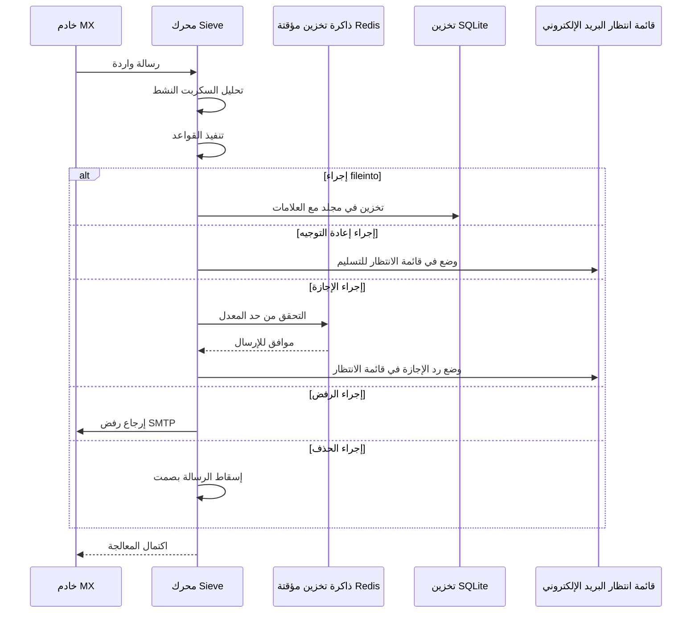

#### ميزات الأمان {#security-features}

تتضمن تنفيذ Sieve في Forward Email حماية أمنية شاملة:

* **حماية CVE-2023-26430**: تمنع حلقات إعادة التوجيه وهجمات قصف البريد
* **تحديد المعدل**: حدود على عمليات إعادة التوجيه (10/رسالة، 100/يوم) وردود الإجازة
* **التحقق من قائمة الرفض**: يتم فحص عناوين إعادة التوجيه مقابل قائمة الرفض
* **رؤوس محمية**: لا يمكن تعديل رؤوس DKIM و ARC والمصادقة عبر editheader
* **حدود حجم السكربت**: فرض الحد الأقصى لحجم السكربت
* **مهلات التنفيذ**: يتم إنهاء السكربتات إذا تجاوزت وقت التنفيذ الحد المسموح

#### أمثلة على سكربتات Sieve {#example-sieve-scripts}

**تخزين النشرات الإخبارية في مجلد:**

```sieve
require ["fileinto"];

if header :contains "List-Id" "newsletter" {
    fileinto "Newsletters";
}
```

**الرد التلقائي للإجازة مع توقيت دقيق:**

```sieve
require ["vacation", "vacation-seconds"];

vacation :seconds 3600 :subject "خارج المكتب"
    "أنا حالياً بعيد وسأرد خلال 24 ساعة.";
```

**تصفية الرسائل المزعجة مع العلامات:**

```sieve
require ["fileinto", "imap4flags"];

if header :contains "X-Spam-Status" "Yes" {
    setflag "\\Seen";
    fileinto "Junk";
}
```

**تصفية معقدة باستخدام المتغيرات:**

```sieve
require ["variables", "fileinto", "regex"];

if header :regex "From" "(.+)@example\\.com" {
    set :lower "sender" "${1}";
    fileinto "Contacts/${sender}";
}
```

> \[!TIP]
> للتوثيق الكامل، وأمثلة السكربتات، وتعليمات التكوين، راجع [الأسئلة الشائعة: هل تدعمون تصفية البريد الإلكتروني باستخدام Sieve؟](/faq#do-you-support-sieve-email-filtering)

### ManageSieve (RFC 5804) {#managesieve-rfc-5804}

يوفر Forward Email دعمًا كاملاً لبروتوكول ManageSieve لإدارة سكربتات Sieve عن بُعد.

**كود المصدر:** [`managesieve-server.js`](https://github.com/forwardemail/forwardemail.net/blob/master/managesieve-server.js)

| RFC                                                       | العنوان                                         | الحالة         |
| --------------------------------------------------------- | ---------------------------------------------- | -------------- |
| [RFC 5804](https://datatracker.ietf.org/doc/html/rfc5804) | بروتوكول لإدارة سكربتات Sieve عن بُعد          | ✅ دعم كامل    |

#### تكوين خادم ManageSieve {#managesieve-server-configuration}

| الإعداد                  | القيمة                   |
| ----------------------- | ----------------------- |
| **الخادم**              | `imap.forwardemail.net` |
| **المنفذ (STARTTLS)**   | `2190` (موصى به)        |
| **المنفذ (TLS ضمني)**   | `4190`                  |
| **المصادقة**            | PLAIN (عبر TLS)         |

> **ملاحظة:** يستخدم المنفذ 2190 STARTTLS (ترقية من اتصال عادي إلى TLS) وهو متوافق مع معظم عملاء ManageSieve بما في ذلك [sieve-connect](https://github.com/philpennock/sieve-connect). يستخدم المنفذ 4190 TLS ضمني (TLS من بداية الاتصال) للعملاء الذين يدعمونه.

#### أوامر ManageSieve المدعومة {#supported-managesieve-commands}

| الأمر          | الوصف                                   |
| -------------- | --------------------------------------- |
| `AUTHENTICATE` | المصادقة باستخدام آلية PLAIN             |
| `CAPABILITY`   | سرد قدرات الخادم والامتدادات            |
| `HAVESPACE`    | التحقق مما إذا كان يمكن تخزين السكربت   |
| `PUTSCRIPT`    | رفع سكربت جديد                         |
| `LISTSCRIPTS`  | سرد جميع السكربتات مع حالة النشاط       |
| `SETACTIVE`    | تفعيل سكربت                           |
| `GETSCRIPT`    | تنزيل سكربت                           |
| `DELETESCRIPT` | حذف سكربت                            |
| `RENAMESCRIPT` | إعادة تسمية سكربت                     |
| `CHECKSCRIPT`  | التحقق من صحة بناء جملة السكربت         |
| `NOOP`         | إبقاء الاتصال نشط                     |
| `LOGOUT`       | إنهاء الجلسة                          |
#### عملاء ManageSieve المتوافقون {#compatible-managesieve-clients}

* **Thunderbird**: دعم Sieve مدمج عبر [إضافة Sieve](https://addons.thunderbird.net/addon/sieve/)
* **Roundcube**: [إضافة ManageSieve](https://plugins.roundcube.net/packages/johndoh/sieve)
* **KMail**: دعم ManageSieve أصلي
* **sieve-connect**: عميل سطر الأوامر
* **أي عميل متوافق مع RFC 5804**

#### تدفق بروتوكول ManageSieve {#managesieve-protocol-flow}

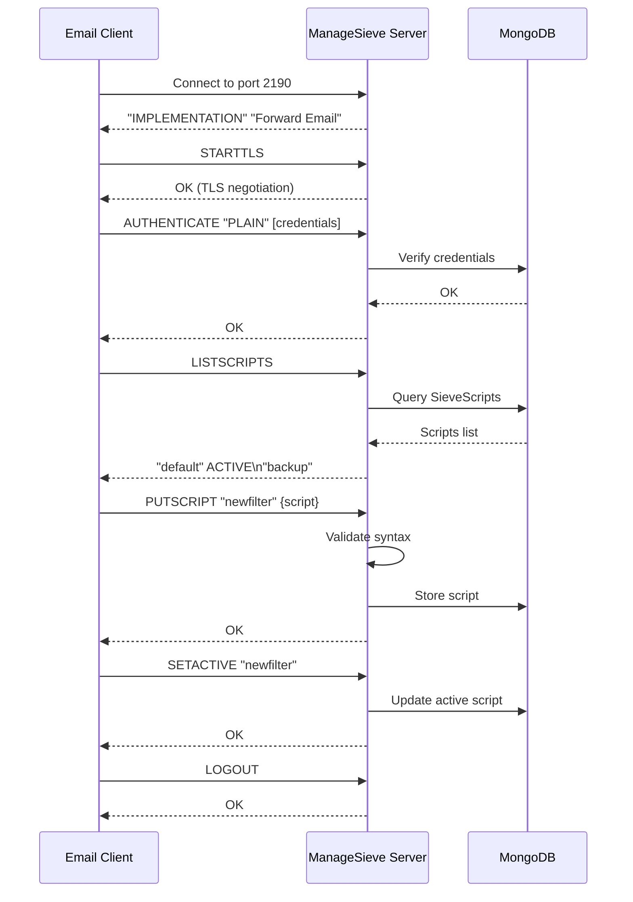

#### واجهة الويب وواجهة برمجة التطبيقات {#web-interface-and-api}

بالإضافة إلى ManageSieve، يوفر Forward Email:

* **لوحة تحكم الويب**: إنشاء وإدارة سكربتات Sieve عبر واجهة الويب في حسابي → النطاقات → الأسماء المستعارة → سكربتات Sieve
* **واجهة برمجة التطبيقات REST**: وصول برمجي لإدارة سكربتات Sieve عبر [واجهة برمجة تطبيقات Forward Email](/api#sieve-scripts)

> \[!TIP]
> للحصول على تعليمات إعداد مفصلة وتكوين العميل، راجع [الأسئلة الشائعة: هل تدعمون تصفية البريد الإلكتروني باستخدام Sieve؟](/faq#do-you-support-sieve-email-filtering)

---


## تحسين التخزين {#storage-optimization}

> \[!IMPORTANT]
> **تقنية تخزين رائدة في الصناعة:** Forward Email هو **مزود البريد الإلكتروني الوحيد في العالم** الذي يجمع بين إزالة التكرار للمرفقات وضغط Brotli على محتوى البريد الإلكتروني. تمنحك هذه الطبقة المزدوجة من التحسين **سعة تخزين فعالة أكبر بمقدار 2-3 مرات** مقارنة بمزودي البريد الإلكتروني التقليديين.

يطبق Forward Email تقنيتين ثوريتين لتحسين التخزين تقللان بشكل كبير من حجم صندوق البريد مع الحفاظ على الامتثال الكامل لمواصفات RFC ودقة الرسائل:

1. **إزالة التكرار للمرفقات** - تلغي المرفقات المكررة عبر جميع الرسائل
2. **ضغط Brotli** - يقلل التخزين بنسبة 46-86% للبيانات الوصفية و50% للمرفقات

### البنية: تحسين التخزين بطبقتين {#architecture-dual-layer-storage-optimization}

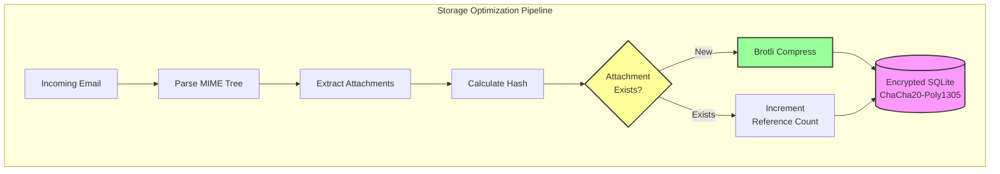

---


## إزالة التكرار للمرفقات {#attachment-deduplication}

يطبق Forward Email إزالة التكرار للمرفقات بناءً على [نهج WildDuck المثبت](https://docs.wildduck.email/docs/in-depth/attachment-deduplication/)، المعدل لتخزين SQLite.

> \[!NOTE]
> **ما يتم إزالته من التكرار:** "المرفق" يشير إلى محتويات عقدة MIME **المشفرة** (base64 أو quoted-printable)، وليس الملف المفكك. هذا يحافظ على صلاحية توقيعات DKIM وGPG.

### كيف يعمل {#how-it-works}

**التنفيذ الأصلي لـ WildDuck (MongoDB GridFS):**

> يقوم خادم Wild Duck IMAP بإزالة التكرار للمرفقات. "المرفق" في هذه الحالة يعني محتويات عقدة MIME المشفرة base64 أو quoted-printable، وليس الملف المفكك. على الرغم من أن استخدام المحتوى المشفر يؤدي إلى الكثير من النتائج السلبية الخاطئة (قد يُحتسب نفس الملف في رسائل مختلفة كمرفقات مختلفة) إلا أنه ضروري لضمان صلاحية مخططات التوقيع المختلفة (DKIM، GPG، إلخ). الرسالة المسترجعة من Wild Duck تبدو تمامًا كما هي الرسالة المخزنة على الرغم من أن Wild Duck يحلل الرسالة إلى كائن شجري ويعيد بناء الرسالة عند الاسترجاع.
**تنفيذ Forward Email لـ SQLite:**

يتبنى Forward Email هذا النهج لتخزين SQLite المشفر من خلال العملية التالية:

1. **حساب الهاش**: عند العثور على مرفق، يتم حساب هاش باستخدام مكتبة [`rev-hash`](https://github.com/sindresorhus/rev-hash) من محتوى المرفق
2. **البحث**: التحقق مما إذا كان هناك مرفق بنفس الهاش موجود في جدول `Attachments`
3. **عد المراجع**:
   * إذا كان موجودًا: زيادة عداد المراجع بمقدار 1 والعداد السحري برقم عشوائي
   * إذا كان جديدًا: إنشاء إدخال مرفق جديد مع العداد = 1
4. **سلامة الحذف**: يستخدم نظام عداد مزدوج (مرجع + سحري) لمنع الإيجابيات الكاذبة
5. **جمع القمامة**: يتم حذف المرفقات فورًا عندما يصل كلا العدادين إلى الصفر

**الكود المصدري:** [`helpers/attachment-storage.js`](https://github.com/forwardemail/forwardemail.net/blob/master/helpers/attachment-storage.js)

### تدفق إزالة التكرار {#deduplication-flow}

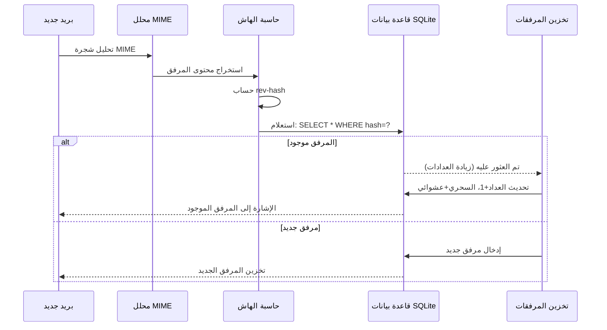

### نظام الرقم السحري {#magic-number-system}

يستخدم Forward Email نظام "الرقم السحري" الخاص بـ WildDuck (مستوحى من [Mail.ru](https://github.com/zone-eu/wildduck)) لمنع الإيجابيات الكاذبة أثناء الحذف:

* يتم تعيين **رقم عشوائي** لكل رسالة
* يتم زيادة **عداد السحر** للمرفق بهذا الرقم العشوائي عند إضافة الرسالة
* يتم إنقاص عداد السحر بنفس الرقم عند حذف الرسالة
* يتم حذف المرفق فقط عندما يصل **كلا العدادين** (المرجع + السحري) إلى الصفر

يضمن هذا النظام ذو العداد المزدوج أنه إذا حدث خطأ أثناء الحذف (مثل تعطل، خطأ في الشبكة)، لا يتم حذف المرفق قبل الأوان.

### الفروقات الرئيسية: WildDuck مقابل Forward Email {#key-differences-wildduck-vs-forward-email}

| الميزة                 | WildDuck (MongoDB)       | Forward Email (SQLite)       |
| ---------------------- | ------------------------ | ---------------------------- |
| **نظام التخزين**       | MongoDB GridFS (مجزأ)    | SQLite BLOB (مباشر)          |
| **خوارزمية الهاش**     | SHA256                   | rev-hash (مبني على SHA-256) |
| **عد المراجع**         | ✅ نعم                   | ✅ نعم                       |
| **الأرقام السحرية**    | ✅ نعم (مستوحى من Mail.ru) | ✅ نعم (نفس النظام)          |
| **جمع القمامة**        | مؤجل (وظيفة منفصلة)      | فوري (عند وصول العدادات للصفر) |
| **الضغط**              | ❌ لا يوجد               | ✅ Brotli (انظر أدناه)        |
| **التشفير**            | ❌ اختياري               | ✅ دائم (ChaCha20-Poly1305)  |

---


## ضغط Brotli {#brotli-compression}

> \[!IMPORTANT]
> **الأول عالميًا:** Forward Email هو **الخدمة البريدية الوحيدة في العالم** التي تستخدم ضغط Brotli على محتوى البريد الإلكتروني. هذا يوفر **توفير في التخزين بنسبة 46-86%** بالإضافة إلى إزالة التكرار في المرفقات.

يقوم Forward Email بتنفيذ ضغط Brotli لكل من محتويات المرفقات وبيانات الرسائل الوصفية، مما يوفر توفيرًا هائلًا في التخزين مع الحفاظ على التوافق مع الإصدارات السابقة.

**التنفيذ:** [`helpers/msgpack-helpers.js`](https://github.com/forwardemail/forwardemail.net/blob/master/helpers/msgpack-helpers.js)

### ما الذي يتم ضغطه {#what-gets-compressed}

**1. محتويات المرفقات** (`encodeAttachmentBody`)

* **الصيغ القديمة**: سلسلة مشفرة بنظام سداسي عشري (بحجم مضاعف 2x) أو Buffer خام
* **الصيغة الجديدة**: Buffer مضغوط بـ Brotli مع رأس سحري "FEBR"
* **قرار الضغط**: يضغط فقط إذا وفر مساحة (يأخذ في الاعتبار رأس بحجم 4 بايت)
* **توفير التخزين**: يصل إلى **50%** (من سداسي عشري → BLOB أصلي)
**2. بيانات وصف الرسالة** (`encodeMetadata`)

تشمل: `mimeTree`، `headers`، `envelope`، `flags`

* **الصيغة القديمة**: نص JSON كسلسلة
* **الصيغة الجديدة**: Buffer مضغوط باستخدام Brotli
* **توفير التخزين**: **46-86%** حسب تعقيد الرسالة

### إعدادات الضغط {#compression-configuration}

```javascript
// خيارات ضغط Brotli محسّنة للسرعة (المستوى 4 توازن جيد)
const BROTLI_COMPRESS_OPTIONS = {
  params: {
    [zlib.constants.BROTLI_PARAM_QUALITY]: 4
  }
};
```

**لماذا المستوى 4؟**

* **ضغط/فك ضغط سريع**: معالجة بأقل من مللي ثانية
* **نسبة ضغط جيدة**: توفير 46-86%
* **أداء متوازن**: مثالي لعمليات البريد الإلكتروني في الوقت الحقيقي

### رأس سحري: "FEBR" {#magic-header-febr}

يستخدم Forward Email رأسًا سحريًا مكونًا من 4 بايتات لتحديد محتويات المرفقات المضغوطة:

```
"FEBR" = Forward Email BRotli
Hex: 0x46 0x45 0x42 0x52
```

**لماذا رأس سحري؟**

* **كشف الصيغة**: تحديد فوري للبيانات المضغوطة مقابل غير المضغوطة
* **التوافق مع الإصدارات السابقة**: سلاسل hex القديمة وBuffers الخام لا تزال تعمل
* **تجنب التصادم**: من غير المحتمل ظهور "FEBR" في بداية بيانات المرفقات الشرعية

### عملية الضغط {#compression-process}

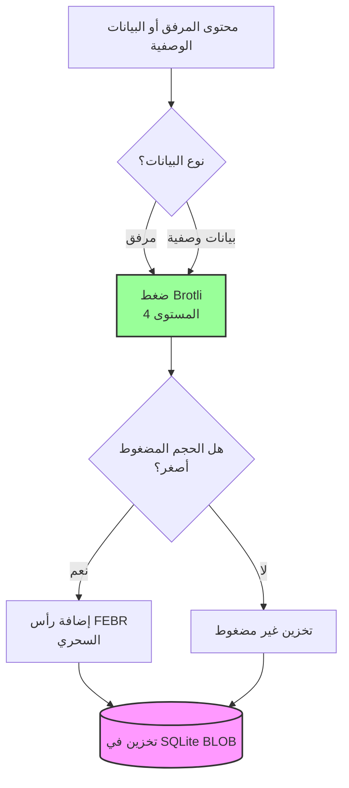

### عملية فك الضغط {#decompression-process}

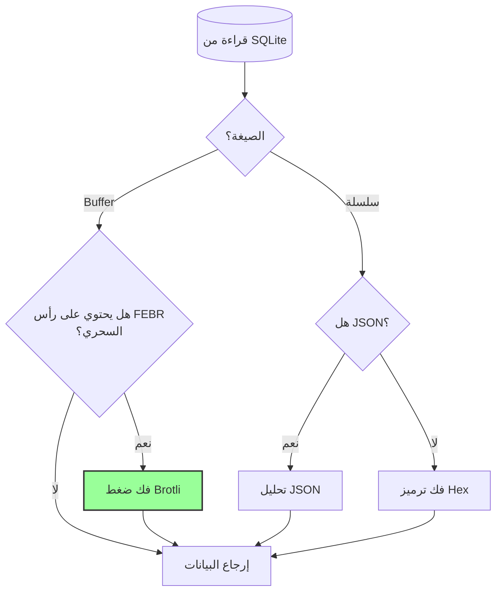

### التوافق مع الإصدارات السابقة {#backwards-compatibility}

جميع دوال فك الترميز **تكتشف تلقائيًا** صيغة التخزين:

| الصيغة                | طريقة الكشف                          | المعالجة                                      |
| --------------------- | ---------------------------------- | --------------------------------------------- |
| **مضغوط Brotli**      | التحقق من رأس "FEBR" السحري         | فك الضغط باستخدام `zlib.brotliDecompressSync()` |
| **Buffer خام**        | `Buffer.isBuffer()` بدون رأس سحري    | إرجاع كما هو                                  |
| **سلسلة Hex**         | التحقق من طول زوجي + أحرف [0-9a-f] | فك الترميز باستخدام `Buffer.from(value, 'hex')` |
| **سلسلة JSON**        | التحقق من `{` أو `[` كأول حرف       | التحليل باستخدام `JSON.parse()`               |

هذا يضمن **عدم فقدان أي بيانات** أثناء الترحيل من الصيغ القديمة إلى الجديدة.

### إحصائيات توفير التخزين {#storage-savings-statistics}

**التوفير المقاس من بيانات الإنتاج:**

| نوع البيانات          | الصيغة القديمة           | الصيغة الجديدة          | التوفير    |
| --------------------- | ------------------------ | ----------------------- | ---------- |
| **محتويات المرفقات** | سلسلة مشفرة بـ Hex (2x)  | BLOB مضغوط باستخدام Brotli | **50%**    |
| **بيانات وصف الرسالة**| نص JSON                  | BLOB مضغوط باستخدام Brotli | **46-86%** |
| **علامات صندوق البريد**| نص JSON                  | BLOB مضغوط باستخدام Brotli | **60-80%** |

**المصدر:** [`helpers/migrate-storage-format.js`](https://github.com/forwardemail/forwardemail.net/blob/master/helpers/migrate-storage-format.js)

### عملية الترحيل {#migration-process}

يوفر Forward Email ترحيلًا تلقائيًا ومتكررًا من الصيغ القديمة إلى الجديدة:
// إحصائيات الترحيل المتتبعة:
{
  attachmentsMigrated: 0,
  messagesMigrated: 0,
  mailboxesMigrated: 0,
  bytesSaved: 0  // إجمالي البايتات المحفوظة من الضغط
}
```

**خطوات الترحيل:**

1. محتويات المرفقات: ترميز سداسي عشري → BLOB أصلي (توفير 50%)
2. بيانات الرسائل الوصفية: نص JSON → BLOB مضغوط بـ Brotli (توفير 46-86%)
3. علامات صندوق البريد: نص JSON → BLOB مضغوط بـ Brotli (توفير 60-80%)

**المصدر:** [`helpers/migrate-storage-format.js`](https://github.com/forwardemail/forwardemail.net/blob/master/helpers/migrate-storage-format.js)

---

### كفاءة التخزين المجمعة {#combined-storage-efficiency}

> \[!TIP]
> **التأثير في العالم الحقيقي:** مع إزالة التكرار في المرفقات + ضغط Brotli، يحصل مستخدمو Forward Email على **تخزين فعال أكثر 2-3 مرات** مقارنة بمزودي البريد الإلكتروني التقليديين.

**سيناريو المثال:**

مزود البريد الإلكتروني التقليدي (صندوق بريد 1 جيجابايت):

* مساحة قرص 1 جيجابايت = 1 جيجابايت من الرسائل
* بدون إزالة التكرار: نفس المرفق مخزن 10 مرات = هدر تخزين 10 أضعاف
* بدون ضغط: تخزين كامل بيانات JSON الوصفية = هدر تخزين 2-3 أضعاف

Forward Email (صندوق بريد 1 جيجابايت):

* مساحة قرص 1 جيجابايت ≈ **2-3 جيجابايت من الرسائل** (تخزين فعال)
* إزالة التكرار: نفس المرفق مخزن مرة واحدة، مشار إليه 10 مرات
* الضغط: توفير 46-86% على البيانات الوصفية، 50% على المرفقات
* التشفير: ChaCha20-Poly1305 (بدون حمل تخزين إضافي)

**جدول المقارنة:**

| المزود            | تقنية التخزين                              | التخزين الفعال (صندوق بريد 1 جيجابايت) |
| ----------------- | ------------------------------------------ | --------------------------------------- |
| Gmail             | لا شيء                                    | 1 جيجابايت                             |
| iCloud            | لا شيء                                    | 1 جيجابايت                             |
| Outlook.com       | لا شيء                                    | 1 جيجابايت                             |
| Fastmail          | لا شيء                                    | 1 جيجابايت                             |
| ProtonMail        | التشفير فقط                               | 1 جيجابايت                             |
| Tutanota          | التشفير فقط                               | 1 جيجابايت                             |
| **Forward Email** | **إزالة التكرار + الضغط + التشفير**       | **2-3 جيجابايت** ✨                     |

### تفاصيل التنفيذ الفني {#technical-implementation-details}

**الأداء:**

* مستوى Brotli 4: ضغط/فك ضغط بأقل من مللي ثانية
* لا توجد عقوبة أداء من الضغط
* SQLite FTS5: بحث أقل من 50 مللي ثانية مع NVMe SSD

**الأمان:**

* الضغط يحدث **بعد** التشفير (قاعدة بيانات SQLite مشفرة)
* تشفير ChaCha20-Poly1305 + ضغط Brotli
* معرفة صفرية: فقط المستخدم لديه كلمة مرور فك التشفير

**الامتثال لمواصفات RFC:**

* الرسائل المسترجعة تبدو **نفسها تمامًا** كما تم تخزينها
* توقيعات DKIM تظل صالحة (المحتوى المشفر محفوظ)
* توقيعات GPG تظل صالحة (لا تعديل على المحتوى الموقع)

### لماذا لا يقوم أي مزود آخر بهذا {#why-no-other-provider-does-this}

**التعقيد:**

* يتطلب تكاملًا عميقًا مع طبقة التخزين
* التوافق مع الإصدارات السابقة يمثل تحديًا
* الترحيل من الصيغ القديمة معقد

**مخاوف الأداء:**

* الضغط يضيف حملًا على وحدة المعالجة المركزية (تم حله بمستوى Brotli 4)
* فك الضغط عند كل قراءة (تم حله بالتخزين المؤقت في SQLite)

**ميزة Forward Email:**

* مبني من الأساس مع مراعاة التحسين
* SQLite يسمح بالتعامل المباشر مع BLOB
* قواعد بيانات مشفرة لكل مستخدم تتيح ضغطًا آمنًا

---

---


## الميزات الحديثة {#modern-features}


## واجهة برمجة تطبيقات REST كاملة لإدارة البريد الإلكتروني {#complete-rest-api-for-email-management}

> \[!TIP]
> يوفر Forward Email واجهة REST API شاملة مع 39 نقطة نهاية لإدارة البريد الإلكتروني برمجيًا.

> \[!TIP]
> **ميزة فريدة في الصناعة:** على عكس كل خدمات البريد الإلكتروني الأخرى، يوفر Forward Email وصولًا برمجيًا كاملاً إلى صندوق بريدك، التقويم، جهات الاتصال، الرسائل، والمجلدات عبر واجهة REST API شاملة. هذا تفاعل مباشر مع ملف قاعدة بيانات SQLite المشفرة الذي يخزن كل بياناتك.

يقدم Forward Email واجهة REST API كاملة توفر وصولًا غير مسبوق إلى بيانات بريدك الإلكتروني. لا تقدم أي خدمة بريد إلكتروني أخرى (بما في ذلك Gmail، iCloud، Outlook، ProtonMail، Tuta، أو Fastmail) هذا المستوى من الوصول المباشر والشامل إلى قاعدة البيانات.
**توثيق API:** <https://forwardemail.net/en/email-api>

### فئات API (39 نقطة نهاية) {#api-categories-39-endpoints}

**1. API الرسائل** (5 نقاط نهاية) - عمليات CRUD كاملة على رسائل البريد الإلكتروني:

* `GET /v1/messages` - قائمة الرسائل مع أكثر من 15 معلمة بحث متقدمة (لا تقدمها أي خدمة أخرى)
* `POST /v1/messages` - إنشاء/إرسال الرسائل
* `GET /v1/messages/:id` - استرجاع الرسالة
* `PUT /v1/messages/:id` - تحديث الرسالة (العلامات، المجلدات)
* `DELETE /v1/messages/:id` - حذف الرسالة

*مثال: العثور على جميع الفواتير من الربع الأخير مع مرفقات:*

```bash
curl -u "alias@domain.com:password" \
  "https://api.forwardemail.net/v1/messages?q=subject:invoice+has:attachment+after:2024-01-01+before:2024-04-01"
```

انظر [توثيق البحث المتقدم](https://forwardemail.net/en/email-api)

**2. API المجلدات** (5 نقاط نهاية) - إدارة مجلدات IMAP كاملة عبر REST:

* `GET /v1/folders` - قائمة جميع المجلدات
* `POST /v1/folders` - إنشاء مجلد
* `GET /v1/folders/:id` - استرجاع المجلد
* `PUT /v1/folders/:id` - تحديث المجلد
* `DELETE /v1/folders/:id` - حذف المجلد

**3. API جهات الاتصال** (5 نقاط نهاية) - تخزين جهات الاتصال CardDAV عبر REST:

* `GET /v1/contacts` - قائمة جهات الاتصال
* `POST /v1/contacts` - إنشاء جهة اتصال (بتنسيق vCard)
* `GET /v1/contacts/:id` - استرجاع جهة الاتصال
* `PUT /v1/contacts/:id` - تحديث جهة الاتصال
* `DELETE /v1/contacts/:id` - حذف جهة الاتصال

**4. API التقويمات** (5 نقاط نهاية) - إدارة حاويات التقويم:

* `GET /v1/calendars` - قائمة حاويات التقويم
* `POST /v1/calendars` - إنشاء تقويم (مثل "تقويم العمل"، "التقويم الشخصي")
* `GET /v1/calendars/:id` - استرجاع التقويم
* `PUT /v1/calendars/:id` - تحديث التقويم
* `DELETE /v1/calendars/:id` - حذف التقويم

**5. API أحداث التقويم** (5 نقاط نهاية) - جدولة الأحداث داخل التقويمات:

* `GET /v1/calendar-events` - قائمة الأحداث
* `POST /v1/calendar-events` - إنشاء حدث مع الحضور
* `GET /v1/calendar-events/:id` - استرجاع الحدث
* `PUT /v1/calendar-events/:id` - تحديث الحدث
* `DELETE /v1/calendar-events/:id` - حذف الحدث

*مثال: إنشاء حدث تقويم:*

```bash
curl -u "alias@domain.com:password" \
  -X POST \
  -H "Content-Type: application/json" \
  -d '{"title":"اجتماع الفريق","start":"2024-12-20T10:00:00Z","attendees":["team@example.com"],"calendar_id":"calendar123"}' \
  https://api.forwardemail.net/v1/calendar-events
```

### التفاصيل التقنية {#technical-details}

* **المصادقة:** مصادقة بسيطة `alias:password` (بدون تعقيد OAuth)
* **الأداء:** أوقات استجابة أقل من 50 مللي ثانية مع SQLite FTS5 وتخزين NVMe SSD
* **انعدام تأخير الشبكة:** وصول مباشر إلى قاعدة البيانات، غير موجه عبر خدمات خارجية

### حالات الاستخدام الواقعية {#real-world-use-cases}

* **تحليلات البريد الإلكتروني:** بناء لوحات تحكم مخصصة تتبع حجم البريد الإلكتروني، أوقات الاستجابة، إحصائيات المرسلين

* **سير العمل الآلي:** تشغيل إجراءات بناءً على محتوى البريد الإلكتروني (معالجة الفواتير، تذاكر الدعم)

* **تكامل CRM:** مزامنة محادثات البريد الإلكتروني مع نظام إدارة علاقات العملاء تلقائيًا

* **الامتثال والاكتشاف:** البحث وتصدير رسائل البريد الإلكتروني للمتطلبات القانونية/الامتثال

* **عملاء البريد الإلكتروني المخصصة:** بناء واجهات بريد إلكتروني متخصصة لسير عملك

* **ذكاء الأعمال:** تحليل أنماط الاتصال، معدلات الاستجابة، تفاعل العملاء

* **إدارة الوثائق:** استخراج وتصنيف المرفقات تلقائيًا

* [التوثيق الكامل](https://forwardemail.net/en/email-api)

* [مرجع API الكامل](https://forwardemail.net/en/email-api)

* [دليل البحث المتقدم](https://forwardemail.net/en/email-api)

* [أكثر من 30 مثال تكامل](https://forwardemail.net/en/email-api)

* [الهيكلية التقنية](https://forwardemail.net/en/blog/docs/best-quantum-safe-encrypted-email-service)

يقدم Forward Email واجهة REST API حديثة توفر تحكمًا كاملاً في حسابات البريد الإلكتروني، النطاقات، الأسماء المستعارة، والرسائل. هذه الواجهة تعد بديلاً قويًا لـ JMAP وتوفر وظائف تتجاوز بروتوكولات البريد الإلكتروني التقليدية.

| الفئة                   | نقاط النهاية | الوصف                                   |
| ----------------------- | ------------ | --------------------------------------- |
| **إدارة الحساب**        | 8            | حسابات المستخدمين، المصادقة، الإعدادات  |
| **إدارة النطاق**        | 12           | النطاقات المخصصة، DNS، التحقق           |
| **إدارة الأسماء المستعارة** | 6            | الأسماء المستعارة للبريد، إعادة التوجيه، catch-all |
| **إدارة الرسائل**       | 7            | إرسال، استقبال، بحث، حذف الرسائل        |
| **التقويم وجهات الاتصال** | 4            | الوصول إلى CalDAV/CardDAV عبر API       |
| **السجلات والتحليلات**  | 2            | سجلات البريد الإلكتروني، تقارير التسليم |
### الميزات الرئيسية لواجهة برمجة التطبيقات {#key-api-features}

**البحث المتقدم:**

توفر واجهة برمجة التطبيقات قدرات بحث قوية مع صيغة استعلام مشابهة لـ Gmail:

```
GET /v1/messages?q=subject:invoice+has:attachment+after:2024-01-01+before:2024-04-01
```

**مشغلات البحث المدعومة:**

* `from:` - البحث حسب المرسل
* `to:` - البحث حسب المستلم
* `subject:` - البحث حسب الموضوع
* `has:attachment` - الرسائل التي تحتوي على مرفقات
* `is:unread` - الرسائل غير المقروءة
* `is:starred` - الرسائل المميزة بنجمة
* `after:` - الرسائل بعد تاريخ معين
* `before:` - الرسائل قبل تاريخ معين
* `label:` - الرسائل التي تحمل تصنيفًا
* `filename:` - اسم ملف المرفق

**إدارة أحداث التقويم:**

```
GET /v1/calendar-events
POST /v1/calendar-events
PUT /v1/calendar-events/:id
DELETE /v1/calendar-events/:id
```

**تكاملات الويب هوك:**

تدعم واجهة برمجة التطبيقات الويب هوك للإشعارات الفورية لأحداث البريد الإلكتروني (الواردة، المرسلة، المرتدة، إلخ).

**المصادقة:**

* مصادقة بمفتاح API
* دعم OAuth 2.0
* تحديد معدل الطلبات: 1000 طلب/ساعة

**تنسيق البيانات:**

* طلب/استجابة بصيغة JSON
* تصميم RESTful
* دعم الترقيم الصفحي

**الأمان:**

* HTTPS فقط
* تدوير مفاتيح API
* قائمة بيضاء لعناوين IP (اختياري)
* توقيع الطلبات (اختياري)

### بنية واجهة برمجة التطبيقات {#api-architecture}

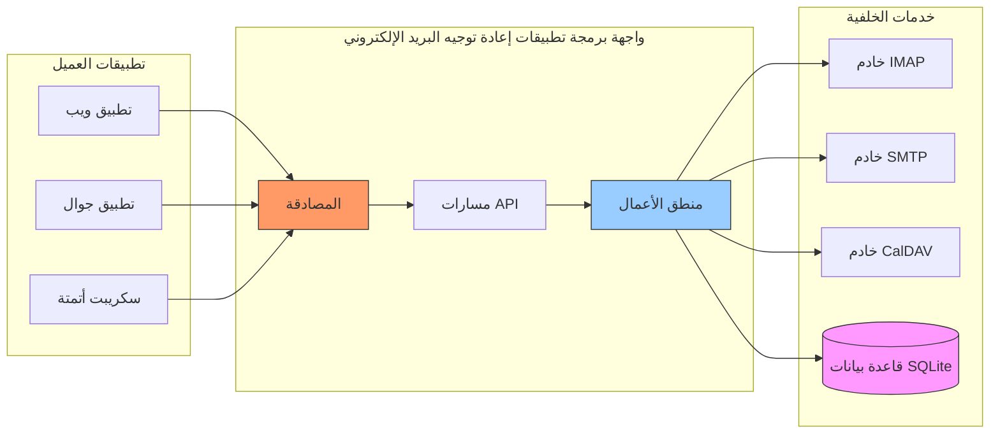

---


## إشعارات الدفع لنظام iOS {#ios-push-notifications}

> \[!TIP]
> يدعم Forward Email إشعارات الدفع الأصلية لنظام iOS عبر XAPPLEPUSHSERVICE لتسليم البريد الإلكتروني الفوري.

> \[!IMPORTANT]
> **ميزة فريدة:** Forward Email هو واحد من خوادم البريد الإلكتروني مفتوحة المصدر القليلة التي تدعم إشعارات الدفع الأصلية لنظام iOS للبريد الإلكتروني، جهات الاتصال، والتقويمات عبر امتداد IMAP `XAPPLEPUSHSERVICE`. تم عكس هندسة هذا البروتوكول من Apple ويوفر تسليمًا فوريًا لأجهزة iOS دون استنزاف البطارية.

يقوم Forward Email بتنفيذ امتداد XAPPLEPUSHSERVICE الخاص بشركة Apple، مما يوفر إشعارات دفع أصلية لأجهزة iOS دون الحاجة إلى الاستطلاع في الخلفية.

### كيف يعمل {#how-it-works-1}

**XAPPLEPUSHSERVICE** هو امتداد IMAP غير معياري يسمح لتطبيق البريد في iOS بتلقي إشعارات دفع فورية عند وصول رسائل جديدة.

يقوم Forward Email بتنفيذ تكامل خدمة إشعارات الدفع الخاصة بشركة Apple (APNs) لـ IMAP، مما يسمح لتطبيق البريد في iOS بتلقي إشعارات دفع فورية عند وصول رسائل جديدة.

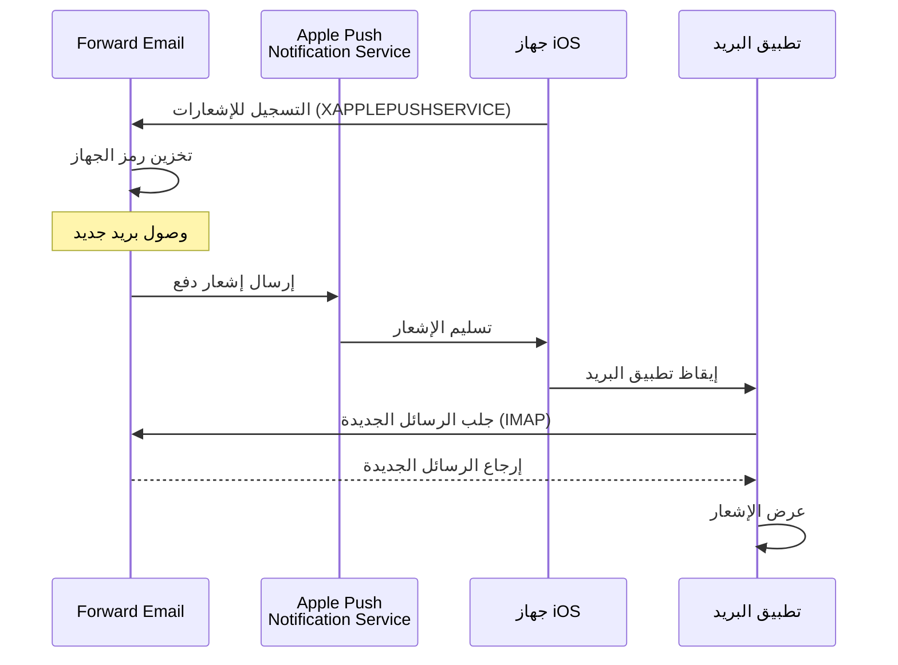

### الميزات الرئيسية {#key-features}

**التسليم الفوري:**

* تصل إشعارات الدفع خلال ثوانٍ
* لا يوجد استطلاع في الخلفية يستهلك البطارية
* يعمل حتى عندما يكون تطبيق البريد مغلقًا

<!---->

* **التسليم الفوري:** تظهر الرسائل الإلكترونية، أحداث التقويم، وجهات الاتصال على جهاز iPhone/iPad فورًا، وليس وفق جدول استطلاع
* **كفاءة في استهلاك البطارية:** يستخدم بنية دفع Apple بدلاً من الحفاظ على اتصالات IMAP مستمرة
* **دفع قائم على الموضوع:** يدعم إشعارات الدفع لصناديق بريد محددة، وليس فقط INBOX
* **لا حاجة لتطبيقات طرف ثالث:** يعمل مع تطبيقات البريد، التقويم، وجهات الاتصال الأصلية في iOS
**التكامل الأصلي:**

* مدمج في تطبيق البريد على iOS
* لا حاجة لتطبيقات طرف ثالث
* تجربة مستخدم سلسة

**مركز على الخصوصية:**

* رموز الجهاز مشفرة
* لا يتم إرسال محتوى الرسائل عبر APNS
* يتم إرسال إشعار "بريد جديد" فقط

**كفاءة في استهلاك البطارية:**

* لا يوجد استعلام مستمر عبر IMAP
* الجهاز ينام حتى وصول الإشعار
* تأثير ضئيل على البطارية

### ما الذي يجعل هذا مميزًا {#what-makes-this-special}

> \[!IMPORTANT]
> معظم مزودي البريد الإلكتروني لا يدعمون XAPPLEPUSHSERVICE، مما يجبر أجهزة iOS على الاستعلام عن البريد الجديد كل 15 دقيقة.

معظم خوادم البريد مفتوحة المصدر (بما في ذلك Dovecot وPostfix وCyrus IMAP) لا تدعم إشعارات الدفع على iOS. يجب على المستخدمين إما:

* استخدام IMAP IDLE (يحافظ على الاتصال مفتوحًا، يستهلك البطارية)
* استخدام الاستعلام الدوري (يفحص كل 15-30 دقيقة، إشعارات متأخرة)
* استخدام تطبيقات بريد خاصة ببنيتها التحتية الخاصة للدفع

يوفر Forward Email نفس تجربة إشعارات الدفع الفورية مثل الخدمات التجارية مثل Gmail وiCloud وFastmail.

**مقارنة مع مزودين آخرين:**

| المزود            | دعم الدفع     | فترة الاستعلام | تأثير على البطارية |
| ----------------- | -------------- | -------------- | ------------------ |
| **Forward Email** | ✅ دفع أصلي    | فوري           | ضئيل              |
| Gmail             | ✅ دفع أصلي    | فوري           | ضئيل              |
| iCloud            | ✅ دفع أصلي    | فوري           | ضئيل              |
| Yahoo             | ✅ دفع أصلي    | فوري           | ضئيل              |
| Outlook.com       | ❌ استعلام    | 15 دقيقة       | متوسط             |
| Fastmail          | ❌ استعلام    | 15 دقيقة       | متوسط             |
| ProtonMail        | ⚠️ عبر الجسر فقط | عبر الجسر      | عالي               |
| Tutanota          | ❌ تطبيق فقط   | غير متوفر      | غير متوفر          |

### تفاصيل التنفيذ {#implementation-details}

**استجابة IMAP CAPABILITY:**

```
* CAPABILITY IMAP4rev1 ... XAPPLEPUSHSERVICE ...
```

**عملية التسجيل:**

1. يكتشف تطبيق البريد على iOS قدرة XAPPLEPUSHSERVICE
2. يسجل التطبيق رمز الجهاز مع Forward Email
3. يخزن Forward Email الرمز ويربطه بالحساب
4. عند وصول بريد جديد، يرسل Forward Email إشعار دفع عبر APNS
5. يستيقظ تطبيق البريد على iOS لجلب الرسائل الجديدة

**الأمان:**

* رموز الجهاز مشفرة أثناء التخزين
* تنتهي صلاحية الرموز ويتم تحديثها تلقائيًا
* لا يتم كشف محتوى الرسائل لـ APNS
* يتم الحفاظ على التشفير من الطرف إلى الطرف

<!---->

* **امتداد IMAP:** `XAPPLEPUSHSERVICE`
* **الكود المصدري:** [WildDuck Issue #711](https://github.com/zone-eu/wildduck/issues/711)
* **الإعداد:** تلقائي - لا حاجة لتكوين، يعمل مباشرة مع تطبيق البريد على iOS

### مقارنة مع خدمات أخرى {#comparison-with-other-services}

| الخدمة        | دعم دفع iOS    | الطريقة                                   |
| ------------- | -------------- | ---------------------------------------- |
| Forward Email | ✅ نعم         | `XAPPLEPUSHSERVICE` (معاد هندسته)        |
| Gmail         | ✅ نعم         | تطبيق Gmail الخاص + دفع Google            |
| iCloud Mail   | ✅ نعم         | تكامل أصلي من Apple                      |
| Outlook.com   | ✅ نعم         | تطبيق Outlook الخاص + دفع Microsoft       |
| Fastmail      | ✅ نعم         | `XAPPLEPUSHSERVICE`                      |
| Dovecot       | ❌ لا          | IMAP IDLE أو استعلام فقط                  |
| Postfix       | ❌ لا          | IMAP IDLE أو استعلام فقط                  |
| Cyrus IMAP    | ❌ لا          | IMAP IDLE أو استعلام فقط                  |

**دفع Gmail:**

يستخدم Gmail نظام دفع خاص يعمل فقط مع تطبيق Gmail. يجب على تطبيق البريد على iOS الاستعلام عن خوادم Gmail IMAP.

**دفع iCloud:**

يدعم iCloud الدفع الأصلي المشابه لـ Forward Email، لكنه مخصص فقط لعناوين @icloud.com.

**Outlook.com:**

لا يدعم Outlook.com XAPPLEPUSHSERVICE، مما يتطلب من تطبيق البريد على iOS الاستعلام كل 15 دقيقة.

**Fastmail:**

لا يدعم Fastmail XAPPLEPUSHSERVICE. يجب على المستخدمين استخدام تطبيق Fastmail لإشعارات الدفع أو قبول تأخيرات الاستعلام لمدة 15 دقيقة.

---


## الاختبار والتحقق {#testing-and-verification}


## اختبارات قدرة البروتوكول {#protocol-capability-tests}
> \[!NOTE]
> يقدم هذا القسم نتائج أحدث اختبارات قدرات البروتوكول التي أُجريت في 22 يناير 2026.

يحتوي هذا القسم على ردود CAPABILITY/CAPA/EHLO الفعلية من جميع المزودين الذين تم اختبارهم. أُجريت جميع الاختبارات في **22 يناير 2026**.

تساعد هذه الاختبارات في التحقق من الدعم المعلن والفعلي لمختلف بروتوكولات البريد الإلكتروني والامتدادات عبر المزودين الرئيسيين.

### Test Methodology {#test-methodology}

**بيئة الاختبار:**

* **التاريخ:** 22 يناير 2026 الساعة 02:37 بالتوقيت العالمي المنسق
* **الموقع:** مثيل AWS EC2
* **IPv4:** 54.167.216.197
* **IPv6:** 2600:4040:46da:9a00:b19e:3ad4:426c:2f48
* **الأدوات:** OpenSSL s_client، سكربتات bash

**المزودون الذين تم اختبارهم:**

* Forward Email
* Gmail
* Outlook.com
* iCloud
* Fastmail
* Yahoo/AOL (Verizon)

### Test Scripts {#test-scripts}

لأجل الشفافية الكاملة، السكربتات الدقيقة المستخدمة لهذه الاختبارات موضحة أدناه.

#### IMAP Capability Test Script {#imap-capability-test-script}

```bash
#!/bin/bash
# IMAP Capability Test Script
# Tests IMAP CAPABILITY for various email providers

echo "========================================="
echo "IMAP CAPABILITY TEST"
echo "Date: $(date -u +"%Y-%m-%d %H:%M:%S UTC")"
echo "========================================="
echo ""

# Gmail
echo "--- Gmail (imap.gmail.com:993) ---"
echo -e "a001 CAPABILITY\na002 LOGOUT" | timeout 10 openssl s_client -connect imap.gmail.com:993 -crlf -quiet 2>&1 | grep -A 20 "CAPABILITY"
echo ""

# Outlook.com
echo "--- Outlook.com (outlook.office365.com:993) ---"
echo -e "a001 CAPABILITY\na002 LOGOUT" | timeout 10 openssl s_client -connect outlook.office365.com:993 -crlf -quiet 2>&1 | grep -A 20 "CAPABILITY"
echo ""

# iCloud
echo "--- iCloud (imap.mail.me.com:993) ---"
echo -e "a001 CAPABILITY\na002 LOGOUT" | timeout 10 openssl s_client -connect imap.mail.me.com:993 -crlf -quiet 2>&1 | grep -A 20 "CAPABILITY"
echo ""

# Fastmail
echo "--- Fastmail (imap.fastmail.com:993) ---"
echo -e "a001 CAPABILITY\na002 LOGOUT" | timeout 10 openssl s_client -connect imap.fastmail.com:993 -crlf -quiet 2>&1 | grep -A 20 "CAPABILITY"
echo ""

# Yahoo
echo "--- Yahoo (imap.mail.yahoo.com:993) ---"
echo -e "a001 CAPABILITY\na002 LOGOUT" | timeout 10 openssl s_client -connect imap.mail.yahoo.com:993 -crlf -quiet 2>&1 | grep -A 20 "CAPABILITY"
echo ""

# Forward Email
echo "--- Forward Email (imap.forwardemail.net:993) ---"
echo -e "a001 CAPABILITY\na002 LOGOUT" | timeout 10 openssl s_client -connect imap.forwardemail.net:993 -crlf -quiet 2>&1 | grep -A 20 "CAPABILITY"
echo ""

echo "========================================="
echo "Test completed"
echo "========================================="
```

#### POP3 Capability Test Script {#pop3-capability-test-script}

```bash
#!/bin/bash
# POP3 Capability Test Script
# Tests POP3 CAPA for various email providers

echo "========================================="
echo "POP3 CAPABILITY TEST"
echo "Date: $(date -u +"%Y-%m-%d %H:%M:%S UTC")"
echo "========================================="
echo ""

# Gmail
echo "--- Gmail (pop.gmail.com:995) ---"
echo -e "CAPA\nQUIT" | timeout 10 openssl s_client -connect pop.gmail.com:995 -crlf -quiet 2>&1 | grep -A 20 "CAPA"
echo ""

# Outlook.com
echo "--- Outlook.com (outlook.office365.com:995) ---"
echo -e "CAPA\nQUIT" | timeout 10 openssl s_client -connect outlook.office365.com:995 -crlf -quiet 2>&1 | grep -A 20 "CAPA"
echo ""

# iCloud (Note: iCloud does not support POP3)
echo "--- iCloud (No POP3 support) ---"
echo "iCloud does not support POP3"
echo ""

# Fastmail
echo "--- Fastmail (pop.fastmail.com:995) ---"
echo -e "CAPA\nQUIT" | timeout 10 openssl s_client -connect pop.fastmail.com:995 -crlf -quiet 2>&1 | grep -A 20 "CAPA"
echo ""

# Yahoo
echo "--- Yahoo (pop.mail.yahoo.com:995) ---"
echo -e "CAPA\nQUIT" | timeout 10 openssl s_client -connect pop.mail.yahoo.com:995 -crlf -quiet 2>&1 | grep -A 20 "CAPA"
echo ""

# Forward Email
echo "--- Forward Email (pop3.forwardemail.net:995) ---"
echo -e "CAPA\nQUIT" | timeout 10 openssl s_client -connect pop3.forwardemail.net:995 -crlf -quiet 2>&1 | grep -A 20 "CAPA"
echo ""

echo "========================================="
echo "Test completed"
echo "========================================="
```
#### سكريبت اختبار قدرة SMTP {#smtp-capability-test-script}

```bash
#!/bin/bash
# سكريبت اختبار قدرة SMTP
# يختبر SMTP EHLO لمزودي البريد الإلكتروني المختلفين

echo "========================================="
echo "اختبار قدرة SMTP"
echo "التاريخ: $(date -u +"%Y-%m-%d %H:%M:%S UTC")"
echo "========================================="
echo ""

# Gmail
echo "--- جيميل (smtp.gmail.com:587) ---"
echo -e "EHLO test.com\nQUIT" | timeout 10 openssl s_client -connect smtp.gmail.com:587 -starttls smtp -crlf -quiet 2>&1 | grep -A 30 "250-"
echo ""

# Outlook.com
echo "--- Outlook.com (smtp.office365.com:587) ---"
echo -e "EHLO test.com\nQUIT" | timeout 10 openssl s_client -connect smtp.office365.com:587 -starttls smtp -crlf -quiet 2>&1 | grep -A 30 "250-"
echo ""

# iCloud
echo "--- iCloud (smtp.mail.me.com:587) ---"
echo -e "EHLO test.com\nQUIT" | timeout 10 openssl s_client -connect smtp.mail.me.com:587 -starttls smtp -crlf -quiet 2>&1 | grep -A 30 "250-"
echo ""

# Fastmail
echo "--- Fastmail (smtp.fastmail.com:587) ---"
echo -e "EHLO test.com\nQUIT" | timeout 10 openssl s_client -connect smtp.fastmail.com:587 -starttls smtp -crlf -quiet 2>&1 | grep -A 30 "250-"
echo ""

# Yahoo
echo "--- Yahoo (smtp.mail.yahoo.com:587) ---"
echo -e "EHLO test.com\nQUIT" | timeout 10 openssl s_client -connect smtp.mail.yahoo.com:587 -starttls smtp -crlf -quiet 2>&1 | grep -A 30 "250-"
echo ""

# Forward Email
echo "--- Forward Email (smtp.forwardemail.net:587) ---"
echo -e "EHLO test.com\nQUIT" | timeout 10 openssl s_client -connect smtp.forwardemail.net:587 -starttls smtp -crlf -quiet 2>&1 | grep -A 30 "250-"
echo ""

echo "========================================="
echo "اكتمل الاختبار"
echo "========================================="
```

### ملخص نتائج الاختبار {#test-results-summary}

#### IMAP (القدرات) {#imap-capability}

**Forward Email**

```
* CAPABILITY IMAP4rev1 AUTH=PLAIN AUTH=PLAIN-CLIENTTOKEN CHILDREN ENABLE ID IDLE NAMESPACE QUOTA SASL-IR UNSELECT XLIST XAPPLEPUSHSERVICE
```

**جيميل**

```
* CAPABILITY IMAP4rev1 UNSELECT IDLE NAMESPACE QUOTA ID XLIST CHILDREN X-GM-EXT-1 UIDPLUS COMPRESS=DEFLATE ENABLE MOVE CONDSTORE ESEARCH UTF8=ACCEPT LIST-EXTENDED LIST-STATUS LITERAL- SPECIAL-USE
```

**iCloud**

```
* OK [CAPABILITY XAPPLEPUSHSERVICE IMAP4 IMAP4rev1 SASL-IR AUTH=ATOKEN AUTH=PLAIN AUTH=ATOKEN2 AUTH=XOAUTH2]
```

**Outlook.com**

```
* CAPABILITY IMAP4rev1 AUTH=PLAIN AUTH=XOAUTH2 SASL-IR UIDPLUS ID UNSELECT CHILDREN IDLE NAMESPACE LITERAL+
```

**Fastmail**

```
* CAPABILITY IMAP4rev1 ACL ANNOTATE-EXPERIMENT-1 CATENATE CONDSTORE ENABLE ESEARCH ESORT I18NLEVEL=1 ID IDLE LIST-EXTENDED LIST-STATUS LITERAL+ LOGINDISABLED MULTIAPPEND NAMESPACE QRESYNC QUOTA RIGHTS=ektx SASL-IR SORT SPECIAL-USE THREAD=ORDEREDSUBJECT UIDPLUS UNSELECT WITHIN X-RENAME XLIST
```

**Yahoo/AOL (Verizon)**

```
* CAPABILITY IMAP4rev1 IDLE NAMESPACE QUOTA ID XLIST CHILDREN UIDPLUS MOVE CONDSTORE ESEARCH ENABLE LIST-EXTENDED LIST-STATUS LITERAL- SPECIAL-USE UNSELECT XAPPLEPUSHSERVICE
```

#### POP3 (CAPA) {#pop3-capa}

**Forward Email**

```
+OK
CAPA
TOP
USER
UIDL
EXPIRE 30
IMPLEMENTATION ForwardEmail
.
```

**جيميل**

```
+OK
CAPA
TOP
USER
UIDL
EXPIRE 30
IMPLEMENTATION Gpop
.
```

**Outlook.com**

```
+OK
CAPA
TOP
USER
UIDL
SASL PLAIN XOAUTH2
.
```

**Fastmail**

```
+OK
CAPA
TOP
USER
UIDL
EXPIRE 30
IMPLEMENTATION Cyrus
.
```

#### SMTP (EHLO) {#smtp-ehlo}

**Forward Email**

```
250-smtp.forwardemail.net
250-PIPELINING
250-SIZE 52428800
250-ETRN
250-STARTTLS
250-ENHANCEDSTATUSCODES
250-8BITMIME
250-DSN
250 CHUNKING
```

**جيميل**

```
250-smtp.gmail.com at your service
250-SIZE 35882577
250-8BITMIME
250-STARTTLS
250-ENHANCEDSTATUSCODES
250-PIPELINING
250-CHUNKING
250 SMTPUTF8
```

**Outlook.com**

```
250-SN4PR13CA0005.outlook.office365.com Hello [x.x.x.x]
250-SIZE 157286400
250-PIPELINING
250-DSN
250-ENHANCEDSTATUSCODES
250-STARTTLS
250-8BITMIME
250-BINARYMIME
250-CHUNKING
250 SMTPUTF8
```

**Fastmail**

```
250-smtp.fastmail.com
250-PIPELINING
250-SIZE 78643200
250-ETRN
250-STARTTLS
250-ENHANCEDSTATUSCODES
250-8BITMIME
250-DSN
250 CHUNKING
```

**Yahoo/AOL (Verizon)**

```
250-smtp.mail.yahoo.com
250-PIPELINING
250-SIZE 41943040
250-8BITMIME
250-ENHANCEDSTATUSCODES
250-STARTTLS
```
### نتائج الاختبار التفصيلية {#detailed-test-results}

#### نتائج اختبار IMAP {#imap-test-results}

**جيميل:**
`* CAPABILITY IMAP4rev1 UNSELECT IDLE NAMESPACE QUOTA ID XLIST CHILDREN X-GM-EXT-1 XYZZY SASL-IR AUTH=XOAUTH2 AUTH=PLAIN AUTH=PLAIN-CLIENTTOKEN AUTH=OAUTHBEARER`

**Outlook.com:**
`* CAPABILITY IMAP4 IMAP4rev1 AUTH=PLAIN AUTH=XOAUTH2 SASL-IR UIDPLUS ID UNSELECT CHILDREN IDLE NAMESPACE LITERAL+`

**iCloud:**
`* CAPABILITY XAPPLEPUSHSERVICE IMAP4 IMAP4rev1 SASL-IR AUTH=ATOKEN AUTH=PLAIN AUTH=ATOKEN2 AUTH=XOAUTH2`

**Fastmail:**
انتهت مهلة الاتصال. راجع الملاحظات أدناه.

**Yahoo:**
`* CAPABILITY IMAP4rev1 SASL-IR AUTH=PLAIN AUTH=XOAUTH2 AUTH=OAUTHBEARER ID MOVE NAMESPACE XYMHIGHESTMODSEQ UIDPLUS LITERAL+ CHILDREN UNSELECT X-MSG-EXT OBJECTID IDLE ENABLE UIDONLY X-ALL-MAIL X-UIDONLY LIST-EXTENDED LIST-STATUS SPECIAL-USE PARTIAL APPENDLIMIT=41697280`

**Forward Email:**
`* CAPABILITY XAPPLEPUSHSERVICE IMAP4rev1 APPENDLIMIT=52428800 AUTH=PLAIN AUTH=PLAIN-CLIENTTOKEN CHILDREN CONDSTORE ENABLE ID IDLE MOVE NAMESPACE QUOTA SASL-IR SPECIAL-USE UIDPLUS UNSELECT UTF8=ACCEPT XLIST`

#### نتائج اختبار POP3 {#pop3-test-results}

**جيميل:**
لم تُرجع الاستجابة CAPA بدون مصادقة.

**Outlook.com:**
لم تُرجع الاستجابة CAPA بدون مصادقة.

**iCloud:**
غير مدعوم.

**Fastmail:**
انتهت مهلة الاتصال. راجع الملاحظات أدناه.

**Yahoo:**
`+OK CAPA list follows... SASL PLAIN XOAUTH2`

**Forward Email:**
لم تُرجع الاستجابة CAPA بدون مصادقة.

#### نتائج اختبار SMTP {#smtp-test-results}

**جيميل:**
`250-AUTH LOGIN PLAIN XOAUTH2 PLAIN-CLIENTTOKEN OAUTHBEARER XOAUTH`

**Outlook.com:**
`250-DSN`

**iCloud:**
`250-DSN`

**Fastmail:**
`250 AUTH PLAIN LOGIN XOAUTH2 OAUTHBEARER`

**Yahoo:**
`250 AUTH PLAIN LOGIN XOAUTH2 OAUTHBEARER`

**Forward Email:**
`250-DSN`, `250-REQUIRETLS`

### ملاحظات على نتائج الاختبار {#notes-on-test-results}

> \[!NOTE]
> ملاحظات هامة وقيود من نتائج الاختبار.

1. **انتهاء مهلة Fastmail**: انتهت مهلة اتصالات Fastmail أثناء الاختبار، على الأرجح بسبب تحديد المعدل أو قيود جدار الحماية من عنوان IP الخاص بخادم الاختبار. من المعروف أن Fastmail يدعم IMAP/POP3/SMTP بشكل قوي بناءً على وثائقهم.

2. **استجابات CAPA في POP3**: عدة مزودين (جيميل، Outlook.com، Forward Email) لم يُرجعوا استجابات CAPA بدون مصادقة. هذا إجراء أمني شائع لخوادم POP3.

3. **دعم DSN**: فقط Outlook.com وiCloud وForward Email يعلنون صراحة عن دعم DSN في استجابات EHLO الخاصة بـ SMTP. هذا لا يعني بالضرورة أن المزودين الآخرين لا يدعمونه، لكنهم لا يعلنون عنه.

4. **REQUIRETLS**: فقط Forward Email يعلن صراحة عن دعم REQUIRETLS مع خانة اختيار للمستخدم لتطبيقه. قد يدعم المزودون الآخرون ذلك داخليًا لكن لا يعلنون عنه في EHLO.

5. **بيئة الاختبار**: أُجريت الاختبارات من مثيل AWS EC2 (IP: 54.167.216.197 IPv4، 2600:4040:46da:9a00:b19e:3ad4:426c:2f48 IPv6) في 22 يناير 2026 الساعة 02:37 UTC.

---


## الملخص {#summary}

يوفر Forward Email دعمًا شاملاً لبروتوكولات RFC عبر جميع معايير البريد الإلكتروني الرئيسية:

* **IMAP4rev1:** 16 RFC مدعومة مع اختلافات مقصودة موثقة
* **POP3:** 4 RFC مدعومة مع حذف دائم متوافق مع RFC
* **SMTP:** 11 امتداد مدعوم بما في ذلك SMTPUTF8، DSN، وPIPELINING
* **المصادقة:** دعم كامل لـ DKIM، SPF، DMARC، ARC
* **أمان النقل:** دعم كامل لـ MTA-STS وREQUIRETLS، دعم جزئي لـ DANE
* **التشفير:** دعم OpenPGP v6 وS/MIME
* **التقويم:** دعم كامل لـ CalDAV، CardDAV، وVTODO
* **الوصول إلى API:** واجهة REST API كاملة مع 39 نقطة نهاية للوصول المباشر إلى قاعدة البيانات
* **دفع iOS:** إشعارات دفع أصلية للبريد الإلكتروني، جهات الاتصال، والتقاويم عبر `XAPPLEPUSHSERVICE`

### الفروقات الرئيسية {#key-differentiators}

> \[!TIP]
> يتميز Forward Email بميزات فريدة غير موجودة في مزودين آخرين.

**ما الذي يجعل Forward Email فريدًا:**

1. **تشفير آمن كمومي** - المزود الوحيد بصناديق بريد SQLite مشفرة بـ ChaCha20-Poly1305
2. **هيكلية عدم المعرفة** - كلمة مرورك تشفر صندوق بريدك؛ لا يمكننا فك تشفيره
3. **نطاقات مخصصة مجانية** - لا رسوم شهرية للبريد الإلكتروني على النطاقات المخصصة
4. **دعم REQUIRETLS** - خانة اختيار للمستخدم لتطبيق TLS على كامل مسار التسليم
5. **API شاملة** - 39 نقطة نهاية REST API للتحكم البرمجي الكامل
6. **إشعارات دفع iOS** - دعم أصلي لـ XAPPLEPUSHSERVICE للتسليم الفوري
7. **مفتوح المصدر** - الشيفرة المصدرية كاملة متاحة على GitHub
8. **تركيز على الخصوصية** - لا تعدين بيانات، لا إعلانات، لا تتبع
* **التشفير المعزول:** الخدمة البريدية الوحيدة التي تستخدم صناديق بريد SQLite مشفرة بشكل فردي  
* **الامتثال لمواصفات RFC:** تعطي الأولوية للامتثال للمعايير على حساب الراحة (مثل POP3 DELE)  
* **واجهة برمجة تطبيقات كاملة:** وصول برمجي مباشر إلى جميع بيانات البريد الإلكتروني  
* **مفتوح المصدر:** تنفيذ شفاف بالكامل  

**ملخص دعم البروتوكولات:**  

| الفئة                | مستوى الدعم  | التفاصيل                                      |
| -------------------- | ------------ | --------------------------------------------- |
| **البروتوكولات الأساسية** | ✅ ممتاز     | دعم كامل لـ IMAP4rev1، POP3، SMTP             |
| **البروتوكولات الحديثة** | ⚠️ جزئي     | دعم جزئي لـ IMAP4rev2، عدم دعم JMAP           |
| **الأمان**            | ✅ ممتاز     | DKIM، SPF، DMARC، ARC، MTA-STS، REQUIRETLS    |
| **التشفير**           | ✅ ممتاز     | OpenPGP، S/MIME، تشفير SQLite                  |
| **CalDAV/CardDAV**    | ✅ ممتاز     | مزامنة كاملة للتقويم وجهات الاتصال             |
| **الترشيح**           | ✅ ممتاز     | Sieve (24 امتدادًا) و ManageSieve              |
| **واجهة برمجة التطبيقات** | ✅ ممتاز     | 39 نقطة نهاية REST API                         |
| **الإشعارات الفورية**  | ✅ ممتاز     | إشعارات دفع أصلية لنظام iOS                     |
